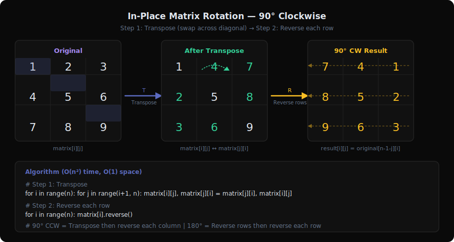
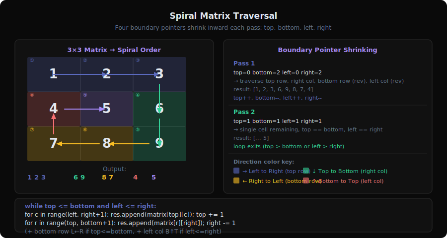
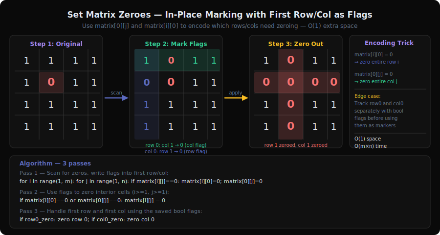
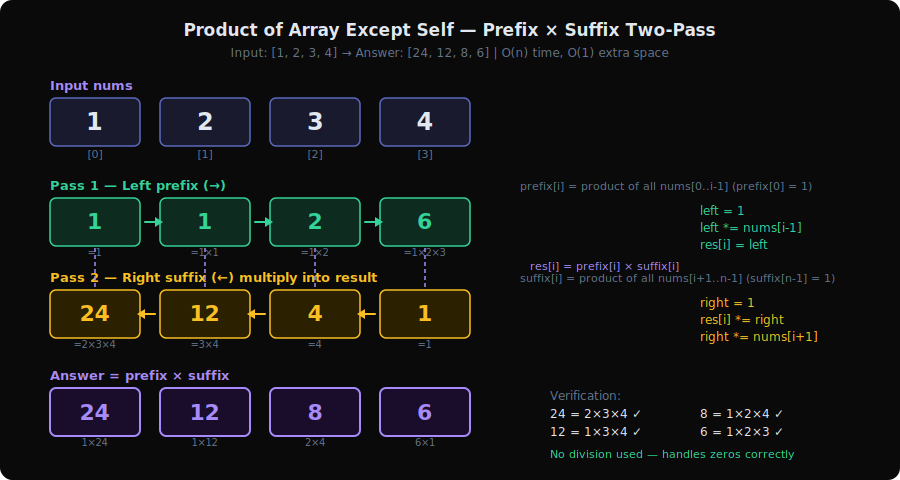
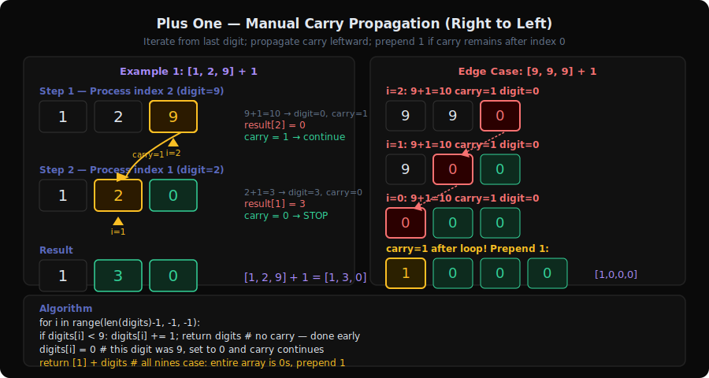
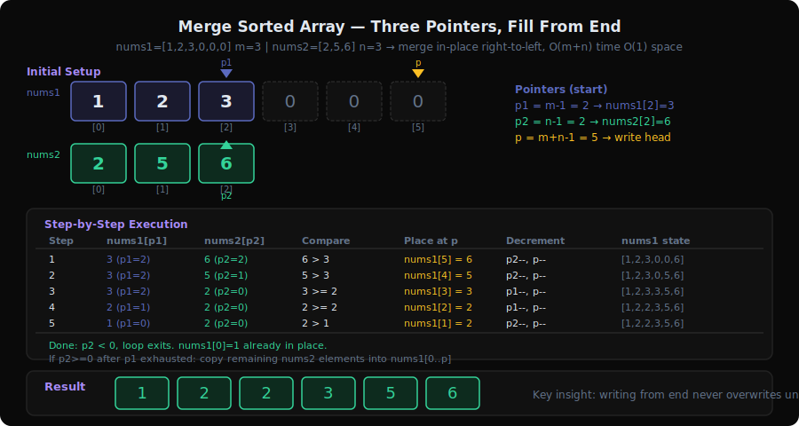
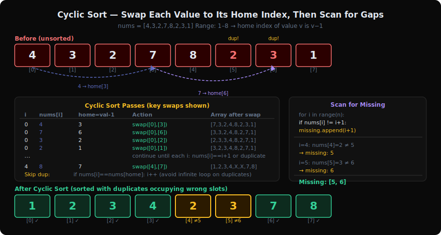

# Array/Matrix Patterns Deep Dive

Array and matrix problems test your ability to manipulate data **in-place** using clever indexing tricks. The common thread: exploit the structure of the container itself (indices as implicit storage, boundary tracking, mathematical relationships) to avoid extra space.

This document covers all 7 sub-patterns with 24 problems from `server/patterns.py`.

---

## 1. In-place Rotation Pattern



**Problems**: 48 (Rotate Image), 189 (Rotate Array), 867 (Transpose Matrix)

### What is it?

Think of rotating a physical photo 90 degrees clockwise. You can't just move pixels one at a time — you'd lose data. Instead, you use a **two-step trick**: transpose (flip along the diagonal) then reverse each row. Each step is simple and in-place.

**Concrete example**: Rotate 3×3 matrix 90° clockwise

```
Original:       Transpose:       Reverse rows:
[1, 2, 3]       [1, 4, 7]       [7, 4, 1]
[4, 5, 6]  →    [2, 5, 8]  →    [8, 5, 2]
[7, 8, 9]       [3, 6, 9]       [9, 6, 3]
```

For **array rotation** (189), the same reversal trick works:
```
Rotate [1,2,3,4,5] by k=2:
  Reverse all:    [5,4,3,2,1]
  Reverse [0,k):  [4,5,3,2,1]
  Reverse [k,n):  [4,5,1,2,3] ✓
```

### The Decision Tree (Visualized)

```
Matrix Rotation 90° Clockwise:

Step 1: Transpose (swap across diagonal)
  [1, 2, 3]         [1, 4, 7]
  [4, 5, 6]    →    [2, 5, 8]
  [7, 8, 9]         [3, 6, 9]

  swap(mat[i][j], mat[j][i]) for i < j

Step 2: Reverse each row
  [1, 4, 7]  →  [7, 4, 1]
  [2, 5, 8]  →  [8, 5, 2]
  [3, 6, 9]  →  [9, 6, 3]

Rotation variants:
  90° CW  = transpose + reverse rows
  90° CCW = transpose + reverse columns
  180°    = reverse rows + reverse columns
```

### Core Template (with walkthrough)

**Matrix rotation 90° clockwise:**
```
function rotate(matrix):
    n = len(matrix)
    // Step 1: Transpose
    for i = 0 to n-1:
        for j = i+1 to n-1:            // j starts at i+1 to avoid double-swap
            swap(matrix[i][j], matrix[j][i])

    // Step 2: Reverse each row
    for i = 0 to n-1:
        reverse(matrix[i])
```

**Array rotation by k:**
```
function rotate(nums, k):
    k = k % len(nums)                  // handle k > n
    reverse(nums, 0, n-1)              // reverse entire array
    reverse(nums, 0, k-1)              // reverse first k elements
    reverse(nums, k, n-1)              // reverse remaining elements
```

### How to Recognize This Pattern

- "Rotate matrix" or "rotate array" **in-place**
- "Transpose" a matrix
- Cyclic shifting of elements
- Look for: **rearrangement that decomposes into simpler reversals/transpositions**

### Key Insight / Trick

Complex rotations decompose into **two simple operations**. For matrices: transpose + row reversal. For arrays: three reversals. Each operation is trivially in-place. This avoids the complexity of tracking 4-way cyclic swaps.

### Questions Detail

| # | Title | Difficulty | Key Twist |
|---|-------|-----------|-----------|
| 48 | Rotate Image | Medium | 90° clockwise = transpose + reverse rows. Must be in-place on n×n matrix. Can also do layer-by-layer 4-way cyclic swap, but transpose+reverse is cleaner. |
| 189 | Rotate Array | Medium | Three reversals trick: reverse all, reverse first k, reverse rest. Handle `k % n`. Also solvable with cyclic replacement or extra array, but triple reversal is O(1) space. |
| 867 | Transpose Matrix | Easy | Swap `mat[i][j]` with `mat[j][i]`. For non-square matrices, must create new matrix (can't transpose in-place). For square matrices, only iterate upper triangle to avoid double-swap. |

---

## 2. Spiral Traversal Pattern



**Problems**: 54 (Spiral Matrix), 59 (Spiral Matrix II), 885 (Spiral Matrix III), 2326 (Spiral Matrix IV)

### What is it?

Imagine an ant walking along the edge of a rectangular field, always turning right when it hits a boundary or an already-visited cell. This traces a **spiral path** through the matrix.

**Concrete example**: Spiral order of a 3×3 matrix

```
[1, 2, 3]
[4, 5, 6]     →   [1, 2, 3, 6, 9, 8, 7, 4, 5]
[7, 8, 9]

Path: → → → ↓ ↓ ← ← ↑ → (right, down, left, up, repeat inward)
```

### The Decision Tree (Visualized)

```
Matrix:  [1, 2, 3]
         [4, 5, 6]
         [7, 8, 9]

Boundaries: top=0, bottom=2, left=0, right=2

Round 1:
  → right along top:    1, 2, 3   (top=0, left→right) then top++
  ↓ down along right:   6, 9      (right=2, top→bottom) then right--
  ← left along bottom:  8, 7      (bottom=2, right→left) then bottom--
  ↑ up along left:      4         (left=0, bottom→top) then left++

Round 2:
  → right along top:    5         (top=1, left=1→right=1)

Result: [1, 2, 3, 6, 9, 8, 7, 4, 5] ✓
```

### Core Template (with walkthrough)

```
function spiralOrder(matrix):
    result = []
    top = 0, bottom = m-1, left = 0, right = n-1

    while top <= bottom AND left <= right:
        // → Traverse right along top row
        for col = left to right:
            result.add(matrix[top][col])
        top++

        // ↓ Traverse down along right column
        for row = top to bottom:
            result.add(matrix[row][right])
        right--

        // ← Traverse left along bottom row (if rows remain)
        if top <= bottom:
            for col = right downto left:
                result.add(matrix[bottom][col])
            bottom--

        // ↑ Traverse up along left column (if cols remain)
        if left <= right:
            for row = bottom downto top:
                result.add(matrix[row][left])
            left++

    return result
```

### How to Recognize This Pattern

- "Spiral order" traversal of a matrix
- "Fill matrix in spiral order"
- Walking along matrix boundaries, shrinking inward
- Look for: **boundary-tracking with four directions cycling**

### Key Insight / Trick

Maintain four boundaries (`top`, `bottom`, `left`, `right`) that shrink inward after each direction sweep. The boundaries naturally handle non-square matrices. The `if` checks before the third and fourth sweeps prevent double-counting when the spiral reduces to a single row or column.

### Questions Detail

| # | Title | Difficulty | Key Twist |
|---|-------|-----------|-----------|
| 54 | Spiral Matrix | Medium | Read elements in spiral order. Four-boundary approach. Watch for single-row or single-column edge cases. The `if top <= bottom` and `if left <= right` guards are essential. |
| 59 | Spiral Matrix II | Medium | Write 1 to n² in spiral order. Same boundary logic but filling instead of reading. Simpler than 54 because the matrix is always square. |
| 885 | Spiral Matrix III | Medium | Start from arbitrary position, spiral outward. Not bounded by matrix — generate spiral coordinates and collect those that fall within bounds. Increment side length every two turns. |
| 2326 | Spiral Matrix IV | Medium | Fill matrix from a linked list in spiral order. Combine spiral traversal with linked list iteration. Fill remaining cells with -1 when list is exhausted. |

---

## 3. In-place Marking Pattern



**Problems**: 73 (Set Matrix Zeroes), 289 (Game of Life), 498 (Diagonal Traverse)

### What is it?

When you need to mark cells for future processing but can't use extra space, **encode the mark in the cell itself**. Use the first row/column as flags, use negative signs, or encode two states in one value.

**Concrete example**: Set Matrix Zeroes — mark which rows/cols should be zeroed

```
Original:           Use first row/col as flags:
[1, 1, 1]           row0_flag = false
[1, 0, 1]    →      col0_flag = false
[1, 1, 1]           matrix[0][1] = 0 (col 1 has a zero)
                     matrix[1][0] = 0 (row 1 has a zero)

Then zero out based on flags, process from bottom-right to avoid overwriting flags.
```

### Core Template (with walkthrough)

**Set Matrix Zeroes (O(1) space):**
```
function setZeroes(matrix):
    m, n = dimensions
    firstRowZero = any zero in first row?
    firstColZero = any zero in first col?

    // Mark: use first row/col as flags
    for i = 1 to m-1:
        for j = 1 to n-1:
            if matrix[i][j] == 0:
                matrix[i][0] = 0        // mark row
                matrix[0][j] = 0        // mark col

    // Zero out based on marks (skip first row/col)
    for i = 1 to m-1:
        for j = 1 to n-1:
            if matrix[i][0] == 0 OR matrix[0][j] == 0:
                matrix[i][j] = 0

    // Handle first row and col separately
    if firstRowZero: zero out first row
    if firstColZero: zero out first col
```

**Game of Life (encode state transition):**
```
// Encode: 0→0=0, 1→0=1, 0→1=2, 1→1=3
// Current state = value % 2
// Next state = value / 2

function gameOfLife(board):
    for each cell:
        liveNeighbors = count neighbors where val % 2 == 1
        if cell is alive (val % 2 == 1):
            if liveNeighbors in {2, 3}: board[i][j] = 3  // 1→1
        else:
            if liveNeighbors == 3: board[i][j] = 2       // 0→1

    for each cell:
        board[i][j] = board[i][j] / 2  // extract next state
```

### How to Recognize This Pattern

- "Do it in-place" with **O(1) extra space** on a matrix
- Need to remember original values while modifying
- Simultaneous updates based on neighbors (Game of Life)
- Look for: **encode metadata in the existing data structure**

### Key Insight / Trick

The matrix itself becomes the auxiliary data structure. For Set Matrix Zeroes, the first row and column serve as boolean arrays. For Game of Life, each cell stores both current and next state by encoding two bits in one integer.

### Questions Detail

| # | Title | Difficulty | Key Twist |
|---|-------|-----------|-----------|
| 73 | Set Matrix Zeroes | Medium | Use first row/col as markers. Process inner matrix first, then handle first row/col using saved flags. Order matters — zeroing first row/col too early destroys the markers. |
| 289 | Game of Life | Medium | Encode state transition: `{0→0, 1→0, 0→1, 1→1}` as `{0, 1, 2, 3}`. Current state = `val % 2`, next state = `val / 2`. One pass to encode, one pass to decode. Avoids O(mn) copy. |
| 498 | Diagonal Traverse | Medium | Traverse matrix diagonally, alternating direction. Track direction flag; when going up-right, handle boundary (top/right edge), flip to down-left. Index math: elements on same diagonal share `i+j` value. |

---

## 4. Prefix/Suffix Products Pattern



**Problems**: 238 (Product of Array Except Self), 845 (Longest Mountain in Array), 2483 (Minimum Penalty for a Shop)

### What is it?

Precompute cumulative information from both directions (left-to-right and right-to-left), then combine them at each position. Like having two scouts — one reports what's to the left, the other what's to the right.

**Concrete example**: Product of Array Except Self — `[1, 2, 3, 4]`

```
Prefix products (left to right):  [1,  1,  2,  6]   (product of everything before i)
Suffix products (right to left):  [24, 12, 4,  1]   (product of everything after i)
Answer = prefix[i] × suffix[i]:   [24, 12, 8,  6]   ✓
```

### Core Template (with walkthrough)

```
function productExceptSelf(nums):
    n = len(nums)
    answer = array of n ones

    // Left pass: answer[i] = product of nums[0..i-1]
    prefix = 1
    for i = 0 to n-1:
        answer[i] = prefix
        prefix *= nums[i]

    // Right pass: multiply by product of nums[i+1..n-1]
    suffix = 1
    for i = n-1 downto 0:
        answer[i] *= suffix
        suffix *= nums[i]

    return answer
```

### How to Recognize This Pattern

- "Product/sum of all elements EXCEPT current" — without division
- "Longest mountain/valley" — need info from both directions
- Prefix sum/product combined with suffix computation
- "Minimum penalty" based on prefix counts
- Look for: **combining left-side and right-side aggregations**

### Key Insight / Trick

Two passes replace division (which fails with zeros) and avoid O(n²) brute force. The answer at position `i` combines what we know from the left (prefix) with what we know from the right (suffix). The second pass can reuse the output array, giving O(1) extra space.

### Questions Detail

| # | Title | Difficulty | Key Twist |
|---|-------|-----------|-----------|
| 238 | Product of Array Except Self | Medium | Two-pass: left products then right products. Can't use division (zeros possible). O(1) extra space by building prefix in output array, then multiplying suffix in reverse pass. |
| 845 | Longest Mountain in Array | Medium | For each index, compute how far up it goes from the left and how far up from the right. Mountain length at `i` = `leftUp[i] + rightUp[i] + 1`. Must have both sides > 0. Two-pointer approach also works. |
| 2483 | Minimum Penalty for a Shop | Medium | Prefix sum of 'Y's (customers) from right = penalty for closing too early. Prefix sum of 'N's from left = penalty for staying open without customers. Minimize `prefixN[i] + suffixY[i]` over all closing times. |

---

## 5. Plus One / Manual Arithmetic Pattern



**Problems**: 43 (Multiply Strings), 66 (Plus One), 67 (Add Binary), 989 (Add to Array-Form)

### What is it?

Simulate **grade-school arithmetic** on numbers represented as strings or arrays. Process digit by digit from right to left, managing carries. No converting to integers — the numbers may be too large.

**Concrete example**: Plus One on `[1, 2, 9]`

```
i=2: 9 + 1 = 10 → digit=0, carry=1
i=1: 2 + 0 + 1(carry) = 3 → digit=3, carry=0
i=0: 1 + 0 + 0 = 1 → digit=1, carry=0

Result: [1, 3, 0] ✓

Edge case: [9, 9, 9] + 1 = [1, 0, 0, 0]
```

### Core Template (with walkthrough)

```
function plusOne(digits):
    carry = 1                           // the "one" we're adding
    for i = n-1 downto 0:
        total = digits[i] + carry
        digits[i] = total % 10
        carry = total / 10
        if carry == 0: break            // no more propagation

    if carry > 0:
        prepend 1 to digits             // e.g., 999 + 1 = 1000

    return digits
```

**Multiply Strings:**
```
function multiply(num1, num2):
    result = array of (m + n) zeros

    for i = m-1 downto 0:
        for j = n-1 downto 0:
            product = int(num1[i]) * int(num2[j])
            p1 = i + j                  // tens position
            p2 = i + j + 1              // ones position
            total = product + result[p2]
            result[p2] = total % 10
            result[p1] += total / 10

    strip leading zeros, return as string
```

### How to Recognize This Pattern

- Numbers represented as **strings or digit arrays** (too large for int/long)
- "Add", "multiply", "subtract" without built-in big number support
- Binary string arithmetic
- Look for: **digit-by-digit processing with carry management**

### Key Insight / Trick

Process right-to-left (least significant digit first), just like you do on paper. The carry is always 0 or 1 for addition (0-9 for multiplication). For multiplication, the key formula: `num1[i] * num2[j]` contributes to positions `i+j` and `i+j+1` in the result.

### Questions Detail

| # | Title | Difficulty | Key Twist |
|---|-------|-----------|-----------|
| 66 | Plus One | Easy | Add 1 to a number represented as digit array. Handle the carry chain — `999 + 1 = 1000` needs an extra digit. Early termination when carry becomes 0. |
| 67 | Add Binary | Easy | Same as Plus One but base 2. Process from right, carry in binary. `result_digit = (a + b + carry) % 2`, `carry = (a + b + carry) / 2`. Build result string in reverse. |
| 43 | Multiply Strings | Medium | Grade-school multiplication in code. Outer product of all digit pairs, accumulated into a result array. `result[i+j+1] += d1 * d2`, propagate carries. Handle leading zeros. |
| 989 | Add to Array-Form | Easy | Add integer `k` to digit array. Process right-to-left: `sum = digits[i] + k % 10`, `k = k / 10 + carry`. Or simply add `k` directly: `sum = digits[i] + k`, `k = sum / 10`. |

---

## 6. In-place from End Pattern



**Problems**: 88 (Merge Sorted Array), 977 (Squares of a Sorted Array)

### What is it?

When merging or building a result in-place, process from the **end** (largest values first) to avoid overwriting unprocessed data. Like stacking boxes from the top of a shelf — you fill the far end first.

**Concrete example**: Merge `[1, 2, 3, 0, 0, 0]` (m=3) with `[2, 5, 6]` (n=3)

```
p1=2(val 3), p2=2(val 6), write=5: 6>3 → place 6 at [5]
p1=2(val 3), p2=1(val 5), write=4: 5>3 → place 5 at [4]
p1=2(val 3), p2=0(val 2), write=3: 3>2 → place 3 at [3]
p1=1(val 2), p2=0(val 2), write=2: 2=2 → place 2(from p2) at [2]
p1=1(val 2), p2=-1,       write=1: p2 done → place 2 at [1]
p1=0(val 1), p2=-1,       write=0: p2 done → place 1 at [0]

Result: [1, 2, 2, 3, 5, 6] ✓
```

### Core Template (with walkthrough)

```
function merge(nums1, m, nums2, n):
    p1 = m - 1                          // last real element in nums1
    p2 = n - 1                          // last element in nums2
    write = m + n - 1                   // write position (end of nums1)

    while p2 >= 0:                      // while nums2 has elements
        if p1 >= 0 AND nums1[p1] > nums2[p2]:
            nums1[write] = nums1[p1]
            p1--
        else:
            nums1[write] = nums2[p2]
            p2--
        write--
```

### How to Recognize This Pattern

- Merging into a pre-allocated array with extra space **at the end**
- Need to avoid overwriting unprocessed elements during in-place operations
- Processing from largest to smallest
- Look for: **pre-allocated trailing space + merge from the end**

### Key Insight / Trick

By writing from the end, the write pointer is always ahead of (or equal to) the read pointer for nums1, so we never overwrite an unread element. This eliminates the need for extra space. We only need to loop while `p2 >= 0` — if `p2` finishes first, remaining nums1 elements are already in place.

### Questions Detail

| # | Title | Difficulty | Key Twist |
|---|-------|-----------|-----------|
| 88 | Merge Sorted Array | Easy | nums1 has trailing zeros as placeholder space. Three pointers from the end. Only need to handle remaining nums2 elements — remaining nums1 elements are already positioned. The classic "merge from end" problem. |
| 977 | Squares of a Sorted Array | Easy | Input has negatives, so squares aren't in order. Two pointers from both ends comparing `abs` values, place larger square at end of result. Fill result right-to-left. (Also classified under Two Pointers.) |

---

## 7. Cyclic Sort Pattern



**Problems**: 41 (First Missing Positive), 268 (Missing Number), 287 (Find the Duplicate), 442 (Find All Duplicates), 448 (Find Disappeared Numbers)

### What is it?

When array values are in range `[1, n]` (or `[0, n]`), each value "belongs" at a specific index. **Place each number at its correct position** by swapping, then scan for mismatches. Think of it as sorting books on a numbered shelf — each book has a number and goes to that shelf position.

**Concrete example**: Find missing numbers in `[4, 3, 2, 7, 8, 2, 3, 1]`

```
Place each number at index (value - 1):
  i=0: nums[0]=4, should be at index 3 → swap with nums[3] → [7,3,2,4,8,2,3,1]
  i=0: nums[0]=7, should be at index 6 → swap with nums[6] → [3,3,2,4,8,2,7,1]
  i=0: nums[0]=3, should be at index 2 → swap with nums[2] → [2,3,3,4,8,2,7,1]
  i=0: nums[0]=2, should be at index 1 → swap with nums[1] → [3,2,3,4,8,2,7,1]
  i=0: nums[0]=3, should be at index 2, nums[2]=3 already → skip (duplicate!)
  i=1: nums[1]=2, correct position ✓
  ... continue ...

After all swaps: [1,2,3,4,_,_,7,8]
Scan: indices 4,5 don't have correct values → missing: 5, 6
```

### Core Template (with walkthrough)

```
function findDisappearedNumbers(nums):
    n = len(nums)

    // Phase 1: Place each number at its correct index
    for i = 0 to n-1:
        while nums[i] != nums[nums[i] - 1]:    // not at correct position
            swap(nums[i], nums[nums[i] - 1])    // put it where it belongs

    // Phase 2: Scan for mismatches
    missing = []
    for i = 0 to n-1:
        if nums[i] != i + 1:
            missing.add(i + 1)

    return missing
```

**Alternative: Negate-in-place**
```
function findDisappearedNumbers(nums):
    // Mark: negate value at index (val-1)
    for num in nums:
        idx = abs(num) - 1
        nums[idx] = -abs(nums[idx])     // mark as seen

    // Scan: positive values = unseen indices
    return [i+1 for i in range(n) if nums[i] > 0]
```

### How to Recognize This Pattern

- Values are in range **[1, n]** or **[0, n]** where n is array length
- "Find missing number(s)" or "find duplicate(s)"
- O(1) space requirement (can't use hash set)
- **Pigeonhole principle** — n slots, values in [1, n]
- Look for: **constrained value range matching array indices**

### Key Insight / Trick

The constraint `values ∈ [1, n]` means each value maps to a unique index (`value - 1`). After placing everything at its "home" index, any position where `nums[i] != i + 1` reveals a missing number (at that index) or a duplicate (the value that's there instead).

Two approaches:
1. **Cyclic swap**: Actually move values to correct positions
2. **Negate marking**: Use sign as a "visited" flag — negate `nums[abs(val)-1]`

### Questions Detail

| # | Title | Difficulty | Key Twist |
|---|-------|-----------|-----------|
| 41 | First Missing Positive | Hard | Only care about positive numbers in [1, n]. Ignore negatives and values > n. Cyclic sort the valid values, then scan for first mismatch. The hard part is realizing the answer is always in [1, n+1]. |
| 268 | Missing Number | Easy | Values in [0, n], array length n. Simple math: `answer = n*(n+1)/2 - sum(nums)`. Or XOR: `xor(0..n) ^ xor(nums)`. Cyclic sort works too but math/XOR is cleaner. |
| 287 | Find the Duplicate | Medium | n+1 values in [1, n] — one duplicate. Can't modify array → Floyd's cycle detection (fast/slow pointers on implicit graph). If modification allowed, negate-marking works. |
| 442 | Find All Duplicates | Medium | Values in [1, n], each appears once or twice. Negate-marking: for each `val`, if `nums[abs(val)-1]` already negative → duplicate found. Or cyclic sort + scan. |
| 448 | Find Disappeared Numbers | Easy | Values in [1, n], find all missing. Negate-marking or cyclic sort. After marking, indices with positive values correspond to missing numbers. |

---

## Comparison Table: All 7 Array/Matrix Sub-Patterns

| Aspect | In-place Rotation | Spiral Traversal | In-place Marking | Prefix/Suffix | Manual Arithmetic | From End | Cyclic Sort |
|--------|------------------|-----------------|-----------------|---------------|-------------------|----------|-------------|
| Data structure | Matrix or Array | Matrix | Matrix | Array | String/Array | Sorted Array | Array [1,n] |
| Key technique | Transpose+Reverse | Boundary shrinking | Encode state in cells | Two-pass L→R, R→L | Digit-by-digit + carry | Write from end | Swap to correct index |
| Space | O(1) | O(1) extra | O(1) | O(1) with output | O(m+n) or O(max) | O(1) | O(1) |
| Common trigger | "rotate in-place" | "spiral order" | "in-place" + matrix | "except self" | "numbers as strings" | "merge sorted" | "missing/duplicate in [1,n]" |
| Problem count | 3 | 4 | 3 | 3 | 4 | 2 | 5 |

---

## Code References

- `server/patterns.py:112-120` — Array/Matrix category definition with 7 sub-patterns
- `server/patterns.py:362-367` — Reverse lookup (problem → pattern)
- `server/main.py:307-369` — API endpoint for pattern data
- `extension/patterns.js` — Client-side pattern labels
