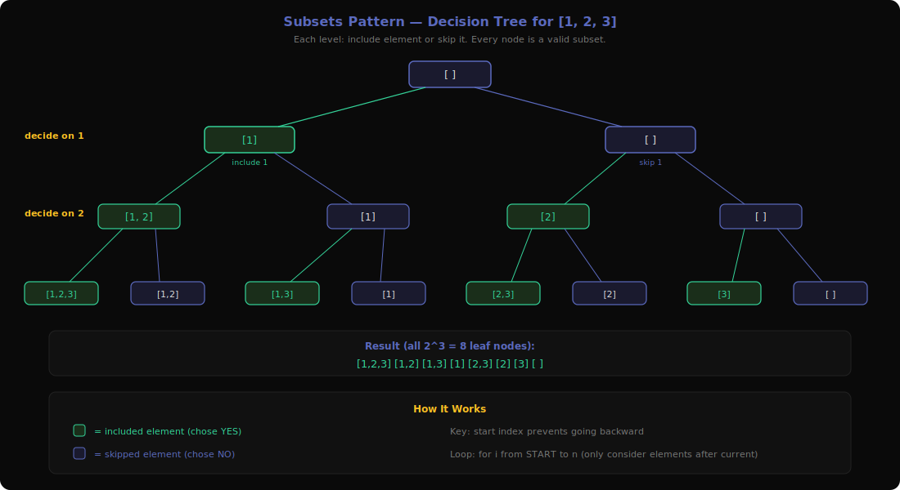
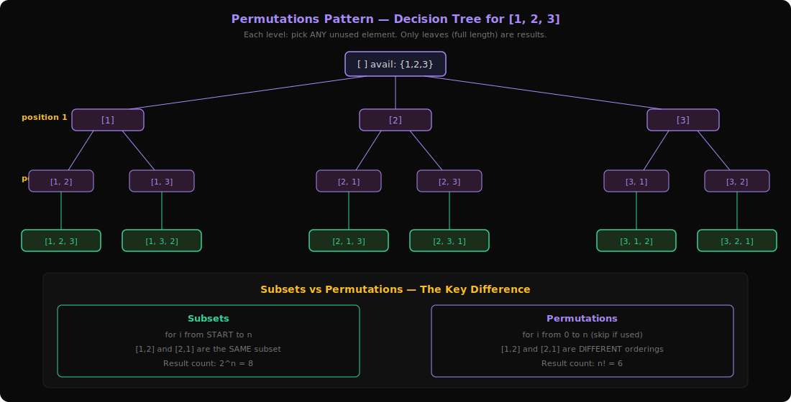
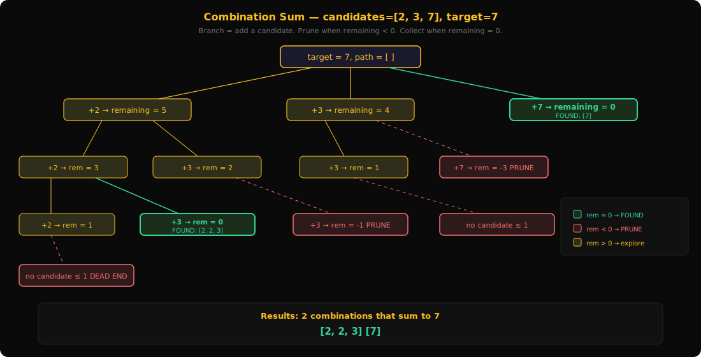
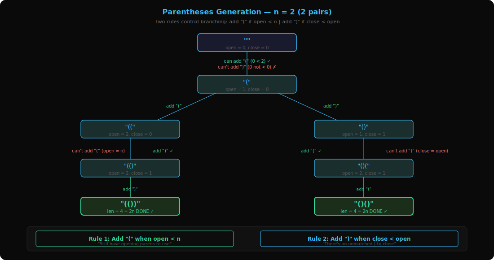
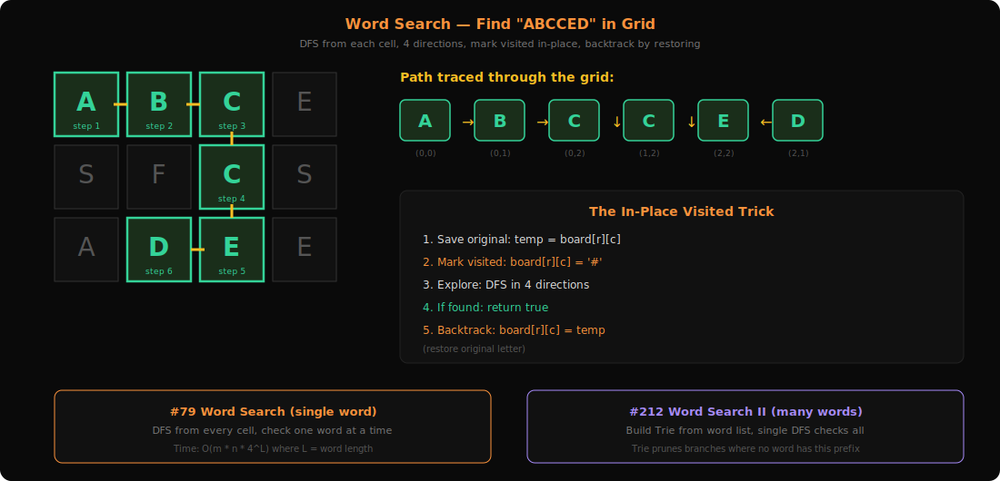
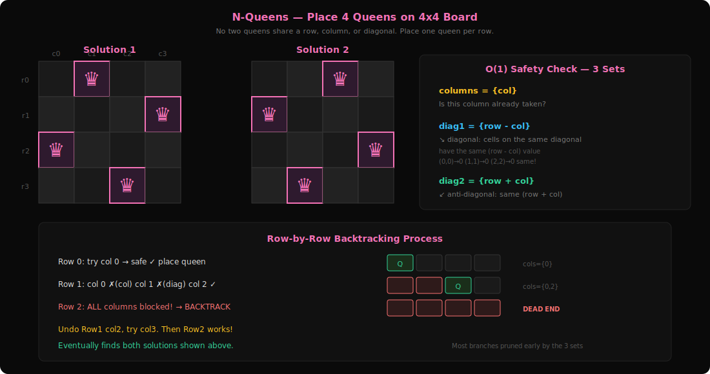
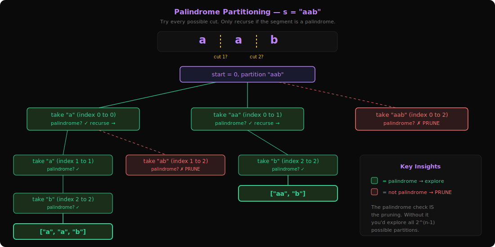

# Research: Backtracking Patterns Deep Dive

**Date**: 2026-03-09
**Git Commit**: 3fca422
**Branch**: main

## Research Question
Deep dive into the Backtracking section from `server/patterns.py` — understand all 7 sub-patterns, fetch and analyze LeetCode questions for each, explain pattern recognition and usage.

## Summary

Backtracking is defined in `server/patterns.py:67-75` with **7 sub-patterns** and **19 total problems**. It is one of the smaller categories in the patterns system.

### What is Backtracking? (The Real Intuition)

Imagine you're in a maze. You walk forward, and at every fork you pick a path. If you hit a dead end, you **walk back** to the last fork and try a different path. You keep doing this until you've either found the exit or tried every path.

That's backtracking. In code terms:
1. **Make a choice** (go left at the fork)
2. **Explore** what happens with that choice (walk down that path)
3. **Undo the choice** if it didn't work out (walk back to the fork)
4. **Try the next choice** (go right instead)

**Why not just use brute force?** Backtracking IS a form of brute force, but smarter. The key difference is **pruning** — you stop exploring a path the moment you know it can't lead to a solution. In a maze, if you see a wall ahead, you turn back immediately instead of walking into it.

**When do you need backtracking?**
- The problem asks for **"all possible"** something (all combinations, all arrangements, all paths)
- You need to **build a solution piece by piece** and validate along the way
- The search space is too large for simple loops but small enough that pruned recursion finishes in time (usually n ≤ 15-20)

---

## 1. Subsets Pattern



**Problems**: 17 (Letter Combinations), 77 (Combinations), 78 (Subsets), 90 (Subsets II)

### What is it?

Think of it like packing a bag. You have items [1, 2, 3] and for **each item** you make a yes/no decision: "Do I put this in the bag or not?" Every possible combination of yes/no decisions gives you one subset.

For [1, 2, 3]:
```
Item 1: YES  Item 2: YES  Item 3: YES  → [1, 2, 3]
Item 1: YES  Item 2: YES  Item 3: NO   → [1, 2]
Item 1: YES  Item 2: NO   Item 3: YES  → [1, 3]
Item 1: YES  Item 2: NO   Item 3: NO   → [1]
Item 1: NO   Item 2: YES  Item 3: YES  → [2, 3]
Item 1: NO   Item 2: YES  Item 3: NO   → [2]
Item 1: NO   Item 2: NO   Item 3: YES  → [3]
Item 1: NO   Item 2: NO   Item 3: NO   → []
```
That's 2^3 = 8 subsets. The power set.

### The Decision Tree (Visualized)

```
                        []
                   /          \
              [1]               []
            /     \           /     \
        [1,2]     [1]      [2]      []
        /   \    /   \    /   \    /   \
   [1,2,3] [1,2] [1,3] [1] [2,3] [2] [3] []
```

At each level, you decide about the next element. But in code, we implement this more efficiently using a loop with a `start` index:

### Core Template (with walkthrough)
```
backtrack(start, current_subset):
    result.add(copy of current_subset)   // every node in the tree is a valid subset
    for i from start to n:              // only consider elements AFTER the last one added
        current_subset.add(nums[i])     // CHOOSE: include nums[i]
        backtrack(i + 1, current_subset) // EXPLORE: recurse with next elements
        current_subset.remove(nums[i])   // UN-CHOOSE: remove nums[i] (backtrack!)
```

**Why `start` index?** This is the crucial trick. If you pick element at index 2, you only look at index 3, 4, 5... onward. You never go back to index 0 or 1. This automatically prevents duplicates like [2,1] when you already have [1,2] — because order doesn't matter in subsets.

### How to Recognize This Pattern
- Problem says **"all subsets"**, **"all combinations"**, **"power set"**
- Order within each result doesn't matter — [1,2] and [2,1] are the same
- You're choosing **which elements to include**, not their arrangement
- Look for: "return all possible X chosen from Y"

### Walkthrough: #78 Subsets with nums = [1, 2, 3]

```
backtrack(start=0, current=[])
  → result = [[]]
  → i=0: add 1 → current=[1]
      backtrack(start=1, current=[1])
        → result = [[], [1]]
        → i=1: add 2 → current=[1,2]
            backtrack(start=2, current=[1,2])
              → result = [[], [1], [1,2]]
              → i=2: add 3 → current=[1,2,3]
                  backtrack(start=3, current=[1,2,3])
                    → result = [[], [1], [1,2], [1,2,3]]
                    → loop ends (start=3, n=3)
                  remove 3 → current=[1,2]
              → loop ends
            remove 2 → current=[1]
        → i=2: add 3 → current=[1,3]
            backtrack(start=3, current=[1,3])
              → result = [[], [1], [1,2], [1,2,3], [1,3]]
            remove 3 → current=[1]
        → loop ends
      remove 1 → current=[]
  → i=1: add 2 → current=[2]
      ...continues similarly...
  → i=2: add 3 → current=[3]
      ...continues similarly...

Final: [[], [1], [1,2], [1,2,3], [1,3], [2], [2,3], [3]]
```

### Handling Duplicates (Subsets II, #90)

When input has duplicates like [1, 2, 2], you'd get [2] twice (once from each 2). Fix:

1. **Sort the array first**: [1, 2, 2]
2. **Skip duplicate at same decision level**: if `nums[i] == nums[i-1]` and `i > start`, skip it

```
for i from start to n:
    if i > start and nums[i] == nums[i-1]: continue  // skip duplicate branches
    ...rest of backtracking...
```

**Why `i > start`?** At position `start`, it's the first element at this decision level — always consider it. But if `i > start` and the value is same as previous, you'd create the same subtree again.

### Questions Detail

| # | Title | Difficulty | Key Twist |
|---|-------|-----------|-----------|
| 17 | Letter Combinations of a Phone Number | Medium | Instead of picking from one array, each "level" has its own choices (digit 2 → "abc", digit 3 → "def"). You iterate over the mapped letters at each level instead of a single array. |
| 77 | Combinations | Medium | Same as Subsets but with a size constraint: only collect results where `len(current) == k`. Add pruning: if remaining elements < spots to fill, stop early. |
| 78 | Subsets | Medium | The pure, classic version. Every node in the recursion tree is a valid answer. No constraints on size or sum. |
| 90 | Subsets II | Medium | Input has duplicates like [1,2,2]. Sort first, then skip `nums[i]` when it equals `nums[i-1]` at the same decision level to avoid duplicate subsets. |

---

## 2. Permutations Pattern



**Problems**: 31 (Next Permutation), 46 (Permutations), 60 (Permutation Sequence)

### What is it?

If Subsets is about **which items to pack**, Permutations is about **what order to arrange them**. You must use EVERY element exactly once, and [1,2,3] is different from [3,2,1].

For [1, 2, 3], there are 3! = 6 arrangements:
```
[1,2,3]  [1,3,2]  [2,1,3]  [2,3,1]  [3,1,2]  [3,2,1]
```

### The Decision Tree (Visualized)

```
Position 1: "Who goes first?"     →  1, 2, or 3
Position 2: "Who goes second?"    →  any of the remaining 2
Position 3: "Who goes last?"      →  the only one left

                         []
                /         |         \
             [1]         [2]         [3]
            /   \       /   \       /   \
        [1,2]  [1,3] [2,1] [2,3] [3,1] [3,2]
          |      |     |     |     |      |
      [1,2,3] [1,3,2] [2,1,3] [2,3,1] [3,1,2] [3,2,1]
```

At each level, you pick from ALL elements that haven't been used yet.

### Core Template (with walkthrough)
```
backtrack(current_permutation, used_set):
    if len(current_permutation) == n:     // all positions filled
        result.add(copy)
        return
    for i from 0 to n:                   // try EVERY element (not from start!)
        if i in used_set: continue        // skip already-used elements
        used_set.add(i)
        current_permutation.add(nums[i])
        backtrack(current_permutation, used_set)
        current_permutation.remove_last()  // backtrack
        used_set.remove(i)                 // backtrack
```

### Critical Difference from Subsets

| | Subsets | Permutations |
|---|---|---|
| Loop | `for i from START to n` | `for i from 0 to n` |
| Why? | Elements after current only (no [2,1] if [1,2] exists) | Any unused element can go at any position |
| Tracking | `start` index (implicit) | `used` set (explicit) |
| When to collect | At every recursive call | Only when all elements are placed |
| Result count | 2^n | n! |

**The key intuition**: In subsets, position doesn't matter, so you enforce an ordering (always go left to right). In permutations, position matters, so you must try every unused element at every position.

### How to Recognize This Pattern
- Problem says **"all permutations"**, **"all arrangements"**, **"all orderings"**
- Order matters — [1,2] and [2,1] are different answers
- Every element must appear exactly once in each result
- Look for: "arrange all elements" or "how many ways to order"

### Walkthrough: #46 Permutations with nums = [1, 2, 3]

```
backtrack(current=[], used={})
  → i=0: not used → add 1 → current=[1], used={0}
      backtrack(current=[1], used={0})
        → i=0: SKIP (used)
        → i=1: not used → add 2 → current=[1,2], used={0,1}
            backtrack(current=[1,2], used={0,1})
              → i=0: SKIP  → i=1: SKIP
              → i=2: add 3 → current=[1,2,3] → len==3 → RECORD [1,2,3]
              remove 3
            remove 2
        → i=2: not used → add 3 → current=[1,3], used={0,2}
            backtrack(current=[1,3], used={0,2})
              → i=1: add 2 → current=[1,3,2] → RECORD [1,3,2]
              remove 2
            remove 3
      remove 1
  → i=1: add 2 → current=[2], used={1}
      ...generates [2,1,3] and [2,3,1]...
  → i=2: add 3 → current=[3], used={2}
      ...generates [3,1,2] and [3,2,1]...
```

### Questions Detail

| # | Title | Difficulty | Key Twist |
|---|-------|-----------|-----------|
| 31 | Next Permutation | Medium | **Not standard backtracking!** This is an algorithm problem: find the rightmost pair where `nums[i] < nums[i+1]`, swap `nums[i]` with the smallest element to its right that's bigger, then reverse the suffix. It's about finding the next lexicographic arrangement in O(n) without generating all permutations. |
| 46 | Permutations | Medium | The textbook version. Given distinct integers, generate all n! orderings using the template above. |
| 60 | Permutation Sequence | Hard | **Also not standard backtracking!** Find the kth permutation directly without generating all of them. Use the factorial number system: the first `(n-1)!` permutations start with element 1, the next `(n-1)!` start with element 2, etc. Divide k by `(n-1)!` to find each position. |

---

## 3. Combination Sum Pattern



**Problems**: 39 (Combination Sum), 40 (Combination Sum II)

### What is it?

This is Subsets with a **target constraint**. Instead of generating ALL subsets, you only want subsets whose elements add up to a specific target number.

Think of it like a vending machine: you have coins [2, 3, 6, 7] and need to make exactly 7. What combinations work?
- 2 + 2 + 3 = 7 ✓
- 7 = 7 ✓
- 2 + 2 + 2 = 6 ✗ (too small, keep going)
- 2 + 2 + 2 + 2 = 8 ✗ (too big, STOP and backtrack!)

### The Decision Tree (Visualized)

For candidates = [2, 3, 6, 7], target = 7:
```
                              target=7
                    /       /       \        \
                  +2       +3       +6        +7
                rem=5    rem=4    rem=1      rem=0 ✓ FOUND [7]
               / | \     / | \      |
             +2 +3 +6  +2 +3 +6   +6
            r=3 r=2 r<0 r=2 r=1  r<0 ✗ PRUNE
           / |    |     |    |
         +2 +3   +2   +2   +3
        r=1 r=0✓ r=0✓ r=0✓ r<0 ✗
         |  FOUND FOUND FOUND
        +2  [3,2,2] [2,3,2] [2,2,3]  ← wait, these are duplicates!
       r<0 ✗
```

The `start` index prevents exploring [3,2,2] and [2,3,2] — you only get [2,2,3].

### Core Template (with walkthrough)
```
backtrack(start, current, remaining):
    if remaining == 0:                    // found a valid combination!
        result.add(copy of current)
        return
    if remaining < 0: return              // overshot — prune this branch

    for i from start to n:
        current.add(candidates[i])
        backtrack(i, current, remaining - candidates[i])   // i, NOT i+1 (reuse allowed)
        current.remove_last()                               // backtrack
```

### The One-Character Difference: `i` vs `i+1`

This is the most important detail in this pattern:

- **Combination Sum (#39)** — elements can be reused: `backtrack(i, ...)`
  - "Same number may be chosen unlimited times"
  - Passing `i` means we can pick candidates[i] again in the next call
  - [2, 2, 3] is valid — we used 2 twice

- **Combination Sum II (#40)** — each element used once: `backtrack(i+1, ...)`
  - "Each number may only be used once"
  - Passing `i+1` moves past the current element
  - Also needs sort + skip duplicates (like Subsets II)

### How to Recognize This Pattern
- **"Combinations that sum to target"** — dead giveaway
- Numbers with a target constraint
- Asks about reuse: "unlimited times" vs "used once"
- Look for: elements + target + "find all combinations"

### Pruning Optimization

Sort candidates first. Then if `candidates[i] > remaining`, break the loop entirely (not just skip). Since the array is sorted, all subsequent candidates are also too large.

```
for i from start to n:
    if candidates[i] > remaining: break    // everything after is also too big
    ...
```

### Questions Detail

| # | Title | Difficulty | Key Twist |
|---|-------|-----------|-----------|
| 39 | Combination Sum | Medium | **Unlimited reuse**: candidates = [2,3,6,7], target = 7. Recurse with same index `i` to allow picking the same number again. Example: [2,2,3] picks 2 twice. Sort + break early when candidate > remaining. |
| 40 | Combination Sum II | Medium | **Single use + duplicates in input**: candidates = [10,1,2,7,6,1,5], target = 8. Each number used once (recurse with `i+1`). Input has two 1s, so sort first and skip `candidates[i] == candidates[i-1]` when `i > start` to avoid duplicate results like [1,2,5] appearing twice. |

---

## 4. Parentheses Generation Pattern



**Problems**: 22 (Generate Parentheses), 301 (Remove Invalid Parentheses)

### What is it?

This is about building strings character by character, where at each position you have **exactly two choices**: put `(` or put `)`. But not every sequence is valid — `))((`  is nonsense. The constraint: **at every point in the string, the number of `(` must be >= the number of `)`**.

For n = 2 (2 pairs), the valid strings are: `(())` and `()()`
Invalid examples: `))((`, `)()(`, `())(` — at some point `)` count exceeds `(` count.

### The Decision Tree (Visualized)

For n = 2, we need to place 2 open and 2 close parens:
```
                        ""
                     open=0, close=0
                        |
                   (can add "(" ? YES, open < 2)
                   (can add ")" ? NO, close not < open)
                        |
                       "("
                    open=1, close=0
                   /                \
          add "("                  add ")"
         open < 2? YES           close < open? YES
            |                        |
          "(("                     "()"
        open=2, close=0          open=1, close=1
            |                        |
       add "(" ? NO (open=n)    add "(" ? YES
       add ")" ? YES                 |
            |                      "()("
          "(()"                  open=2, close=1
        open=2, close=1              |
            |                   add ")" ? YES
          "(())"                     |
        DONE ✓                   "()()"
                                 DONE ✓
```

### The Two Rules That Control Everything

At any point, you can:
1. **Add `(`** only if `open_count < n` (you haven't used all your opening parens yet)
2. **Add `)`** only if `close_count < open_count` (there's an unmatched `(` to close)

That's it. These two rules automatically generate only valid parentheses.

### Core Template (with walkthrough)
```
backtrack(current_string, open_count, close_count):
    if len(current_string) == 2 * n:       // placed all 2n characters
        result.add(current_string)
        return

    if open_count < n:                      // Rule 1: can still open
        backtrack(current + "(", open + 1, close)

    if close_count < open_count:            // Rule 2: can close an open paren
        backtrack(current + ")", open, close + 1)
```

### Why This is Different from Other Backtracking

In Subsets/Permutations, you loop over an array of choices. Here, there's **no array** — you have exactly two choices at each step (`(` or `)`), and the constraints themselves are the pruning. It's closer to a binary tree than a for-loop tree.

### How to Recognize This Pattern
- **"Generate valid parentheses"** — textbook trigger
- Building a string with structural constraints
- Two types of characters with balancing rules
- Also applies to: bracket matching, operator placement, balanced binary strings

### Walkthrough: #22 Generate Parentheses with n = 3

```
backtrack("", open=0, close=0)
  → can add "(": YES (0 < 3) → backtrack("(", 1, 0)
      → can add "(": YES (1 < 3) → backtrack("((", 2, 0)
          → can add "(": YES (2 < 3) → backtrack("(((", 3, 0)
              → can add "(": NO (3 = 3)
              → can add ")": YES (0 < 3) → backtrack("((())", 3, 1)
                  → ... eventually → "((()))" ✓
          → can add ")": YES (0 < 2) → backtrack("(()", 2, 1)
              → ... eventually → "(()())" ✓ and "(())()" ✓
      → can add ")": YES (0 < 1) → backtrack("()", 1, 1)
          → ... eventually → "()(())" ✓ and "()()()" ✓

Result: ["((()))","(()())","(())()","()(())","()()()"]
```

### #301 Remove Invalid Parentheses — The Reverse Problem

Instead of building valid strings, you START with an invalid string and remove the minimum number of parentheses to make it valid.

Approach: First count how many `(` and `)` need to be removed. Then backtrack through the string, at each parenthesis deciding: keep it or remove it. Prune branches that can't possibly reach a valid result.

### Questions Detail

| # | Title | Difficulty | Key Twist |
|---|-------|-----------|-----------|
| 22 | Generate Parentheses | Medium | Pure generation with two rules. n pairs means 2n characters total. The decision at each step is binary: `(` or `)`. Track open/close counts. Results are the nth Catalan number of valid strings. |
| 301 | Remove Invalid Parentheses | Hard | Given a string like `"()())()"`, remove the minimum parens to make it valid. First pass: count excess `(` and `)` to remove. Then backtrack: for each paren, choose to keep or remove. Skip duplicates (consecutive same parens). All valid results with minimum removals. |

---

## 5. Word Search Pattern



**Problems**: 79 (Word Search), 212 (Word Search II), 2018 (Check if Word Can Be Placed in Crossword)

### What is it?

You have a 2D grid of letters and a word to find. Starting from any cell, you can move up/down/left/right to adjacent cells, spelling out the word one letter at a time. You can't reuse the same cell in one path.

It's like tracing your finger on a Boggle board — you move to neighboring squares, and if you spell the word, you win.

### The Decision Tree (Visualized)

Board:
```
A B C E
S F C S
A D E E
```
Word: "ABCCED"

```
Start at A(0,0) — matches 'A' ✓
  → move right to B(0,1) — matches 'B' ✓
      → move right to C(0,2) — matches 'C' ✓
          → move down to C(1,2) — matches 'C' ✓
              → move down to E(2,2) — matches 'E' ✓
                  → move left to D(2,1) — matches 'D' ✓ → FOUND!
                  → move up to C(1,2) — VISITED, skip
                  → move right to E(2,3) — doesn't match 'D', skip
              → move right to S(1,3) — doesn't match 'E', skip
              → move up to C(0,2) — VISITED, skip
          → move up — out of bounds
          → move left to B(0,1) — VISITED, skip
      → move down to F(1,1) — doesn't match 'C', skip
      → move left to A(0,0) — VISITED, skip
  → move down to S(1,0) — doesn't match 'B', skip
```

### The In-Place Visited Trick

Instead of maintaining a separate `visited` set (extra memory), temporarily **destroy** the cell and **restore** it:

```
original = board[row][col]     // save it
board[row][col] = '#'          // mark as visited (no letter matches '#')
...explore all 4 directions...
board[row][col] = original     // restore it (BACKTRACK!)
```

This is the backtracking step — you "undo" the visit so other paths can use this cell.

### Core Template (with walkthrough)
```
backtrack(row, col, word_index):
    // Base case: matched all characters
    if word_index == len(word): return true

    // Boundary + validity check
    if row < 0 or row >= m or col < 0 or col >= n: return false
    if board[row][col] != word[word_index]: return false

    // CHOOSE: mark this cell as used
    temp = board[row][col]
    board[row][col] = '#'

    // EXPLORE: try all 4 directions
    found = backtrack(row+1, col, word_index+1)    // down
         or backtrack(row-1, col, word_index+1)    // up
         or backtrack(row, col+1, word_index+1)    // right
         or backtrack(row, col-1, word_index+1)    // left

    // UN-CHOOSE: restore the cell (backtrack)
    board[row][col] = temp

    return found
```

**Starting the search**: Try every cell as a potential starting point:
```
for each cell (r, c) in board:
    if backtrack(r, c, 0): return true
return false
```

### How to Recognize This Pattern
- **2D grid/matrix** of characters
- **"Find a word/path in a grid"**
- Movement is to adjacent cells (4-directional usually)
- **"Same cell may not be used more than once"** — this is the visited constraint that requires backtracking
- If it were "cells can be reused," you wouldn't need backtracking at all

### Word Search II (#212) — Why a Trie Changes Everything

Problem: Instead of ONE word, find ALL words from a list in the grid.

Naive approach: Run Word Search for each word separately. If you have 1000 words, that's 1000 separate DFS traversals.

Smart approach: Build a **Trie** (prefix tree) from all words. Then do ONE DFS traversal of the grid, and at each cell, follow the Trie. If the Trie has no child for the current letter, prune immediately — no word in the list can start with this prefix.

```
Without Trie: for each of 1000 words → DFS from each of 144 cells = 144,000 DFS calls
With Trie:    ONE DFS from each of 144 cells, Trie handles all words simultaneously = 144 DFS calls
```

### Questions Detail

| # | Title | Difficulty | Key Twist |
|---|-------|-----------|-----------|
| 79 | Word Search | Medium | Single word, single grid. Try each cell as starting point, DFS in 4 directions, mark visited cells temporarily. The "backtrack" is restoring the cell value after exploring. Short-circuit with `or` — stop as soon as any direction finds the word. |
| 212 | Word Search II | Hard | Multiple words in one grid. Build a Trie from the word list, then DFS once. At each cell, check if the Trie node has a child for this letter. If a complete word is found, add to results and remove from Trie (to avoid duplicates). Dramatically faster than running #79 for each word. |
| 2018 | Check if Word Can Be Placed in Crossword | Medium | Different flavor: place a word in a crossword grid with blockers (`#`) and pre-filled letters. Check horizontal and vertical slots. Less about DFS backtracking, more about constraint checking at each slot position. |

---

## 6. N-Queens Pattern



**Problems**: 37 (Sudoku Solver), 51 (N-Queens)

### What is it?

Place N queens on an N×N chessboard so that **no two queens attack each other**. Queens attack along rows, columns, and both diagonals.

This is the poster child of backtracking. You can't solve it with a formula — you have to try placements and undo them when they conflict.

### Why Backtracking is the Only Way

For a 4×4 board, there are C(16,4) = 1820 ways to place 4 queens on 16 squares. Checking all of them is feasible but wasteful. With backtracking, the moment you place a queen that conflicts, you stop exploring that branch. In practice, you explore maybe 50-100 states instead of 1820.

### The Decision Tree (Visualized)

For N = 4, place one queen per row (since two queens can't share a row):

```
Row 0: try each column
  col=0: Q...        col=1: .Q..        col=2: ..Q.        col=3: ...Q
           |                  |                  |                  |
Row 1: try valid cols  try valid cols    try valid cols     try valid cols
  col=2: Q.Q.  ✓      col=3: .Q.Q  ✓    col=0: Q.Q.  ✓    col=0: Q..Q  ✓
  col=3: Q..Q  ✓                         col=1: .QQ.  ✗    col=1: .Q.Q  ✗
                                          (same col? no,     (diagonal!)
                                           diagonal!)
```

For N=4, only 2 solutions exist:
```
Solution 1:     Solution 2:
. Q . .         . . Q .
. . . Q         Q . . .
Q . . .         . . . Q
. . Q .         . Q . .
```

### The O(1) Constraint Check Trick

Naive: For each queen placement, scan all previously placed queens to check conflicts. O(n) per check.

Smart: Maintain three sets:
- `columns`: which columns are occupied
- `diag1`: which `(row - col)` diagonals are occupied
- `diag2`: which `(row + col)` diagonals are occupied

**Why does `row - col` identify a diagonal?** All cells on the same top-left-to-bottom-right diagonal have the same `row - col` value:
```
(0,0)→0  (0,1)→-1  (0,2)→-2
(1,0)→1  (1,1)→0   (1,2)→-1
(2,0)→2  (2,1)→1   (2,2)→0
```

Similarly, `row + col` identifies the other diagonal direction.

### Core Template (with walkthrough)
```
columns = set()
diag1 = set()    // row - col
diag2 = set()    // row + col

backtrack(row):
    if row == n:                           // all queens placed!
        result.add(snapshot of board)
        return

    for col in 0..n:
        if col in columns: continue        // column conflict
        if (row-col) in diag1: continue    // diagonal conflict
        if (row+col) in diag2: continue    // anti-diagonal conflict

        // CHOOSE: place queen
        columns.add(col)
        diag1.add(row - col)
        diag2.add(row + col)
        board[row][col] = 'Q'

        backtrack(row + 1)                 // EXPLORE: next row

        // UN-CHOOSE: remove queen (backtrack)
        columns.remove(col)
        diag1.remove(row - col)
        diag2.remove(row + col)
        board[row][col] = '.'
```

**Why iterate row by row?** Since no two queens can share a row, we place exactly one queen per row. This reduces the problem from "place N queens anywhere" to "choose one column per row." The search space drops from C(n²,n) to n^n, and with column/diagonal pruning it's even smaller.

### How to Recognize This Pattern
- **Board/grid placement** with conflict rules
- **"No two X share a row/column/diagonal"**
- **Constraint satisfaction** — multiple rules must be satisfied simultaneously
- The problem can't be solved greedily — a locally valid placement might lead to a dead end later

### Sudoku (#37) — Same Idea, Different Shape

Sudoku is N-Queens generalized:
- Instead of "one queen per row, column, diagonal" it's "one of each digit 1-9 per row, column, 3×3 box"
- Instead of trying columns for each row, you try digits 1-9 for each empty cell
- Track three sets: `row_digits[r]`, `col_digits[c]`, `box_digits[box_id]`
- `box_id = (row // 3) * 3 + (col // 3)`

```
backtrack(cell_index):
    if cell_index == 81: return true (solved!)
    if cell is pre-filled: backtrack(cell_index + 1)
    for digit 1 to 9:
        if digit valid in row, col, and box:
            place digit
            if backtrack(cell_index + 1): return true
            remove digit (backtrack)
    return false (no digit works — need to backtrack further)
```

### Questions Detail

| # | Title | Difficulty | Key Twist |
|---|-------|-----------|-----------|
| 37 | Sudoku Solver | Hard | 9×9 grid with row/col/box constraints. Process cells sequentially. Try digits 1-9 in each empty cell. Three constraint sets to check. Only one solution exists (guaranteed). Returns the solved board in-place. |
| 51 | N-Queens | Hard | N×N board, find ALL valid placements. One queen per row, iterate columns. Use column/diagonal sets for O(1) checks. Return all solutions as board snapshots. For N=8, there are 92 solutions. |

---

## 7. Palindrome Partitioning Pattern



**Problems**: 131 (Palindrome Partitioning), 132 (Palindrome Partitioning II), 1457 (Pseudo-Palindromic Paths)

### What is it?

Given a string, split it into pieces such that **every piece is a palindrome**. Find all possible ways to do this.

For `"aab"`:
- Split as `"a" | "a" | "b"` → each piece is a palindrome ✓
- Split as `"aa" | "b"` → "aa" is palindrome, "b" is palindrome ✓
- Split as `"a" | "ab"` → "ab" is NOT a palindrome ✗ (stop, don't explore further)
- Split as `"aab"` → NOT a palindrome ✗

Result: `[["a","a","b"], ["aa","b"]]`

### The Decision Tree (Visualized)

For `s = "aab"`:
```
                        "aab"
                    start=0
              /         |          \
         "a"(0:1)   "aa"(0:2)   "aab"(0:3)
         palin? ✓   palin? ✓    palin? ✗ PRUNE
            |           |
          "ab"        "b"(2:3)
        start=1      palin? ✓
        /     \         |
   "a"(1:2)  "ab"(1:3) DONE → ["aa","b"] ✓
   palin? ✓  palin? ✗
      |       PRUNE
   "b"(2:3)
   palin? ✓
      |
   DONE → ["a","a","b"] ✓
```

The palindrome check is the **pruning**. If a segment isn't a palindrome, you don't recurse into it.

### Core Template (with walkthrough)
```
backtrack(start, current_partition):
    if start == len(s):                         // consumed entire string
        result.add(copy of current_partition)
        return

    for end from start to len(s):               // try every possible cut point
        substring = s[start : end+1]
        if is_palindrome(substring):            // PRUNE: only continue if this piece is valid
            current_partition.add(substring)     // CHOOSE
            backtrack(end + 1, current_partition) // EXPLORE: partition the rest
            current_partition.remove_last()       // UN-CHOOSE (backtrack)
```

### How It's Similar to Subsets

Think of it this way: you're choosing where to place "cuts" in the string. For `"aab"` (length 3), there are 2 possible cut positions (after index 0 and after index 1). Each cut position is either used or not — that's 2^2 = 4 possible partitions. But the palindrome constraint prunes invalid ones.

```
"a | a | b"  — cuts at positions 1 and 2 → valid
"a | ab"     — cut at position 1 only    → invalid ("ab" not palindrome)
"aa | b"     — cut at position 2 only    → valid
"aab"        — no cuts                   → invalid ("aab" not palindrome)
```

### How to Recognize This Pattern
- **"Partition a string"** into parts with a property
- Each part must satisfy a constraint (palindrome, specific length, etc.)
- "All possible partitions" → backtracking; "minimum cuts" → DP
- The constraint acts as natural pruning

### Optimization: Precompute Palindrome Table

Checking `is_palindrome` each time is O(n). For better performance, precompute a 2D table:
```
dp[i][j] = true if s[i..j] is a palindrome
```
Built using: `dp[i][j] = (s[i] == s[j]) and dp[i+1][j-1]`
Now palindrome checks are O(1).

### #132 — When Backtracking Becomes DP

"Minimum cuts" doesn't need ALL partitions — it needs the BEST one. This shifts from backtracking to DP:
```
dp[i] = minimum cuts needed for s[0..i]
dp[i] = min(dp[j-1] + 1) for all j where s[j..i] is palindrome
```
Precompute palindrome table + 1D DP = O(n²) vs backtracking's exponential.

### Questions Detail

| # | Title | Difficulty | Key Twist |
|---|-------|-----------|-----------|
| 131 | Palindrome Partitioning | Medium | Generate ALL valid partitions. At each position, try every possible substring ending. If it's a palindrome, take it and recurse on the remainder. Classic backtracking with palindrome check as pruning. Optimization: precompute palindrome table for O(1) checks. |
| 132 | Palindrome Partitioning II | Hard | Find MINIMUM number of cuts (not all partitions). Pure backtracking would be too slow. Use DP: `dp[i] = min cuts for s[0..i]`. Precompute which substrings are palindromes. This is really a DP problem that shares the same "palindrome partition" concept. |
| 1457 | Pseudo-Palindromic Paths in Binary Tree | Medium | Different flavor entirely: traverse root-to-leaf paths in a binary tree. A path is "pseudo-palindromic" if the digit frequencies can form a palindrome (at most one digit with odd frequency). Track frequencies with a bitmask — flip bit for each digit. At leaf, check if bitmask has at most 1 bit set: `bitmask & (bitmask - 1) == 0`. |

---

## Backtracking Meta-Pattern Summary

All 7 sub-patterns share this skeleton:

```
backtrack(state):
    if goal_reached(state):
        record_solution()
        return
    for each choice in available_choices(state):
        if is_valid(choice):
            make_choice(choice)
            backtrack(updated_state)
            undo_choice(choice)    // THE BACKTRACK STEP
```

**What varies across sub-patterns:**

| Aspect | Subsets | Permutations | Combo Sum | Parentheses | Word Search | N-Queens | Palindrome |
|--------|---------|-------------|-----------|------------|-------------|----------|------------|
| Loop start | `i=start` | `i=0` | `i=start` | N/A (binary) | 4 directions | `col=0..n` | `end=start..n` |
| Reuse | No (i+1) | No (visited) | Yes/No | N/A | No (visited) | No (row++) | No (end+1) |
| Pruning | Skip dups | Skip used | Sum > target | Count rules | Cell mismatch | Col/diag sets | Not palindrome |
| Result size | 2^n | n! | Varies | Catalan | 1 (bool) | Varies | Varies |

## Code References
- `server/patterns.py:67-75` — Backtracking category definition with all 7 sub-patterns and problem numbers
- `server/patterns.py:362-367` — Reverse lookup: problem number → (category, pattern)
- `server/main.py:307-369` — `/api/patterns` endpoint serving pattern data with user progress
- `extension/patterns.js:187-189` — Client-side pattern labels for Backtracking
