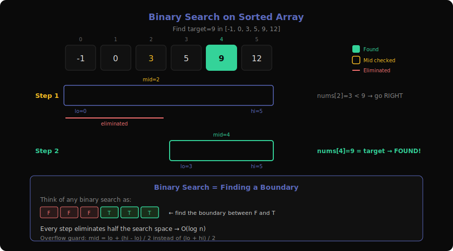
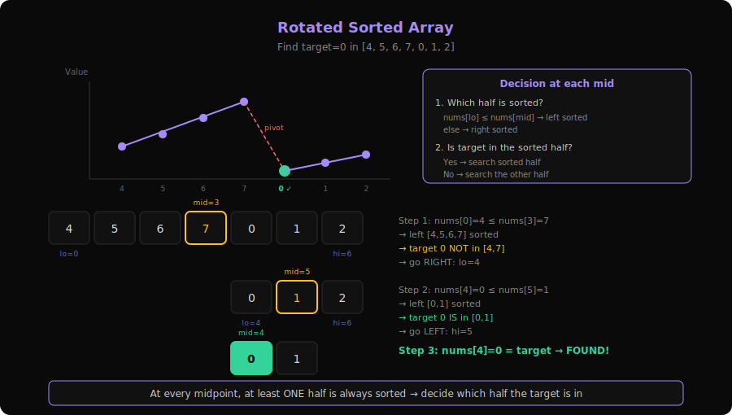
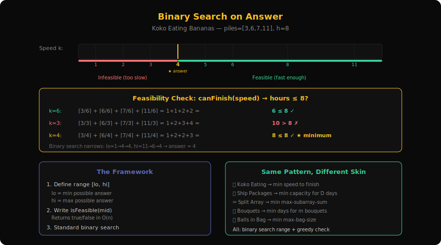
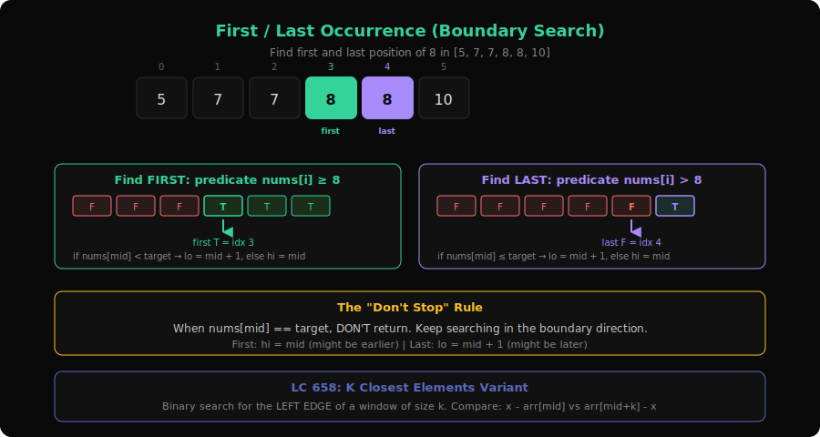
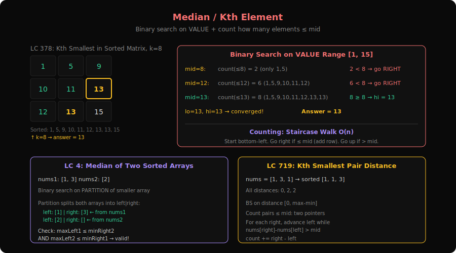

# Research: Binary Search Patterns Deep Dive

**Date**: 2026-03-09
**Researcher**: claude
**Git Commit**: 3fca422
**Branch**: main
**Repository**: idea1

## What is Binary Search?

Binary search is a technique for finding a target value in a **sorted** (or monotonic) search space by repeatedly cutting the space in half. Each step eliminates 50% of the remaining candidates.

**Real-world analogy**: You're looking for a word in a dictionary. You don't scan page by page — you open to the middle, check if your word comes before or after, then flip to the middle of the remaining half. Each flip halves the pages left to check.

**Why it matters**: Linear search checks every element → O(n). Binary search halves each time → O(log n). For n = 1,000,000, that's ~20 steps vs 1,000,000 steps.

**The Core Idea**:
```
The search space has a MONOTONIC property:
  [F, F, F, F, T, T, T, T, T]
                ↑
Binary search finds this boundary — the FIRST True (or LAST False).
```

**Key operations**:
| Operation | Time |
|-----------|------|
| Search in sorted array | O(log n) |
| Search on answer space | O(log(range) × check_cost) |
| Find boundary / first occurrence | O(log n) |

**Three flavors of binary search**:
1. **On a sorted array** — classic, find a target or insertion point
2. **On a rotated/modified array** — sorted but disrupted, need extra logic
3. **On the answer** — search the range of possible answers, validate each with a feasibility check

---

## 1. Binary Search on Sorted Array



**Problems**: 35 (Search Insert Position), 69 (Sqrt(x)), 74 (Search a 2D Matrix), 278 (First Bad Version), 374 (Guess Number), 540 (Single Element in Sorted Array), 704 (Binary Search), 1539 (Kth Missing Positive Number)

### What is it?

The textbook binary search: you have a sorted array and want to find a target (or the position where it would be inserted). Compare the middle element to the target, then search the appropriate half.

**Real-world analogy**: A number guessing game. "I'm thinking of a number between 1 and 100." After each guess, you hear "higher" or "lower." The optimal strategy is always guessing the middle of the remaining range.

**Example**: Find 9 in `[-1, 0, 3, 5, 9, 12]`

```
Step 1: lo=0, hi=5, mid=2 → nums[2]=3 < 9 → search right half
Step 2: lo=3, hi=5, mid=4 → nums[4]=9 = 9 → found! return 4
```

### The Binary Search Process (Visualized)

```
Array:  [-1,  0,  3,  5,  9,  12]
Index:    0   1   2   3   4   5

Step 1:  [──────────────────────]
          lo          mid       hi
          0           2         5
          nums[2]=3 < target=9 → go RIGHT

Step 2:              [──────────]
                      lo  mid  hi
                      3   4    5
                      nums[4]=9 = target → FOUND at index 4!
```

### Core Template (with walkthrough)

**Template 1: Exact match**
```
function binarySearch(nums, target):
    lo = 0, hi = len(nums) - 1

    while lo <= hi:
        mid = lo + (hi - lo) / 2       // avoid overflow
        if nums[mid] == target:
            return mid
        else if nums[mid] < target:
            lo = mid + 1                // target is in right half
        else:
            hi = mid - 1               // target is in left half

    return -1                           // not found
```

**Template 2: Lower bound (first occurrence / insertion point)**
```
function lowerBound(nums, target):
    lo = 0, hi = len(nums)            // note: hi = n, not n-1

    while lo < hi:                     // note: strict <, not <=
        mid = lo + (hi - lo) / 2
        if nums[mid] < target:
            lo = mid + 1
        else:
            hi = mid                   // note: hi = mid, not mid-1

    return lo                          // lo = first index where nums[lo] >= target
```

**Why two templates?**
- Template 1 finds exact matches. It returns early when found.
- Template 2 finds boundaries. It always narrows to a single point. It's more versatile — you can build "first occurrence," "last occurrence," and "insertion point" from it.

**The overflow trap**: `mid = (lo + hi) / 2` can overflow when lo + hi > INT_MAX. Use `mid = lo + (hi - lo) / 2` instead.

### How to Recognize This Pattern

- Array is **sorted** and you need O(log n)
- "Search for target in sorted array"
- "Find the insertion position"
- "First bad version" / "find the boundary between false and true"
- API-based search where each call is expensive (minimize calls)
- "Look for: sorted + find target/boundary + O(log n) required"

### Key Insight / Trick

**Binary search is really about finding a boundary**, not a specific value. Think of the array as a boolean predicate:

```
nums = [1, 3, 5, 7, 9]     target = 6
pred:  [T, T, T, F, F]      predicate: nums[i] < target?
                 ↑
Binary search finds this transition point.
```

Once you frame it as "find the boundary between True and False," every binary search problem looks the same.

### Variations & Edge Cases

- **2D Matrix** (LC 74): Flatten the matrix conceptually — `row = mid / cols, col = mid % cols` — then standard binary search
- **Sqrt(x)** (LC 69): Search [0, x] for the largest `m` where `m*m <= x`. A "binary search on answer" in disguise but the search space is sorted
- **Single Element** (LC 540): In a sorted array where every element appears twice except one, the single element disrupts the pair pattern. Use parity of indices: before the single element, pairs start at even indices; after, they start at odd indices
- **Off-by-one errors**: The #1 source of bugs. Always check: does `lo <= hi` or `lo < hi`? Is it `hi = mid` or `hi = mid - 1`? These depend on your template choice

### Questions Detail

| # | Title | Difficulty | Key Twist |
|---|-------|-----------|-----------|
| 704 | Binary Search | Easy | The textbook problem. Pure sorted array search. No tricks — template 1 directly. Good for getting the muscle memory right. |
| 35 | Search Insert Position | Easy | Return the index if found, otherwise return where it would be inserted. This is literally the lower-bound template (template 2). Returns `lo` at the end. |
| 69 | Sqrt(x) | Easy | Binary search on [0, x]. Find the largest mid where `mid * mid <= x`. Watch for overflow: use `mid <= x / mid` instead of `mid * mid <= x`. |
| 74 | Search a 2D Matrix | Medium | The matrix is effectively a sorted 1D array. Map `mid` to `(mid / cols, mid % cols)`. Then standard binary search on `m × n` elements. |
| 278 | First Bad Version | Easy | Classic boundary search. Versions [1..n], predicate `isBadVersion(mid)`. Find the first True. Template 2 directly. Minimize API calls = minimize iterations. |
| 374 | Guess Number Higher or Lower | Easy | Same as 278 but with a three-way API (too high / too low / correct). Template 1 with the API replacing comparisons. |
| 540 | Single Element in Sorted Array | Medium | Every element appears twice except one. The single disrupts pair alignment. If `mid` is even, its pair should be at `mid+1`. If `nums[mid] == nums[mid^1]` (XOR flips the last bit: even↔odd), single is to the right; else to the left. |
| 1539 | Kth Missing Positive Number | Easy | Count missing numbers below `nums[mid]`: `missing = nums[mid] - (mid + 1)`. If `missing < k`, the kth missing is further right. Otherwise, search left. Final answer: `lo + k`. |

---

## 2. Rotated Sorted Array



**Problems**: 33 (Search in Rotated Sorted Array), 81 (Search in Rotated Sorted Array II), 153 (Find Minimum in Rotated Sorted Array), 162 (Find Peak Element), 852 (Peak Index in Mountain Array), 1095 (Find in Mountain Array)

### What is it?

A sorted array that has been "rotated" — split at some pivot and the two halves swapped. The array is no longer fully sorted, but each half is. Binary search still works because at least one half is always sorted.

**Real-world analogy**: Imagine a clock where the numbers 1-12 are in order, but someone rotated the face so 8 is at the top. The numbers still go in order within each "half" — you can still binary search by figuring out which half you're in.

**Example**: Find 0 in `[4, 5, 6, 7, 0, 1, 2]`

```
Step 1: lo=0, hi=6, mid=3 → nums[3]=7
        Left half [4,5,6,7] is sorted (nums[lo]=4 ≤ nums[mid]=7)
        Target 0 is NOT in [4, 7] → go RIGHT
        lo = 4

Step 2: lo=4, hi=6, mid=5 → nums[5]=1
        Left half [0,1] is sorted (nums[lo]=0 ≤ nums[mid]=1)
        Target 0 IS in [0, 1] → go LEFT
        hi = 5

Step 3: lo=4, hi=5, mid=4 → nums[4]=0 → FOUND!
```

### The Decision Logic (Visualized)

```
Original sorted: [0, 1, 2, 4, 5, 6, 7]
Rotated at k=4:  [4, 5, 6, 7, 0, 1, 2]
                  ─────────  ────────
                  sorted ↑    sorted ↑
                         pivot

At any mid, ONE half is guaranteed sorted:

Case A: Left half sorted (nums[lo] ≤ nums[mid])
  ┌──sorted──┐
  [4, 5, 6, 7, 0, 1, 2]
   lo      mid         hi
  → Is target in [nums[lo], nums[mid]]?
    Yes → search left.  No → search right.

Case B: Right half sorted (nums[mid] ≤ nums[hi])
              ┌──sorted──┐
  [6, 7, 0, 1, 2, 4, 5]
   lo      mid         hi
  → Is target in [nums[mid], nums[hi]]?
    Yes → search right.  No → search left.
```

### Core Template (with walkthrough)

```
function searchRotated(nums, target):
    lo = 0, hi = len(nums) - 1

    while lo <= hi:
        mid = lo + (hi - lo) / 2
        if nums[mid] == target:
            return mid

        // Determine which half is sorted
        if nums[lo] <= nums[mid]:
            // LEFT half is sorted
            if nums[lo] <= target < nums[mid]:
                hi = mid - 1             // target in sorted left half
            else:
                lo = mid + 1             // target in unsorted right half
        else:
            // RIGHT half is sorted
            if nums[mid] < target <= nums[hi]:
                lo = mid + 1             // target in sorted right half
            else:
                hi = mid - 1             // target in unsorted left half

    return -1
```

**The key decision**: At each step, identify which half is sorted (compare `nums[lo]` with `nums[mid]`). Then check if the target falls within the sorted half's range. If yes, search there. If no, search the other half.

### How to Recognize This Pattern

- "Sorted array that has been **rotated**"
- "Find the minimum in a rotated sorted array"
- "**Mountain array**" — increases then decreases (rotation variant)
- "**Peak element**" — local maximum in an unsorted array
- The array was once sorted but has a single "break point"
- "Look for: sorted-but-disrupted + O(log n) required"

### Key Insight / Trick

**At every midpoint, at least one half is always sorted**. This is the invariant that makes binary search possible despite the rotation. You leverage the sorted half to decide which way to go.

For **Find Minimum** (LC 153): The minimum is at the rotation point. If `nums[mid] > nums[hi]`, the break is in the right half. Otherwise, it's in the left half (or mid itself is the min).

For **Peak Element** (LC 162): If `nums[mid] < nums[mid+1]`, the peak is to the right (still ascending). Otherwise, the peak is at mid or to the left.

### Variations & Edge Cases

- **Duplicates** (LC 81): When `nums[lo] == nums[mid] == nums[hi]`, you can't determine which half is sorted. Worst case: `lo++, hi--` → degrades to O(n) in pathological cases like `[1,1,1,1,1]`
- **Mountain arrays** (LC 852, 1095): Increase then decrease. Binary search on the slope: if `nums[mid] < nums[mid+1]`, go right (ascending slope). Otherwise, go left (descending slope or peak).
- **Find minimum vs search**: For finding the minimum, compare `nums[mid]` with `nums[hi]` (not `nums[lo]`). For searching a target, compare with both ends.

### Questions Detail

| # | Title | Difficulty | Key Twist |
|---|-------|-----------|-----------|
| 33 | Search in Rotated Sorted Array | Medium | The defining rotated search problem. No duplicates. At each mid, determine which half is sorted and whether target is in that range. Template above applies directly. |
| 81 | Search in Rotated Sorted Array II | Medium | Same as 33 but with **duplicates**. When `nums[lo] == nums[mid]`, you can't tell which side is sorted — just `lo++` to skip one duplicate. Worst case O(n), average still O(log n). |
| 153 | Find Minimum in Rotated Sorted Array | Medium | Don't search for a target — search for the pivot point. If `nums[mid] > nums[hi]`, the minimum is in the right half. Otherwise, it's in the left half (including mid). Use `hi = mid` (not `mid-1`) because mid might be the answer. |
| 162 | Find Peak Element | Medium | Not rotated, but binary search on a non-sorted array. If `nums[mid] < nums[mid+1]`, a peak exists to the right (values are still going up). Otherwise, a peak is at mid or to its left. Works because `nums[-1] = nums[n] = -∞`. |
| 852 | Peak Index in Mountain Array | Medium | Simplified version of 162. Guaranteed mountain shape (strictly increases then strictly decreases). Same slope-based binary search. If `arr[mid] < arr[mid+1]`, go right. |
| 1095 | Find in Mountain Array | Hard | First find the peak (like 852), then binary search the ascending half, then binary search the descending half (with reversed comparison). Three binary searches total (premium). |

---

## 3. Binary Search on Answer (Binary Search on Result)



**Problems**: 410 (Split Array Largest Sum), 774 (Minimize Max Distance to Gas Station), 875 (Koko Eating Bananas), 1011 (Capacity To Ship Packages), 1482 (Min Days for Bouquets), 1760 (Min Limit of Balls in Bag), 2064 (Minimized Maximum of Products Distributed), 2226 (Maximum Candies Allocated to K Children)

### What is it?

Instead of searching a sorted array, you search the **range of possible answers**. For each candidate answer, you run a feasibility check: "Can this answer work?" The answers form a monotonic pattern (all feasible or all infeasible after a threshold), so binary search finds the boundary.

**Real-world analogy**: You're building a bridge and need to decide the minimum thickness of steel beams. Too thin → bridge collapses (infeasible). Too thick → wasteful. You test thicknesses by simulation: "Would 5cm work? Would 3cm work? Would 4cm work?" The answer switches from "no" to "yes" at some thickness, and you binary search for that threshold.

**Example**: Koko eating bananas — piles = [3, 6, 7, 11], h = 8 hours

```
Search space: speed k ∈ [1, 11] (min=1, max=max_pile)

k=6: hours = ⌈3/6⌉+⌈6/6⌉+⌈7/6⌉+⌈11/6⌉ = 1+1+2+2 = 6 ≤ 8 ✓ feasible
k=3: hours = ⌈3/3⌉+⌈6/3⌉+⌈7/3⌉+⌈11/3⌉ = 1+2+3+4 = 10 > 8 ✗ too slow
k=4: hours = ⌈3/4⌉+⌈6/4⌉+⌈7/4⌉+⌈11/4⌉ = 1+2+2+3 = 8 ≤ 8 ✓ feasible
k=3: already checked → infeasible

Answer: k=4 (minimum speed that finishes in ≤ 8 hours)

Monotonic property:
Speed:  1  2  3  4  5  6  7  8  9  10  11
Works?  ✗  ✗  ✗  ✓  ✓  ✓  ✓  ✓  ✓  ✓   ✓
                  ↑
                  binary search finds this boundary
```

### The Framework (Visualized)

```
┌─────────────────────────────────────────────┐
│     Binary Search on Answer Framework        │
├─────────────────────────────────────────────┤
│                                             │
│  1. Define the answer RANGE: [lo, hi]       │
│     lo = smallest possible answer           │
│     hi = largest possible answer            │
│                                             │
│  2. Define the FEASIBILITY CHECK:           │
│     canDoIt(mid) → true/false               │
│     "Can we achieve the goal with mid?"     │
│                                             │
│  3. Binary search on the range:             │
│     ✗ ✗ ✗ ✗ ✓ ✓ ✓ ✓ ✓                     │
│              ↑                              │
│     Find this boundary                      │
│                                             │
│  4. Return the boundary value               │
└─────────────────────────────────────────────┘
```

### Core Template (with walkthrough)

```
function binarySearchOnAnswer(problem):
    lo = minimum_possible_answer
    hi = maximum_possible_answer

    while lo < hi:
        mid = lo + (hi - lo) / 2
        if isFeasible(mid):
            hi = mid                // mid works, but maybe smaller works too
        else:
            lo = mid + 1            // mid doesn't work, need bigger

    return lo                       // lo = smallest feasible answer

function isFeasible(candidate):
    // Problem-specific: simulate or check if 'candidate' is achievable
    // Must run in O(n) or O(n log n) — NOT O(n²)
    return true/false
```

**The trick**: The template is always the same. Only `isFeasible()` changes per problem. This is why this pattern is so powerful — once you recognize it, every problem reduces to writing a single validation function.

**Minimize vs Maximize**:
- **Minimize** (find smallest feasible): `if feasible → hi = mid, else lo = mid + 1`
- **Maximize** (find largest feasible): `if feasible → lo = mid, else hi = mid - 1` (use `mid = lo + (hi - lo + 1) / 2` to avoid infinite loop)

### How to Recognize This Pattern

- "**Minimize the maximum**" or "**Maximize the minimum**"
- "What is the minimum X such that..."
- "Can you do it in at most K ..." / "least capacity to ..."
- The answer itself is a number in a range, not an index in an array
- You can write a function `canDoItWith(x) → bool` that's monotonic in x
- "Look for: optimization + feasibility check + monotonic answer space"

### Key Insight / Trick

**The answer space is always monotonic**. If speed k=5 works for Koko, then k=6, k=7, ... all work too (eating faster always finishes sooner). This monotonicity is what makes binary search applicable.

**Identifying the search range**:
- **Lower bound**: Usually the minimum possible (e.g., max(weights) for shipping — you must fit the heaviest package)
- **Upper bound**: Usually the maximum possible (e.g., sum(weights) for shipping — ship everything in one day)

**The feasibility check is the hard part**, not the binary search itself. Common patterns:
- Greedy simulation (iterate array, count days/trips/splits)
- Counting elements ≤ mid in a matrix (for kth smallest)

### Variations & Edge Cases

- **Floating-point answer** (LC 774): Binary search on doubles. Instead of `lo < hi`, use `for 100 iterations` or `while hi - lo > 1e-6`
- **Minimize max vs maximize min**: Both are binary search on answer. The feasibility check logic flips.
- **Edge**: When lo == hi initially, the answer is trivially lo. When the problem is impossible, return -1 before binary searching.

### Questions Detail

| # | Title | Difficulty | Key Twist |
|---|-------|-----------|-----------|
| 875 | Koko Eating Bananas | Medium | The textbook "binary search on answer" problem. Range: [1, max(piles)]. Feasibility: can Koko finish all piles within h hours at speed mid? Greedy check: `sum(⌈pile/mid⌉) ≤ h`. |
| 1011 | Capacity To Ship Packages Within D Days | Medium | Range: [max(weights), sum(weights)]. Feasibility: greedily pack each day until adding the next weight exceeds capacity, then start a new day. Count days ≤ D? Same structure as Koko but with a shipping metaphor. |
| 410 | Split Array Largest Sum | Hard | "Minimize the maximum subarray sum when splitting into k parts." Range: [max(nums), sum(nums)]. Feasibility: greedy split — if running sum exceeds mid, start a new subarray. Count splits ≤ k? Identical structure to 1011 but dressed differently. |
| 1482 | Min Number of Days to Make m Bouquets | Medium | Range: [min(bloomDay), max(bloomDay)]. Feasibility: on day=mid, which flowers have bloomed? Count consecutive groups of k bloomed flowers ≥ m? Adds a "consecutive adjacent" constraint to the greedy check. |
| 1760 | Min Limit of Balls in a Bag | Medium | Range: [1, max(nums)]. Each bag with balls > mid needs `⌈balls/mid⌉ - 1` splits. Total splits ≤ maxOperations? The feasibility check is a simple formula per element. |
| 2064 | Minimized Maximum of Products Distributed | Medium | Distribute products to stores, minimize the max any store gets. Range: [1, max(quantities)]. Feasibility: each product needs `⌈quantity/mid⌉` stores. Total stores needed ≤ n? |
| 774 | Minimize Max Distance to Gas Station | Hard | Floating-point binary search. Range: [0, max_gap]. Feasibility: to make all gaps ≤ mid, count stations needed = `sum(⌈gap/mid⌉ - 1)`. Use iteration count instead of `lo < hi` (premium). |
| 2226 | Maximum Candies Allocated to K Children | Medium | **Maximize** instead of minimize. Range: [1, max(candies)]. Feasibility: `sum(pile / mid) ≥ k`? Note: uses `lo = mid` instead of `hi = mid` because we want the **largest** feasible. |

---

## 4. First/Last Occurrence (Boundary Search)



**Problems**: 34 (Find First and Last Position), 658 (Find K Closest Elements)

### What is it?

You need to find where a specific value first appears (or last appears) in a sorted array that may have duplicates. Standard binary search finds **some** occurrence, but you need the **leftmost** or **rightmost** one.

**Real-world analogy**: In a phone book with many "Smiths," you want the first Smith (to start reading) and the last Smith (to know when to stop). You can't just find any Smith — you need the boundaries.

**Example**: Find first and last position of 8 in `[5, 7, 7, 8, 8, 10]`

```
Finding FIRST occurrence of 8:
  lo=0, hi=5, mid=2 → nums[2]=7 < 8 → lo=3
  lo=3, hi=5, mid=4 → nums[4]=8 = 8 → don't stop! hi=4 (might be earlier)
  lo=3, hi=4, mid=3 → nums[3]=8 = 8 → hi=3
  lo=3, hi=3 → lo=hi=3 → first = 3 ✓

Finding LAST occurrence of 8:
  lo=0, hi=5, mid=2 → nums[2]=7 < 8 → lo=3
  lo=3, hi=5, mid=4 → nums[4]=8 = 8 → don't stop! lo=4 (might be later)
  lo=4, hi=5, mid=4 → nums[4]=8 = 8 → lo=5
  lo=5, hi=5 → nums[5]=10 ≠ 8 → check lo-1=4 → last = 4 ✓

Result: [3, 4]
```

### The Boundary Search (Visualized)

```
Array: [5, 7, 7, 8, 8, 10]
        0  1  2  3  4  5

Predicate for FIRST 8: "is nums[mid] >= 8?"
        [F, F, F, T, T, T]
                  ↑
                  first True = index 3 (first 8)

Predicate for LAST 8: "is nums[mid] > 8?"
        [F, F, F, F, F, T]
                        ↑
                        first True = index 5
                        last 8 = index 5 - 1 = 4
```

### Core Template (with walkthrough)

```
function findFirst(nums, target):
    lo = 0, hi = len(nums)
    while lo < hi:
        mid = lo + (hi - lo) / 2
        if nums[mid] < target:
            lo = mid + 1
        else:
            hi = mid               // nums[mid] >= target, could be answer
    if lo < len(nums) AND nums[lo] == target:
        return lo
    return -1

function findLast(nums, target):
    lo = 0, hi = len(nums)
    while lo < hi:
        mid = lo + (hi - lo) / 2
        if nums[mid] <= target:     // note: <= instead of <
            lo = mid + 1
        else:
            hi = mid
    return lo - 1 if lo > 0 AND nums[lo-1] == target else -1
```

**The difference**: `findFirst` uses `<` (stops at first ≥), `findLast` uses `<=` (stops at first >, then steps back one).

### How to Recognize This Pattern

- "Find the **first** and **last** position of target"
- "How many times does target appear?" → `last - first + 1`
- Sorted array with **duplicates** and need specific boundaries
- "K closest elements" → find the window starting point via binary search
- "Look for: sorted + duplicates + need exact boundary position"

### Key Insight / Trick

**The "don't stop" rule**: When you find the target, don't return immediately. Instead, continue searching in the direction of the boundary you want:
- For **first occurrence**: when `nums[mid] == target`, set `hi = mid` (there might be an earlier one)
- For **last occurrence**: when `nums[mid] == target`, set `lo = mid + 1` (there might be a later one)

This is equivalent to converting the exact-match search into a boundary search.

### Variations & Edge Cases

- **Count of target**: `findLast(target) - findFirst(target) + 1`
- **K Closest Elements** (LC 658): Binary search for the left boundary of a window of size k. Compare `x - arr[mid]` vs `arr[mid+k] - x` to decide whether to shift the window right.
- **Empty array**: Always check bounds after binary search ends
- **Target not in array**: Both functions should return -1

### Questions Detail

| # | Title | Difficulty | Key Twist |
|---|-------|-----------|-----------|
| 34 | Find First and Last Position of Element in Sorted Array | Medium | The defining problem. Run binary search twice: once for lower bound (first occurrence), once for upper bound (last occurrence). Each is a boundary search with a slightly different comparison. Must be O(log n), not O(n). |
| 658 | Find K Closest Elements | Medium | Given sorted array, find k elements closest to x. Binary search for the **left edge** of the optimal window. Compare distances: if `x - arr[mid] > arr[mid+k] - x`, shift right (`lo = mid+1`), else shift left (`hi = mid`). Result is `arr[lo..lo+k-1]`. The binary search finds the window position, not a specific element. |

---

## 5. Median/Kth Element



**Problems**: 4 (Median of Two Sorted Arrays), 378 (Kth Smallest Element in Sorted Matrix), 719 (Find K-th Smallest Pair Distance)

### What is it?

Finding the kth smallest element in a structured (but not simply sorted) data set — two sorted arrays, a sorted matrix, or all pair distances. Direct enumeration would be too slow, so you binary search on the **value** and count how many elements are ≤ that value.

**Real-world analogy**: Imagine you're judging a competition with multiple scorecards (each sorted). You need the median score across all cards. You don't merge all cards — instead, you pick a candidate score and count how many scores are below it. If too few → guess higher. If too many → guess lower.

**Example**: Kth smallest in sorted matrix, k=8

```
Matrix: [[1, 5, 9],
         [10, 11, 13],
         [12, 13, 15]]

Search space: [1, 15] (min element to max element)

mid = 8:  count ≤ 8: row0=[1,5] → 2, row1=[] → 0, row2=[] → 0 = 2 < 8
mid = 12: count ≤ 12: row0=[1,5,9] → 3, row1=[10,11] → 2, row2=[12] → 1 = 6 < 8
mid = 13: count ≤ 13: row0=[1,5,9] → 3, row1=[10,11,13] → 3, row2=[12,13] → 2 = 8 ≥ 8
mid = 12: count = 6 < 8 → go right
→ Answer: 13
```

### The Counting Framework (Visualized)

```
Binary Search on VALUE, not on INDEX

Search space: [min_val, max_val]

For each candidate value 'mid':
  count = "how many elements ≤ mid?"

  count < k  →  answer is bigger  →  lo = mid + 1
  count ≥ k  →  answer is mid or smaller  →  hi = mid

┌─────────────────────────────────────┐
│  Value:    1  5  9 10 11 12 13  15  │
│  Count≤v:  1  2  3  4  5  6  8   9 │
│                                ↑    │
│                        count=8 ≥ k=8│
│                        → hi = 13    │
└─────────────────────────────────────┘
```

### Core Template (with walkthrough)

```
function kthSmallest(structure, k):
    lo = minimum_value_in_structure
    hi = maximum_value_in_structure

    while lo < hi:
        mid = lo + (hi - lo) / 2
        count = countLessOrEqual(structure, mid)
        if count < k:
            lo = mid + 1
        else:
            hi = mid

    return lo

function countLessOrEqual(structure, target):
    // Structure-specific counting in O(n) or O(n log n)
    // - Sorted matrix: staircase walk from bottom-left, O(m+n)
    // - Two sorted arrays: binary search in each, O(log m + log n)
    // - Pair distances: sort + two pointers, O(n)
    return count
```

### How to Recognize This Pattern

- "**Kth smallest**" in a structured but not linearly sorted collection
- "**Median** of two sorted arrays"
- The collection is too large to flatten and sort (n² pairs, m×n matrix)
- Each individual dimension is sorted but the whole isn't
- You can efficiently count how many elements ≤ a given value
- "Look for: kth element + structured data + counting function"

### Key Insight / Trick

**Binary search on value, not index**. Instead of asking "what is at position k?", ask "is the answer ≤ mid?" and count how many elements satisfy that. The counting function is the heart of each problem:

- **Sorted matrix**: Start from bottom-left. If `matrix[r][c] ≤ mid`, add `r+1` (entire column above is ≤ mid) and move right. Otherwise move up. O(m + n).
- **Two sorted arrays** (LC 4): Binary search for a partition point in the smaller array that divides both arrays into left/right halves of equal total size.
- **Pair distances** (LC 719): Sort array, then for each element, use two pointers to count pairs with distance ≤ mid. O(n).

### Variations & Edge Cases

- **Median of Two Sorted Arrays** (LC 4): Arguably the hardest binary search problem. Binary search on partition point in the smaller array. The partition must satisfy: `maxLeft1 ≤ minRight2` and `maxLeft2 ≤ minRight1`. Edge cases with empty partitions require sentinel values (-∞, +∞).
- **Even vs odd total**: Median requires handling `(total+1)/2` and `total/2` for even-length sets
- **Value that doesn't exist**: The answer from binary search might be a value not in the original structure. For LC 378, it always converges to an actual matrix value. For LC 719, the answer is always an actual distance.

### Questions Detail

| # | Title | Difficulty | Key Twist |
|---|-------|-----------|-----------|
| 4 | Median of Two Sorted Arrays | Hard | The most famous binary search problem. Binary search on the partition of the shorter array. Partition divides both arrays into left/right such that `leftCount = (m+n+1)/2`. Check: `maxLeft1 ≤ minRight2 AND maxLeft2 ≤ minRight1`. If not, adjust partition. O(log(min(m,n))). |
| 378 | Kth Smallest Element in a Sorted Matrix | Medium | Binary search on value [matrix[0][0], matrix[n-1][n-1]]. Count elements ≤ mid using the staircase walk: start bottom-left, go right if ≤ mid (add row count), go up if > mid. O(n) per check, O(n log(max-min)) total. Can also solve with min-heap. |
| 719 | Find K-th Smallest Pair Distance | Hard | Binary search on distance [0, max-min]. Count pairs with distance ≤ mid: sort the array, then for each right pointer, advance left pointer while `nums[right] - nums[left] > mid`. Count = `sum(right - left)`. O(n log n + n log(max-min)). |

---

## Comparison Table: All Binary Search Sub-Patterns

| Aspect | On Sorted Array | Rotated Array | On Answer | First/Last Occurrence | Median/Kth |
|--------|----------------|---------------|-----------|----------------------|------------|
| **Search space** | Sorted array indices | Rotated array indices | Range of possible answers | Sorted array with dupes | Value range of structured data |
| **What you search for** | Target value | Target or minimum | Optimal answer | Boundary position | Kth value |
| **Monotonic property** | Array is sorted | One half always sorted | Feasibility is monotonic | Array is sorted | Count function is monotonic |
| **Key technique** | Compare mid to target | Identify sorted half | Feasibility check | Don't stop at first match | Count ≤ mid |
| **Time complexity** | O(log n) | O(log n) | O(log(range) × n) | O(log n) | O(n × log(range)) |
| **When to use** | "Find target in sorted" | "Rotated" / "peak" | "Minimize the max" | "First/last position" | "Kth smallest in matrix/pairs" |
| **Typical difficulty** | Easy | Medium | Medium-Hard | Medium | Hard |

### Common Pitfalls Across All Patterns

1. **Off-by-one**: `lo <= hi` vs `lo < hi`, `hi = mid` vs `hi = mid - 1`. Pick ONE template and stick with it.
2. **Integer overflow**: Always use `mid = lo + (hi - lo) / 2`, never `(lo + hi) / 2`.
3. **Infinite loop**: With `lo < hi` and `lo = mid`, use `mid = lo + (hi - lo + 1) / 2` (ceiling division) to avoid `lo = mid` when `hi = lo + 1`.
4. **Wrong half**: After finding which half to search, double-check the boundary conditions (inclusive vs exclusive).

### Relationship Between Patterns

```
Binary Search on Sorted Array (foundation)
    │
    ├── Array is rotated? ──→ Rotated Sorted Array
    │
    ├── Need first/last position? ──→ Boundary Search
    │
    ├── "Minimize the max" / "optimal value"? ──→ Binary Search on Answer
    │
    └── "Kth element" in structured data? ──→ Median/Kth (BS on value + counting)
```

---

## Code References

- `server/patterns.py:84-90` — Binary Search category definition (5 sub-patterns, 27 problems)
- `server/patterns.py:362-367` — Reverse lookup (problem → pattern)
- `server/main.py:307-369` — API endpoint for pattern data
- `extension/patterns.js` — Client-side pattern labels
