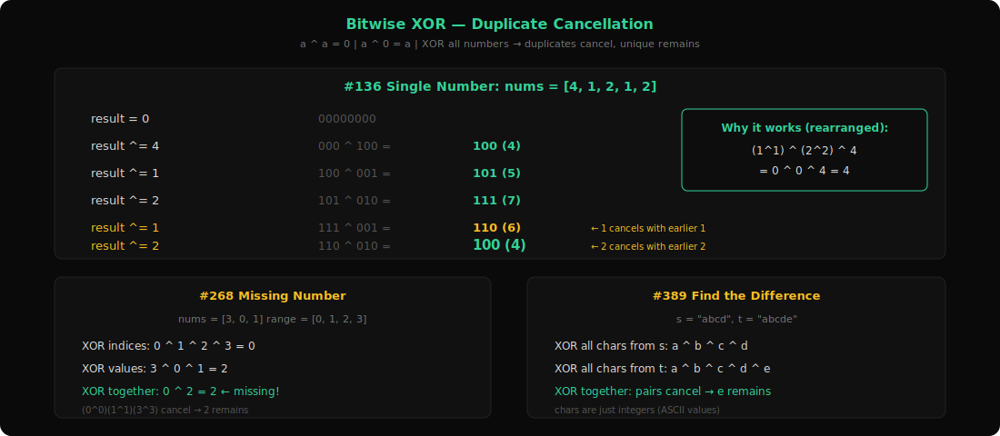
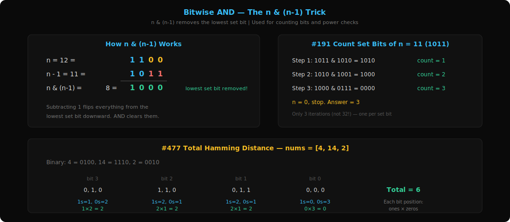
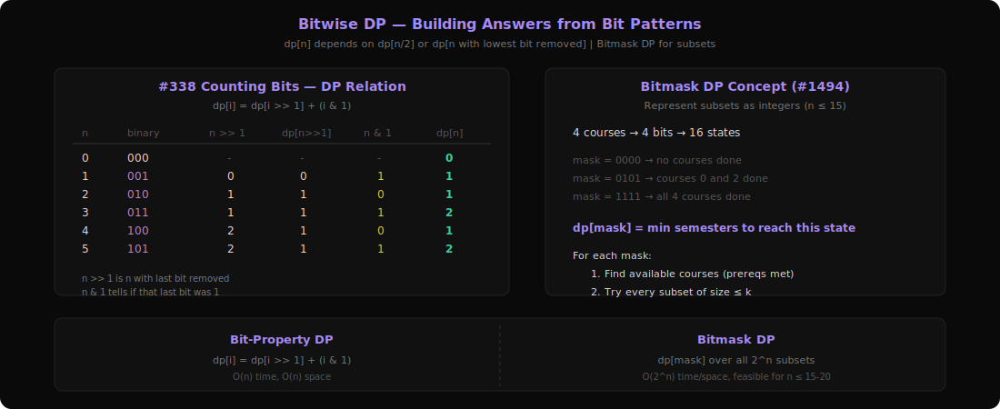
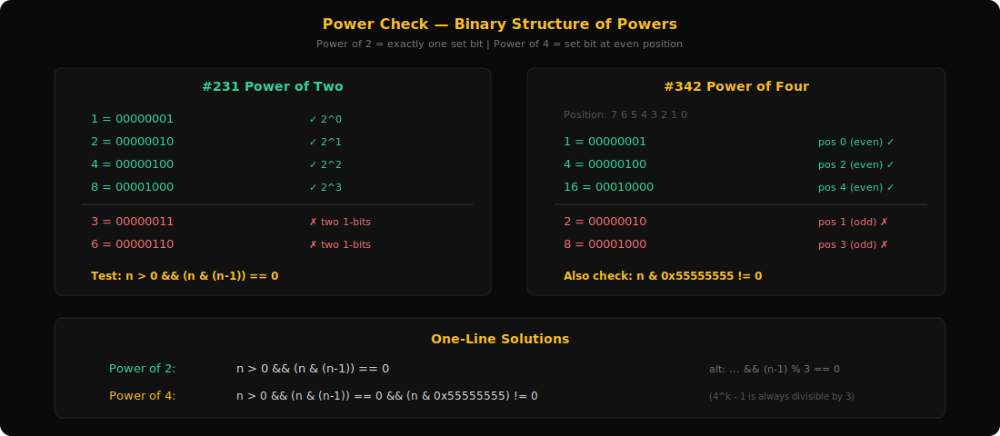

# Research: Bit Manipulation Patterns Deep Dive

**Date**: 2026-03-09
**Git Commit**: 3fca422
**Branch**: main

## Research Question
Deep dive into the Bit Manipulation section from `server/patterns.py` — understand all 4 sub-patterns, analyze LeetCode questions, explain pattern recognition and usage.

## Summary

Bit Manipulation is defined in `server/patterns.py:99-104` with **4 sub-patterns** and **12 total problems** (11 unique — #231 appears in both Bitwise AND and Power Check). It is the smallest category by sub-pattern count.

### What is Bit Manipulation? (The Real Intuition)

Every integer in a computer is stored as a sequence of 0s and 1s (bits). Bit manipulation is about solving problems by working directly with these bits instead of treating numbers as whole values.

**Why bother?** Because certain operations that seem complex with arithmetic become trivially simple with bits:
- "Find the number that appears once when all others appear twice" → one line of XOR
- "Is this number a power of 2?" → one line of AND
- "Count the 1-bits" → a simple loop with AND

**The key mental shift**: Stop thinking of `5` as "five." Think of it as `101` — three bits, with the 1st and 3rd positions set.

### Essential Bit Operations Cheat Sheet

```
AND (&):   1 & 1 = 1, everything else = 0    "Both bits must be 1"
OR  (|):   0 | 0 = 0, everything else = 1    "At least one bit must be 1"
XOR (^):   same = 0, different = 1            "Bits must differ"
NOT (~):   flips all bits                     "0→1, 1→0"
LEFT SHIFT  (<<):  multiply by 2             "Add a 0 on the right"
RIGHT SHIFT (>>):  divide by 2               "Remove the rightmost bit"
```

**Critical properties of XOR:**
```
a ^ a = 0        (anything XOR itself is 0)
a ^ 0 = a        (anything XOR 0 is itself)
a ^ b ^ a = b    (a cancels out — this is the key insight!)
XOR is commutative and associative (order doesn't matter)
```

**Critical tricks with AND:**
```
n & (n-1)         removes the lowest set bit
n & (-n)          isolates the lowest set bit
n & 1             checks if n is odd (last bit)
```

---

## 1. Bitwise XOR Pattern



**Problems**: 136 (Single Number), 137 (Single Number II), 268 (Missing Number), 389 (Find the Difference)

### What is it?

XOR is the "cancellation" operator. When you XOR a number with itself, it becomes 0. When you XOR a number with 0, it stays the same. This means if you XOR all numbers together, **duplicates cancel out** and you're left with the unique one.

Think of it like a light switch: flip it once → on, flip it again → off. If every number flips the switch twice (appears twice), they cancel. The one that only flips once is left.

### Walkthrough: #136 Single Number

```
nums = [4, 1, 2, 1, 2]

Step by step XOR:
  0 ^ 4 = 4        (binary: 000 ^ 100 = 100)
  4 ^ 1 = 5        (binary: 100 ^ 001 = 101)
  5 ^ 2 = 7        (binary: 101 ^ 010 = 111)
  7 ^ 1 = 6        (binary: 111 ^ 001 = 110)  ← 1 cancels with earlier 1
  6 ^ 2 = 4        (binary: 110 ^ 010 = 100)  ← 2 cancels with earlier 2

Result: 4 — the only number that appeared once!
```

**Why it works**: XOR is commutative, so the order doesn't matter. Mentally rearrange: `(1^1) ^ (2^2) ^ 4 = 0 ^ 0 ^ 4 = 4`

### Core Template

```
result = 0
for num in nums:
    result ^= num
return result
```

That's it. One variable, one loop, one XOR.

### How to Recognize This Pattern

- **"Every element appears twice except one"** — dead giveaway for XOR
- **"Find the missing/extra element"** — XOR expected vs actual
- **"Find the difference"** — XOR all elements from both sources
- Constraint says O(1) space, linear time, no extra data structures
- Look for: pairs that should cancel out, with one outlier

### Variations

**#268 Missing Number**: numbers [0, n] but array has n elements (one missing).
XOR all indices 0..n with all values in array. Pairs cancel, missing number remains.
```
0^1^2^3 ^ 3^0^1 = 2  (the missing number)
```

**#389 Find the Difference**: string s and string t (t = s + one extra char).
XOR all characters from both strings. Paired chars cancel, extra char remains.

**#137 Single Number II**: every element appears THREE times except one.
Simple XOR won't work (a^a^a = a, not 0). Instead, count bits at each position modulo 3.
For each of the 32 bit positions, count how many numbers have a 1 there.
If count % 3 != 0, the unique number has a 1 at that position.

### Questions Detail

| # | Title | Difficulty | Key Twist |
|---|-------|-----------|-----------|
| 136 | Single Number | Easy | Pure XOR: every number appears twice except one. XOR all → answer. The canonical "XOR cancels duplicates" problem. O(1) space, O(n) time. |
| 137 | Single Number II | Medium | Every number appears THREE times except one. XOR alone won't work because `a^a^a = a`. Instead, count set bits at each of the 32 positions modulo 3. If count % 3 == 1 at position k, the unique number has bit k set. Alternatively, use two variables (`ones`, `twos`) to simulate a ternary counter. |
| 268 | Missing Number | Easy | Array has [0..n] with one missing. XOR all indices (0 to n) with all array values. Everything pairs up except the missing number. Alternative: use sum formula n*(n+1)/2 - sum(nums), but XOR avoids overflow. |
| 389 | Find the Difference | Easy | String t = shuffle(s) + one extra character. XOR all chars from s and t together. Pairs cancel, leaving the added character. Works because chars are just integers (ASCII values). |

---

## 2. Bitwise AND Pattern



**Problems**: 191 (Number of 1 Bits), 231 (Power of Two), 477 (Total Hamming Distance)

### What is it?

AND is the "masking" operator. It reveals specific bits or strips them away. The most powerful trick: `n & (n-1)` removes the lowest set bit from n.

Think of AND as a stencil: it only lets through bits where BOTH numbers have a 1. Everything else becomes 0.

### The n & (n-1) Trick — Visualized

```
n   = 12 = 1100
n-1 = 11 = 1011
            ----
n & (n-1)  = 1000 = 8

What happened? The lowest set bit (position 2) was removed!
```

**Why does this work?** Subtracting 1 from a binary number flips all bits from the lowest set bit down to 0:
```
  1100  (n = 12)
- 0001
------
  1011  (n-1 = 11)
       ↑ lowest set bit and everything below flipped
```
When you AND these together, the lowest set bit and everything below it becomes 0. Everything above stays the same.

### Walkthrough: #191 Number of 1 Bits (Hamming Weight)

```
n = 11 = 1011

Iteration 1: n & (n-1) = 1011 & 1010 = 1010, count = 1
Iteration 2: n & (n-1) = 1010 & 1001 = 1000, count = 2
Iteration 3: n & (n-1) = 1000 & 0111 = 0000, count = 3
n = 0, stop.

Answer: 3 set bits
```

Each iteration removes exactly one set bit. The loop runs exactly `k` times where `k` is the number of 1-bits. Much better than checking all 32 bits!

### Core Template

```
# Count set bits
count = 0
while n:
    n &= (n - 1)    # remove lowest set bit
    count += 1
return count
```

### How to Recognize This Pattern

- **"Count the number of 1 bits"** — direct application
- **"Hamming weight" / "Hamming distance"** — count differing bits
- **"Check if power of 2"** — `n & (n-1) == 0`
- Problems involving bit-level properties of numbers
- Look for: counting bits, isolating bits, checking specific bit patterns

### Key AND Tricks Summary

```
n & (n-1)     → remove lowest set bit (used in bit counting)
n & (-n)      → isolate lowest set bit (gives you just that bit)
n & 1         → check if odd (test last bit)
n & mask      → extract specific bits
```

### Questions Detail

| # | Title | Difficulty | Key Twist |
|---|-------|-----------|-----------|
| 191 | Number of 1 Bits | Easy | Count set bits. The naive way: check each of 32 bits with `n & 1`, then `n >>= 1`. The clever way: `n &= (n-1)` in a loop — only iterates as many times as there are set bits (up to 32, but usually much less). Also called Brian Kernighan's algorithm. |
| 231 | Power of Two | Easy | A power of 2 in binary is `1` followed by zeros: 1, 10, 100, 1000... It has exactly ONE set bit. So `n > 0 && (n & (n-1)) == 0`. The `n & (n-1)` removes the only set bit, leaving 0. If the result isn't 0, there were multiple set bits → not a power of 2. |
| 477 | Total Hamming Distance | Medium | Sum of Hamming distances across ALL pairs. Naive: O(n^2) compare every pair. Smart: for each of 32 bit positions, count how many numbers have a 1 (`c`) and how many have a 0 (`n-c`). Each 1-bit pairs with each 0-bit to contribute 1 to the distance. Total for that position = `c * (n-c)`. Sum across all 32 positions. O(32n). |

---

## 3. Bitwise DP Pattern



**Problems**: 338 (Counting Bits), 1442 (Count Triplets with Equal XOR), 1494 (Parallel Courses II)

### What is it?

This pattern combines bit manipulation with dynamic programming. You use bit properties to build DP transitions: the bit pattern of `n` relates to the bit pattern of `n/2` or `n & (n-1)`, letting you compute things about `n` from previously computed results.

The second flavor is **bitmask DP**: represent a subset of elements as a bitmask (integer), and use DP over these bitmasks. If you have n=15 elements, there are 2^15 = 32768 possible subsets, each representable as a single integer.

### Walkthrough: #338 Counting Bits

"For each number 0 to n, count its set bits."

The DP relation: `bits[n] = bits[n >> 1] + (n & 1)`

```
n=0: bits[0] = 0                                    (base case)
n=1: bits[1] = bits[0] + (1 & 1) = 0 + 1 = 1       binary: 1
n=2: bits[2] = bits[1] + (2 & 1) = 1 + 0 = 1       binary: 10
n=3: bits[3] = bits[1] + (3 & 1) = 1 + 1 = 2       binary: 11
n=4: bits[4] = bits[2] + (4 & 1) = 1 + 0 = 1       binary: 100
n=5: bits[5] = bits[2] + (5 & 1) = 1 + 1 = 2       binary: 101
```

**Why does this work?** Shifting n right by 1 (`n >> 1`) removes the last bit. So the number of set bits in `n` equals the number in `n >> 1` (same number without the last bit) plus whether that last bit was 1 (checked by `n & 1`).

### Core Templates

**Bit-property DP:**
```
dp[0] = 0
for i from 1 to n:
    dp[i] = dp[i >> 1] + (i & 1)       # OR
    dp[i] = dp[i & (i-1)] + 1          # using lowest-set-bit removal
```

**Bitmask DP (for #1494 style):**
```
# dp[mask] = best answer when the set of "done" items is represented by mask
dp[0] = base_case
for mask from 0 to (1 << n) - 1:
    available = compute_available(mask)
    for each submask of available:
        dp[mask | submask] = min(dp[mask | submask], dp[mask] + 1)
```

### How to Recognize This Pattern

- **"Count bits for every number from 0 to n"** — bit-property DP
- **"n ≤ 15" or "n ≤ 20"** — bitmask DP (2^20 = ~1M states, feasible)
- DP where the state involves which elements are "used" or "done"
- Problem says "subset" and n is small → bitmask representation
- Look for: DP transitions that involve bit operations

### Questions Detail

| # | Title | Difficulty | Key Twist |
|---|-------|-----------|-----------|
| 338 | Counting Bits | Easy | Count set bits for 0 to n. Naive: count each number separately O(n log n). DP: `dp[i] = dp[i >> 1] + (i & 1)` uses the fact that `i` has the same bits as `i/2` plus possibly one more. Alternative: `dp[i] = dp[i & (i-1)] + 1` removes one set bit and adds 1. Both are O(n). |
| 1442 | Count Triplets (Equal XOR) | Medium | Find triplets (i,j,k) where XOR of subarray [i..j-1] equals XOR of [j..k]. Key insight: if two XOR ranges are equal, their combined XOR is 0. So find all pairs (i,k) where prefix_xor[i] == prefix_xor[k+1]. For each such pair, any j between i+1 and k works, giving (k-i) valid triplets. Uses prefix XOR array, not pure bitmask DP. |
| 1494 | Parallel Courses II | Hard | Take n courses (n ≤ 15) with prerequisites, at most k per semester. Minimize semesters. With n ≤ 15, represent "completed courses" as a bitmask. `dp[mask]` = min semesters to complete courses in mask. For each mask, find available courses (prerequisites met), enumerate submasks of size ≤ k, and transition. Enumerate submasks of a bitmask efficiently with `sub = (sub-1) & avail`. |

---

## 4. Power Check Pattern



**Problems**: 231 (Power of Two), 342 (Power of Four)

### What is it?

Check whether a number is an exact power of some base (2, 4, etc.) using bit tricks instead of loops or logarithms.

The insight: powers of 2 have a unique binary structure — exactly ONE bit set. Powers of 4 are powers of 2 with the set bit at an even position.

### Visualizing Powers of 2

```
1   = 00000001     (2^0)  ✓ exactly one '1' bit
2   = 00000010     (2^1)  ✓
4   = 00000100     (2^2)  ✓
8   = 00001000     (2^3)  ✓
16  = 00010000     (2^4)  ✓
32  = 00100000     (2^5)  ✓

3   = 00000011     ✗ two '1' bits
6   = 00000110     ✗ two '1' bits
10  = 00001010     ✗ two '1' bits
```

**Pattern**: A power of 2 has exactly one 1-bit. So `n & (n-1)` (which removes the lowest set bit) gives 0.

### Visualizing Powers of 4

Powers of 4 are a subset of powers of 2 where the single bit is at an EVEN position (0, 2, 4, 6...):

```
1   = 00000001     position 0 (even)  ✓ power of 4
4   = 00000100     position 2 (even)  ✓ power of 4
16  = 00010000     position 4 (even)  ✓ power of 4
64  = 01000000     position 6 (even)  ✓ power of 4

2   = 00000010     position 1 (odd)   ✗ power of 2, NOT power of 4
8   = 00001000     position 3 (odd)   ✗ power of 2, NOT power of 4
32  = 00100000     position 5 (odd)   ✗ power of 2, NOT power of 4
```

**The mask trick**: Use a mask with 1s only at even positions: `0x55555555` = `01010101...01010101` (32 bits).
If `n` is a power of 2 AND `n & 0x55555555 != 0`, the set bit is at an even position → power of 4.

### Core Templates

```
# Power of 2
return n > 0 and (n & (n - 1)) == 0

# Power of 4
return n > 0 and (n & (n - 1)) == 0 and (n & 0x55555555) != 0
```

### How to Recognize This Pattern

- **"Is n a power of X?"** where X is 2 or a power of 2
- Constraints allow bit manipulation (integer input)
- Problem asks for O(1) solution without loops
- Look for: structural properties of binary representations

### Alternative: Modulo Trick for Power of 4

A power of 4 minus 1 is always divisible by 3:
```
4^1 - 1 = 3   (3 % 3 = 0) ✓
4^2 - 1 = 15  (15 % 3 = 0) ✓
4^3 - 1 = 63  (63 % 3 = 0) ✓
```

So: `n > 0 && (n & (n-1)) == 0 && (n-1) % 3 == 0`

Both approaches (mask and modulo) are valid O(1) solutions.

### Questions Detail

| # | Title | Difficulty | Key Twist |
|---|-------|-----------|-----------|
| 231 | Power of Two | Easy | Exactly one set bit: `n > 0 && (n & (n-1)) == 0`. Also valid: `n > 0 && (n & -n) == n` (isolating the only bit gives the number itself). Edge case: n = 0 or negative → false. |
| 342 | Power of Four | Easy | First check power of 2 (one set bit), then verify the bit is at an even position. Two approaches: (1) `& 0x55555555` mask with 1s at even positions, or (2) check `(n-1) % 3 == 0`. The modulo trick works because 4^k ≡ 1 (mod 3), so 4^k - 1 ≡ 0 (mod 3). |

---

## Bit Manipulation Meta-Pattern Summary

| Aspect | Bitwise XOR | Bitwise AND | Bitwise DP | Power Check |
|--------|-------------|-------------|------------|-------------|
| Core Operation | `^` (XOR) | `&` (AND) | `>>`, `&`, masks | `& (n-1)` |
| Key Property | a ^ a = 0 | n & (n-1) strips low bit | Bit pattern of n relates to n/2 | Power of 2 = one set bit |
| Typical Use | Find unique element among duplicates | Count/manipulate individual bits | Build answers from smaller bit patterns | Check binary structure |
| Time Complexity | O(n) | O(k) where k = set bits | O(n) or O(2^n) for bitmask | O(1) |
| Space Complexity | O(1) | O(1) | O(n) or O(2^n) | O(1) |
| Problem Count | 4 | 3 | 3 | 2 |

### When to Use Bit Manipulation

1. **"Find the unique/missing/extra element"** → XOR everything together
2. **"Count set bits" or "Hamming distance/weight"** → n & (n-1) loop
3. **"Is it a power of 2/4?"** → n & (n-1) == 0
4. **"n ≤ 15-20 and subsets"** → Bitmask DP
5. **"O(1) space, no extra data structures"** → Bit tricks might apply

## Code References
- `server/patterns.py:99-104` — Bit Manipulation category definition with 4 sub-patterns
- `server/patterns.py:362-367` — Reverse lookup: problem number → (category, pattern)
- `server/main.py:307-369` — `/api/patterns` endpoint serving pattern data with user progress
- `extension/patterns.js:197-198` — Client-side pattern labels for Bit Manipulation
