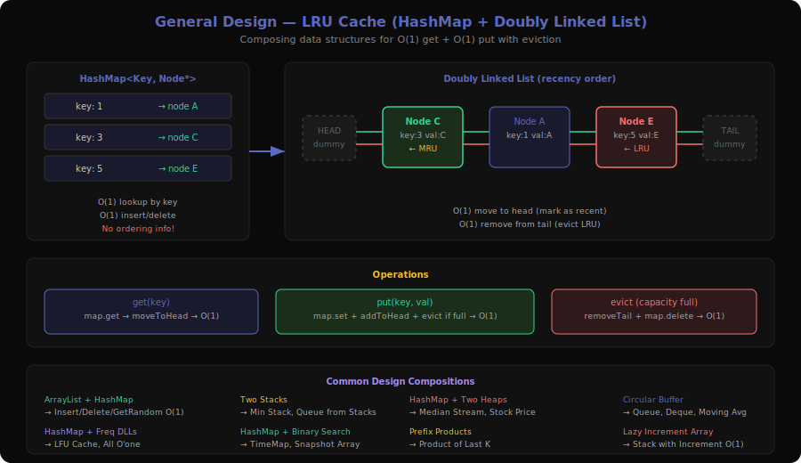
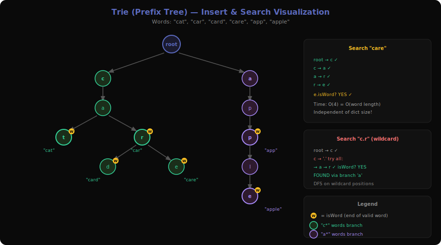

# Design Patterns Deep Dive

Design problems test your ability to build data structures and systems from scratch. Unlike algorithmic problems where you apply a known technique to transform input → output, design problems require you to choose the right **combination of primitives** (arrays, hash maps, linked lists, heaps, trees) and wire them together so that multiple operations all meet their time complexity requirements simultaneously.

The key challenge: satisfying O(1) or O(log n) constraints on MULTIPLE operations at once. Often, optimizing one operation makes another slower, so you need to find the right hybrid structure.

**Sub-Patterns**: General Design (33 problems), Tries (6 problems)

---

## 1. General Design Pattern



**Problems**: 146 (LRU Cache), 155 (Min Stack), 225 (Implement Stack using Queues), 232 (Implement Queue using Stacks), 251 (Flatten 2D Vector), 271 (Encode and Decode Strings), 295 (Find Median from Data Stream), 341 (Flatten Nested List Iterator), 346 (Moving Average from Data Stream), 353 (Design Snake Game), 359 (Logger Rate Limiter), 362 (Design Hit Counter), 379 (Design Phone Directory), 380 (Insert Delete GetRandom O(1)), 432 (All O'one Data Structure), 460 (LFU Cache), 604 (Design Compressed String Iterator), 622 (Design Circular Queue), 641 (Design Circular Deque), 642 (Design Search Autocomplete System), 706 (Design HashMap), 715 (Range Module), 900 (RLE Iterator), 981 (Time Based Key-Value Store), 1146 (Snapshot Array), 1348 (Tweet Counts Per Frequency), 1352 (Product of the Last K Numbers), 1381 (Design a Stack With Increment Operation), 1756 (Design Most Recently Used Queue), 2013 (Detect Squares), 2034 (Stock Price Fluctuation), 2296 (Design a Text Editor), 2336 (Smallest Number in Infinite Set)

### What is it?

Imagine you're building a toolbox where each drawer (operation) must open instantly. A regular toolbox might let you find tools quickly but makes adding new tools slow, or vice versa. Design problems ask you to build a toolbox where ALL drawers work fast.

**Concrete example**: LRU Cache — You need O(1) `get` AND O(1) `put` with eviction of the least recently used item.

```
Operations on cache with capacity 2:
  put(1, "A")  →  cache: [1:A]
  put(2, "B")  →  cache: [1:A, 2:B]
  get(1)       →  "A", cache: [2:B, 1:A]  (1 is now most recent)
  put(3, "C")  →  evict 2 (least recent), cache: [1:A, 3:C]
  get(2)       →  -1  (was evicted)
```

**Why HashMap alone fails**: O(1) lookup, but no ordering → can't find least recent.
**Why LinkedList alone fails**: Ordered by recency, but O(n) lookup.
**Solution**: HashMap (key → node) + Doubly Linked List (recency order). HashMap gives O(1) lookup, DLL gives O(1) insertion/deletion/reordering.

### The Decision Tree (Visualized)

```
Design Problem Decision Framework:

What operations need to be O(1)?

├── get/put + eviction order?
│   ├── Least Recently Used → HashMap + Doubly Linked List (LRU)
│   └── Least Frequently Used → HashMap + Freq buckets + DLL per bucket (LFU)
│
├── insert/remove/getRandom?
│   └── ArrayList + HashMap (val → index) → swap-with-last for O(1) remove
│
├── push/pop + getMin?
│   └── Two stacks: main stack + min-tracking stack (Min Stack)
│
├── inc/dec + getMax/getMin on counts?
│   └── HashMap + Doubly Linked List of count buckets (All O'one)
│
├── update + current/max/min on stream?
│   └── HashMap + Two heaps (max-heap + min-heap) with lazy deletion
│
└── Need ordering/versioning?
    ├── Time-based retrieval → HashMap + sorted list + binary search
    └── Snapshot-based → HashMap of (snap_id → value) per index


Common Building Blocks:
┌──────────────────────────────────────────────┐
│ HashMap      → O(1) key lookup               │
│ DLL          → O(1) insert/delete at position │
│ Array        → O(1) random access by index    │
│ Heap         → O(log n) min/max extraction    │
│ Sorted List  → O(log n) binary search         │
│ Circular Buf → O(1) FIFO with fixed capacity  │
└──────────────────────────────────────────────┘
```

### Core Template (with walkthrough)

**LRU Cache (the most important design problem):**

```
class LRUCache:
    class Node:
        key, value
        prev, next

    capacity
    map: HashMap<key, Node>
    head: dummy Node (MRU end)
    tail: dummy Node (LRU end)

    function get(key):
        if key not in map: return -1
        node = map[key]
        moveToHead(node)                // Mark as most recently used
        return node.value

    function put(key, value):
        if key in map:
            node = map[key]
            node.value = value
            moveToHead(node)            // Update recency
        else:
            node = new Node(key, value)
            map[key] = node
            addToHead(node)             // Add as most recent
            if map.size > capacity:
                lru = removeTail()      // Evict least recent
                map.remove(lru.key)

    // DLL helper operations (all O(1)):
    function addToHead(node):
        node.prev = head
        node.next = head.next
        head.next.prev = node
        head.next = node

    function removeNode(node):
        node.prev.next = node.next
        node.next.prev = node.prev

    function moveToHead(node):
        removeNode(node)
        addToHead(node)

    function removeTail():
        node = tail.prev
        removeNode(node)
        return node
```

**Insert Delete GetRandom O(1):**

```
class RandomizedSet:
    list: ArrayList<int>          // Enables O(1) random access
    map: HashMap<int, int>        // val → index in list

    function insert(val):
        if val in map: return false
        map[val] = list.size
        list.add(val)
        return true

    function remove(val):
        if val not in map: return false
        index = map[val]
        lastVal = list[list.size - 1]
        list[index] = lastVal           // Swap with last
        map[lastVal] = index
        list.removeLast()               // O(1) removal from end
        map.remove(val)
        return true

    function getRandom():
        return list[random(0, list.size - 1)]   // O(1) random index
```

**Min Stack:**

```
class MinStack:
    stack: Stack<int>
    minStack: Stack<int>          // Tracks min at each level

    function push(val):
        stack.push(val)
        if minStack.empty() OR val <= minStack.top():
            minStack.push(val)

    function pop():
        if stack.top() == minStack.top():
            minStack.pop()
        stack.pop()

    function getMin():
        return minStack.top()     // O(1) current minimum
```

### How to Recognize This Pattern

- "Design a data structure that supports..." followed by multiple operations with time constraints
- "Implement the XYZ class" with specific method signatures
- Multiple operations that EACH need to be O(1) or O(log n)
- Need to combine properties of different data structures (ordering + lookup + random access)
- "Stream" of data with queries (median, moving average, snapshots)
- **Look for**: Multiple O(1) operation requirements that no single data structure satisfies alone

### Key Insight / Trick

The **fundamental technique** is **composing data structures**: when one structure gives you O(1) for operation A but O(n) for operation B, and another gives O(1) for B but O(n) for A, combine them. Keep them in sync so both reflect the same state.

Common compositions:
1. **HashMap + Doubly Linked List** = O(1) lookup + O(1) ordered insertion/deletion (LRU, LFU, All O'one)
2. **ArrayList + HashMap** = O(1) random access + O(1) insertion/deletion (RandomizedSet)
3. **Two Stacks** = queue behavior (232) or min-tracking (155)
4. **HashMap + Two Heaps** = O(1) update + O(log n) min/max (Stock Price)
5. **HashMap + Binary Search** = O(1) set + O(log n) time-based retrieval (TimeMap, SnapshotArray)

The **swap-with-last trick** is crucial for ArrayList-based designs: to remove an element from the middle in O(1), swap it with the last element and remove from the end.

### Variations & Edge Cases

- **Lazy deletion**: When using heaps, instead of removing elements (O(n) search), mark them as invalid and skip during extraction. Used in Stock Price Fluctuation (2034).
- **Circular buffer**: For fixed-size FIFO structures (622, 641, 346). Use modular arithmetic: `(index + 1) % capacity`.
- **Prefix products**: For Product of Last K (1352), maintain a running prefix product array. Product of last k = `prefix[n] / prefix[n-k]`. Handle zeros by resetting the prefix array.
- **Two-stack queue**: For amortized O(1) queue using stacks (232), push to input stack, pop from output stack. When output is empty, pour all from input to output. Amortized O(1) per operation.
- **Capacity = 0**: Edge case for LRU/LFU — every put should evict immediately.

### Questions Detail

| # | Title | Difficulty | Key Twist |
|---|-------|-----------|-----------|
| 146 | LRU Cache | Medium | The canonical design problem. HashMap + Doubly Linked List. HashMap maps key → DLL node. DLL maintains recency order. On access, move node to head. On eviction, remove from tail. Both operations O(1). |
| 155 | Min Stack | Medium | Two stacks: main stack + auxiliary min stack. Push to min stack when value ≤ current min. Pop from min stack when main stack pops the current min. getMin() is always the top of the min stack. |
| 225 | Implement Stack using Queues | Easy | Push: enqueue, then dequeue-and-enqueue all previous elements (rotates the new element to the front). Pop/top: just dequeue. Makes push O(n) but pop O(1). Can also do push O(1) and pop O(n). |
| 232 | Implement Queue using Stacks | Easy | Two stacks: input and output. Push to input. Pop from output; if output empty, pour all of input into output (reverses order → FIFO). Amortized O(1) per operation. |
| 251 | Flatten 2D Vector | Medium | Premium. Iterator over 2D array. Two pointers: outer (which inner array) and inner (position within it). advance() skips empty inner arrays. hasNext() ensures pointer is at a valid position. |
| 271 | Encode and Decode Strings | Medium | Premium. Encode list of strings into single string and decode back. Use length-prefix encoding: `"4#word"` for each string. Handles any characters including delimiters since length tells you exactly where each string ends. |
| 295 | Find Median from Data Stream | Hard | Two heaps: max-heap for lower half, min-heap for upper half. Keep balanced (sizes differ by at most 1). Median is top of max-heap (odd count) or average of both tops (even count). addNum is O(log n), findMedian is O(1). |
| 341 | Flatten Nested List Iterator | Medium | Stack-based approach: push elements in reverse order. hasNext() keeps unfolding nested lists on top of stack until an integer is found. Lazy evaluation — don't flatten everything upfront. |
| 346 | Moving Average from Data Stream | Easy | Premium. Circular buffer of size k. Maintain running sum. On new element: subtract oldest (if buffer full), add new, divide by count. O(1) per operation. |
| 353 | Design Snake Game | Medium | Premium. Deque for snake body. HashMap/set for body positions (O(1) collision check). On move: add new head, remove tail (unless food eaten). Check bounds, self-collision, and food at new head. |
| 359 | Logger Rate Limiter | Easy | Premium. HashMap<message, lastTimestamp>. shouldPrintMessage(): if not seen or timestamp - lastSeen ≥ 10, update and return true. Otherwise false. O(1) per call. |
| 362 | Design Hit Counter | Medium | Premium. Queue or circular buffer of timestamps. hit(): add timestamp. getHits(): count entries within last 300 seconds. Circular buffer of size 300 with counts is most efficient. |
| 379 | Design Phone Directory | Medium | Premium. HashSet of available numbers + counter. get(): return smallest available. check(): query set. release(): add back. Or use a stack/queue of available numbers for O(1) get. |
| 380 | Insert Delete GetRandom O(1) | Medium | ArrayList + HashMap. Insert: append to list, store index in map. Remove: swap with last element, update map, remove last. getRandom: pick random index from list. All O(1). The swap-with-last trick is the key insight. |
| 432 | All O'one Data Structure | Hard | HashMap (key → count) + DLL of count buckets (each bucket has a set of keys with that count). inc/dec: move key between buckets. getMax/getMin: head/tail of DLL. Most complex design problem — three data structures working together. |
| 460 | LFU Cache | Hard | Like LRU but evict least FREQUENTLY used (ties broken by recency). HashMap + frequency-to-DLL map + min-frequency tracker. Each frequency bucket is itself an LRU list. On access: move key to freq+1 bucket. Most complex cache design. |
| 604 | Design Compressed String Iterator | Easy | Premium. Parse RLE format. Maintain current character, remaining count, and position in encoded string. next(): decrement count, return char. hasNext(): check if count > 0 or more chars to parse. |
| 622 | Design Circular Queue | Medium | Array of fixed size k. Maintain head, tail, count. enQueue: place at tail, advance tail with modulo. deQueue: advance head with modulo. isEmpty/isFull: check count. Modular arithmetic `(index + 1) % k` is the key. |
| 641 | Design Circular Deque | Medium | Extension of 622 — support insert/delete at both front and rear. Same circular array with modulo arithmetic. insertFront decrements head, insertLast increments tail. Both use `(index ± 1 + k) % k`. |
| 642 | Design Search Autocomplete System | Hard | Premium. Trie + sorting. Each trie node stores top-3 sentences matching that prefix. On input: traverse trie character by character, return stored suggestions. On '#': insert the completed sentence with updated frequency. |
| 706 | Design HashMap | Easy | Array of buckets (linked lists for collision handling). Hash function: `key % numBuckets`. put: hash → find/update or append. get: hash → search chain. remove: hash → unlink. Resize when load factor exceeds threshold. |
| 715 | Range Module | Hard | Sorted intervals (TreeMap/sorted list). addRange: merge overlapping intervals. removeRange: split/trim affected intervals. queryRange: check if entire range is covered by one interval. O(log n) with balanced BST/TreeMap. |
| 900 | RLE Iterator | Medium | Maintain pointer into encoded array and remaining count for current element. next(n): consume n elements across multiple RLE segments. Decrement counts, advance pointer when segment exhausted. Handle large n values. |
| 981 | Time Based Key-Value Store | Medium | HashMap<key, List<(timestamp, value)>>. set: append to key's list (timestamps are increasing). get: binary search in key's list for largest timestamp ≤ query. O(1) set, O(log n) get. |
| 1146 | Snapshot Array | Medium | Array of TreeMaps/sorted lists. Each index stores (snap_id → value) pairs. set: update current snap_id entry. snap: increment global snap_id. get: binary search for largest snap_id ≤ query. Space-efficient — only stores changes. |
| 1348 | Tweet Counts Per Frequency | Medium | HashMap<tweetName, sorted list of timestamps>. recordTweet: insert into sorted list. getTweetCountsPerFrequency: iterate time chunks, binary search for count in each chunk. |
| 1352 | Product of the Last K Numbers | Medium | Prefix product array. add(num): append `prefix[-1] * num`. If num is 0, reset prefix to [1] (anything before a zero can't contribute). getProduct(k): `prefix[-1] / prefix[-1-k]`. O(1) per operation. |
| 1381 | Design a Stack With Increment Operation | Medium | Array-based stack + lazy increment array. inc(k, val): add val to inc[min(k, size) - 1]. pop: add inc[top] to inc[top-1] before returning (propagate lazy increment). O(1) for all operations including inc. |
| 1756 | Design Most Recently Used Queue | Hard | Premium. Similar to LRU but different interface — fetch(k) removes the kth element and appends it to the end. BIT (Binary Indexed Tree) + array for O(√n) or O(log n) per operation. Or simple list for O(n). |
| 2013 | Detect Squares | Medium | HashMap<x, HashMap<y, count>>. On count(point): for each point with same x, find matching diagonal points to form a square. Check both above and below. Multiply counts for total ways. O(n) per query where n is distinct y-values at query x. |
| 2034 | Stock Price Fluctuation | Medium | HashMap<timestamp, price> + two heaps (max-heap for maximum, min-heap for minimum) + latest timestamp tracker. Lazy deletion on heaps: when top of heap has stale price (doesn't match map), pop and try next. |
| 2296 | Design a Text Editor | Hard | Two stacks: left stack (chars left of cursor) and right stack (chars right of cursor). addText: push to left. deleteText: pop from left. cursorLeft: pop from left, push to right. cursorRight: pop from right, push to left. O(k) per operation. |
| 2336 | Smallest Number in Infinite Set | Medium | Min-heap + HashSet for added-back numbers + counter for next natural number. popSmallest: if heap non-empty and heap.top < counter, pop heap. Else return counter++. addBack: if num < counter and not in set, add to heap and set. |

---

## 2. Tries Pattern



**Problems**: 208 (Implement Trie), 211 (Design Add and Search Words Data Structure), 425 (Word Squares), 648 (Replace Words), 720 (Longest Word in Dictionary), 745 (Prefix and Suffix Search)

### What is it?

A Trie (prefix tree) is like a filing system organized by spelling. Instead of storing complete words in a list, you store them character by character in a tree. The path from root to any node spells out a prefix. Words sharing common prefixes share tree branches.

**Concrete example**: Insert "app", "apple", "ape" into a trie:

```
        root
         |
         a
         |
         p
        / \
       p   e ●
      /
     l
     |
     e ●

● = marks end of a valid word

Lookup "app": root → a → p → p (found, but is it marked as word end? Depends on whether "app" was inserted)
Lookup "ap":  root → a → p (exists as prefix, not as complete word unless marked)
Lookup "ax":  root → a → x (no 'x' child of 'a' → not found)
```

### The Decision Tree (Visualized)

```
Trie Operations:

INSERT "cat":
  root → c (create) → a (create) → t (create, mark as word) ●

INSERT "car":
  root → c (exists) → a (exists) → r (create, mark as word) ●

INSERT "card":
  root → c → a → r → d (create, mark as word) ●

Current Trie:
       root
        |
        c
        |
        a
       / \
      t●   r●
           |
           d●

SEARCH "car":
  root → c ✓ → a ✓ → r ✓ → isWord? YES ✓

SEARCH "ca":
  root → c ✓ → a ✓ → isWord? NO ✗

STARTS_WITH "ca":
  root → c ✓ → a ✓ → exists? YES ✓ (prefix found)

SEARCH "c.r" (with wildcard):
  root → c ✓ → '.' matches any:
    → try 'a': → r ✓ → isWord? YES ✓
    → try 't': no 'r' child → fail
  Found via 'a' branch!


Trie Node Structure:
┌───────────────────────────────────────┐
│ TrieNode                              │
│   children: map<char, TrieNode> [26]  │
│   isWord: boolean                     │
│   (optional) word: string             │
│   (optional) count: int               │
└───────────────────────────────────────┘
```

### Core Template (with walkthrough)

```
class TrieNode:
    children: array[26] of TrieNode    // For lowercase English letters
    isWord: boolean = false

class Trie:
    root = new TrieNode()

    function insert(word):
        node = root
        for char in word:
            index = char - 'a'
            if node.children[index] is null:
                node.children[index] = new TrieNode()
            node = node.children[index]
        node.isWord = true             // Mark end of word

    function search(word):
        node = findNode(word)
        return node != null AND node.isWord

    function startsWith(prefix):
        return findNode(prefix) != null

    function findNode(word):
        node = root
        for char in word:
            index = char - 'a'
            if node.children[index] is null:
                return null            // Path doesn't exist
            node = node.children[index]
        return node                    // Return the node at end of path
```

**Wildcard search (211 — Design Add and Search Words):**

```
function searchWithWildcard(word, index, node):
    if index == len(word):
        return node.isWord

    char = word[index]
    if char == '.':                    // Wildcard — try ALL children
        for child in node.children:
            if child != null AND searchWithWildcard(word, index+1, child):
                return true
        return false
    else:
        child = node.children[char - 'a']
        if child is null: return false
        return searchWithWildcard(word, index+1, child)
```

**Replace Words / Shortest Prefix (648):**

```
function findShortestRoot(word):
    node = root
    for i = 0 to len(word) - 1:
        index = word[i] - 'a'
        if node.children[index] is null:
            return word                // No matching root
        node = node.children[index]
        if node.isWord:
            return word[0..i]          // Found shortest root prefix
    return word
```

### How to Recognize This Pattern

- "Prefix search", "autocomplete", "starts with"
- "Dictionary" of words with lookup/matching operations
- "Replace all words with their shortest root/prefix"
- Wildcard matching where '.' matches any single character
- "Find longest word that can be built character by character"
- "Word search" across multiple words (Trie often optimizes brute force)
- **Look for**: Multiple strings sharing prefixes + prefix-based queries

### Key Insight / Trick

The **prefix sharing** is what makes tries efficient. If you have 1000 words starting with "pre", the trie stores "pre" once, not 1000 times. This gives:
- **Insert/Search**: O(L) where L = word length (independent of dictionary size!)
- **Prefix queries**: O(P) where P = prefix length — no need to scan all words

For **Replace Words** (648), the trie naturally gives you the SHORTEST matching prefix. As you traverse character by character, the FIRST `isWord = true` you hit is the shortest root.

For **Prefix + Suffix Search** (745), the trick is to insert `suffix#word` for all possible suffixes. Then `f(prefix, suffix)` becomes `startsWith(suffix + "#" + prefix)`. Clever encoding turns a 2D search into 1D.

### Variations & Edge Cases

- **Wildcard search** (211): When you hit '.', recursively try ALL 26 children. This makes worst-case exponential but is fast in practice with limited dots.
- **Word Squares** (425): Premium. Trie + backtracking. For each position, use trie to find words matching the required prefix (formed by existing words in the square).
- **Longest buildable word** (720): Insert all words into trie. BFS/DFS to find longest word where every prefix is also a valid word (every node on the path has `isWord = true`).
- **Array vs HashMap for children**: Array[26] is faster for lowercase-only. HashMap is more flexible for unicode/larger alphabets.
- **Memory optimization**: Can compress single-child chains (Patricia/Radix trie), but rarely needed for interview problems.

### Questions Detail

| # | Title | Difficulty | Key Twist |
|---|-------|-----------|-----------|
| 208 | Implement Trie (Prefix Tree) | Medium | The foundational trie problem. Implement insert, search, startsWith. Each node has 26 children + isWord flag. insert is O(L), search is O(L), startsWith is O(P). Building block for all other trie problems. |
| 211 | Design Add and Search Words Data Structure | Medium | Trie + DFS for wildcard '.' matching. addWord is standard trie insert. search with '.' requires trying all children at that position — recursive DFS. Constraint "at most 2 dots" keeps it practical. |
| 425 | Word Squares | Hard | Premium. Trie for prefix lookup + backtracking. Build square row by row. For each new row, the required prefix is determined by the columns already filled. Use trie to find words matching that prefix. |
| 648 | Replace Words | Medium | Build trie from dictionary of roots. For each word in sentence, traverse trie — if you hit isWord, replace word with the prefix found so far (shortest root). If no root found, keep original word. |
| 720 | Longest Word in Dictionary | Medium | Build trie from all words. Find longest word where EVERY prefix is also in the dictionary (every node on path from root has isWord). BFS/DFS on trie — only follow children that are word endings. Ties broken lexicographically. |
| 745 | Prefix and Suffix Search | Hard | Encode each word as all possible `suffix#word` strings and insert into trie. Query `f(prefix, suffix)` → search for `suffix#prefix` in trie. Trade space for query speed. Alternative: two tries (prefix + reversed suffix) with intersection. |

---

## Sub-Pattern Comparison

| Aspect | General Design | Tries |
|--------|---------------|-------|
| Core challenge | Combine data structures for multiple O(1) ops | Efficient string prefix operations |
| Typical building blocks | HashMap + DLL, ArrayList + HashMap, Heaps | Tree of character nodes |
| Time per operation | O(1) amortized (design goal) | O(L) where L = word length |
| Space | Varies by problem | O(total characters across all words) |
| Key technique | Composition of structures | Prefix sharing |
| When to use | "Design a class that supports X, Y, Z in O(1)" | "Prefix search", "dictionary matching" |
| Problem count | 33 | 6 |
| Difficulty range | Easy to Hard | Medium to Hard |
| Most important problem | 146 (LRU Cache) | 208 (Implement Trie) |
| Interview frequency | Very high (LRU, Min Stack, RandomizedSet) | Medium (mostly Trie + one variant) |

---

## Design Problem Categories (Thematic Grouping)

Since General Design has 33 problems, here's a thematic breakdown to help organize study:

### Cache / Eviction Policies
| # | Title | Key Structure |
|---|-------|--------------|
| 146 | LRU Cache | HashMap + DLL |
| 460 | LFU Cache | HashMap + Freq-bucketed DLLs |

### Stack / Queue Variants
| # | Title | Key Structure |
|---|-------|--------------|
| 155 | Min Stack | Two stacks |
| 225 | Stack using Queues | One/two queues |
| 232 | Queue using Stacks | Two stacks (amortized) |
| 622 | Circular Queue | Circular array |
| 641 | Circular Deque | Circular array |
| 1381 | Stack with Increment | Array + lazy increment |

### Iterator / Stream Processing
| # | Title | Key Structure |
|---|-------|--------------|
| 251 | Flatten 2D Vector | Two pointers |
| 295 | Find Median from Data Stream | Two heaps |
| 341 | Flatten Nested List Iterator | Stack |
| 346 | Moving Average | Circular buffer |
| 604 | Compressed String Iterator | Pointer + count |
| 900 | RLE Iterator | Pointer + count |
| 1352 | Product of Last K | Prefix products |

### HashMap from Scratch
| # | Title | Key Structure |
|---|-------|--------------|
| 706 | Design HashMap | Array of buckets + chaining |

### Time / Versioning
| # | Title | Key Structure |
|---|-------|--------------|
| 981 | Time Based Key-Value Store | HashMap + binary search |
| 1146 | Snapshot Array | Per-index version lists |
| 362 | Design Hit Counter | Circular buffer (300s) |
| 359 | Logger Rate Limiter | HashMap<msg, timestamp> |

### Complex Multi-Structure
| # | Title | Key Structure |
|---|-------|--------------|
| 380 | Insert Delete GetRandom O(1) | ArrayList + HashMap |
| 432 | All O'one Data Structure | HashMap + DLL of count buckets |
| 2034 | Stock Price Fluctuation | HashMap + two heaps (lazy deletion) |
| 2296 | Design a Text Editor | Two stacks (left/right of cursor) |
| 2336 | Smallest Number in Infinite Set | Min-heap + HashSet + counter |

### Encoding / Serialization
| # | Title | Key Structure |
|---|-------|--------------|
| 271 | Encode and Decode Strings | Length-prefix encoding |

### Simulation / Game
| # | Title | Key Structure |
|---|-------|--------------|
| 353 | Design Snake Game | Deque + HashSet |
| 379 | Design Phone Directory | Set + stack/counter |

### Geometric / Interval
| # | Title | Key Structure |
|---|-------|--------------|
| 715 | Range Module | Sorted intervals (TreeMap) |
| 2013 | Detect Squares | HashMap of coordinates |
| 1348 | Tweet Counts Per Frequency | HashMap + sorted timestamps |

---

## Code References

- `server/patterns.py:130-133` — Design category definition with 2 sub-patterns
- `server/patterns.py:362-367` — Reverse lookup (problem → pattern)
- `server/main.py:307-369` — API endpoint for pattern data
- `extension/patterns.js` — Client-side pattern labels
