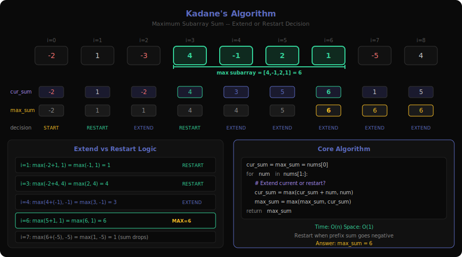
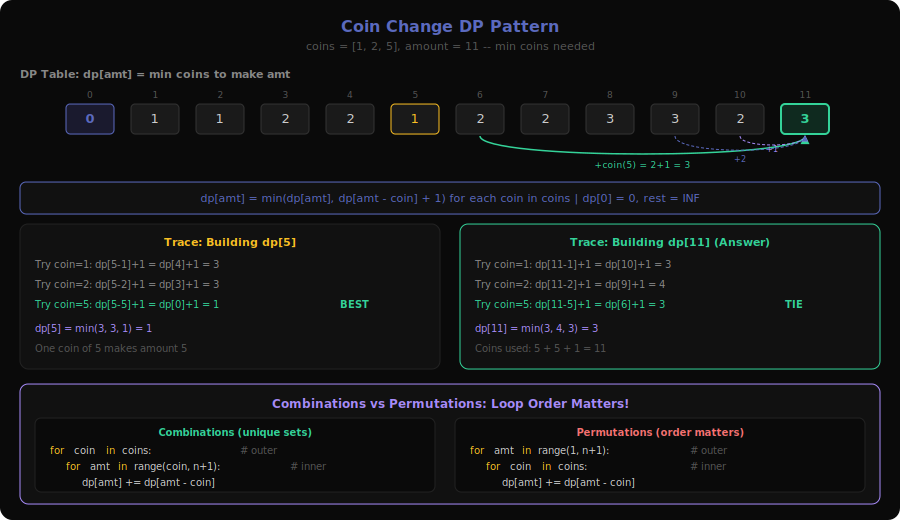
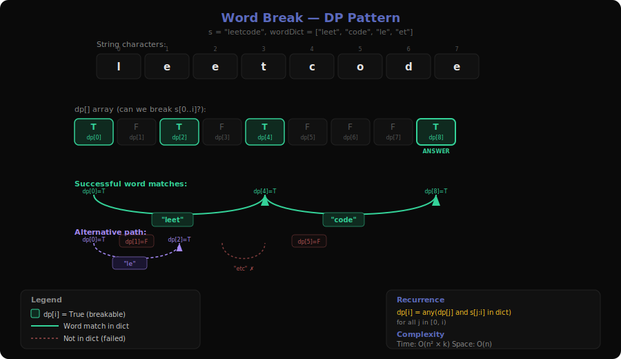
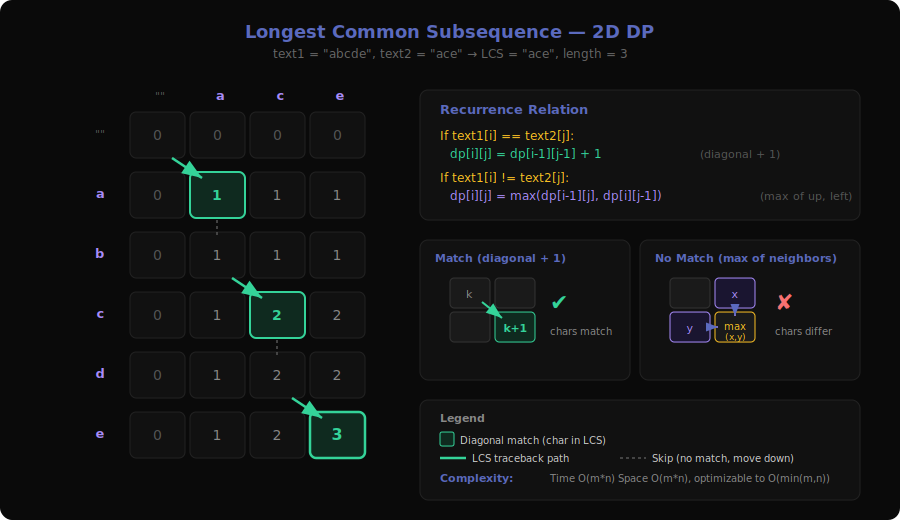
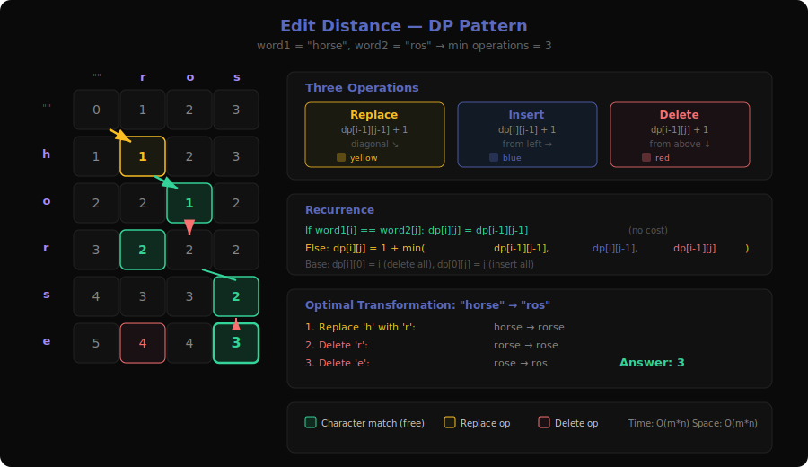
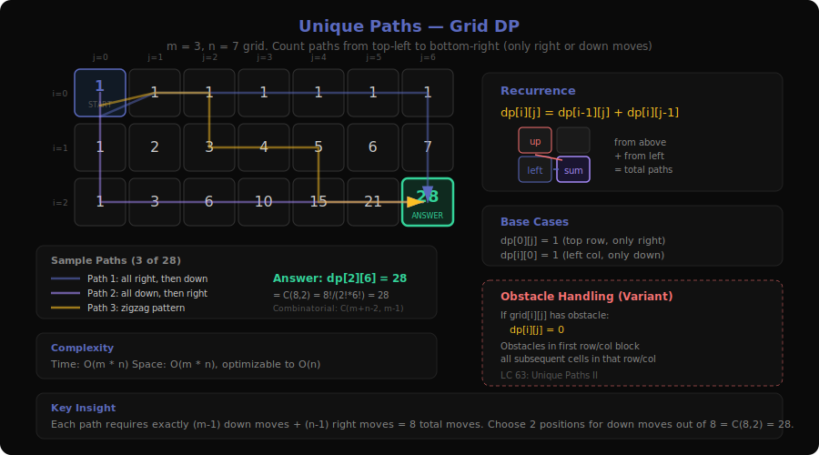
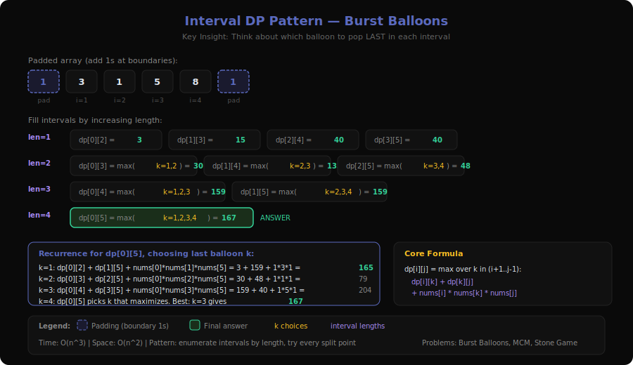
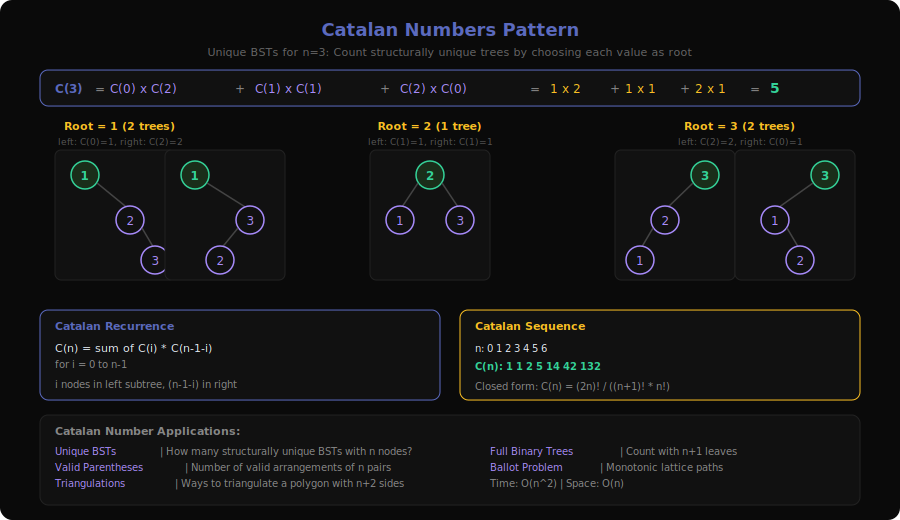
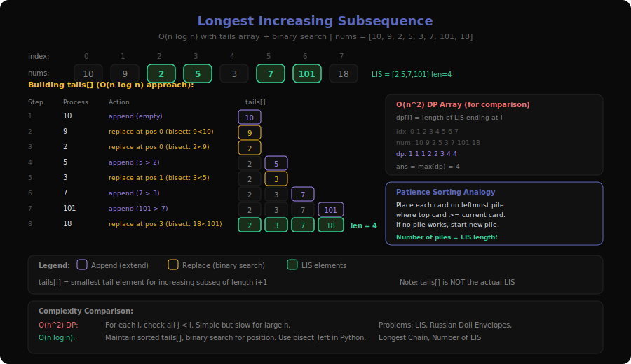
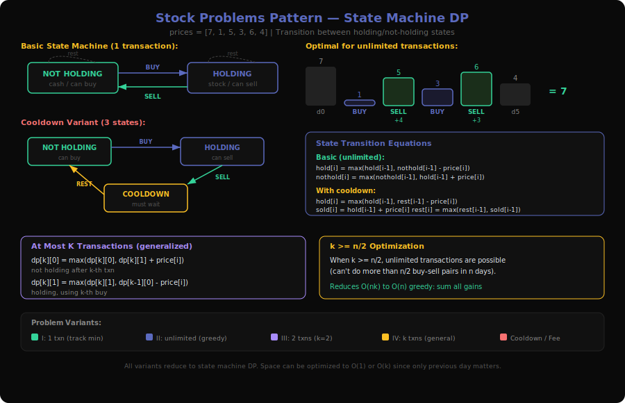

# Dynamic Programming Patterns Deep Dive

Dynamic Programming (DP) is an optimization technique that solves problems by breaking them into overlapping subproblems and storing their results. Unlike divide-and-conquer (which solves independent subproblems), DP exploits the fact that the same subproblem appears multiple times. The two key properties are **optimal substructure** (optimal solution builds from optimal sub-solutions) and **overlapping subproblems** (same computation repeated).

**Sub-patterns covered**: Fibonacci Style, Kadane's Algorithm, Coin Change, 0/1 Knapsack, Word Break Style, Longest Common Subsequence, Edit Distance, Unique Paths on Grid, Interval DP, Catalan Numbers, Longest Increasing Subsequence, Stock Problems

---

## 1. Fibonacci Style Pattern


**Problems**: 509 (Fibonacci Number), 70 (Climbing Stairs), 746 (Min Cost Climbing Stairs), 91 (Decode Ways), 198 (House Robber), 213 (House Robber II), 337 (House Robber III), 740 (Delete and Earn)

### What is it?
- **Analogy**: Imagine climbing a staircase where each step costs energy. You can take 1 or 2 steps at a time. To figure out the cheapest way to reach step N, you only need to know the cheapest way to reach step N-1 and step N-2. That's Fibonacci-style DP — each state depends on a fixed number of previous states.
- **Example**: Climbing Stairs with n=4
  - Ways to reach step 1: 1 (just take 1 step)
  - Ways to reach step 2: 2 (1+1 or 2)
  - Ways to reach step 3: ways(2) + ways(1) = 2 + 1 = 3
  - Ways to reach step 4: ways(3) + ways(2) = 3 + 2 = 5
- **Input → Output**: n=4 → 5 distinct ways

### The Recurrence (Visualized)
```
f(4)
├── f(3)
│   ├── f(2)
│   │   ├── f(1) = 1
│   │   └── f(0) = 1
│   └── f(1) = 1
└── f(2)
    ├── f(1) = 1
    └── f(0) = 1

Without memoization: f(2) computed twice, f(1) computed three times
With memoization: each f(k) computed exactly once → O(n)
```

### Core Template (with walkthrough)
```
function fibonacci_dp(n):
    if n <= 1: return base_case          # Base: smallest subproblems
    prev2 = base_case_0                  # f(0)
    prev1 = base_case_1                  # f(1)
    for i from 2 to n:                   # Build bottom-up
        current = combine(prev1, prev2)  # f(i) = f(i-1) ⊕ f(i-2)
        prev2 = prev1                    # Slide window forward
        prev1 = current
    return prev1
```

**Trace for Climbing Stairs, n=4**:
| i | prev2 | prev1 | current |
|---|-------|-------|---------|
| 2 | 1     | 1     | 2       |
| 3 | 1     | 2     | 3       |
| 4 | 2     | 3     | 5       |

Result: 5

### How to Recognize This Pattern
- "How many ways to reach step N?" or "minimum cost to reach N"
- Each state depends on a **fixed, small number** of previous states (usually 1-3)
- Problem has a **linear sequence** of decisions
- You see "you can take 1 or 2 steps" or "skip or take current element"
- **Look for**: linear recurrence where `f(n) = g(f(n-1), f(n-2), ...)`

### Key Insight / Trick
The key insight is **space optimization**: since each state only depends on the last 2 states, you don't need an array — just two variables. This reduces space from O(n) to O(1).

For House Robber variants, the recurrence becomes `dp[i] = max(dp[i-1], dp[i-2] + nums[i])` — either skip this house (take previous best) or rob it (take two-back best + current value). The "either skip or take" decision is the hallmark of Fibonacci-style DP.

### Variations & Edge Cases
- **Circular array** (House Robber II): Run the algorithm twice — once excluding the first element, once excluding the last. Take the max.
- **Tree structure** (House Robber III): Replace the linear recurrence with tree DFS. Each node returns a pair: (best if robbed, best if not robbed).
- **Mapping to Fibonacci** (Delete and Earn): Sort and group values, then it reduces to House Robber on the grouped array.
- **String decoding** (Decode Ways): Similar structure but with conditional transitions — "0" has no valid decoding, "10"-"26" can be decoded as one or two digits.

### Questions Detail
| # | Title | Difficulty | Key Twist |
|---|-------|-----------|-----------|
| 509 | Fibonacci Number | Easy | Pure Fibonacci — the baseline. Direct `f(n) = f(n-1) + f(n-2)`. Good for learning the pattern before real problems. |
| 70 | Climbing Stairs | Easy | Fibonacci in disguise. "1 or 2 steps" maps to `ways(n) = ways(n-1) + ways(n-2)`. The first real application of the pattern. |
| 746 | Min Cost Climbing Stairs | Easy | Adds cost minimization: `dp[i] = cost[i] + min(dp[i-1], dp[i-2])`. Introduces the idea that Fibonacci-style works for optimization too, not just counting. |
| 91 | Decode Ways | Medium | Fibonacci with conditional branching. Not every pair of digits forms a valid decoding (must be 10-26). Tricky edge cases with '0'. The recurrence is conditional, not uniform. |
| 198 | House Robber | Medium | The classic "take or skip" DP. `dp[i] = max(dp[i-1], dp[i-2] + nums[i])`. Introduces the optimization (max) variant of Fibonacci-style — not just counting but choosing. |
| 213 | House Robber II | Medium | Circular constraint — first and last houses are adjacent. Solved by running House Robber twice (exclude first OR last). Tests understanding of how constraints modify the recurrence. |
| 337 | House Robber III | Medium | Tree-shaped DP instead of linear. Each node returns `(rob_this, skip_this)` pair. Tests ability to adapt linear Fibonacci DP to tree structures via DFS post-order traversal. |
| 740 | Delete and Earn | Medium | Requires a non-obvious reduction step: group numbers by value, compute total earn per value, then it's exactly House Robber on sorted values. The "recognize it's Fibonacci-style" is the hard part. |

---

## 2. Kadane's Algorithm Pattern



**Problems**: 53 (Maximum Subarray), 152 (Maximum Product Subarray), 918 (Maximum Sum Circular Subarray), 1749 (Maximum Absolute Sum of Any Subarray), 2321 (Maximum Score of a Good Subarray)

### What is it?
- **Analogy**: You're walking along a number line collecting coins (positive) and paying tolls (negative). At each step you decide: "Is it better to keep my running total, or start fresh from here?" Kadane's tracks this running best as you scan left to right.
- **Example**: nums = [-2, 1, -3, 4, -1, 2, 1, -5, 4]
  - At each position, `current_sum = max(nums[i], current_sum + nums[i])`
  - Walking through: -2 → 1 → -2 → 4 → 3 → 5 → 6 → 1 → 5
  - Max seen: 6 (subarray [4, -1, 2, 1])
- **Input → Output**: [-2, 1, -3, 4, -1, 2, 1, -5, 4] → 6

### The Decision at Each Step (Visualized)
```
nums:        [-2]  [1]  [-3]  [4]  [-1]  [2]  [1]  [-5]  [4]
             ───── ──── ───── ──── ───── ──── ──── ───── ────
current_sum:  -2    1    -2    4     3     5    6     1    5
              ↑     ↑     ↑    ↑     ↑     ↑    ↑     ↑    ↑
decision:   start start extend start extend ext ext  ext  ext
max_so_far:  -2    1     1    4     4     5    6     6    6
                                                     ↑ answer
```

### Core Template (with walkthrough)
```
function kadane(nums):
    current_sum = nums[0]              # Start with first element
    max_sum = nums[0]                  # Best seen so far
    for i from 1 to len(nums)-1:
        current_sum = max(nums[i],     # Option 1: start fresh here
                     current_sum + nums[i])  # Option 2: extend
        max_sum = max(max_sum, current_sum)  # Update global best
    return max_sum
```

**Key**: The `max(nums[i], current_sum + nums[i])` is the entire algorithm. If extending the previous subarray makes it worse than starting fresh, start fresh.

### How to Recognize This Pattern
- "Maximum/minimum sum of a **contiguous** subarray"
- "Find the subarray with the largest/smallest [sum/product]"
- The answer must be a **contiguous** portion (not subsequence)
- Array is unsorted and you need to consider all subarrays
- **Look for**: optimization over contiguous subarrays in O(n)

### Key Insight / Trick
Kadane's is really a DP where `dp[i]` = "best subarray ending at index i". The transition is: either extend the previous best subarray or start a new one at i. You only need the previous state, so it's O(1) space.

The insight for the **product** variant: track both `max_product` AND `min_product` at each step, because multiplying by a negative flips min↔max.

### Variations & Edge Cases
- **Product instead of sum** (LC 152): Track both min and max products because negatives flip signs. When you hit a negative, swap min and max before multiplying.
- **Circular array** (LC 918): The max subarray is either a normal subarray OR the "wrap-around" = total_sum - min_subarray. Run Kadane's for max AND min, then compare.
- **Absolute sum** (LC 1749): Track both max and min prefix sums. The answer is max(max_subarray_sum, |min_subarray_sum|).
- **All negatives**: Kadane's naturally handles this — the answer is the largest single element.

### Questions Detail
| # | Title | Difficulty | Key Twist |
|---|-------|-----------|-----------|
| 53 | Maximum Subarray | Medium | The pure Kadane's problem. Single pass, track `current_max` and `global_max`. The textbook version with no modifications needed. |
| 152 | Maximum Product Subarray | Medium | Must track both min AND max products because a negative × negative = positive. At each step: `new_max = max(num, max*num, min*num)`. The sign-flipping is the core difficulty. |
| 918 | Maximum Sum Circular Subarray | Medium | Max subarray can wrap around the ends. Key insight: wrap-around max = total_sum - min_subarray. Run Kadane for both max and min. Edge case: if all negative, min_subarray = entire array, so don't use the circular formula. |
| 1749 | Maximum Absolute Sum of Any Subarray | Medium | Need the max of |subarray_sum|. This equals max(max_subarray_sum, -min_subarray_sum). Run Kadane's twice (for max and min) or track both simultaneously. |
| 2321 | Maximum Score of a Good Subarray | Hard | Subarray must contain index k. Expand outward from k greedily — always expand toward the larger neighbor. The "score" involves the minimum element, so you want to keep the minimum high while expanding. Two-pointer approach from k outward. |

---

## 3. Coin Change Pattern



**Problems**: 322 (Coin Change), 518 (Coin Change II), 377 (Combination Sum IV)

### What is it?
- **Analogy**: You have coins of different denominations and need to make exact change. Like standing at a vending machine with quarters, dimes, and nickels, trying to pay exactly $1.37 with the fewest coins possible.
- **Example**: coins = [1, 2, 5], amount = 11
  - dp[0] = 0 (0 coins for amount 0)
  - dp[1] = 1 (one 1-coin)
  - dp[2] = 1 (one 2-coin)
  - dp[5] = 1 (one 5-coin)
  - dp[11] = 3 (5+5+1)
- **Input → Output**: coins=[1,2,5], amount=11 → 3

### The Build-Up Table (Visualized)
```
coins = [1, 2, 5], amount = 11

amt:  0  1  2  3  4  5  6  7  8  9  10  11
dp:   0  1  1  2  2  1  2  2  3  3   2   3
          ↑  ↑        ↑                   ↑
         1¢ 2¢       5¢              5+5+1

For dp[11]: min(dp[11-1]+1, dp[11-2]+1, dp[11-5]+1)
          = min(dp[10]+1, dp[9]+1, dp[6]+1)
          = min(3, 4, 3) = 3
```

### Core Template (with walkthrough)
```
function coin_change(coins, amount):
    dp = array of size (amount+1) filled with infinity
    dp[0] = 0                                  # Base: 0 coins for amount 0
    for amt from 1 to amount:                  # Build up each amount
        for coin in coins:                     # Try each coin
            if coin <= amt:
                dp[amt] = min(dp[amt],         # Keep current best
                         dp[amt - coin] + 1)   # Or use this coin + best for remainder
    return dp[amount] if dp[amount] != infinity else -1
```

### How to Recognize This Pattern
- "Fewest/minimum number of items to reach a target"
- "How many ways to make amount X using denominations Y"
- **Unlimited reuse** of items (unlike 0/1 Knapsack)
- Target is a single number (amount, sum, total)
- **Look for**: unbounded items + target sum/value → Coin Change DP

### Key Insight / Trick
The critical distinction is between **counting combinations** vs **counting permutations**:
- **Combinations** (Coin Change II, LC 518): Loop coins in outer loop, amounts in inner loop. This ensures each combination is counted once (order doesn't matter: [1,2] and [2,1] are the same).
- **Permutations** (Combination Sum IV, LC 377): Loop amounts in outer loop, coins in inner loop. This counts different orderings as distinct ([1,2] ≠ [2,1]).

The loop order changes the answer completely!

### Variations & Edge Cases
- **Count combinations** (LC 518): Change `min` to `sum` and swap loop order. `dp[amt] += dp[amt - coin]`.
- **Count permutations** (LC 377): Amount outer, coins inner. Each ordering is distinct.
- **Impossible amounts**: When no combination works, dp stays at infinity → return -1.
- **Coin value > amount**: Skip that coin for smaller amounts.

### Questions Detail
| # | Title | Difficulty | Key Twist |
|---|-------|-----------|-----------|
| 322 | Coin Change | Medium | Find the **minimum number** of coins. Classic bottom-up DP. Initialize dp to infinity, dp[0]=0, try each coin at each amount. The foundational unbounded knapsack problem. |
| 518 | Coin Change II | Medium | Count the **number of combinations** (order doesn't matter). Coins must be the outer loop to avoid counting [1,2] and [2,1] as separate. The loop order is the entire problem. |
| 377 | Combination Sum IV | Medium | Count the **number of permutations** (order matters). Amount is the outer loop, coins inner. [1,1,2] and [2,1,1] are different. Contrast with LC 518 to understand the loop-order insight. |

---

## 4. 0/1 Knapsack Pattern


**Problems**: 416 (Partition Equal Subset Sum), 494 (Target Sum)

### What is it?
- **Analogy**: You're packing a backpack for a hike. Each item has a weight and a value. Your backpack has a weight limit. You can either take each item or leave it — no cutting items in half. Which items maximize total value without exceeding the limit?
- **Example**: Partition Equal Subset Sum with nums = [1, 5, 11, 5]
  - Total sum = 22, so target = 11
  - Can we pick a subset summing to 11? Yes: [5, 5, 1] → sum = 11
  - Remaining: [11] → sum = 11 ✓
- **Input → Output**: [1, 5, 11, 5] → true

### The DP Table (Visualized)
```
nums = [1, 5, 11, 5], target = 11

        sum: 0  1  2  3  4  5  6  7  8  9  10  11
no items:    T  F  F  F  F  F  F  F  F  F   F   F
after 1:     T  T  F  F  F  F  F  F  F  F   F   F
after 5:     T  T  F  F  F  T  T  F  F  F   F   F
after 11:    T  T  F  F  F  T  T  F  F  F   F  [T] ← found!
after 5:     T  T  F  F  F  T  T  F  F  F   T  [T]

dp[11] = true → can partition into equal subsets
```

### Core Template (with walkthrough)
```
function knapsack_01(items, capacity):
    dp = boolean/int array of size (capacity+1), all false/0
    dp[0] = true/base_value                     # Base: empty set achieves 0
    for item in items:                           # Consider each item once
        for cap from capacity down to item:      # REVERSE order! (0/1 constraint)
            dp[cap] = dp[cap] OR dp[cap - item]  # Take or skip this item
    return dp[capacity]
```

**Critical**: The inner loop goes in **reverse** (capacity down to item). This ensures each item is used at most once. If you loop forward, you'd allow reusing items (that's the unbounded/Coin Change pattern).

### How to Recognize This Pattern
- "Partition into two subsets with equal/given sum"
- "Can you select items (each used once) to reach target T?"
- Each item has a **binary choice**: include or exclude
- No item can be used more than once
- **Look for**: single-use items + target sum → 0/1 Knapsack

### Key Insight / Trick
The inner loop direction is everything:
- **Forward loop** (left to right) = unbounded knapsack (items reusable) = Coin Change
- **Reverse loop** (right to left) = 0/1 knapsack (items used once)

Why reverse works: when computing `dp[cap]`, `dp[cap - item]` hasn't been updated yet for the current item, so it reflects the state *without* using the current item. This enforces "use at most once."

### Variations & Edge Cases
- **Target Sum** (LC 494): Transform the problem: if we split nums into sets P (positive) and N (negative), then P - N = target and P + N = sum. So P = (sum + target) / 2. Reduces to subset sum.
- **Odd total sum**: For equal partition, if total sum is odd → impossible, return false immediately.
- **2D knapsack**: When items have both weight and value, use `dp[cap] = max(dp[cap], dp[cap-weight] + value)`.
- **Space optimization**: 1D array with reverse iteration replaces the full 2D table.

### Questions Detail
| # | Title | Difficulty | Key Twist |
|---|-------|-----------|-----------|
| 416 | Partition Equal Subset Sum | Medium | Classic subset sum. Total must be even, then find subset summing to total/2. Boolean DP with reverse iteration. The purest 0/1 knapsack formulation. |
| 494 | Target Sum | Medium | Assign + or - to each number to reach target. Key insight: algebraically transform to subset sum: find subset summing to (total + target) / 2. If (total + target) is odd, answer is 0. Count the number of ways, not just yes/no. |

---

## 5. Word Break Style Pattern



**Problems**: 139 (Word Break), 140 (Word Break II)

### What is it?
- **Analogy**: You're reading a string of characters with no spaces, like "ilovecoding". You have a dictionary of words. Can you insert spaces to make every piece a valid word? Like figuring out that "ilovecoding" = "i love coding".
- **Example**: s = "leetcode", wordDict = ["leet", "code"]
  - dp[0] = true (empty prefix is always breakable)
  - dp[4] = true (s[0:4] = "leet" is in dict, and dp[0] is true)
  - dp[8] = true (s[4:8] = "code" is in dict, and dp[4] is true)
- **Input → Output**: "leetcode", ["leet","code"] → true

### The DP Build-Up (Visualized)
```
s = "leetcode"
dict = {"leet", "code"}

index:    0    1    2    3    4    5    6    7    8
          ↓    ↓    ↓    ↓    ↓    ↓    ↓    ↓    ↓
dp:      [T]   F    F    F   [T]   F    F    F   [T]
          ↑                   ↑                   ↑
        empty            "leet"✓              "code"✓
                        (dp[0]=T)            (dp[4]=T)

dp[8] = true → string can be segmented
```

### Core Template (with walkthrough)
```
function word_break(s, wordDict):
    n = len(s)
    dp = boolean array of size (n+1), all false
    dp[0] = true                              # Empty string is always valid
    wordSet = set(wordDict)                   # O(1) lookups
    for i from 1 to n:                        # For each position
        for j from 0 to i-1:                  # Try every split point
            if dp[j] AND s[j:i] in wordSet:   # Previous part valid + this word exists
                dp[i] = true
                break                         # Found one valid split, enough
    return dp[n]
```

### How to Recognize This Pattern
- "Can string be segmented into dictionary words?"
- "Find all ways to break/split a string"
- A string needs to be **partitioned** into valid segments
- Dictionary/word list is provided
- **Look for**: string segmentation with a dictionary → Word Break DP

### Key Insight / Trick
This is really an **interval DP on a string**: `dp[i]` means "can s[0..i-1] be segmented?" The transition checks all split points j: if `dp[j]` is true and `s[j..i-1]` is in the dictionary, then `dp[i]` is true.

Optimization: instead of checking all j from 0 to i-1, only check j values where `i - j <= max_word_length`. This prunes the inner loop significantly.

### Variations & Edge Cases
- **Enumerate all segmentations** (LC 140): Change from boolean DP to backtracking with memoization. Store which words can end at each position, then DFS to build all valid sentences.
- **Trie optimization**: For large dictionaries, build a Trie and walk it character by character instead of checking substrings against a set.
- **Empty dictionary**: Return false for any non-empty string.
- **Single-character words**: Every string is breakable if all its characters are in the dictionary.

### Questions Detail
| # | Title | Difficulty | Key Twist |
|---|-------|-----------|-----------|
| 139 | Word Break | Medium | Boolean DP: can the string be segmented? `dp[i] = any(dp[j] and s[j:i] in dict)` for all j. The foundational problem — decide yes/no. |
| 140 | Word Break II | Hard | Return ALL valid segmentations, not just yes/no. Requires backtracking with memoization (top-down DP). For each position, try all dictionary words that start there, recurse, and concatenate results. Exponential output possible. |

---

## 6. Longest Common Subsequence (LCS) Pattern



**Problems**: 1143 (Longest Common Subsequence), 1092 (Shortest Common Supersequence), 1312 (Minimum Insertion Steps to Make a String Palindrome)

### What is it?
- **Analogy**: Two people each have a playlist of songs. They want to find the longest sequence of songs that appears in both playlists in the same relative order (but not necessarily consecutive). That shared sequence is the LCS.
- **Example**: text1 = "abcde", text2 = "ace"
  - Comparing character by character in a 2D grid:
  - 'a' matches 'a' → LCS grows to 1
  - 'c' matches 'c' → LCS grows to 2
  - 'e' matches 'e' → LCS grows to 3
  - LCS = "ace", length 3
- **Input → Output**: "abcde", "ace" → 3

### The DP Table (Visualized)
```
       ""  a  c  e
   ""   0  0  0  0
   a    0  1  1  1
   b    0  1  1  1
   c    0  1  2  2
   d    0  1  2  2
   e    0  1  2  3

Match (diagonal + 1) vs No match (max of left, up)
dp[5][3] = 3 → LCS length is 3
```

### Core Template (with walkthrough)
```
function lcs(text1, text2):
    m, n = len(text1), len(text2)
    dp = 2D array (m+1) x (n+1), all zeros
    for i from 1 to m:
        for j from 1 to n:
            if text1[i-1] == text2[j-1]:       # Characters match
                dp[i][j] = dp[i-1][j-1] + 1    # Extend diagonal
            else:                               # No match
                dp[i][j] = max(dp[i-1][j],      # Skip char from text1
                           dp[i][j-1])          # Skip char from text2
    return dp[m][n]
```

**Trace**: When characters match, take the diagonal value + 1 (both characters contribute). When they don't match, take the better of skipping one character from either string.

### How to Recognize This Pattern
- "Longest common subsequence" (directly stated)
- Two strings/sequences being compared
- "Minimum deletions/insertions to make strings equal"
- "Shortest supersequence containing both strings"
- **Look for**: two sequences + preserve relative order → LCS

### Key Insight / Trick
LCS is the foundation for many string comparison problems. The key reduction:
- **Minimum deletions to make strings equal** = (len1 - LCS) + (len2 - LCS)
- **Shortest common supersequence** = len1 + len2 - LCS
- **Minimum insertions for palindrome** = len(s) - LCS(s, reverse(s))

Once you compute the LCS length, many related problems are just arithmetic on top of it.

### Variations & Edge Cases
- **Reconstruct the actual LCS**: Backtrack through the DP table from dp[m][n] — go diagonal on match, otherwise go in the direction of the larger value.
- **Space optimization**: Only need two rows at a time → O(min(m,n)) space.
- **Palindrome problems** (LC 1312): LCS of string and its reverse gives the longest palindromic subsequence. Minimum insertions = len - LPS.
- **Three sequences**: Extend to 3D DP — same logic but O(n³) time.

### Questions Detail
| # | Title | Difficulty | Key Twist |
|---|-------|-----------|-----------|
| 1143 | Longest Common Subsequence | Medium | Pure LCS — the textbook problem. 2D DP with match (diagonal+1) vs no-match (max of left, up). Foundation for all LCS variants. |
| 1092 | Shortest Common Supersequence | Hard | Find the shortest string containing both as subsequences. Length = len1 + len2 - LCS. To reconstruct: walk the DP table backward, emitting characters from both strings, merging on matches. The reconstruction logic is the hard part. |
| 1312 | Minimum Insertion Steps to Make a String Palindrome | Hard | Minimum insertions = len(s) - LCS(s, reverse(s)). The LCS of a string with its reverse IS the longest palindromic subsequence. Elegant reduction to standard LCS. |

---

## 7. Edit Distance Pattern



**Problems**: 72 (Edit Distance), 583 (Delete Operation for Two Strings), 712 (Minimum ASCII Delete Sum for Two Strings)

### What is it?
- **Analogy**: You're using autocorrect on your phone. The phone needs to figure out the "distance" between what you typed and dictionary words. Edit distance counts the minimum number of single-character operations (insert, delete, replace) to transform one word into another.
- **Example**: word1 = "horse", word2 = "ros"
  - horse → rorse (replace h→r)
  - rorse → rose (delete r)
  - rose → ros (delete e)
  - 3 operations total
- **Input → Output**: "horse", "ros" → 3

### The DP Table (Visualized)
```
       ""  r  o  s
   ""   0  1  2  3     ← insertions needed
   h    1  1  2  3
   o    2  2  1  2
   r    3  2  2  2
   s    4  3  3  2     ← answer
   e    5  4  4  3

Operations: ↖ diagonal = replace (or match if same char, cost 0)
            ← left = insert into word1
            ↑ up = delete from word1
```

### Core Template (with walkthrough)
```
function edit_distance(word1, word2):
    m, n = len(word1), len(word2)
    dp = 2D array (m+1) x (n+1)
    for i from 0 to m: dp[i][0] = i           # Delete all chars from word1
    for j from 0 to n: dp[0][j] = j           # Insert all chars of word2
    for i from 1 to m:
        for j from 1 to n:
            if word1[i-1] == word2[j-1]:
                dp[i][j] = dp[i-1][j-1]       # Match — no cost
            else:
                dp[i][j] = 1 + min(
                    dp[i-1][j-1],              # Replace
                    dp[i-1][j],                # Delete from word1
                    dp[i][j-1]                 # Insert into word1
                )
    return dp[m][n]
```

### How to Recognize This Pattern
- "Minimum operations to transform string A into string B"
- Operations include insert, delete, replace (or subsets thereof)
- "Minimum deletions from both strings to make them equal"
- "Minimum cost to make two strings identical"
- **Look for**: string transformation with character-level operations → Edit Distance

### Key Insight / Trick
Edit distance generalizes LCS. The key difference:
- **LCS**: only considers match/skip (no replacements)
- **Edit Distance**: adds replacement as a third option

The base cases are critical: `dp[i][0] = i` (deleting all i characters from word1) and `dp[0][j] = j` (inserting all j characters to form word2). These represent the cost of transforming to/from an empty string.

### Variations & Edge Cases
- **Delete-only** (LC 583): No replacements, only deletions from both strings. `dp[i][j] = dp[i-1][j-1]` on match, else `dp[i][j] = 1 + min(dp[i-1][j], dp[i][j-1])`. Equivalent to `len1 + len2 - 2*LCS`.
- **Weighted deletions** (LC 712): Each deletion costs the ASCII value of the deleted character. Replace `1 + min(...)` with `min(dp[i-1][j] + ascii(word1[i-1]), dp[i][j-1] + ascii(word2[j-1]))`.
- **Space optimization**: Only need two rows → O(min(m,n)) space.
- **Path reconstruction**: Backtrack through the DP table to find the actual sequence of operations.

### Questions Detail
| # | Title | Difficulty | Key Twist |
|---|-------|-----------|-----------|
| 72 | Edit Distance | Medium | The classic — insert, delete, or replace. Three-way min at each cell. The foundational string transformation problem. Understanding the base cases (transforming to/from empty string) is key. |
| 583 | Delete Operation for Two Strings | Medium | Only deletions allowed (from both strings). Equivalent to `m + n - 2 * LCS(word1, word2)`. Can be solved directly with edit distance DP (no replace option) or reduced to LCS. |
| 712 | Minimum ASCII Delete Sum for Two Strings | Medium | Deletions cost ASCII values, not just 1. Same structure as edit distance but with weighted costs. `dp[i][j] = dp[i-1][j] + ord(s1[i-1])` or `dp[i][j-1] + ord(s2[j-1])` for non-matching characters. |

---

## 8. Unique Paths on Grid Pattern



**Problems**: 62 (Unique Paths), 63 (Unique Paths II), 64 (Minimum Path Sum), 120 (Triangle), 221 (Maximal Square), 931 (Minimum Falling Path Sum), 1277 (Count Square Submatrices with All Ones)

### What is it?
- **Analogy**: You're navigating a city grid from the top-left corner to the bottom-right corner. You can only go right or down (no U-turns). How many different routes are there? Or, if each intersection has a toll, what's the cheapest route?
- **Example**: Unique Paths on a 3×3 grid
  ```
  [1] [1] [1]
  [1] [2] [3]
  [1] [3] [6] ← 6 paths to reach here
  ```
  Each cell = sum of cell above + cell to the left
- **Input → Output**: m=3, n=3 → 6

### The Grid Fill (Visualized)
```
Unique Paths (3×7 grid):

  1  1  1  1  1  1  1
  1  2  3  4  5  6  7
  1  3  6  10 15 21 28

dp[i][j] = dp[i-1][j] + dp[i][j-1]
Each cell counts paths from top-left to that cell.
Answer: dp[2][6] = 28
```

### Core Template (with walkthrough)
```
function unique_paths(grid):
    m, n = dimensions of grid
    dp = 2D array (m x n)
    # Initialize first row and column
    for i: dp[i][0] = base_value             # Only one way: straight down
    for j: dp[0][j] = base_value             # Only one way: straight right
    for i from 1 to m-1:
        for j from 1 to n-1:
            dp[i][j] = combine(dp[i-1][j],   # From above
                            dp[i][j-1])       # From left
    return dp[m-1][n-1]
```

Where `combine` is `+` for counting paths, `min/max` for optimization.

### How to Recognize This Pattern
- "Number of paths from top-left to bottom-right"
- "Minimum/maximum cost path in a grid"
- Movement restricted to right/down (or limited directions)
- 2D grid or triangular structure
- **Look for**: grid traversal with restricted movement → Grid DP

### Key Insight / Trick
Grid DP is really just Fibonacci DP in 2D. Each cell depends on a fixed number of neighbors (usually 2: above and left). The key is identifying:
1. **What are the directions?** (right+down, or any adjacent, or diagonal)
2. **What's the combination function?** (sum for counting, min for cost, max for value)
3. **What are the base cases?** (first row/column, or top row of triangle)

Space optimization: you can use a single 1D array since you only need the current and previous rows.

### Variations & Edge Cases
- **Obstacles** (LC 63): If grid[i][j] is an obstacle, set dp[i][j] = 0. Check obstacles in the first row/column too — one obstacle blocks everything after it.
- **Minimum path sum** (LC 64): Replace `+` counting with `min` optimization: `dp[i][j] = grid[i][j] + min(dp[i-1][j], dp[i][j-1])`.
- **Triangle** (LC 120): Non-rectangular grid. `dp[i][j] = triangle[i][j] + min(dp[i-1][j-1], dp[i-1][j])`. Work top-down or bottom-up.
- **Maximal Square** (LC 221): `dp[i][j] = min(dp[i-1][j], dp[i][j-1], dp[i-1][j-1]) + 1` if cell is '1'. The min of three neighbors determines the largest square ending at this cell.
- **Falling path** (LC 931): Can move to any of three cells below (down-left, down, down-right). `dp[i][j] = matrix[i][j] + min(dp[i-1][j-1], dp[i-1][j], dp[i-1][j+1])`.

### Questions Detail
| # | Title | Difficulty | Key Twist |
|---|-------|-----------|-----------|
| 62 | Unique Paths | Medium | Pure grid path counting. `dp[i][j] = dp[i-1][j] + dp[i][j-1]`. Also solvable with combinatorics: C(m+n-2, m-1). The simplest grid DP. |
| 63 | Unique Paths II | Medium | Grid has obstacles (cells with value 1). Set dp to 0 at obstacles. An obstacle in the first row blocks all cells to its right. Tests careful base case handling. |
| 64 | Minimum Path Sum | Medium | Each cell has a cost; find the cheapest path. `dp[i][j] = grid[i][j] + min(dp[i-1][j], dp[i][j-1])`. Switch from counting (sum) to optimization (min). |
| 120 | Triangle | Medium | Non-rectangular grid — each row has one more element. Bottom-up is cleaner: `dp[j] = triangle[i][j] + min(dp[j], dp[j+1])`. Reduces to 1D array naturally. |
| 221 | Maximal Square | Medium | Not a path problem but a grid DP. `dp[i][j] = min(left, above, diagonal) + 1` for '1' cells. The min-of-three-neighbors is the non-obvious recurrence. Answer is max(dp[i][j])². |
| 931 | Minimum Falling Path Sum | Medium | Movement is down + diagonals (3 options per cell instead of 2). Must handle column boundary conditions. Otherwise standard grid min-path DP. |
| 1277 | Count Square Submatrices with All Ones | Medium | Same recurrence as Maximal Square: `dp[i][j] = min(left, above, diagonal) + 1`. But instead of finding the max, SUM all dp values — each dp[i][j] counts how many squares have their bottom-right corner at (i,j). |

---

## 9. Interval DP Pattern



**Problems**: 312 (Burst Balloons), 546 (Remove Boxes)

### What is it?
- **Analogy**: Imagine popping a row of balloons. When you pop a balloon, its left and right neighbors become adjacent. The order you pop them changes the total score because each pop depends on the current neighbors. You need to find the optimal popping order — this requires thinking about intervals of balloons.
- **Example**: Burst Balloons with nums = [3, 1, 5, 8]
  - Padded: [1, 3, 1, 5, 8, 1]
  - Key insight: think about which balloon is popped LAST in each interval
  - If 1 is popped last in interval [3,1,5]: score = 3×1×5 (neighbors are the interval boundaries)
  - Total: try all "last to pop" choices for each interval
- **Input → Output**: [3, 1, 5, 8] → 167

### The Interval Building (Visualized)
```
nums = [3, 1, 5, 8], padded = [1, 3, 1, 5, 8, 1]

Think of dp[i][j] = max coins from bursting all balloons between i and j (exclusive)

Length 1 intervals (single balloon):
dp[0][2] = 1×3×1 = 3    (burst balloon 3, neighbors are padding 1 and balloon 1)
dp[1][3] = 3×1×5 = 15
dp[2][4] = 1×5×8 = 40
dp[3][5] = 5×8×1 = 40

Length 2, 3, 4... build up until dp[0][5] = 167

Key: "which balloon is LAST to be popped in this interval?"
```

### Core Template (with walkthrough)
```
function interval_dp(arr):
    n = len(arr)
    dp = 2D array n x n, all zeros
    for length from 1 to n:                    # Interval length
        for i from 0 to n-length:              # Start of interval
            j = i + length                     # End of interval
            for k from i+1 to j-1:             # Split point (last element)
                dp[i][j] = max(dp[i][j],
                    dp[i][k] + dp[k][j] +      # Left + right subproblems
                    cost(i, k, j))              # Cost of this split
    return dp[0][n-1]
```

**Key structure**: iterate by interval length (small to large), then try all split points within each interval.

### How to Recognize This Pattern
- Operations on a **sequence** where removing/splitting elements changes neighbors
- "Maximum/minimum cost to remove/merge all elements"
- Order of operations matters and affects future costs
- Think about "what to do LAST" rather than "what to do FIRST"
- **Look for**: sequential removal/merging where neighbors affect cost → Interval DP

### Key Insight / Trick
The fundamental trick in Interval DP is **reverse thinking**: instead of asking "what do I pop first?", ask "what do I pop LAST in this interval?" When you fix the last element to be popped, you know exactly what its neighbors will be — the interval boundaries — because everything else has already been popped. This eliminates the dependency on popping order.

For Burst Balloons specifically: pad the array with 1s on both ends. `dp[i][j]` = max coins from popping all balloons strictly between i and j. If k is the last balloon popped in interval (i, j), then `dp[i][j] = dp[i][k] + dp[k][j] + nums[i]*nums[k]*nums[j]`.

### Variations & Edge Cases
- **Remove Boxes** (LC 546): Much harder — the state needs an extra dimension tracking consecutive identical boxes. `dp[i][j][k]` where k = number of boxes identical to box[i] that are attached to its left. O(n⁴) solution.
- **Matrix Chain Multiplication**: Classic interval DP — find the optimal order to multiply matrices. Same structure as Burst Balloons.
- **Palindrome partitioning (min cuts)**: Can be framed as interval DP but has a more efficient O(n²) formulation.

### Questions Detail
| # | Title | Difficulty | Key Twist |
|---|-------|-----------|-----------|
| 312 | Burst Balloons | Hard | The canonical interval DP problem. Pad with 1s, think about "last to burst" in each interval. `dp[i][j] = max over k of dp[i][k] + dp[k][j] + nums[i]*nums[k]*nums[j]`. The reverse-thinking insight is the entire problem. |
| 546 | Remove Boxes | Hard | Interval DP with an extra state dimension. Must track how many identical boxes are "attached" to the left end. `dp[i][j][k]` = max points removing boxes i..j with k extra identical boxes attached to i. Much harder than Burst Balloons — O(n⁴) complexity. |

---

## 10. Catalan Numbers Pattern



**Problems**: 96 (Unique Binary Search Trees), 95 (Unique Binary Search Trees II), 241 (Different Ways to Add Parentheses)

### What is it?
- **Analogy**: How many different shapes of binary trees can you build with N nodes? This is the Catalan number C(n). It appears whenever you're counting structures that can be recursively decomposed: balanced parentheses, BST shapes, polygon triangulations.
- **Example**: n = 3 (nodes 1, 2, 3)
  - Root = 1: left=0 nodes, right=2 nodes → C(0)×C(2) = 1×2 = 2 trees
  - Root = 2: left=1 node, right=1 node → C(1)×C(1) = 1×1 = 1 tree
  - Root = 3: left=2 nodes, right=0 nodes → C(2)×C(0) = 2×1 = 2 trees
  - Total: 2 + 1 + 2 = 5 = C(3)
- **Input → Output**: n=3 → 5

### The Catalan Recurrence (Visualized)
```
C(n) = Σ C(i) × C(n-1-i) for i = 0 to n-1

C(0) = 1    (empty tree)
C(1) = 1    (single node)
C(2) = C(0)×C(1) + C(1)×C(0) = 1+1 = 2
C(3) = C(0)×C(2) + C(1)×C(1) + C(2)×C(0) = 2+1+2 = 5
C(4) = C(0)×C(3) + C(1)×C(2) + C(2)×C(1) + C(3)×C(0) = 5+2+2+5 = 14

Sequence: 1, 1, 2, 5, 14, 42, 132, 429, ...
```

### Core Template (with walkthrough)
```
function catalan(n):
    dp = array of size (n+1), all zeros
    dp[0] = 1                                # Empty structure
    dp[1] = 1                                # Single element
    for i from 2 to n:
        for j from 0 to i-1:
            dp[i] += dp[j] * dp[i-1-j]      # Left subtree × right subtree
    return dp[n]
```

**Why multiplication?** The left and right sub-structures are independent. If there are `a` ways to build the left and `b` ways to build the right, there are `a × b` total combinations.

### How to Recognize This Pattern
- "Count the number of structurally unique trees/structures with N elements"
- "How many ways to fully parenthesize an expression?"
- "Count valid arrangements" that recursively decompose into left/right parts
- Recursive splitting where you choose a "root" or "pivot"
- **Look for**: counting recursive structures that split into two independent halves → Catalan

### Key Insight / Trick
The Catalan pattern appears whenever a problem has this structure:
1. Choose a "root" element from the sequence
2. Everything to the left forms one independent subproblem
3. Everything to the right forms another independent subproblem
4. Count = sum over all root choices of (left_count × right_count)

The closed-form is C(n) = C(2n, n) / (n+1), but the DP recurrence is usually clearer for problem-solving.

### Variations & Edge Cases
- **Generate all structures** (LC 95): Instead of counting, recursively build all trees. For each root k, generate all left subtrees from [1..k-1] and all right subtrees from [k+1..n], then combine all pairs.
- **Expression parenthesization** (LC 241): Split at each operator position. Left and right subexpressions are computed independently, then all pairs of results are combined with the operator.
- **n = 0**: C(0) = 1 (the empty structure is one valid structure).

### Questions Detail
| # | Title | Difficulty | Key Twist |
|---|-------|-----------|-----------|
| 96 | Unique Binary Search Trees | Medium | Count structurally unique BSTs with n nodes. Pure Catalan number computation. `dp[n] = Σ dp[i-1] × dp[n-i]` for each root i. The BST property ensures unique structure for each root choice. |
| 95 | Unique Binary Search Trees II | Medium | Generate ALL unique BSTs, not just count them. Recursive approach: for each root, recursively build all left/right subtrees and combine. Returns a list of tree roots. Memory-intensive but follows the Catalan structure exactly. |
| 241 | Different Ways to Add Parentheses | Medium | Split an expression at each operator. Left and right subexpressions are evaluated independently, then all result pairs are combined. Uses the Catalan recursive structure on expressions rather than trees. Memoize on substring to avoid recomputation. |

---

## 11. Longest Increasing Subsequence (LIS) Pattern



**Problems**: 300 (Longest Increasing Subsequence), 354 (Russian Doll Envelopes), 1671 (Minimum Number of Removals to Make Mountain Array), 2407 (Longest Increasing Subsequence II)

### What is it?
- **Analogy**: You have a shelf of books of different heights. You want to select the longest line of books (from left to right, keeping their original order) where each book is taller than the one before it. You can skip books, but you can't rearrange them.
- **Example**: nums = [10, 9, 2, 5, 3, 7, 101, 18]
  - Possible increasing subsequences: [2, 5, 7, 101], [2, 5, 7, 18], [2, 3, 7, 101], ...
  - Longest length: 4 (e.g., [2, 5, 7, 101])
- **Input → Output**: [10, 9, 2, 5, 3, 7, 101, 18] → 4

### Two Approaches (Visualized)
```
O(n²) DP approach:
nums: [10, 9, 2, 5, 3, 7, 101, 18]
dp:   [ 1, 1, 1, 2, 2, 3,  4,  4]

For dp[5] (value 7): check all j < 5 where nums[j] < 7
  j=2 (val 2, dp=1) → dp[5] = max(dp[5], 1+1) = 2
  j=3 (val 5, dp=2) → dp[5] = max(dp[5], 2+1) = 3
  j=4 (val 3, dp=2) → dp[5] = max(dp[5], 2+1) = 3

O(n log n) patience sorting approach:
tails: []
Process 10 → [10]
Process 9  → [9]          (replace 10)
Process 2  → [2]          (replace 9)
Process 5  → [2, 5]       (append)
Process 3  → [2, 3]       (replace 5)
Process 7  → [2, 3, 7]    (append)
Process 101→ [2, 3, 7, 101] (append)
Process 18 → [2, 3, 7, 18]  (replace 101)
Length of tails = 4
```

### Core Template (with walkthrough)
```
# O(n²) DP
function lis_dp(nums):
    n = len(nums)
    dp = array of size n, all 1s              # Each element is an LIS of length 1
    for i from 1 to n-1:
        for j from 0 to i-1:
            if nums[j] < nums[i]:             # Can extend
                dp[i] = max(dp[i], dp[j] + 1) # Take the longest extension
    return max(dp)

# O(n log n) Binary Search
function lis_binary(nums):
    tails = []                                 # Smallest tail for each LIS length
    for num in nums:
        pos = binary_search(tails, num)        # Find insertion point
        if pos == len(tails):
            tails.append(num)                  # Extend longest LIS
        else:
            tails[pos] = num                   # Replace to keep smallest tail
    return len(tails)
```

### How to Recognize This Pattern
- "Longest increasing/decreasing subsequence"
- "Minimum deletions to make array sorted"
- "Maximum number of nested intervals/envelopes/dolls"
- Subsequence (not subarray) — elements need not be contiguous
- **Look for**: maintaining relative order + monotonicity constraint → LIS

### Key Insight / Trick
The O(n log n) approach maintains a `tails` array where `tails[i]` is the smallest possible tail element for an increasing subsequence of length i+1. For each new element, binary search for where it fits:
- If it's larger than all tails → extend the LIS
- Otherwise → replace the first tail that's ≥ it (keeping tails as small as possible opens up more future options)

The `tails` array is always sorted, so binary search works. Note: `tails` is NOT the actual LIS — it's a bookkeeping structure.

### Variations & Edge Cases
- **2D LIS** (Russian Doll Envelopes, LC 354): Sort by width ascending, then by height DESCENDING (for same width). Then find LIS on heights. The descending sort for same width prevents using two envelopes with the same width.
- **Mountain array** (LC 1671): Compute LIS from left AND LIS from right (which is longest decreasing subsequence). For each peak position, mountain length = left_LIS[i] + right_LIS[i] - 1. Min removals = n - max mountain length.
- **LIS with range constraint** (LC 2407): Elements in the subsequence must differ by at most k. Use a segment tree to efficiently query the max LIS length for values in range [num-k, num-1].
- **Strictly vs non-strictly increasing**: For strict, use `<` in comparison and `bisect_left`. For non-strict (≤), use `bisect_right`.

### Questions Detail
| # | Title | Difficulty | Key Twist |
|---|-------|-----------|-----------|
| 300 | Longest Increasing Subsequence | Medium | The classic LIS problem. O(n²) DP or O(n log n) with binary search on tails array. Foundation for all LIS variants. Understanding the tails array is the key optimization. |
| 354 | Russian Doll Envelopes | Hard | 2D nesting problem reduced to 1D LIS. Sort by width ascending, height descending (critical for same-width case). Then LIS on heights. The sorting trick is the non-obvious reduction step. |
| 1671 | Minimum Number of Removals to Make Mountain Array | Hard | Compute forward LIS and backward LIS (decreasing from right). For each valid peak, mountain length = forward[i] + backward[i] - 1. Must have both sides ≥ 2. Min removals = n - max_mountain. |
| 2407 | Longest Increasing Subsequence II | Hard | LIS where consecutive elements differ by at most k. Standard O(n²) is too slow. Requires segment tree or BIT to query `max(dp[v])` for `v ∈ [num-k, num-1]` in O(log n). Advanced data structure optimization. |

---

## 12. Stock Problems Pattern



**Problems**: 121 (Best Time to Buy and Sell Stock), 122 (Best Time to Buy and Sell Stock II), 123 (Best Time to Buy and Sell Stock III), 188 (Best Time to Buy and Sell Stock IV), 309 (Best Time to Buy and Sell Stock with Cooldown)

### What is it?
- **Analogy**: You're a stock trader looking at historical prices. You know the future prices (hindsight is 20/20). When should you buy and sell to maximize profit? Different variants limit how many transactions you can make or add cooldown periods.
- **Example**: prices = [7, 1, 5, 3, 6, 4] (one transaction)
  - Buy at 1 (day 2), sell at 6 (day 5) → profit = 5
  - Don't buy at 7 — that's the highest, not lowest
- **Input → Output**: [7, 1, 5, 3, 6, 4] → 5

### State Machine (Visualized)
```
General stock trading state machine:

  ┌──────────┐    buy     ┌──────────┐
  │  NOT     │ ────────→  │ HOLDING  │
  │ HOLDING  │            │  STOCK   │
  │          │ ←────────  │          │
  └──────────┘    sell    └──────────┘

With cooldown (LC 309):
  ┌──────────┐    buy     ┌──────────┐
  │  REST    │ ────────→  │ HOLDING  │
  │          │            │          │
  └──────────┘            └──────────┘
       ↑                       │
       │                       │ sell
       │    ┌──────────┐       │
       └────│ COOLDOWN │←──────┘
            └──────────┘

With k transactions (LC 188):
  k separate buy/sell cycles, each tracked independently
```

### Core Template (with walkthrough)
```
# Single transaction (LC 121)
function max_profit_1(prices):
    min_price = infinity
    max_profit = 0
    for price in prices:
        min_price = min(min_price, price)           # Track lowest buy price
        max_profit = max(max_profit, price - min_price)  # Best sell at current price
    return max_profit

# k transactions (LC 188) — general framework
function max_profit_k(prices, k):
    if k >= len(prices)/2:                          # Unlimited transactions
        return sum of all positive differences
    # dp[t][0] = max profit with t transactions, not holding
    # dp[t][1] = max profit with t transactions, holding
    dp = (k+1) x 2 array, dp[t][1] = -infinity
    for price in prices:
        for t from k down to 1:
            dp[t][0] = max(dp[t][0], dp[t][1] + price)    # Sell
            dp[t][1] = max(dp[t][1], dp[t-1][0] - price)  # Buy
    return dp[k][0]
```

### How to Recognize This Pattern
- "Best time to buy and sell stock"
- "Maximum profit with at most K transactions"
- Sequential decisions with state (holding/not holding)
- Cooldown or transaction fee constraints
- **Look for**: sequential buy/sell decisions with constraints → Stock DP

### Key Insight / Trick
Model the problem as a **state machine**. At each day, you're in one of several states (holding stock, not holding, in cooldown). The transitions between states have costs (buy = -price, sell = +price). The DP tracks the maximum profit in each state.

For **k transactions**: use `dp[t][holding]` where t counts completed transactions. Buying uses `dp[t-1][0] - price` (starts a new transaction from the previous completed state).

The elegant simplification: **if k ≥ n/2, you can do unlimited transactions** (you can never do more than n/2 transactions in n days). In that case, just sum all positive price differences.

### Variations & Edge Cases
- **Single transaction** (LC 121): Track min price and max profit. O(1) space, O(n) time. The simplest case — no DP array needed.
- **Unlimited transactions** (LC 122): Sum all positive day-to-day differences. `profit += max(0, prices[i] - prices[i-1])`. Greedy, not really DP.
- **At most 2 transactions** (LC 123): Special case of k=2. Track 4 variables: `buy1, sell1, buy2, sell2`. Each pass updates all four.
- **At most k transactions** (LC 188): General state machine with k transaction slots. O(nk) time.
- **Cooldown** (LC 309): Three states: `held, sold, rest`. After selling, must rest one day before buying. `rest[i] = max(rest[i-1], sold[i-1])`, `held[i] = max(held[i-1], rest[i-1] - price)`, `sold[i] = held[i-1] + price`.

### Questions Detail
| # | Title | Difficulty | Key Twist |
|---|-------|-----------|-----------|
| 121 | Best Time to Buy and Sell Stock | Easy | One transaction only. Track min price seen so far and max profit possible. No DP array needed — just two variables. The entry point to the stock series. |
| 122 | Best Time to Buy and Sell Stock II | Medium | Unlimited transactions. Greedy: sum all positive differences between consecutive days. Equivalent to buying every dip and selling every peak. No DP needed — but understanding WHY greedy works is key. |
| 123 | Best Time to Buy and Sell Stock III | Hard | At most 2 transactions. Track `buy1, sell1, buy2, sell2` — four states updated each day. `buy2` depends on `sell1` (second transaction starts after first ends). The state dependency chain is the insight. |
| 188 | Best Time to Buy and Sell Stock IV | Hard | At most k transactions — the general case. When k ≥ n/2, reduce to unlimited. Otherwise, O(nk) DP with `dp[t][0/1]`. Combines all previous stock problems into one framework. |
| 309 | Best Time to Buy and Sell Stock with Cooldown | Medium | After selling, must wait one day (cooldown). Three states: `held, sold, rest`. The state machine has a mandatory cooldown transition. `rest[i] = max(rest[i-1], sold[i-1])` ensures the one-day gap. |

---

## Pattern Comparison Table

| Aspect | Fibonacci | Kadane's | Coin Change | 0/1 Knapsack | Word Break | LCS | Edit Distance | Grid DP | Interval DP | Catalan | LIS | Stock |
|--------|-----------|---------|-------------|--------------|------------|-----|--------------|---------|------------|---------|-----|-------|
| **Dimensions** | 1D | 1D | 1D | 1D (optimized from 2D) | 1D | 2D | 2D | 2D | 2D | 1D | 1D | 1D (states) |
| **State meaning** | f(i) = answer for position i | Best subarray ending at i | Min coins for amount i | Can reach sum i? | Can segment s[0..i]? | LCS of prefixes | Min ops for prefixes | Paths/cost to cell (i,j) | Best for interval [i,j] | Structures with n elements | LIS ending at i | Max profit in state |
| **Transition** | f(i-1), f(i-2) | max(extend, restart) | min over all coins | dp[cap-item] | dp[j] + word match | match/skip | insert/delete/replace | from neighbors | split at all points k | sum of left×right | max over all j < i | state machine |
| **Time** | O(n) | O(n) | O(n × coins) | O(n × capacity) | O(n² × word_len) | O(m×n) | O(m×n) | O(m×n) | O(n³) | O(n²) | O(n²) or O(n log n) | O(n×k) |
| **Space** | O(1) | O(1) | O(amount) | O(capacity) | O(n) | O(m×n) | O(m×n) | O(m×n) | O(n²) | O(n) | O(n) | O(k) |
| **Key trick** | Space optimization | Track min product too | Loop order matters | Reverse inner loop | Max word length prune | Diagonal = match | Base cases matter | 1D row optimization | Think "last" not "first" | Left × right split | Binary search on tails | State machine model |
| **Problems** | 8 | 5 | 3 | 2 | 2 | 3 | 3 | 7 | 2 | 3 | 4 | 5 |

---

## When to Use DP vs Other Approaches

| Signal | Use DP | Use Greedy | Use Backtracking |
|--------|--------|-----------|-----------------|
| Optimal substructure | ✓ Always | ✓ Sometimes | ✗ Not needed |
| Overlapping subproblems | ✓ Key property | ✗ Not present | ✗ Not present |
| Greedy choice property | ✗ Not present | ✓ Key property | ✗ Not present |
| Need all solutions | ✗ Counts/optimizes | ✗ Finds one | ✓ Enumerates all |
| Contiguous subarray | Kadane's | | |
| Subsequence ordering | LIS, LCS | | |
| String transformation | Edit Distance | | |
| Item selection with constraint | Knapsack/Coin | | |
| Grid traversal | Grid DP | | |

---

## Code References
- `server/patterns.py:47-60` — Dynamic Programming category definition with all 12 sub-patterns
- `server/patterns.py:362-367` — Reverse lookup (problem → pattern)
- `server/main.py:307-369` — API endpoint for pattern data
- `extension/patterns.js` — Client-side pattern labels
