# Graph Traversal Patterns Deep Dive

Graph traversal is the backbone of competitive programming and system design. Every time you navigate a social network, route packets, schedule tasks, or detect fraud rings — you're doing graph traversal. This document covers all 12 sub-patterns from the codebase, with 68 LeetCode problems analyzed.

---

## 1. DFS Connected Components Pattern

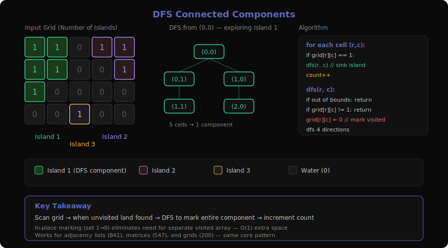

**Problems**: 200 (Number of Islands), 130 (Surrounded Regions), 417 (Pacific Atlantic Water Flow), 547 (Number of Provinces), 695 (Max Area of Island), 733 (Flood Fill), 841 (Keys and Rooms), 1020 (Number of Enclaves), 1254 (Number of Closed Islands), 1905 (Count Sub Islands), 2101 (Detonate the Maximum Bombs)

### What is it?

Imagine you're looking at a satellite photo of an archipelago. You want to count how many separate island groups exist. You pick any piece of land, then walk to every connected piece of land (up/down/left/right). Once you can't walk any further, that's one island. You mark it as "visited" and move on to find the next unvisited piece of land.

**Concrete example** — Number of Islands with a 4×5 grid:
```
Input:
  1 1 0 0 0         Island 1: cells (0,0),(0,1),(1,0),(1,1),(2,0)
  1 1 0 0 0         Island 2: cells (0,3),(0,4),(1,4)
  1 0 0 1 1         Island 3: cell  (3,1)
  0 0 1 0 0
                    Output: 3 islands
```

Start at (0,0) → DFS marks all connected 1s → that's island #1. Skip visited cells. Next unvisited 1 at (0,3) → DFS → island #2. Next at (3,2) → island #3.

### The Decision Tree (Visualized)

```
DFS from (0,0) in Number of Islands:

    (0,0)=1 ✓
    ├── → (0,1)=1 ✓
    │   ├── → (0,2)=0 ✗
    │   ├── ↓ (1,1)=1 ✓
    │   │   ├── → (1,2)=0 ✗
    │   │   ├── ↓ (2,1)=0 ✗
    │   │   └── ← (1,0) visited
    │   └── ↑ (0,0) visited
    ├── ↓ (1,0)=1 ✓
    │   ├── ↓ (2,0)=1 ✓
    │   │   ├── ↓ (3,0)=0 ✗
    │   │   └── → (2,1)=0 ✗
    │   └── → (1,1) visited
    └── ↑ out of bounds

Result: 5 cells visited → one connected component
```

### Core Template (with walkthrough)

```
function countComponents(grid):
    count = 0
    for each cell (r, c) in grid:          // scan every cell
        if grid[r][c] == 1:                 // found unvisited land
            dfs(grid, r, c)                 // mark entire component
            count += 1                      // one more component found
    return count

function dfs(grid, r, c):
    if r,c out of bounds: return            // boundary check
    if grid[r][c] != 1: return              // water or already visited
    grid[r][c] = 0                          // mark visited (sink the land)
    dfs(grid, r-1, c)                       // up
    dfs(grid, r+1, c)                       // down
    dfs(grid, r, c-1)                       // left
    dfs(grid, r, c+1)                       // right
```

**Trace** for the grid above starting at (0,0):
1. `dfs(0,0)` → mark 0, recurse 4 directions
2. `dfs(0,1)` → mark 0, recurse → finds `dfs(1,1)` → mark 0
3. `dfs(1,0)` → mark 0 → `dfs(2,0)` → mark 0
4. All further calls hit 0s or out-of-bounds → unwind
5. Back in main loop: `count = 1`. Continue scanning...

### How to Recognize This Pattern

- "Count the number of connected components / islands / groups / provinces"
- "Find all cells/nodes reachable from a starting point"
- Grid with 0s and 1s where you explore connected regions
- "Mark all connected X as visited" — flood-fill style
- **Look for**: iterate all cells → DFS/BFS from unvisited → count groups

### Key Insight / Trick

**In-place marking eliminates the need for a separate visited set.** By modifying the grid itself (setting `1 → 0` or `'O' → '#'`), you avoid O(m×n) extra space. The grid IS your visited array.

For problems where you can't modify the grid, use a `visited` set — but the core logic stays identical.

### Variations & Edge Cases

- **Surrounded Regions (130)**: Reverse thinking — DFS from borders first to mark safe cells, then flip everything else
- **Pacific Atlantic (417)**: Two separate DFS passes from each ocean border, then intersect
- **Sub Islands (1905)**: DFS on grid2 but validate against grid1 simultaneously
- **Adjacency matrix (547)**: Same idea but input is n×n matrix instead of grid — iterate nodes, DFS through adjacency
- **Directed graph (841, 2101)**: Reachability from a source — DFS with visited set, count reachable nodes

### Questions Detail

| # | Title | Difficulty | Key Twist |
|---|-------|-----------|-----------|
| 200 | Number of Islands | Medium | Classic grid DFS — count connected components of 1s. The foundation problem for this entire pattern. |
| 130 | Surrounded Regions | Medium | Inverse DFS — start from border 'O's and mark them safe, then flip remaining 'O's to 'X'. Teaches "outside-in" thinking. |
| 417 | Pacific Atlantic Water Flow | Medium | Two-source DFS — run DFS from Pacific border and Atlantic border separately, then find cells reachable by both. Reverse the flow direction (go uphill). |
| 547 | Number of Provinces | Medium | Same as 200 but on an adjacency matrix instead of a grid. Good for seeing the pattern isn't grid-specific. |
| 695 | Max Area of Island | Medium | DFS returns a count instead of void — return 1 + sum of recursive calls to track component size. |
| 733 | Flood Fill | Easy | Simplest DFS — change color of connected same-color cells. Watch for the edge case where newColor == oldColor (infinite loop). |
| 841 | Keys and Rooms | Medium | Graph is given as adjacency list (rooms → keys). DFS from room 0, check if visited count == n. |
| 1020 | Number of Enclaves | Medium | Like 130 but count remaining land cells instead of flipping. DFS from borders to eliminate reachable land, then count survivors. |
| 1254 | Number of Closed Islands | Medium | 0 = land, 1 = water (inverted from 200). DFS from border land first to eliminate open islands, then count remaining components. |
| 1905 | Count Sub Islands | Medium | DFS on grid2's islands, but during DFS check if every cell is also land in grid1. If any cell fails, it's not a sub-island. |
| 2101 | Detonate the Maximum Bombs | Medium | Build a directed graph (bomb A reaches B if distance ≤ radius_A), then DFS from each bomb to find max reachable count. Directed edges — A reaching B doesn't mean B reaches A. |

---

## 2. BFS Connected Components Pattern

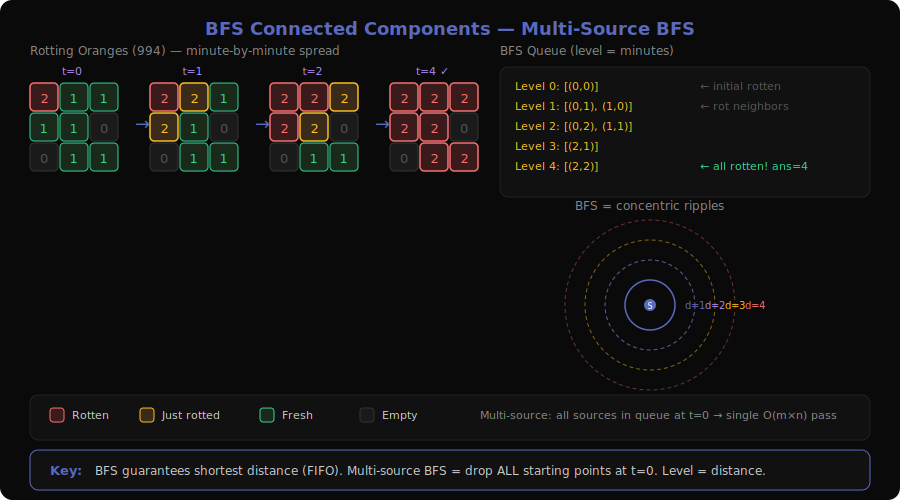

**Problems**: 542 (01 Matrix), 994 (Rotting Oranges), 1091 (Shortest Path in Binary Matrix)

### What is it?

Imagine dropping a stone in a pond — ripples expand outward in concentric circles, one ring at a time. BFS explores a graph the same way: all neighbors at distance 1 first, then distance 2, and so on. This makes BFS the natural choice when you need **shortest distance** or **minimum time** in an unweighted graph.

**Concrete example** — Rotting Oranges:
```
Input:          Minute 0:    Minute 1:    Minute 2:    Minute 3:    Minute 4:
2 1 1           2 1 1        2 2 1        2 2 2        2 2 2        2 2 2
1 1 0    →      1 1 0   →    2 1 0   →    2 2 0   →    2 2 0   →    2 2 0
0 1 1           0 1 1        0 1 1        0 2 1        0 2 2        0 2 2

Output: 4 minutes
```

All rotten oranges go into the queue at minute 0. Each minute, they rot their fresh neighbors. BFS level = one minute.

### The Decision Tree (Visualized)

```
Multi-source BFS for Rotting Oranges:

Queue at t=0: [(0,0)]           ← all initially rotten
    │
    ├── t=1: rot (0,1), (1,0)   ← neighbors of (0,0)
    │   Queue: [(0,1), (1,0)]
    │
    ├── t=2: rot (0,2), (1,1)   ← neighbors of t=1 nodes
    │   Queue: [(0,2), (1,1)]
    │
    ├── t=3: rot (2,1)          ← neighbor of (1,1)
    │   Queue: [(2,1)]
    │
    └── t=4: rot (2,2)          ← neighbor of (2,1)
        Queue: [(2,2)]

        All fresh oranges rotten → return 4
```

### Core Template (with walkthrough)

```
function bfsShortestDistance(grid, sources):
    queue = deque()
    for each source in sources:             // multi-source: add ALL starting points
        queue.append((source, 0))           // (position, distance)
        mark source as visited

    maxDist = 0
    while queue is not empty:
        (r, c), dist = queue.popleft()      // FIFO guarantees level-order
        maxDist = max(maxDist, dist)
        for each neighbor (nr, nc) of (r,c):
            if valid(nr, nc) and not visited:
                mark (nr, nc) as visited
                queue.append(((nr, nc), dist + 1))

    return maxDist                          // or check if all cells reached
```

**Trace** for Rotting Oranges:
1. Queue = [(0,0, d=0)]. Fresh count = 6
2. Pop (0,0). Push (0,1, d=1), (1,0, d=1). Fresh = 4
3. Pop (0,1). Push (0,2, d=2), (1,1, d=2). Fresh = 2
4. Pop (1,0). No new fresh neighbors.
5. Pop (0,2). No new. Pop (1,1). Push (2,1, d=3). Fresh = 1
6. Pop (2,1). Push (2,2, d=4). Fresh = 0
7. Queue empty. All reached. Return 4.

### How to Recognize This Pattern

- "Minimum time/distance for something to spread to all cells"
- "Shortest path in an unweighted grid/graph"
- "Find nearest X for every cell" (multi-source BFS)
- Multiple starting points spreading simultaneously
- **Look for**: all edges have weight 1 + need shortest distance → BFS

### Key Insight / Trick

**Multi-source BFS**: Instead of running BFS from each source separately (O(k × n²)), add ALL sources to the queue at time 0. This computes shortest distance from the nearest source for every cell in a single O(m×n) pass. It's like the "ripple" starts from multiple stones dropped simultaneously.

### Variations & Edge Cases

- **01 Matrix (542)**: Multi-source BFS from all 0-cells. Each 1-cell gets distance to nearest 0.
- **8-directional (1091)**: Same BFS but with 8 neighbors instead of 4. Don't forget diagonal moves.
- **Impossible cases**: Rotting Oranges returns -1 if any fresh orange is unreachable (check fresh count at end).
- When grid values represent different states (0=empty, 1=fresh, 2=rotten), be careful about what counts as "visitable."

### Questions Detail

| # | Title | Difficulty | Key Twist |
|---|-------|-----------|-----------|
| 542 | 01 Matrix | Medium | Multi-source BFS from all 0-cells simultaneously. Each 1-cell gets its shortest distance to any 0. Classic "reverse the question" — instead of searching FROM each 1, search FROM all 0s. |
| 994 | Rotting Oranges | Medium | Multi-source BFS where rotten oranges are the sources. Track time via BFS levels. Return -1 if any fresh orange remains unreachable. The quintessential "spreading" BFS problem. |
| 1091 | Shortest Path in Binary Matrix | Medium | BFS with 8-directional movement (including diagonals) from (0,0) to (n-1,n-1). Path length = number of cells visited. Return -1 if blocked. Standard shortest-path-in-grid but with 8 directions. |

---

## 3. DFS Cycle Detection Pattern

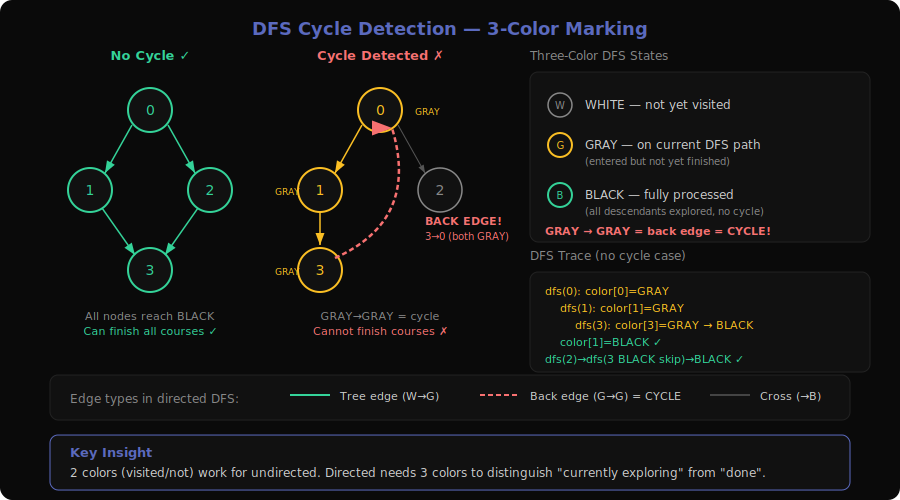

**Problems**: 207 (Course Schedule), 210 (Course Schedule II), 802 (Find Eventual Safe States), 1059 (All Paths from Source Lead to Destination)

### What is it?

Imagine you're a university registrar checking if students can actually complete their degree. Course A requires Course B, which requires Course C, which requires... Course A. That's a cycle — nobody can ever start. DFS cycle detection walks through the prerequisite chain. If you ever revisit a course you're currently processing (it's "on the stack"), you've found a circular dependency.

**Concrete example** — Course Schedule with 4 courses:
```
Prerequisites: [1→0], [2→0], [3→1], [3→2]

    0 ← 1 ← 3
    ↑       ↑
    └── 2 ──┘

No cycle → return true (can finish all courses)

But if we add [0→3]:
    0 ← 1 ← 3 ← 0   (cycle: 0→3→1→0)
    return false
```

### The Decision Tree (Visualized)

```
DFS Cycle Detection with 3-color marking:

WHITE = unvisited, GRAY = in current path, BLACK = fully processed

Start: all nodes WHITE

dfs(0):                         color[0] = GRAY
├── dfs(1):                     color[1] = GRAY
│   ├── dfs(3):                 color[3] = GRAY
│   │   └── no neighbors
│   │   color[3] = BLACK ✓      fully explored, no cycle through 3
│   color[1] = BLACK ✓
├── dfs(2):                     color[2] = GRAY
│   ├── dfs(3):                 color[3] = BLACK → skip (already done)
│   color[2] = BLACK ✓
color[0] = BLACK ✓

All nodes BLACK → no cycle → return true

--- With cycle (add edge 3→0) ---
dfs(0):                         color[0] = GRAY
├── dfs(1):                     color[1] = GRAY
│   ├── dfs(3):                 color[3] = GRAY
│   │   ├── neighbor 0:         color[0] = GRAY ⚠️
│   │   │   GRAY node found on current path → CYCLE DETECTED!
```

### Core Template (with walkthrough)

```
function hasCycle(numCourses, prerequisites):
    graph = build adjacency list from prerequisites
    color = array of WHITE for each node     // 0=white, 1=gray, 2=black

    for each node in 0..numCourses-1:
        if color[node] == WHITE:
            if dfs(node) returns CYCLE:
                return true                  // cycle found
    return false                             // no cycle

function dfs(node):
    color[node] = GRAY                       // entering — on current DFS path
    for each neighbor of node:
        if color[neighbor] == GRAY:          // back edge → cycle!
            return CYCLE
        if color[neighbor] == WHITE:         // unvisited → explore
            if dfs(neighbor) returns CYCLE:
                return CYCLE
    color[node] = BLACK                      // leaving — fully explored
    return NO_CYCLE
```

**Why 3 colors instead of 2?**
- WHITE → GRAY → BLACK tracks the DFS lifecycle
- Finding a GRAY neighbor = back edge = cycle (it's an ancestor on the current path)
- Finding a BLACK neighbor = cross/forward edge = safe (already fully explored, no cycle through it)
- With only visited/unvisited, you can't distinguish "currently exploring" from "already done"

### How to Recognize This Pattern

- "Can you finish all courses / tasks given prerequisites?"
- "Is there a circular dependency?"
- "Find all nodes that don't lead to cycles" (safe states)
- Directed graph + need to detect back edges
- **Look for**: dependency ordering + feasibility check → cycle detection

### Key Insight / Trick

**The 3-color (WHITE/GRAY/BLACK) marking is what makes DFS cycle detection work in directed graphs.** In undirected graphs you only need 2 colors (visited/not), but directed graphs need to distinguish "on the current path" (GRAY) from "fully processed" (BLACK). Hitting a GRAY node means you've found a back edge — a cycle.

### Variations & Edge Cases

- **Course Schedule II (210)**: Same cycle detection + record BLACK nodes in reverse → that's the topological order. (Also solvable with Kahn's BFS — see pattern 4.)
- **Safe States (802)**: A node is safe if ALL paths from it reach a terminal (no outgoing edges). Equivalent to: node is safe iff it's NOT part of a cycle and doesn't reach a cycle. DFS with 3-color; BLACK nodes are safe.
- **1059 (Premium)**: All paths from source lead to destination — DFS from source, check that every path ends at destination (no dead ends elsewhere, no cycles).
- **Disconnected graphs**: Must try DFS from every unvisited node, not just node 0.

### Questions Detail

| # | Title | Difficulty | Key Twist |
|---|-------|-----------|-----------|
| 207 | Course Schedule | Medium | Pure cycle detection in a directed graph. Build adjacency list from prerequisites, then DFS with 3-color marking. If any GRAY→GRAY back edge found, return false. The canonical cycle detection problem. |
| 210 | Course Schedule II | Medium | Cycle detection + topological ordering. If no cycle, return the order (push to result when a node turns BLACK — gives reverse topological order). Same as 207 but you also need to output the valid ordering. |
| 802 | Find Eventual Safe States | Medium | Find all nodes NOT in or leading to a cycle. DFS with 3-color marking — nodes that end up BLACK are safe. Can also be solved with reverse graph + topological sort (remove nodes with 0 outgoing edges iteratively). |
| 1059 | All Paths from Source Lead to Destination | Medium | Premium. DFS from source — verify every path terminates at the target. No cycles allowed, and non-target nodes must have outgoing edges. Combines cycle detection with reachability validation. |

---

## 4. BFS Topological Sort (Kahn's Algorithm) Pattern

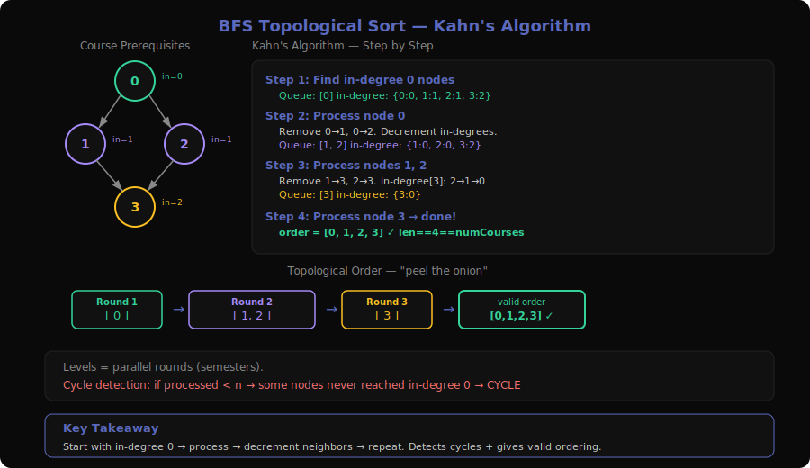

**Problems**: 210 (Course Schedule II), 269 (Alien Dictionary), 310 (Minimum Height Trees), 444 (Sequence Reconstruction), 1136 (Parallel Courses), 1857 (Largest Color Value in a Directed Graph), 2050 (Parallel Courses III), 2115 (Find All Possible Recipes from Given Supplies), 2392 (Build a Matrix With Conditions)

### What is it?

Imagine you're a project manager scheduling tasks. Some tasks depend on others being completed first. You start by identifying tasks with ZERO dependencies — those can begin immediately. Once a task completes, you remove it as a dependency from downstream tasks. Any downstream task whose dependency count drops to zero can now start. Repeat until all tasks are scheduled (or you detect a deadlock/cycle).

**Concrete example** — Course Schedule II with 4 courses:
```
Prerequisites: [1→0], [2→0], [3→1], [3→2]

In-degree:  0→0  1→1  2→1  3→2

Step 1: Queue = [0]          (in-degree 0)
Step 2: Process 0 → reduce 1,2   In-degree: 1→0, 2→0
        Queue = [1, 2]
Step 3: Process 1 → reduce 3     In-degree: 3→1
        Process 2 → reduce 3     In-degree: 3→0
        Queue = [3]
Step 4: Process 3

Output: [0, 1, 2, 3] ✓ (or [0, 2, 1, 3])
```

### The Decision Tree (Visualized)

```
Kahn's Algorithm — BFS Level Processing:

Initial in-degrees:
  Node:       0   1   2   3
  In-degree:  0   1   1   2

Queue: [0]     ← only node with in-degree 0
  │
  ├── Process 0: remove edges 0→1, 0→2
  │   In-degrees: 1→0, 2→0
  │   Queue: [1, 2]
  │
  ├── Process 1: remove edge 1→3
  │   In-degrees: 3→1
  │   Queue: [2]
  │
  ├── Process 2: remove edge 2→3
  │   In-degrees: 3→0
  │   Queue: [3]
  │
  └── Process 3: no outgoing edges
      Queue: empty

Result: [0, 1, 2, 3]
Processed 4 nodes == numCourses → valid ordering ✓
```

### Core Template (with walkthrough)

```
function topologicalSort(n, edges):
    graph = adjacency list from edges
    inDegree = array of 0s, size n

    for each edge (u → v):              // compute in-degrees
        inDegree[v] += 1

    queue = deque()
    for node in 0..n-1:
        if inDegree[node] == 0:          // no prerequisites
            queue.append(node)

    order = []
    while queue is not empty:
        node = queue.popleft()
        order.append(node)               // this node is next in topological order
        for each neighbor of node:
            inDegree[neighbor] -= 1      // "complete" this prerequisite
            if inDegree[neighbor] == 0:  // all prereqs done
                queue.append(neighbor)

    if len(order) == n:
        return order                     // valid topological order
    else:
        return []                        // cycle detected (some nodes never reached 0)
```

### How to Recognize This Pattern

- "Find a valid ordering given dependencies"
- "Determine if a sequence is uniquely determined"
- "Find the minimum number of semesters / parallel rounds"
- "Build something from ingredients/supplies with dependency chains"
- **Look for**: directed edges representing "must come before" → topological sort

### Key Insight / Trick

**Kahn's algorithm naturally detects cycles**: if the output has fewer nodes than the graph, some nodes never reached in-degree 0 — they're in a cycle. This is often simpler than DFS 3-color cycle detection for problems that also need the ordering.

**For parallel scheduling** (1136, 2050): process BFS level by level. Each level = one "round" or "semester." The total number of levels = minimum time to complete everything.

### Variations & Edge Cases

- **Alien Dictionary (269, Premium)**: Build a graph from character ordering constraints between adjacent words. Each pair of adjacent words gives one edge. Then topological sort the characters.
- **Minimum Height Trees (310)**: Not a traditional topo sort, but uses the same "peel leaves" idea — repeatedly remove degree-1 nodes until 1-2 nodes remain (the centroids).
- **Parallel Courses (1136, 2050)**: BFS level = one semester. For 2050, track longest path to each node (max of all prerequisite paths + 1).
- **Unique ordering (444)**: Check if at every step the queue has exactly 1 element — if so, the topological order is unique.
- **Cycle = impossible**: If `len(order) < n`, return empty/false.

### Questions Detail

| # | Title | Difficulty | Key Twist |
|---|-------|-----------|-----------|
| 210 | Course Schedule II | Medium | Pure Kahn's algorithm — output the topological order or empty array if cycle exists. The BFS approach is often cleaner than DFS for this problem since it directly builds the order left-to-right. |
| 269 | Alien Dictionary | Hard | Premium. Construct the dependency graph from adjacent words in a sorted alien language. Compare adjacent words character by character to extract ordering edges, then topological sort. Watch for invalid inputs (prefix before full word). |
| 310 | Minimum Height Trees | Medium | "Topological sort on an undirected tree" — iteratively remove leaf nodes (degree 1) from the outside in. The last 1-2 remaining nodes are the tree's centroids, giving minimum height when used as roots. |
| 444 | Sequence Reconstruction | Medium | Premium. Build a graph from subsequences and check if the topological order is unique. At each BFS step, the queue must have exactly one element for the order to be uniquely determined. |
| 1136 | Parallel Courses | Medium | Premium. BFS topological sort counting levels. Each level = one semester. Return total levels, or -1 if cycle. Direct application of level-by-level Kahn's. |
| 1857 | Largest Color Value in a Directed Graph | Hard | Topological sort + DP. At each node, track the maximum count of each color along any path ending there. For each node, take max of all predecessor paths for each of 26 colors. Return -1 if cycle. |
| 2050 | Parallel Courses III | Hard | Topological sort with weighted completion times. Each course has a duration. Track earliest completion time for each course = max(completion times of all prereqs) + own duration. Return maximum completion time. |
| 2115 | Find All Possible Recipes from Given Supplies | Medium | Build dependency graph: recipe → ingredients. Supplies have in-degree 0. Process via topological sort — a recipe becomes "available" when all its ingredients are available (in-degree drops to 0). |
| 2392 | Build a Matrix With Conditions | Hard | Two separate topological sorts — one for row ordering, one for column ordering. If either has a cycle, return empty. Otherwise, place each value at the position determined by its topological rank in rows and columns. |

---

## 5. Deep Copy / Cloning Pattern

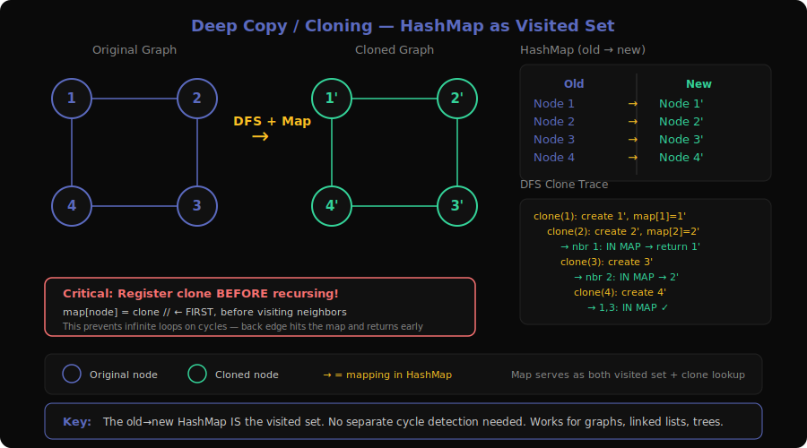

**Problems**: 133 (Clone Graph), 138 (Copy List with Random Pointer), 1334 (Find the City With the Smallest Number of Neighbors at a Threshold Distance), 1490 (Clone N-ary Tree)

### What is it?

Imagine you're a photocopier for a web of interconnected documents. Each document has links to other documents. You can't just copy each document individually — you need to ensure that when Document A's copy links to Document B, it links to the COPY of B, not the original B. The challenge: you might encounter the same document multiple times (cycles!), and you need to avoid making duplicate copies.

**Concrete example** — Clone Graph with 4 nodes:
```
Original:  1 — 2        Copy:  1' — 2'
           |   |               |    |
           4 — 3               4' — 3'

Map: {1→1', 2→2', 3→3', 4→4'}

When cloning node 1:
  1. Create 1' (clone)
  2. Store in map: old_1 → new_1'
  3. For each neighbor [2, 4]:
     - 2 not cloned yet → recurse, create 2'
     - 4 not cloned yet → recurse, create 4'
  4. Set 1'.neighbors = [2', 4']
```

### The Decision Tree (Visualized)

```
DFS Clone of graph 1—2—3—4—1:

clone(1):                       map = {1: 1'}
├── neighbor 2: not in map
│   clone(2):                   map = {1: 1', 2: 2'}
│   ├── neighbor 1: IN MAP → return map[1] = 1'
│   ├── neighbor 3: not in map
│   │   clone(3):               map = {1: 1', 2: 2', 3: 3'}
│   │   ├── neighbor 2: IN MAP → return map[2] = 2'
│   │   ├── neighbor 4: not in map
│   │   │   clone(4):           map = {..., 4: 4'}
│   │   │   ├── neighbor 1: IN MAP → return map[1] = 1'
│   │   │   └── neighbor 3: IN MAP → return map[3] = 3'
│   │   │   4'.neighbors = [1', 3'] ✓
│   │   3'.neighbors = [2', 4'] ✓
│   2'.neighbors = [1', 3'] ✓
├── neighbor 4: IN MAP → return map[4] = 4'
1'.neighbors = [2', 4'] ✓
```

### Core Template (with walkthrough)

```
function cloneGraph(node):
    if node is null: return null
    map = {}                              // old node → new node
    return dfs(node, map)

function dfs(node, map):
    if node in map:                        // already cloned — return the copy
        return map[node]

    clone = new Node(node.val)             // create the clone
    map[node] = clone                      // register BEFORE recursing (handles cycles!)

    for each neighbor of node:
        clone.neighbors.append(dfs(neighbor, map))

    return clone
```

**Critical**: Register the clone in the map BEFORE recursing into neighbors. This is what prevents infinite loops in cyclic graphs. When you encounter a node you're currently cloning (via a back edge), the map already has its clone.

### How to Recognize This Pattern

- "Deep copy / clone a graph / linked list / tree with arbitrary pointers"
- Structure has cycles or cross-links (random pointers)
- Need to map old nodes to new nodes
- "Return a copy where no new node points to any old node"
- **Look for**: graph/list duplication with identity-preserving links

### Key Insight / Trick

**The hash map IS the visited set.** The `old → new` mapping serves double duty: it prevents re-cloning (like a visited set) AND provides the correct clone reference when a node is encountered again. This elegantly handles cycles without any extra cycle-detection logic.

### Variations & Edge Cases

- **Random Pointer (138)**: Linked list with an extra random pointer. Same map approach works. Alternative O(1) space trick: interleave clones with originals (A→A'→B→B'→...), then assign random pointers, then separate the lists.
- **N-ary Tree (1490, Premium)**: Trees have no cycles, so you don't strictly need the map — but it still works and is simpler to write.
- **1334**: Not actually a cloning problem — it's a shortest-path problem (Dijkstra from each city or Floyd-Warshall). Grouped here in patterns.py but algorithmically belongs with Dijkstra.
- **Empty graph**: Always handle the null/empty case first.

### Questions Detail

| # | Title | Difficulty | Key Twist |
|---|-------|-----------|-----------|
| 133 | Clone Graph | Medium | Classic graph deep copy with DFS + hashmap. The graph is undirected and connected. Handle cycles via the map. BFS approach works equally well — use a queue instead of recursion. |
| 138 | Copy List with Random Pointer | Medium | Linked list where each node has a `next` and a `random` pointer. Map approach: clone each node, map old→new, then wire up next and random using the map. O(1) space trick: interleave cloned nodes in the original list. |
| 1334 | Find the City With Smallest Number of Neighbors | Medium | Run Dijkstra from each city (or Floyd-Warshall for all pairs), then for each city count how many others are within distanceThreshold. Return the city with fewest neighbors (tie-break: largest index). Not a cloning problem per se. |
| 1490 | Clone N-ary Tree | Medium | Premium. Deep copy an N-ary tree. Since trees are acyclic, simple DFS without a map works — just recurse on each child and build the clone tree. Map approach also valid for consistency. |

---

## 6. Shortest Path — Dijkstra's Algorithm Pattern

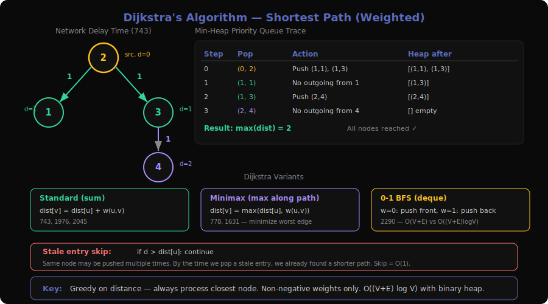

**Problems**: 743 (Network Delay Time), 778 (Swim in Rising Water), 1514 (Path with Maximum Probability), 1631 (Path With Minimum Effort), 1976 (Number of Ways to Arrive at Destination), 2045 (Second Minimum Time to Reach Destination), 2203 (Minimum Weighted Subgraph With the Required Paths), 2290 (Minimum Obstacle Removals to Reach Corner), 2577 (Minimum Time to Visit a Cell in a Grid), 2812 (Find the Safest Path in a Grid)

### What is it?

Imagine you're a GPS navigation system finding the fastest route. You start at your location and explore outward, always expanding the next closest unvisited intersection first. You never revisit an intersection once you've found the shortest path to it (because Dijkstra guarantees that the first time you reach a node via the priority queue, it's optimal).

**Concrete example** — Network Delay Time:
```
Edges: [2→1, w=1], [2→3, w=1], [3→4, w=1]
Source: node 2, n=4

Priority Queue (min-heap):
Step 0: push (0, 2)           dist = {2:0}
Step 1: pop (0, 2)            process neighbors
        push (1, 1), (1, 3)   dist = {2:0, 1:1, 3:1}
Step 2: pop (1, 1)            no outgoing edges
Step 3: pop (1, 3)            push (2, 4)   dist = {..., 4:2}
Step 4: pop (2, 4)            no outgoing edges

All nodes reached. Max distance = 2. Answer: 2
```

### The Decision Tree (Visualized)

```
Dijkstra from node 2:

    2 (d=0)
    ├── → 1 (d=0+1=1) ✓
    └── → 3 (d=0+1=1) ✓
         └── → 4 (d=1+1=2) ✓

Priority Queue trace:
  [(0,2)]
  pop(0,2) → [(1,1), (1,3)]
  pop(1,1) → [(1,3)]              ← 1 has no outgoing
  pop(1,3) → [(2,4)]
  pop(2,4) → []                   ← done

  dist[] = {2:0, 1:1, 3:1, 4:2}
  max(dist) = 2
```

### Core Template (with walkthrough)

```
function dijkstra(n, edges, source):
    graph = adjacency list with weights
    dist = array of INFINITY, size n
    dist[source] = 0
    pq = min-heap with (0, source)         // (distance, node)

    while pq is not empty:
        d, u = pq.pop()                     // closest unprocessed node
        if d > dist[u]: continue             // stale entry — skip
        for each (v, weight) in graph[u]:
            newDist = dist[u] + weight
            if newDist < dist[v]:            // found a shorter path
                dist[v] = newDist
                pq.push((newDist, v))

    return dist                              // shortest distance from source to every node
```

**Why `if d > dist[u]: continue`?**
We might push the same node multiple times with different distances. By the time we pop a stale entry, we've already found a better path. Skipping it is O(1) and avoids redundant processing.

### How to Recognize This Pattern

- "Find shortest/minimum cost path in a weighted graph"
- Edges have non-negative weights
- "Minimum time/cost to reach all nodes from a source"
- "Find path that minimizes the maximum edge weight" (modified Dijkstra)
- **Look for**: weighted edges + single source shortest path + non-negative weights → Dijkstra

### Key Insight / Trick

**Dijkstra is greedy on distance.** The priority queue always processes the globally closest unfinished node. This works because with non-negative weights, once a node is popped, no future path to it can be shorter. This greedy property is why Dijkstra fails with negative edges (Bellman-Ford needed there).

**Modified Dijkstra** for "minimax" problems: instead of summing edge weights, take the `max` along the path. The priority queue minimizes the maximum weight encountered. Examples: Swim in Rising Water, Path With Minimum Effort.

### Variations & Edge Cases

- **Minimax Dijkstra (778, 1631)**: `dist[v] = max(dist[u], weight(u,v))` instead of `dist[u] + weight(u,v)`. Priority queue still works because the "max" operation preserves the greedy property.
- **Maximum probability (1514)**: Max-heap instead of min-heap. `dist[v] = dist[u] * prob(u,v)`. Use negative log to convert to min Dijkstra, or just use a max-heap.
- **Count shortest paths (1976)**: Track both `dist[v]` and `count[v]`. When finding an equal-length path, add to count instead of replacing.
- **Second minimum (2045)**: Track two distances per node: `dist1[v]` and `dist2[v]`. Allow re-processing a node if the new distance is strictly between dist1 and dist2.
- **0-1 BFS (2290)**: When edge weights are only 0 or 1, use a deque instead of a heap. Push weight-0 edges to front, weight-1 edges to back. O(V+E) instead of O((V+E)logV).
- **Multi-source (2812)**: BFS from all danger cells first to compute safety scores, then Dijkstra (or binary search + BFS) to maximize minimum safety along the path.

### Questions Detail

| # | Title | Difficulty | Key Twist |
|---|-------|-----------|-----------|
| 743 | Network Delay Time | Medium | Classic Dijkstra — find shortest path from source to all nodes, return max distance. The textbook problem for learning Dijkstra. If any node is unreachable, return -1. |
| 778 | Swim in Rising Water | Hard | Minimax Dijkstra on a grid. The "cost" to reach a cell is the max elevation along the path. Use min-heap with max-elevation as priority. Also solvable with binary search + BFS or Union-Find. |
| 1514 | Path with Maximum Probability | Medium | Max-product Dijkstra. Multiply probabilities along edges. Use max-heap (negate probabilities for min-heap). Start with probability 1.0 at source. |
| 1631 | Path With Minimum Effort | Medium | Minimax Dijkstra on a grid. Effort = max absolute height difference along the path. Minimize this maximum. Same structure as 778 but with height differences as edge weights. |
| 1976 | Number of Ways to Arrive at Destination | Medium | Dijkstra + counting. Track `dist[v]` and `ways[v]`. When `newDist == dist[v]`, add `ways[u]` to `ways[v]`. When `newDist < dist[v]`, reset `ways[v] = ways[u]`. Return `ways[dest] % MOD`. |
| 2045 | Second Minimum Time to Reach Destination | Hard | Track two distances per node. Allow a node to be processed twice — once for shortest, once for second shortest. The second-shortest must be strictly greater than the shortest. Green/red traffic light timing adds complexity. |
| 2203 | Minimum Weighted Subgraph With Required Paths | Hard | Three Dijkstra runs: from src1, from src2, and from dest (on reversed graph). For each node v, answer candidate = dist_src1[v] + dist_src2[v] + dist_dest_reversed[v]. Take minimum over all v. |
| 2290 | Minimum Obstacle Removals to Reach Corner | Hard | 0-1 BFS. Empty cell = weight 0, obstacle = weight 1. Use deque: push weight-0 to front, weight-1 to back. Finds minimum obstacles to remove from (0,0) to (m-1,n-1). |
| 2577 | Minimum Time to Visit a Cell in a Grid | Hard | Modified Dijkstra with time constraints. Each cell has a minimum time before you can enter. You can wait (move back and forth) to kill time. Edge weight depends on parity — you may need to wait 1 extra second. |
| 2812 | Find the Safest Path in a Grid | Medium | Multi-source BFS from all thieves to compute safety score for each cell, then maximize the minimum safety along a path from (0,0) to (n-1,n-1). Solvable with binary search + BFS or reverse Dijkstra. |

---

## 7. Shortest Path — Bellman-Ford Algorithm Pattern

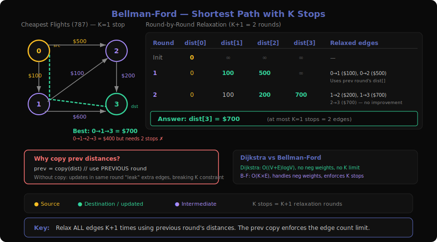

**Problems**: 787 (Cheapest Flights Within K Stops), 1129 (Shortest Path with Alternating Colors)

### What is it?

Imagine you're booking the cheapest multi-city flight, but your airline only allows a limited number of layovers. Unlike Dijkstra (which greedily picks the closest node), Bellman-Ford systematically relaxes ALL edges, round by round. Each round guarantees paths with one more edge are considered. After K rounds, you have the shortest paths using at most K edges — perfect for "at most K stops" constraints.

**Concrete example** — Cheapest Flights Within K=1 Stops:
```
Flights: [0→1, $100], [1→2, $100], [0→2, $500], [1→3, $600], [2→3, $200]
src=0, dst=3, k=1 (at most 1 stop = at most 2 edges)

Round 0: dist = [0, ∞, ∞, ∞]
Round 1 (relax all edges using round 0 distances):
  0→1: dist[1] = min(∞, 0+100) = 100
  0→2: dist[2] = min(∞, 0+500) = 500
  dist = [0, 100, 500, ∞]

Round 2 (relax all edges using round 1 distances):
  1→2: dist[2] = min(500, 100+100) = 200
  1→3: dist[3] = min(∞, 100+600) = 700
  2→3: dist[3] = min(700, 500+200) = 700
  dist = [0, 100, 200, 700]

Answer: dist[3] = 700 (route: 0→1→3)
Note: 0→1→2→3 costs 400 but uses 2 stops (k+1=3 edges) — invalid!
```

### The Decision Tree (Visualized)

```
Bellman-Ford with K=1 stops (K+1=2 rounds):

Round 0 (initial):
  [0]=0  [1]=∞  [2]=∞  [3]=∞

Round 1 (relax using PREVIOUS round's values):
  Edge 0→1: 0+100=100 < ∞  → [1]=100
  Edge 0→2: 0+500=500 < ∞  → [2]=500
  Edge 1→2: ∞ (1 was ∞ in round 0, skip)
  Edge 1→3: ∞ (skip)
  Edge 2→3: ∞ (skip)

  [0]=0  [1]=100  [2]=500  [3]=∞

Round 2 (relax using round 1's values):
  Edge 1→2: 100+100=200 < 500 → [2]=200
  Edge 1→3: 100+600=700 < ∞  → [3]=700
  Edge 2→3: 500+200=700 = 700 → no change

  [0]=0  [1]=100  [2]=200  [3]=700  ✓
```

### Core Template (with walkthrough)

```
function bellmanFord(n, flights, src, dst, k):
    dist = array of INFINITY, size n
    dist[src] = 0

    for round in 1..k+1:                    // k stops = k+1 edges
        prev = copy of dist                  // CRITICAL: use previous round's values
        for each (u, v, cost) in flights:
            if prev[u] != INFINITY:
                dist[v] = min(dist[v], prev[u] + cost)

    return dist[dst] if dist[dst] != INFINITY else -1
```

**Why copy `prev`?** Without the copy, updating dist[v] in the current round might affect later relaxations in the same round, effectively allowing more edges than intended. The copy ensures each round only uses paths from the previous round.

### How to Recognize This Pattern

- "Shortest path with at most K stops/edges"
- "Cheapest flight with limited layovers"
- Graph may have negative weights (but no negative cycles for basic BF)
- Need to constrain path length (number of edges), not just total weight
- **Look for**: shortest path + edge count limit → Bellman-Ford

### Key Insight / Trick

**The `prev` copy is what enforces the edge count limit.** Standard Bellman-Ford relaxes in-place and after V-1 rounds finds shortest paths (unlimited edges). But by using a copy of the previous round's distances, each round strictly adds one more edge. This is the key modification for "at most K stops" problems.

### Variations & Edge Cases

- **Alternating colors (1129)**: State = (node, last_color). Run BFS where each edge has a color, and you alternate. Not classic Bellman-Ford but same "layer-by-layer with constraints" idea. BFS works because all edges have weight 1.
- **Negative edges**: Standard Bellman-Ford handles negative weights (Dijkstra can't). Detect negative cycles by checking if V-th round still improves distances.
- **SPFA optimization**: Use a queue to only relax edges from recently updated nodes — average case O(E) but worst case still O(VE).

### Questions Detail

| # | Title | Difficulty | Key Twist |
|---|-------|-----------|-----------|
| 787 | Cheapest Flights Within K Stops | Medium | Classic Bellman-Ford with edge limit. Run K+1 rounds of relaxation, using the previous round's distances to enforce the stop limit. Also solvable with modified Dijkstra (state = (cost, node, stops_remaining)) or DP. |
| 1129 | Shortest Path with Alternating Colors | Medium | BFS with state (node, last_edge_color). Build two adjacency lists (red/blue). From each node via a red edge, only take blue edges next, and vice versa. Not pure Bellman-Ford but shares the "constrained relaxation" spirit. Start BFS with both colors from node 0. |

---

## 8. Union-Find (Disjoint Set Union) Pattern

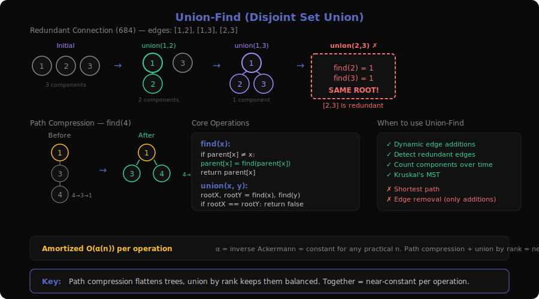

**Problems**: 200 (Number of Islands), 261 (Graph Valid Tree), 305 (Number of Islands II), 323 (Number of Connected Components), 547 (Number of Provinces), 684 (Redundant Connection), 721 (Accounts Merge), 737 (Sentence Similarity II), 947 (Most Stones Removed), 952 (Largest Component Size by Common Factor), 959 (Regions Cut By Slashes), 1101 (The Earliest Moment When Everyone Become Friends)

### What is it?

Imagine you're organizing a huge conference and need to figure out who knows who. Initially, everyone is in their own group. As people introduce each other, you merge their friend groups. At any point you can ask "Are Alice and Bob in the same group?" by checking if they share the same group leader. This is Union-Find: `union(a,b)` merges two groups, `find(a)` returns the group leader.

**Concrete example** — Redundant Connection:
```
Edges added one by one: [1,2], [1,3], [2,3]

Step 1: union(1,2) → groups: {1,2}, {3}     ← 1 and 2 connected
Step 2: union(1,3) → groups: {1,2,3}         ← 3 joins the group
Step 3: union(2,3) → find(2)=1, find(3)=1   ← SAME GROUP already!
        → [2,3] is the redundant edge ✓
```

### The Decision Tree (Visualized)

```
Union-Find with Path Compression & Union by Rank:

Initial: parent = [0,1,2,3,4,5]  rank = [0,0,0,0,0,0]
         Each node is its own root

union(1,2):  find(1)=1, find(2)=2  → different roots
             rank[1]==rank[2] → parent[2]=1, rank[1]++
             parent = [0,1,1,3,4,5]  rank = [0,1,0,0,0,0]

union(3,4):  find(3)=3, find(4)=4  → different roots
             parent[4]=3, rank[3]++
             parent = [0,1,1,3,3,5]  rank = [0,1,0,1,0,0]

union(2,4):  find(2)=1, find(4)=3  → different roots
             rank[1]==rank[3] → parent[3]=1, rank[1]++
             parent = [0,1,1,1,3,5]  rank = [0,2,0,1,0,0]

find(4):     4→3→1 (path compression: set parent[4]=1, parent[3]=1)
             parent = [0,1,1,1,1,5]
```

### Core Template (with walkthrough)

```
class UnionFind:
    function init(n):
        parent = [0, 1, 2, ..., n-1]       // each node is its own root
        rank = [0, 0, ..., 0]               // rank for union by rank
        components = n                       // number of connected components

    function find(x):                        // find root with path compression
        if parent[x] != x:
            parent[x] = find(parent[x])      // point directly to root
        return parent[x]

    function union(x, y):
        rootX = find(x)
        rootY = find(y)
        if rootX == rootY: return false      // already connected
        if rank[rootX] < rank[rootY]:        // union by rank
            parent[rootX] = rootY
        elif rank[rootX] > rank[rootY]:
            parent[rootY] = rootX
        else:
            parent[rootY] = rootX
            rank[rootX] += 1
        components -= 1
        return true                          // merged two components
```

**Time complexity**: Nearly O(1) per operation (amortized O(α(n)) with both optimizations, where α is the inverse Ackermann function — practically constant).

### How to Recognize This Pattern

- "Are two nodes in the same connected component?"
- "Merge groups/sets dynamically as edges are added"
- "Find redundant connections / detect when adding an edge creates a cycle"
- "Count connected components as edges are added over time"
- **Look for**: dynamic connectivity + union/merge operations → Union-Find

### Key Insight / Trick

**Path compression + union by rank together give near-constant time per operation.** Path compression flattens the tree (every node points directly to root after a find), and union by rank keeps trees balanced. Without these optimizations, Union-Find degrades to O(n) per operation.

**Union-Find excels over DFS/BFS when edges arrive dynamically** (online). DFS would need to re-traverse from scratch each time, but Union-Find incrementally maintains component information.

### Variations & Edge Cases

- **Redundant Connection (684)**: Process edges in order. The first edge where `find(u) == find(v)` (already connected) is redundant.
- **Number of Islands II (305, Premium)**: Grid cells become land one at a time. Union-Find tracks components as new land appears and unions with adjacent land.
- **Accounts Merge (721)**: Union emails that appear in the same account. Then group all emails by their root. Use a map-based Union-Find (strings, not just ints).
- **Graph Valid Tree (261, Premium)**: n nodes, n-1 edges, no cycle = tree. Union-Find: if any union returns false (already connected), it's not a tree.
- **Largest Component (952)**: Union numbers that share a common prime factor. Use a factor-to-number map. Sieve for prime factors.

### Questions Detail

| # | Title | Difficulty | Key Twist |
|---|-------|-----------|-----------|
| 200 | Number of Islands | Medium | Can be solved with Union-Find instead of DFS. Union adjacent land cells. Final answer = number of components among land cells. Demonstrates Union-Find as an alternative to DFS for static grids. |
| 261 | Graph Valid Tree | Medium | Premium. A graph is a valid tree iff it has exactly n-1 edges and no cycles. Union-Find: process each edge — if union returns false (cycle), not a tree. After all edges, check component count == 1. |
| 305 | Number of Islands II | Hard | Premium. Cells become land one by one (online). After each addition, union with adjacent land cells. Track component count dynamically. The quintessential Union-Find problem — DFS would need full re-scan each time. |
| 323 | Number of Connected Components | Medium | Premium. Direct application — union all edges, return component count. The simplest Union-Find problem. |
| 547 | Number of Provinces | Medium | Adjacency matrix input. Union(i,j) when isConnected[i][j]==1. Return component count. Same as 200/323 but with matrix representation. |
| 684 | Redundant Connection | Medium | Process edges in order. The edge that creates a cycle (union returns false) is the answer. If multiple, return the last one in input. Union-Find naturally finds the first redundant edge encountered. |
| 721 | Accounts Merge | Medium | Union-Find on strings (emails). For each account, union all its emails together. Then group emails by root. Requires mapping emails to indices for Union-Find, then collecting groups. |
| 737 | Sentence Similarity II | Medium | Premium. Union synonym pairs. Two words are similar if they're in the same component. Transitive similarity = connected components in the synonym graph. |
| 947 | Most Stones Removed | Medium | Union stones that share a row or column. Answer = total stones - number of components. Each component can be reduced to 1 stone. Use coordinate-based union (row → col mapping to avoid collision). |
| 952 | Largest Component Size by Common Factor | Hard | Union numbers sharing a prime factor. For each number, find prime factors and union the number with a representative for each factor. Track largest component size. Requires prime factorization + factor-to-number mapping. |
| 959 | Regions Cut By Slashes | Medium | Each cell in an N×N grid divided into 4 triangles. '/' and '\\' determine which triangles connect. Union adjacent triangles within and across cells. Count components. Clever encoding: cell (r,c) → 4 sub-regions. |
| 1101 | The Earliest Moment When Everyone Become Friends | Medium | Premium. Sort friendships (edges) by timestamp. Process in order with Union-Find. Return the timestamp when component count drops to 1 (everyone connected). |

---

## 9. Strongly Connected Components Pattern

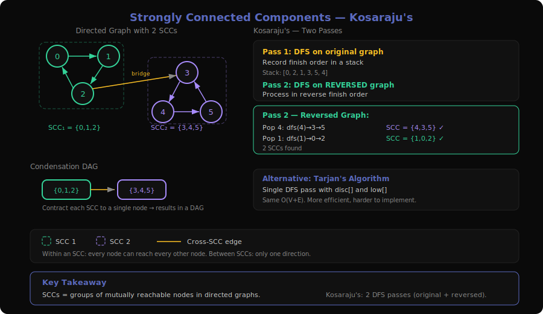

**Problems**: 210 (Course Schedule II), 547 (Number of Provinces), 1192 (Critical Connections in a Network), 2127 (Maximum Employees to Be Invited to a Meeting)

### What is it?

Imagine a city's road network where some neighborhoods have one-way streets. A strongly connected component (SCC) is a set of intersections where you can drive from ANY intersection to ANY other intersection within that set, despite one-way restrictions. It's like a neighborhood where no matter where you are, you can always get anywhere else.

In an undirected graph, connected components are trivial (just DFS/BFS). In directed graphs, reachability isn't symmetric — A can reach B doesn't mean B can reach A. SCCs capture mutual reachability.

**Concrete example** — Finding SCCs:
```
Directed graph:
  0 → 1 → 2 → 0     (cycle: SCC₁ = {0,1,2})
  2 → 3               (one-way bridge)
  3 → 4 → 5 → 3      (cycle: SCC₂ = {3,4,5})

SCCs: {0,1,2} and {3,4,5}
DAG of SCCs: SCC₁ → SCC₂
```

### The Decision Tree (Visualized)

```
Kosaraju's Algorithm (two-pass DFS):

Pass 1: DFS on original graph, record finish order
  dfs(0): 0→1→2→0(visited)→3→4→5→3(visited)
  Finish order (stack): [0, 2, 1, 3, 5, 4] → reversed: [4, 5, 3, 1, 2, 0]

Pass 2: DFS on REVERSED graph in reverse finish order
  Reversed graph: 1→0, 2→1, 0→2, 3→2, 4→3, 5→4, 3→5

  Start from 4: dfs(4)→3→5→4(visited)  → SCC = {4,3,5} ✓
  Next unvisited: 1: dfs(1)→0→2→1(visited) → SCC = {1,0,2} ✓

  Two SCCs found ✓
```

### Core Template (with walkthrough)

```
// Kosaraju's Algorithm — O(V + E)
function findSCCs(n, edges):
    graph = adjacency list from edges
    reverseGraph = reverse all edges

    // Pass 1: DFS on original graph, record finish times
    visited = set()
    stack = []
    for node in 0..n-1:
        if node not in visited:
            dfs1(node, graph, visited, stack)

    // Pass 2: DFS on reversed graph in reverse finish order
    visited.clear()
    sccs = []
    while stack is not empty:
        node = stack.pop()               // highest finish time first
        if node not in visited:
            component = []
            dfs2(node, reverseGraph, visited, component)
            sccs.append(component)

    return sccs

function dfs1(node, graph, visited, stack):
    visited.add(node)
    for neighbor in graph[node]:
        if neighbor not in visited:
            dfs1(neighbor, graph, visited, stack)
    stack.append(node)                   // push AFTER all descendants done

function dfs2(node, reverseGraph, visited, component):
    visited.add(node)
    component.append(node)
    for neighbor in reverseGraph[node]:
        if neighbor not in visited:
            dfs2(neighbor, reverseGraph, visited, component)
```

**Why does reversing the graph work?**
If A reaches B and B reaches A in the original graph, then B reaches A and A reaches B in the reversed graph — the SCC is preserved. But if A reaches B but B can't reach A, then in the reversed graph B reaches A but A can't reach B. Processing by finish time ensures we don't "leak" between SCCs.

### How to Recognize This Pattern

- "Find all groups of mutually reachable nodes in a directed graph"
- "Condense a directed graph into a DAG of components"
- "Find cycles in a directed graph and group them"
- Problems involving circular dependencies or mutual relationships
- **Look for**: directed graph + mutual reachability → SCCs

### Key Insight / Trick

**Kosaraju's is conceptually simplest (two DFS passes), while Tarjan's is one pass.** For interviews, Kosaraju's is easier to explain and implement. Tarjan's uses DFS discovery/low-link values — same approach used for bridges and articulation points (see pattern 10).

### Variations & Edge Cases

- **Condensation DAG**: After finding SCCs, contract each SCC to a single node. The result is a DAG — useful for further analysis (longest path in DAG of SCCs, etc.)
- **2127 (Maximum Employees)**: Find all cycles in a "functional graph" (each node has exactly one outgoing edge). 2-cycles are special — they can be combined with chains. Larger cycles must seat all members around the table.
- **Single node = trivially an SCC** (unless self-loops matter for your problem)

### Questions Detail

| # | Title | Difficulty | Key Twist |
|---|-------|-----------|-----------|
| 210 | Course Schedule II | Medium | Can use SCC concepts — if any SCC has size > 1, there's a cycle and no valid ordering exists. In practice, Kahn's algorithm (pattern 4) is simpler for this problem. |
| 547 | Number of Provinces | Medium | Undirected graph — SCCs reduce to regular connected components. DFS/BFS/Union-Find all work. Included here to show SCCs generalize connected components. |
| 1192 | Critical Connections in a Network | Hard | Uses Tarjan's low-link values (same framework as SCC detection) to find bridges. A bridge is an edge where removing it increases the number of components. See pattern 10 for details. |
| 2127 | Maximum Employees to Be Invited to a Meeting | Hard | Functional graph (each node has exactly 1 outgoing edge = "favorite person"). Find all cycles. For cycles of length ≥ 3, the entire cycle must fit around the table. For 2-cycles (mutual pairs), extend with longest chains from each end. Answer = max(largest cycle, sum of all extended 2-cycles). |

---

## 10. Bridges & Articulation Points Pattern

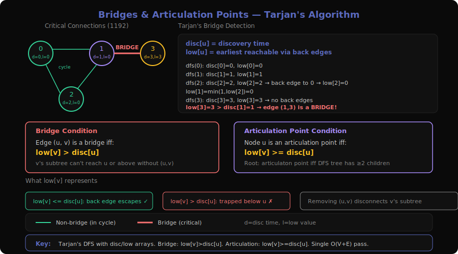

**Problems**: 1192 (Critical Connections in a Network), 2360 (Longest Cycle in a Graph)

### What is it?

Imagine a network of servers connected by cables. A **bridge** (critical connection) is a cable whose failure would split the network into two disconnected parts. An **articulation point** is a server whose failure would disconnect the network. Finding these is crucial for network reliability — they're single points of failure.

**Concrete example** — Critical Connections:
```
Servers: 0, 1, 2, 3
Connections: [0-1], [1-2], [2-0], [1-3]

    0 — 1 — 3
    |  /
    2

Edge [1-3] is a bridge:
  Remove [1-3] → node 3 is disconnected ✗
Edge [0-1] is NOT a bridge:
  Remove [0-1] → 0 can still reach 1 via 0→2→1 ✓

Output: [[1,3]]
```

### The Decision Tree (Visualized)

```
Tarjan's Bridge-Finding DFS:

disc[] = discovery time, low[] = lowest reachable discovery time

dfs(0, parent=-1):           disc[0]=0, low[0]=0
├── neighbor 1:
│   dfs(1, parent=0):        disc[1]=1, low[1]=1
│   ├── neighbor 2:
│   │   dfs(2, parent=1):    disc[2]=2, low[2]=2
│   │   ├── neighbor 0:      0 ≠ parent(1), visited → low[2]=min(2, disc[0])=0
│   │   └── neighbor 1:      1 == parent → skip
│   │   Return: low[2]=0
│   │   low[1] = min(low[1], low[2]) = min(1,0) = 0
│   │   low[2]=0 ≤ disc[1]=1 → NOT a bridge ✓
│   │
│   ├── neighbor 3:
│   │   dfs(3, parent=1):    disc[3]=3, low[3]=3
│   │   └── no unvisited neighbors
│   │   Return: low[3]=3
│   │   low[3]=3 > disc[1]=1 → BRIDGE [1,3] ✓
│   │
│   └── neighbor 0: parent → skip
│   Return: low[1]=0
│
├── neighbor 2: visited → low[0]=min(0, disc[2])=0
low[0]=0
```

### Core Template (with walkthrough)

```
function findBridges(n, connections):
    graph = adjacency list from connections
    disc = array of -1, size n              // discovery time
    low = array of -1, size n               // lowest discovery time reachable
    timer = 0
    bridges = []

    for node in 0..n-1:
        if disc[node] == -1:
            dfs(node, -1, graph, disc, low, timer, bridges)

    return bridges

function dfs(u, parent, graph, disc, low, timer, bridges):
    disc[u] = low[u] = timer++

    for v in graph[u]:
        if v == parent: continue             // skip the edge we came from
        if disc[v] == -1:                    // unvisited
            dfs(v, u, graph, disc, low, timer, bridges)
            low[u] = min(low[u], low[v])     // update with child's low
            if low[v] > disc[u]:             // v can't reach u or above without (u,v)
                bridges.append([u, v])        // (u,v) is a bridge!
        else:                                 // back edge
            low[u] = min(low[u], disc[v])    // can reach v via back edge
```

**The key condition**: `low[v] > disc[u]` means the subtree rooted at v has NO back edge to u or any of u's ancestors. So removing edge (u,v) disconnects v's subtree. That makes (u,v) a bridge.

### How to Recognize This Pattern

- "Find critical connections / edges whose removal disconnects the graph"
- "Find articulation points / nodes whose removal disconnects the graph"
- "Single points of failure in a network"
- Undirected graph + need to find vulnerable edges/nodes
- **Look for**: connectivity analysis + removal impact → Tarjan's algorithm

### Key Insight / Trick

**`low[v]` represents the earliest ancestor reachable from v's entire subtree via back edges.** If `low[v] > disc[u]`, v's subtree is "trapped" below u — no back edge escapes upward past u. This is what makes (u,v) a bridge. For articulation points, the condition is `low[v] >= disc[u]` (≥ instead of >) for non-root nodes.

### Variations & Edge Cases

- **Articulation points**: Change condition to `low[v] >= disc[u]` and u is an articulation point. Special case: root is an articulation point iff it has ≥ 2 children in the DFS tree.
- **2360 (Longest Cycle in a Directed Graph)**: Not a bridge problem per se, but uses DFS with timestamping (similar to disc/low). Track visit time per node; if revisiting a node in the current path, cycle length = current_time - disc[revisited_node]. Functional graph makes this simpler.
- **Multi-edges**: If multiple edges exist between u and v, only one counts as "parent edge" — track edge index, not just node identity.

### Questions Detail

| # | Title | Difficulty | Key Twist |
|---|-------|-----------|-----------|
| 1192 | Critical Connections in a Network | Hard | Pure Tarjan's bridge-finding algorithm. DFS with disc/low arrays. An edge (u,v) is critical iff low[v] > disc[u]. The canonical bridge-finding problem. Watch for parent-edge handling in undirected graphs. |
| 2360 | Longest Cycle in a Graph | Hard | Directed functional graph (each node has at most one outgoing edge). DFS with visit timestamps. When revisiting a node from the current path, cycle length = current_time - visit_time[node]. Track globally visited to avoid re-processing. Not a bridge problem but uses similar DFS timestamp techniques. |

---

## 11. Minimum Spanning Tree Pattern

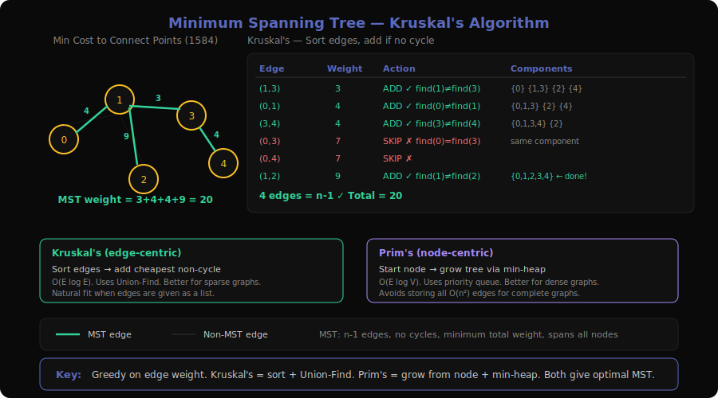

**Problems**: 1135 (Connecting Cities With Minimum Cost), 1168 (Optimize Water Distribution in a Village), 1489 (Find Critical and Pseudo-Critical Edges in MST), 1584 (Min Cost to Connect All Points)

### What is it?

Imagine you're a city planner laying fiber optic cables between towns. You need every town connected (directly or via other towns), and you want to minimize the total cable length. The result is a tree (n-1 edges for n towns, no cycles) that spans all towns with minimum total weight. That's a Minimum Spanning Tree.

Two classic algorithms:
- **Kruskal's**: Sort all edges by weight, greedily add the cheapest edge that doesn't create a cycle (use Union-Find to check)
- **Prim's**: Start from any node, greedily add the cheapest edge that connects a new node (use a min-heap)

**Concrete example** — Min Cost to Connect All Points:
```
Points: [0,0], [2,2], [3,10], [5,2], [7,0]

All pairwise Manhattan distances (15 edges total):
  (0,1)=4  (0,2)=13  (0,3)=7   (0,4)=7
  (1,2)=9  (1,3)=3   (1,4)=7
  (2,3)=10 (2,4)=14
  (3,4)=4

Kruskal's (sort edges, add cheapest non-cycle):
  (1,3)=3 → add ✓   components: {0}{1,3}{2}{4}
  (0,1)=4 → add ✓   components: {0,1,3}{2}{4}
  (3,4)=4 → add ✓   components: {0,1,3,4}{2}
  (0,3)=7 → skip ✗  (same component)
  (0,4)=7 → skip ✗  (same component)
  (1,4)=7 → skip ✗  (same component)
  (1,2)=9 → add ✓   components: {0,1,2,3,4}

MST weight = 3 + 4 + 4 + 9 = 20 ✓
```

### The Decision Tree (Visualized)

```
Kruskal's Algorithm — Greedy Edge Selection:

Sorted edges:
  (1,3)=3  (0,1)=4  (3,4)=4  (0,3)=7  (0,4)=7  (1,4)=7  (1,2)=9 ...

Processing:
  (1,3)=3 → find(1)≠find(3) → union → ADD    MST=[3]       components=4
  (0,1)=4 → find(0)≠find(1) → union → ADD    MST=[3,4]     components=3
  (3,4)=4 → find(3)≠find(4) → union → ADD    MST=[3,4,4]   components=2
  (0,3)=7 → find(0)=find(3) → SKIP            (would create cycle)
  (0,4)=7 → find(0)=find(4) → SKIP
  (1,4)=7 → find(1)=find(4) → SKIP
  (1,2)=9 → find(1)≠find(2) → union → ADD    MST=[3,4,4,9] components=1 ✓

  4 edges added = n-1 = 5-1 ✓  Total = 20
```

### Core Template (with walkthrough)

```
// Kruskal's Algorithm — O(E log E)
function kruskalMST(n, edges):
    sort edges by weight ascending
    uf = UnionFind(n)
    mstWeight = 0
    mstEdges = 0

    for each (u, v, weight) in sorted edges:
        if uf.find(u) != uf.find(v):         // different components
            uf.union(u, v)
            mstWeight += weight
            mstEdges += 1
            if mstEdges == n - 1:             // MST complete
                break

    if mstEdges == n - 1:
        return mstWeight                      // valid MST
    else:
        return -1                             // graph not connected
```

```
// Prim's Algorithm — O(E log V)
function primMST(n, adjList):
    visited = set()
    pq = min-heap with (0, startNode)         // (weight, node)
    mstWeight = 0

    while pq is not empty and len(visited) < n:
        weight, u = pq.pop()
        if u in visited: continue
        visited.add(u)
        mstWeight += weight
        for (v, w) in adjList[u]:
            if v not in visited:
                pq.push((w, v))

    return mstWeight if len(visited) == n else -1
```

### How to Recognize This Pattern

- "Connect all nodes/cities/points with minimum total cost"
- "Minimum cost to make the graph connected"
- "Find if an edge is critical for the MST"
- Undirected weighted graph + spanning tree needed
- **Look for**: connect everything + minimize total edge weight → MST

### Key Insight / Trick

**Kruskal's = greedy on edges + Union-Find. Prim's = greedy on nodes + min-heap.** Choose based on graph density:
- **Sparse graphs** (E ≈ V): Kruskal's is simpler and faster (sort E edges)
- **Dense graphs** (E ≈ V²): Prim's is better (avoid sorting V² edges)
- For complete graphs like "connect all points" (1584), Prim's with a heap avoids storing all O(n²) edges explicitly.

### Variations & Edge Cases

- **Virtual node trick (1168, Premium)**: Add a virtual node 0 connected to each village with edge weight = cost of building a well. Now "build a well" = "connect to virtual node." Run MST as normal — wells and pipes are treated uniformly.
- **Critical vs pseudo-critical edges (1489)**: An edge is critical if removing it increases MST weight. An edge is pseudo-critical if it can appear in some MST but isn't required. Test by exclusion (remove edge, compute MST) and inclusion (force edge, compute MST).
- **Complete graph (1584)**: All-pairs edges. Don't pre-compute all O(n²) edges — use Prim's and compute weights on-the-fly.

### Questions Detail

| # | Title | Difficulty | Key Twist |
|---|-------|-----------|-----------|
| 1135 | Connecting Cities With Minimum Cost | Medium | Premium. Pure Kruskal's or Prim's — sort edges, union components, sum weights. Return -1 if not all cities connected. The textbook MST problem. |
| 1168 | Optimize Water Distribution in a Village | Hard | Premium. Each village can build a well (cost) or connect via pipe (cost). Virtual node trick: add node 0 with well-cost edges to each village, then run MST on n+1 nodes. Elegant reduction to standard MST. |
| 1489 | Find Critical and Pseudo-Critical Edges in MST | Hard | For each edge: (1) exclude it and compute MST — if weight increases, it's critical. (2) Force-include it and compute MST — if weight equals original MST, it's pseudo-critical. O(E² × α(V)) with Union-Find. |
| 1584 | Min Cost to Connect All Points | Medium | Complete graph with Manhattan distance as edge weight. Kruskal's: generate all O(n²) edges, sort, MST. Prim's: use a dist[] array, pick closest unvisited node each step. Prim's avoids storing all edges. |

---

## 12. Bidirectional BFS Pattern

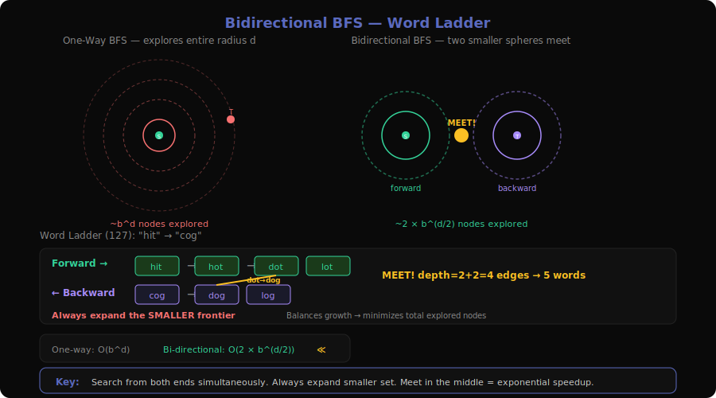

**Problems**: 126 (Word Ladder II), 127 (Word Ladder), 815 (Bus Routes)

### What is it?

Imagine two search parties looking for each other in a maze — one starts from the entrance, the other from the exit. They expand outward simultaneously. The moment their search areas overlap, they've found the shortest path. This is much faster than one-way BFS because the search space is roughly halved in each direction.

One-way BFS explores a "sphere" of radius d: ~b^d nodes (where b = branching factor). Two-way BFS explores two spheres of radius d/2: ~2 × b^(d/2) nodes. Since b^(d/2) ≪ b^d, the speedup is exponential.

**Concrete example** — Word Ladder:
```
beginWord = "hit", endWord = "cog"
wordList = ["hot","dot","dog","lot","log","cog"]

One-way BFS:    hit → hot → {dot, lot} → {dog, log} → cog    (5 levels)

Bidirectional BFS:
  Forward set:  {hit}
  Backward set: {cog}

  Step 1 (expand smaller set — forward):
    hit → hot         Forward: {hot}
  Step 2 (expand smaller set — backward):
    cog → {dog, log}  Backward: {dog, log}
  Step 3 (expand smaller set — forward):
    hot → {dot, lot}  Forward: {dot, lot}
  Step 4 (expand smaller set — forward):
    dot → dog ← IN BACKWARD SET! → overlap found!

  Path length = forward_depth + backward_depth + 1 = 2 + 2 + 1 = 5
```

### The Decision Tree (Visualized)

```
Bidirectional BFS — Word Ladder:

Forward frontier (→)           Backward frontier (←)
Level 0: {hit}                 Level 0: {cog}
         |                              |
Level 1: {hot}                 Level 1: {dog, log}
         |                              |
Level 2: {dot, lot}            (don't expand — forward is smaller)
         |
         dot → dog ∈ backward → MEET! ✓

Total levels = 2 + 2 = 4 edges → 5 words

Compare one-way BFS: would explore all of levels 0,1,2,3,4
Bidirectional: each side only goes to level 2
```

### Core Template (with walkthrough)

```
function bidirectionalBFS(beginWord, endWord, wordList):
    wordSet = set(wordList)
    if endWord not in wordSet: return 0

    frontSet = {beginWord}
    backSet = {endWord}
    visited = {beginWord, endWord}
    depth = 1

    while frontSet and backSet:
        // Always expand the SMALLER set (key optimization)
        if len(frontSet) > len(backSet):
            swap(frontSet, backSet)

        nextSet = {}
        for word in frontSet:
            for each neighbor of word:          // change one letter at a time
                if neighbor in backSet:
                    return depth + 1             // frontiers met!
                if neighbor in wordSet and neighbor not in visited:
                    visited.add(neighbor)
                    nextSet.add(neighbor)

        frontSet = nextSet
        depth += 1

    return 0                                    // no path exists
```

**Why expand the smaller set?** If forward has 10 nodes and backward has 1000, expanding forward (10 × branching_factor) is much cheaper than expanding backward (1000 × branching_factor). This balances the two frontiers.

### How to Recognize This Pattern

- "Shortest transformation / path between two known endpoints"
- Both source and target are known upfront
- Large branching factor where one-way BFS would be too slow
- "Minimum number of steps/changes to convert X to Y"
- **Look for**: known source + known target + shortest path + large state space → bidirectional BFS

### Key Insight / Trick

**Always expand the smaller frontier.** This is what gives bidirectional BFS its power. Without this optimization, one side could balloon while the other stays small, losing the benefit. By always expanding the smaller set, both frontiers grow at roughly the same rate, minimizing total exploration.

### Variations & Edge Cases

- **Word Ladder II (126)**: Find ALL shortest paths, not just the length. Use bidirectional BFS to find the shortest length, then DFS/backtracking to reconstruct all paths. Much harder — need to record the parent map during BFS.
- **Bus Routes (815)**: Not traditional bidirectional BFS, but benefits from it. The graph is on bus routes (not stops). BFS where nodes are routes, and two routes are connected if they share a stop. Can be optimized with bidirectional BFS from source stops to target stops.
- **When NOT to use**: If the target isn't known upfront (e.g., "find any node with property X"), bidirectional BFS doesn't apply. Also not useful if the graph is a tree (no alternative paths to meet).

### Questions Detail

| # | Title | Difficulty | Key Twist |
|---|-------|-----------|-----------|
| 127 | Word Ladder | Hard | Classic bidirectional BFS. Change one letter at a time, find shortest transformation sequence. Build neighbors by trying all 26 letters at each position. Bidirectional BFS reduces from O(26^d × L) to O(2 × 26^(d/2) × L). |
| 126 | Word Ladder II | Hard | Find ALL shortest transformation sequences. Phase 1: BFS (or bidirectional BFS) to find the shortest length and build a level map. Phase 2: DFS/backtracking from endWord to beginWord using only edges that decrease the level. Much harder than 127. |
| 815 | Bus Routes | Hard | Graph of bus routes, not individual stops. Two routes connect if they share a stop. BFS to find minimum bus transfers from source to target. Build a stop-to-routes map, then BFS at the route level. Can be optimized with bidirectional BFS. |

---

## Sub-Pattern Comparison Table

| Aspect | DFS Components | BFS Components | DFS Cycle | BFS Topo Sort | Deep Copy | Dijkstra | Bellman-Ford | Union-Find | SCC | Bridges | MST | Bidir. BFS |
|--------|---------------|----------------|-----------|---------------|-----------|----------|--------------|------------|-----|---------|-----|------------|
| **Graph type** | Undirected/Dir | Undirected | Directed | Directed | Any | Weighted | Weighted | Undirected | Directed | Undirected | Weighted Undir | Unweighted |
| **Core data structure** | Stack/recursion | Queue | Stack + colors | Queue + in-degree | HashMap | Min-heap | Array (rounds) | Parent array | Stack | Stack + disc/low | Heap or sorted edges | Two sets/queues |
| **Time complexity** | O(V+E) | O(V+E) | O(V+E) | O(V+E) | O(V+E) | O((V+E)logV) | O(V×E) | O(α(n)) per op | O(V+E) | O(V+E) | O(E logE) | O(b^(d/2)) |
| **Primary use** | Count/find components | Shortest unweighted | Detect cycles | Order dependencies | Clone structures | Shortest weighted | K-limited paths | Dynamic connectivity | Mutual reachability | Critical edges | Min-cost spanning | Shortest between two points |
| **Key condition** | visited check | FIFO level | GRAY→GRAY back edge | in-degree == 0 | old→new map | d > dist[u] skip | prev copy | find(x)==find(y) | finish time order | low[v] > disc[u] | no cycle (UF) | frontier overlap |
| **Handles cycles** | Yes (visited) | Yes (visited) | Detects them | Detects them | Yes (map) | N/A (DAG-like) | Yes | Detects them | Groups them | Finds vulnerabilities | Avoids them | N/A |
| **Negative weights** | N/A | N/A | N/A | N/A | N/A | No | Yes | N/A | N/A | N/A | Yes | N/A |

---

## Code References

- `server/patterns.py:33-46` — Graph Traversal category definition (12 sub-patterns, 68 problems)
- `server/patterns.py:362-367` — Reverse lookup (problem number → pattern)
- `server/main.py:307-369` — API endpoint for pattern data
- `extension/patterns.js` — Client-side pattern labels
