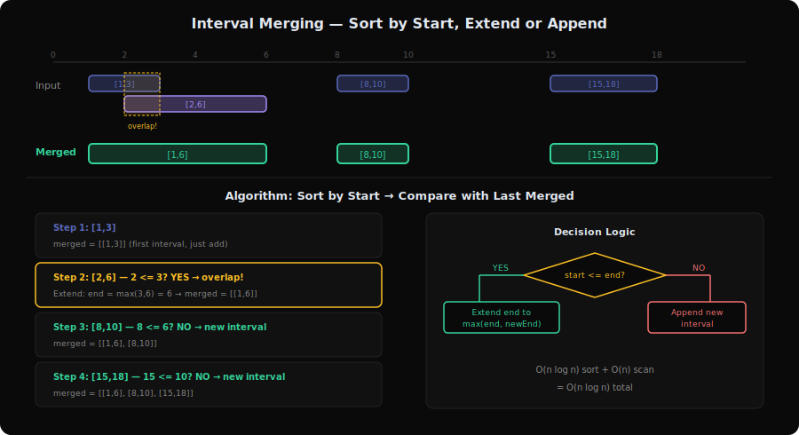
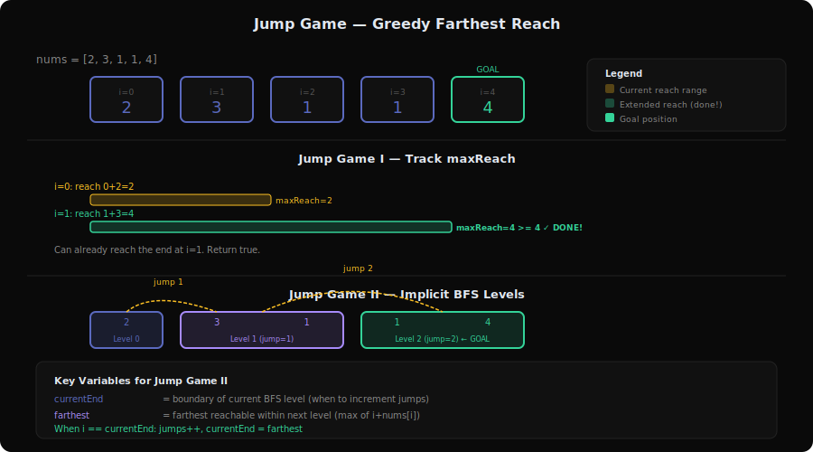
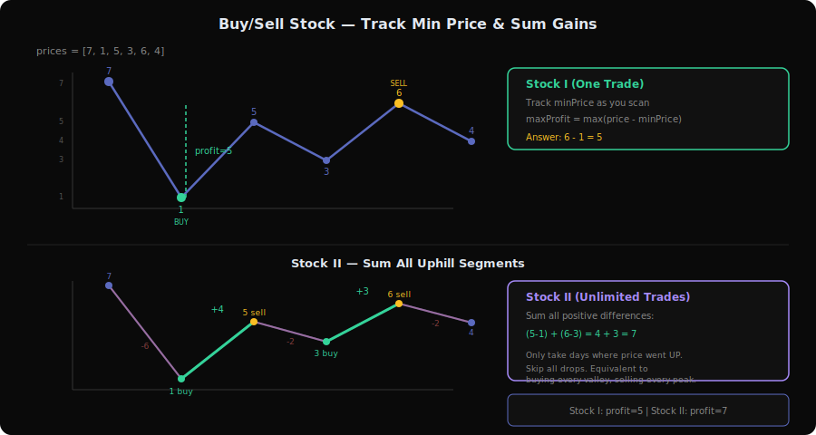
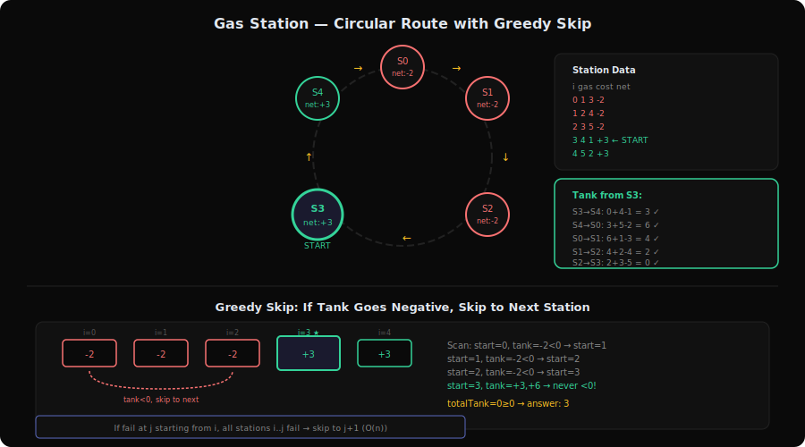
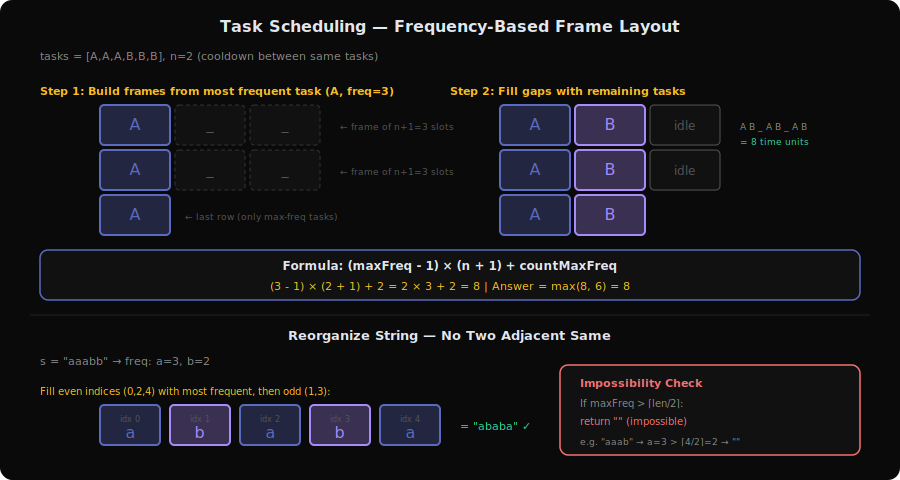
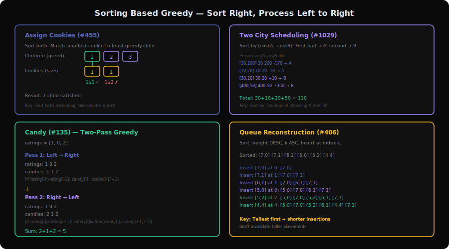

# Greedy Patterns Deep Dive

Greedy algorithms make the **locally optimal choice at every step**, trusting that this leads to a globally optimal solution. The key to greedy problems is proving (or intuiting) that being greedy *works* — that you never need to undo a decision. If you find yourself wanting to undo or look back, the problem likely needs DP, not greedy.

This document covers all 6 sub-patterns from `server/patterns.py` with 18 problems total.

---

## 1. Interval Merging Pattern



**Problems**: 56 (Merge Intervals), 57 (Insert Interval), 759 (Employee Free Time), 986 (Interval List Intersections), 2406 (Divide Intervals Into Minimum Number of Groups)

### What is it?

Think of a calendar app. You have a bunch of meetings: 9-10, 9:30-11, 12-1. Some overlap and need to be merged into single blocks: 9-11, 12-1. The greedy insight: if you sort all meetings by start time, you only ever need to compare the current meeting with the last merged one.

**Concrete example**: Merge `[[1,3],[2,6],[8,10],[15,18]]`

```
Sort by start (already sorted).

merged = [[1,3]]

[2,6]: 2 <= 3 (overlaps with [1,3]) → extend to [1,6]
merged = [[1,6]]

[8,10]: 8 > 6 (no overlap) → new interval
merged = [[1,6],[8,10]]

[15,18]: 15 > 10 (no overlap) → new interval
merged = [[1,6],[8,10],[15,18]]
```

### The Merge Process (Visualized)

```
Timeline:
0  1  2  3  4  5  6  7  8  9 10 11 12 13 14 15 16 17 18
   [------]                                            Input [1,3]
      [-----------]                                    Input [2,6]
                        [-----]                        Input [8,10]
                                          [---------]  Input [15,18]

   [------------------]  [-----]          [---------]  Merged output
         [1,6]           [8,10]            [15,18]
```

### Core Template (with walkthrough)

```
function mergeIntervals(intervals):
    sort intervals by start time

    merged = [intervals[0]]

    for each interval in intervals[1:]:
        last = merged[-1]           // The last merged interval

        if interval.start <= last.end:      // Overlap!
            last.end = max(last.end, interval.end)  // Extend
        else:
            merged.append(interval)  // No overlap, new interval

    return merged
```

**Why each line exists**:
- Sort by start: Guarantees that any overlap must involve the most recent merged interval
- `<= last.end` (not `<`): Touching intervals like `[1,4],[4,5]` are considered overlapping
- `max(last.end, interval.end)`: The new interval might be entirely contained within the last (e.g., `[1,10],[2,5]` → `[1,10]`)

### How to Recognize This Pattern

- "Merge overlapping intervals" or "insert an interval"
- "Find free time between intervals"
- "Minimum number of rooms/groups for overlapping intervals"
- Input is a list of `[start, end]` pairs
- **Look for**: Any problem involving ranges on a number line that may overlap

### Key Insight / Trick

**Sort by start time** transforms an O(n²) comparison problem into O(n log n). After sorting, each interval can only overlap with its immediate predecessor in the merged list — you never need to look further back.

For **intersection** (#986): Use two pointers (one per list). The intersection of `[a,b]` and `[c,d]` is `[max(a,c), min(b,d)]` if `max(a,c) <= min(b,d)`. Advance the pointer pointing to the interval that ends first.

For **minimum groups** (#2406): This is equivalent to "maximum overlap at any point" — use a sweep line with events: `+1` at each start, `-1` at each `end+1`. The max running sum is the answer.

### Variations & Edge Cases

- **Merge** (#56): Sort + extend-or-append
- **Insert** (#57): Three phases — add all before, merge overlapping, add all after
- **Intersection** (#986): Two-pointer merge of two sorted lists
- **Min groups** (#2406): Sweep line / event counting
- **Free time** (#759): Flatten all employee schedules, merge, gaps between merged intervals = free time
- **Edge cases**: Single interval, all intervals overlap, no overlaps, intervals touching at endpoints

### Questions Detail

| # | Title | Difficulty | Key Twist |
|---|-------|-----------|-----------|
| 56 | Merge Intervals | Medium | The classic interval merge. Sort by start, extend or append. The subtle part: use `max(end)` not just replace end, because a later interval might be contained within an earlier one. |
| 57 | Insert Interval | Medium | Already sorted, no need to re-sort. Three clean loops: (1) add all intervals ending before newInterval, (2) merge all overlapping with newInterval, (3) add remaining. Alternatively, add the new interval and call #56. |
| 759 | Employee Free Time | Hard | (Premium) Flatten all k employees' sorted schedules into one list, merge them, then the gaps between merged intervals are the free time. Can also use a min-heap to process intervals in order. |
| 986 | Interval List Intersections | Medium | Two sorted lists of non-overlapping intervals. Two-pointer approach: compute intersection `[max(a.start,b.start), min(a.end,b.end)]`, advance the pointer whose interval ends first. No sorting needed since inputs are pre-sorted. |
| 2406 | Divide Intervals Into Min Groups | Medium | Equivalent to maximum concurrent overlap. Use a sweep line: create events `(start, +1)` and `(end+1, -1)`, sort events, scan for max running sum. Or use a min-heap tracking earliest end time per group. |

---

## 2. Jump Game Pattern



**Problems**: 55 (Jump Game), 45 (Jump Game II)

### What is it?

Imagine stepping stones across a river. Each stone has a number telling you the maximum distance you can jump from it. Can you reach the other shore? And if so, what's the fewest jumps needed?

**Concrete example — Jump Game (#55)**: `nums = [2,3,1,1,4]`

```
Index:    0  1  2  3  4
Value:    2  3  1  1  4
Reach:    2  4  3  4  8

At each position, update maxReach = max(maxReach, i + nums[i])
- i=0: maxReach = max(0, 0+2) = 2
- i=1: maxReach = max(2, 1+3) = 4  ← can already reach end (index 4)!
```

### The Greedy Reach (Visualized)

```
nums:      [2,  3,  1,  1,  4]
index:      0   1   2   3   4

i=0: can reach up to index 2
     |====>
     0   1   2   3   4

i=1: can reach up to index 4 ← DONE!
         |=========>
     0   1   2   3   4

maxReach keeps expanding rightward. If maxReach >= last index, return true.
If i > maxReach at any point, we're stuck — return false.
```

### Core Template (with walkthrough)

```
// Jump Game I: Can you reach the end?
function canJump(nums):
    maxReach = 0

    for i = 0 to len(nums) - 1:
        if i > maxReach:         // Can't reach this position
            return false
        maxReach = max(maxReach, i + nums[i])

    return true                  // maxReach >= last index


// Jump Game II: Minimum jumps to reach the end
function minJumps(nums):
    jumps = 0
    currentEnd = 0      // Farthest we can go with current jump count
    farthest = 0        // Farthest we can go with one more jump

    for i = 0 to len(nums) - 2:   // Note: stop BEFORE last index
        farthest = max(farthest, i + nums[i])

        if i == currentEnd:        // Must make a jump now
            jumps++
            currentEnd = farthest

    return jumps
```

**Why each line exists (Jump II)**:
- `currentEnd`: The boundary of the current "BFS level" — positions reachable with `jumps` jumps
- `farthest`: While scanning this level, track the farthest position reachable with `jumps + 1` jumps
- `if i == currentEnd`: We've exhausted the current level, must jump. This is implicit BFS!
- Stop before last index: If `currentEnd` is the last index, we're already there — no extra jump needed

### How to Recognize This Pattern

- "Can you reach the end?" or "Minimum jumps to reach the end"
- Array where each element represents a jump distance
- Sequential decision-making with forward-only movement
- **Look for**: Reachability problems with a greedy forward scan

### Key Insight / Trick

**Jump Game I** is about tracking the farthest reachable index. If you can't reach position `i`, you can't reach anything after it either.

**Jump Game II** is BFS in disguise. Think of it as levels: level 0 is index 0, level 1 is all positions reachable in one jump from level 0, etc. The greedy part: you don't need to enumerate all positions in a level, just track the farthest reach.

### Variations & Edge Cases

- **Single element**: Always reachable (already at the end)
- **Zero at some index**: Only blocks if `maxReach` can't get past it
- **All zeros except first**: Only works if `nums[0] >= len-1`

### Questions Detail

| # | Title | Difficulty | Key Twist |
|---|-------|-----------|-----------|
| 55 | Jump Game | Medium | Boolean reachability. Track `maxReach` as you scan left to right. If `i > maxReach`, return false. The greedy proof: if any path can reach index `i`, then `maxReach >= i`. |
| 45 | Jump Game II | Medium | Minimum jumps count. The trick is treating it as implicit BFS with levels. Track `currentEnd` (this level's boundary) and `farthest` (next level's boundary). Increment `jumps` when you hit `currentEnd`. |

---

## 3. Buy/Sell Stock Pattern



**Problems**: 121 (Best Time to Buy and Sell Stock), 122 (Best Time to Buy and Sell Stock II)

### What is it?

You're a time traveler with stock prices. In version I, you can only make ONE trade — buy once, sell once. In version II, you can make unlimited trades.

**Concrete example — Stock I (#121)**: `prices = [7,1,5,3,6,4]`

```
Track min price seen so far, compute profit at each step:

Day 0: price=7, minPrice=7, profit=0
Day 1: price=1, minPrice=1, profit=0
Day 2: price=5, minPrice=1, profit=4 ← buy@1, sell@5
Day 3: price=3, minPrice=1, profit=2
Day 4: price=6, minPrice=1, profit=5 ← buy@1, sell@6 ← BEST
Day 5: price=4, minPrice=1, profit=3

Answer: 5 (buy on day 1, sell on day 4)
```

### The Stock Price Scan (Visualized)

```
Price: 7   1   5   3   6   4
       |
       7       5
       |   |       |   6
       |   |   5   |   |
       |   |   |   3   |   4
       |   |   |   |   |   |
       |   1   |   |   |   |
       +---+---+---+---+---+--

Stock I:  Track minPrice, compute price - minPrice
          minPrice: 7→1→1→1→1→1
          maxProfit: 0→0→4→2→5→3 → Answer: 5

Stock II: Sum all uphill segments
          Gains: (-6) + 4 + (-2) + 3 + (-2) = +4+3 = 7
          (Only add positive differences)
```

### Core Template (with walkthrough)

```
// Stock I: One transaction
function maxProfit_I(prices):
    minPrice = infinity
    maxProfit = 0

    for price in prices:
        minPrice = min(minPrice, price)        // Best buy price so far
        maxProfit = max(maxProfit, price - minPrice)  // Best profit if sold today

    return maxProfit


// Stock II: Unlimited transactions
function maxProfit_II(prices):
    totalProfit = 0

    for i = 1 to len(prices) - 1:
        if prices[i] > prices[i-1]:            // Price went up
            totalProfit += prices[i] - prices[i-1]  // Collect the gain

    return totalProfit
```

**Why Stock II works by summing all uphill segments**:
Any profitable sequence like buying at 1 and selling at 6 equals the sum of all daily gains: `(5-1) + (3-5) + (6-3)` = 4 + (-2) + 3. But we only take positive days, giving us 4+3 = 7, which is actually *better* than a single trade. This is because we can make multiple trades.

### How to Recognize This Pattern

- "Buy and sell stock" or "maximize profit"
- Array of prices over time
- Constraint on number of transactions
- **Look for**: Sequential decision with "buy low, sell high" structure

### Key Insight / Trick

**Stock I**: The greedy insight is that the best sell price for any day is known (it's today's price), so the best profit is `today - minSoFar`. Track `minSoFar` as you go.

**Stock II**: Every uphill segment is a profitable trade. Mathematically, summing all positive daily differences gives the optimal total profit. You don't need to track individual trades.

### Variations & Edge Cases

- **Monotonically decreasing**: Both return 0 (no profitable trade)
- **Monotonically increasing**: Stock I = last - first, Stock II = last - first (same result, but stock II gets there by summing daily gains)
- **All same prices**: Both return 0
- **Two elements**: Simple comparison

### Questions Detail

| # | Title | Difficulty | Key Twist |
|---|-------|-----------|-----------|
| 121 | Best Time to Buy and Sell Stock | Easy | Single transaction. Track minimum price seen so far, compute `price - minPrice` at each step, keep the maximum. O(n) time, O(1) space. The key insight: you always want to buy at the lowest past price. |
| 122 | Best Time to Buy and Sell Stock II | Medium | Unlimited transactions. Sum all positive daily differences `prices[i] - prices[i-1]` when positive. This is equivalent to capturing every uphill segment. No need to track actual buy/sell points. |

---

## 4. Gas Station Pattern



**Problems**: 134 (Gas Station), 2202 (Maximize the Topmost Element After K Moves)

### What is it?

You're driving around a circular road with gas stations. Each station gives you some gas, and each road segment costs some gas. Starting with an empty tank, find the starting station (if any) that lets you complete the loop.

**Concrete example**: `gas = [1,2,3,4,5]`, `cost = [3,4,5,1,2]`

```
Net gain at each station: gas[i] - cost[i]
Net: [-2, -2, -2, +3, +3]
Total sum = 0, so a solution exists.

Try starting at each station, track running tank:
Start i=0: -2, -4, -6, ...  ← goes negative at i=0, skip to i=1
Start i=1: -2, -4, -1, ...  ← goes negative at i=1, skip to i=2
Start i=2: -2, +1, +4, ...  ← goes negative at i=2, skip to i=3
Start i=3: +3, +6, +4, +2, +0 ← works! Answer: 3
```

### The Circular Route (Visualized)

```
Stations:    0     1     2     3     4
Gas:        [1]   [2]   [3]   [4]   [5]
Cost:        3     4     5     1     2
Net:        -2    -2    -2    +3    +3

Running tank from station 3:
  Station 3: tank = 0 + 4 - 1 = 3  ✓
  Station 4: tank = 3 + 5 - 2 = 6  ✓
  Station 0: tank = 6 + 1 - 3 = 4  ✓
  Station 1: tank = 4 + 2 - 4 = 2  ✓
  Station 2: tank = 2 + 3 - 5 = 0  ✓ (just barely!)

Made it around! Answer: station 3
```

### Core Template (with walkthrough)

```
function canCompleteCircuit(gas, cost):
    totalTank = 0      // Total gas surplus/deficit
    currentTank = 0    // Current running tank
    start = 0          // Candidate starting station

    for i = 0 to n - 1:
        net = gas[i] - cost[i]
        totalTank += net
        currentTank += net

        if currentTank < 0:       // Can't continue from current start
            start = i + 1          // Try starting from next station
            currentTank = 0        // Reset tank

    return start if totalTank >= 0 else -1
```

**Why each line exists**:
- `totalTank`: If total gas < total cost, no solution exists (sum of all nets < 0)
- `currentTank`: Tracks running surplus from candidate start
- Reset on negative: If the tank goes negative, none of the stations between `start` and `i` can be the answer (they'd all go negative even sooner), so jump to `i+1`

### How to Recognize This Pattern

- "Circular route" with costs and gains
- "Find starting position for a circular journey"
- Greedy elimination of invalid starting points
- **Look for**: Circular array problems with cumulative surplus/deficit tracking

### Key Insight / Trick

**If you can't reach station `j` starting from station `i`, then no station between `i` and `j` works either.** Why? Because the tank was positive at all those intermediate stations (otherwise we'd have stopped earlier), so starting from any of them means you'd have *less* gas at station `j`. This lets us skip to `j+1` in one jump — making the algorithm O(n).

The second insight: **if `totalTank >= 0`, a solution is guaranteed to exist** (and is unique per the problem statement).

### Variations & Edge Cases

- **Single station**: Works if `gas[0] >= cost[0]`
- **All stations equal**: Works if `gas[i] >= cost[i]` for all
- **Total gas < total cost**: Always return -1

### Questions Detail

| # | Title | Difficulty | Key Twist |
|---|-------|-----------|-----------|
| 134 | Gas Station | Medium | The classic circular route problem. The greedy skip: if starting from `i` you fail at `j`, skip to `j+1` because all stations between `i` and `j` would fail even earlier. Check `totalTank >= 0` for existence. |
| 2202 | Maximize Topmost Element After K Moves | Medium | A pile (stack) with k moves — can remove top or add back a previously removed element. Greedy analysis: with k moves, you can access the top k-1 elements (remove them) and either keep one or look at the kth element. Handle edge cases: single-element pile with odd k returns -1. |

---

## 5. Task Scheduling Pattern



**Problems**: 621 (Task Scheduler), 767 (Reorganize String), 1054 (Distant Barcodes)

### What is it?

Imagine you're a chef with orders. Some dishes are the same and need cooling time between repetitions (you can't make two of the same dish back-to-back). You want to minimize total time (or arrange items so no two adjacent are the same).

**Concrete example — Task Scheduler (#621)**: `tasks = [A,A,A,B,B,B]`, `n = 2`

```
Most frequent task: A (count=3)
Arrange A with n gaps between:  A _ _ A _ _ A

Fill gaps with other tasks:     A B _ A B _ A B

Total = max(formula, total tasks) = max((3-1)*(2+1)+1, 6) = max(7, 6) = 7
```

### The Scheduling Grid (Visualized)

```
Tasks: A=3, B=3, n=2

Slots arranged by most frequent task:
┌───┬───┬───┐
│ A │ _ │ _ │  Frame 1
├───┼───┼───┤
│ A │ _ │ _ │  Frame 2
├───┼───┼───┤
│ A │   │   │  Last row (only tasks with max freq)
└───┴───┴───┘

Fill with B:
┌───┬───┬───┐
│ A │ B │ _ │  Frame 1
├───┼───┼───┤
│ A │ B │ _ │  Frame 2
├───┼───┼───┤
│ A │ B │   │  Last row
└───┴───┴───┘

Intervals: A B _ A B _ A B = 8 time units
Formula: (maxFreq-1) * (n+1) + countMaxFreq = (3-1)*(2+1)+2 = 8
```

### Core Template (with walkthrough)

```
// Task Scheduler
function leastInterval(tasks, n):
    freq = count frequency of each task
    maxFreq = max(freq)
    countMaxFreq = count of tasks with maxFreq

    // Formula: (maxFreq - 1) frames of size (n+1) + final row
    formulaResult = (maxFreq - 1) * (n + 1) + countMaxFreq

    return max(formulaResult, len(tasks))  // Can't be less than total tasks


// Reorganize String / Distant Barcodes (no adjacent duplicates)
function reorganize(items):
    freq = count frequency of each item
    if max(freq) > (len(items) + 1) / 2:   // Impossible check
        return ""

    // Sort by frequency (descending), place most frequent first
    sorted_items = sort items by freq descending

    result = new array[len(items)]
    // Fill even indices first (0, 2, 4, ...), then odd (1, 3, 5, ...)
    index = 0
    for each item in sorted_items:
        for count times:
            if index >= len(items): index = 1   // Switch to odd
            result[index] = item
            index += 2

    return result
```

### How to Recognize This Pattern

- "Schedule tasks with cooldown between same tasks"
- "Rearrange so no two adjacent elements are the same"
- "Minimum time to complete all tasks"
- **Look for**: Frequency-based placement with gap or adjacency constraints

### Key Insight / Trick

**The most frequent element dictates the structure.** In task scheduling, the most frequent task creates "frames" of size `n+1`. Other tasks fill the gaps. The formula `(maxFreq-1) * (n+1) + countMaxFreq` computes the minimum slots.

For **reorganize/no-adjacent** problems: if the most frequent element appears more than `⌈len/2⌉` times, it's impossible. Otherwise, place by frequency in alternating positions (even indices first, then odd).

### Variations & Edge Cases

- **More tasks than gaps**: The answer is simply `len(tasks)` (no idle time)
- **Single task type**: Need `(count-1) * (n+1) + 1` slots
- **n = 0**: No cooldown, answer = `len(tasks)`
- **Impossible case** (reorganize): Most frequent > `⌈len/2⌉`

### Questions Detail

| # | Title | Difficulty | Key Twist |
|---|-------|-----------|-----------|
| 621 | Task Scheduler | Medium | Count frequencies, apply the frame formula. The most frequent task creates frames of `n+1` slots. Other tasks fill gaps. Result is `max(formula, total_tasks)`. Can also be solved with a max-heap simulation. |
| 767 | Reorganize String | Medium | Rearrange so no two adjacent chars are the same. Greedy: place most frequent char first at even indices, then fill remaining at odd indices. Impossible if any char appears > `⌈n/2⌉` times. Can also use a max-heap: always pick the two most frequent. |
| 1054 | Distant Barcodes | Medium | Same problem as #767 but guaranteed to have a valid answer. Sort by frequency descending, fill even indices first then odd. Or use max-heap to always place the most frequent unused barcode. |

---

## 6. Sorting Based Greedy Pattern



**Problems**: 135 (Candy), 406 (Queue Reconstruction by Height), 455 (Assign Cookies), 1029 (Two City Scheduling)

### What is it?

Some problems become trivially solvable once you sort the input correctly. The greedy insight is: **sort by the right criteria, then process in order, making the locally optimal choice at each step.**

**Concrete example — Assign Cookies (#455)**: `children = [1,2,3]`, `cookies = [1,1]`

```
Sort both:  children = [1,2,3], cookies = [1,1]

Cookie 1 (size 1) → child 1 (greed 1): 1 >= 1 ✓ → assign!
Cookie 2 (size 1) → child 2 (greed 2): 1 >= 2 ✗ → skip child
No more cookies. Answer: 1 child satisfied.
```

### The Sorting-Then-Greedy Flow (Visualized)

```
ASSIGN COOKIES:
Children (sorted): [1, 2, 3]   ← greed factors
Cookies (sorted):  [1, 1]      ← cookie sizes

  child=1, cookie=1: 1>=1 ✓ assign! (both advance)
  child=2, cookie=1: 1>=2 ✗ (advance cookie... no more cookies)

Result: 1 satisfied

TWO CITY SCHEDULING:
Sort by (costA - costB), i.e., "how much cheaper is city A?"

Person: [10,20]  [30,200]  [400,50]  [30,20]
Diff:     -10     -170      +350      +10

Sorted:  [30,200] [10,20]  [30,20]  [400,50]
          -170     -10      +10      +350

First n=2 → city A:  30 + 10 = 40
Last  n=2 → city B:  20 + 50 = 70
Total: 110
```

### Core Template (with walkthrough)

```
// Assign Cookies
function assignCookies(children, cookies):
    sort children ascending
    sort cookies ascending
    child_i = 0

    for cookie in cookies:
        if child_i < len(children) AND cookie >= children[child_i]:
            child_i++       // This child is satisfied

    return child_i


// Candy (two-pass greedy)
function candy(ratings):
    n = len(ratings)
    candies = [1] * n       // Everyone gets at least 1

    // Left to right: if rating increases, give more than left neighbor
    for i = 1 to n-1:
        if ratings[i] > ratings[i-1]:
            candies[i] = candies[i-1] + 1

    // Right to left: if rating increases (going right to left), enforce
    for i = n-2 down to 0:
        if ratings[i] > ratings[i+1]:
            candies[i] = max(candies[i], candies[i+1] + 1)

    return sum(candies)
```

**Why Candy needs two passes**: A single left-to-right pass handles increasing sequences but misses decreasing sequences (where the right neighbor constraint matters). The right-to-left pass catches those. The `max` ensures we satisfy both directions.

### How to Recognize This Pattern

- Problem becomes simple after sorting by some criteria
- "Assign resources greedily" or "minimize cost with assignment"
- Two-pass problems (left-to-right then right-to-left)
- "Reconstruct order" based on relative constraints
- **Look for**: Problems where the optimal strategy is "sort, then process in order"

### Key Insight / Trick

**Choosing the right sort key** is the entire solution:
- **Assign Cookies**: Sort both by size — smallest cookie to least greedy child
- **Two City**: Sort by `costA - costB` — first half goes to A, second to B
- **Queue Reconstruction**: Sort by height descending, k ascending — insert at index k
- **Candy**: No sorting of input, but two-directional passes (a form of greedy ordering)

For **Queue Reconstruction** (#406): Tallest people first means when you insert shorter people later, they don't affect the `k` value of already-placed people. Insert each person at index `k` in the result array.

### Variations & Edge Cases

- **Ties in sorting**: Usually need a secondary sort key (e.g., height desc, then k asc)
- **Candy with equal ratings**: Equal neighbors don't need more candies (can be 1)
- **Two City with equal costs**: Doesn't matter which city — difference is 0

### Questions Detail

| # | Title | Difficulty | Key Twist |
|---|-------|-----------|-----------|
| 135 | Candy | Hard | Two-pass greedy: left-to-right ensures right-neighbor constraint, right-to-left ensures left-neighbor constraint. Use `max` in the second pass to satisfy both. The hard part is proving two passes suffice. |
| 406 | Queue Reconstruction by Height | Medium | Sort by height descending, k ascending. Then insert each person at index k in the result. Tallest-first ensures insertions don't invalidate earlier placements. Elegant O(n²) solution. |
| 455 | Assign Cookies | Easy | Sort both arrays. Use two pointers — try to satisfy the least greedy child with the smallest sufficient cookie. Classic greedy matching. |
| 1029 | Two City Scheduling | Medium | Sort by `costA - costB` (the "savings" of choosing A over B). Send the first n people to city A, last n to city B. The sort ensures we maximize total savings. |

---

## Pattern Comparison Table

| Aspect | Interval Merging | Jump Game | Buy/Sell Stock | Gas Station | Task Scheduling | Sorting Based |
|--------|-----------------|-----------|---------------|-------------|-----------------|---------------|
| Core operation | Sort + merge overlaps | Track farthest reach | Track min/max or sum gains | Track running surplus | Frequency counting | Sort + process in order |
| Sort needed? | Yes (by start) | No | No | No | Sort by frequency | Yes (problem-specific key) |
| Time complexity | O(n log n) | O(n) | O(n) | O(n) | O(n log n) or O(n) | O(n log n) |
| Space complexity | O(n) | O(1) | O(1) | O(1) | O(1) or O(n) | O(n) |
| Greedy proof | Sorted order ensures local = global | Reach only expands | Min-so-far is optimal buy | Skipping invalid starts | Most frequent dictates | Sort key captures optimal |
| Common mistake | Missing `max(end)` in merge | Off-by-one in Jump II | Not tracking minPrice | Forgetting totalTank check | Wrong impossibility check | Wrong sort key |
| Pattern trigger | "intervals", "merge" | "jump", "reach" | "buy/sell", "profit" | "circular", "gas" | "schedule", "cooldown", "no adjacent" | "assign", "reconstruct" |

---

## When Greedy Fails → Use DP Instead

Greedy doesn't always work. Here's when to switch to DP:

| Problem Type | Greedy Works? | Why/Why Not |
|---|---|---|
| Buy/Sell Stock I (1 trade) | Yes | Min-so-far is always optimal |
| Buy/Sell Stock III (2 trades) | No | Need to track states for two transactions |
| Buy/Sell Stock IV (k trades) | No | Need DP with k states |
| Buy/Sell Stock with Cooldown | No | Cooldown creates dependent decisions |
| Jump Game I (reachability) | Yes | Farthest reach only expands |
| Jump Game with costs | No | Need DP (greedy jump might cost more) |
| Coin Change | No | Greedy doesn't find optimal for arbitrary denominations |
| Activity Selection | Yes | Classic greedy — sort by end time, pick non-overlapping |

**Rule of thumb**: If making one choice constrains future choices in complex ways, use DP. If each choice is independent or only constrains things in one direction, greedy works.

---

## Code References

- `server/patterns.py:76-83` — Greedy category definition with all 6 sub-patterns
- `server/patterns.py:362-367` — Reverse lookup (problem number → pattern)
- `server/main.py:307-369` — API endpoint for pattern data
- `extension/patterns.js` — Client-side pattern labels
