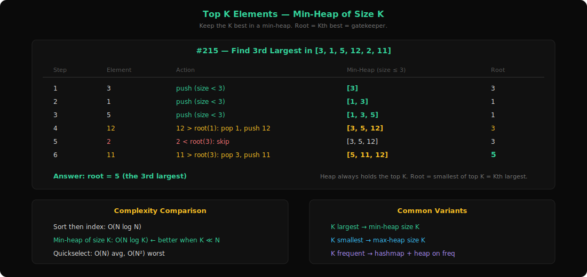
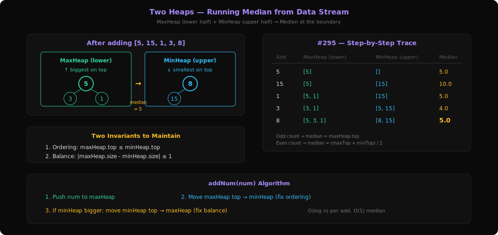
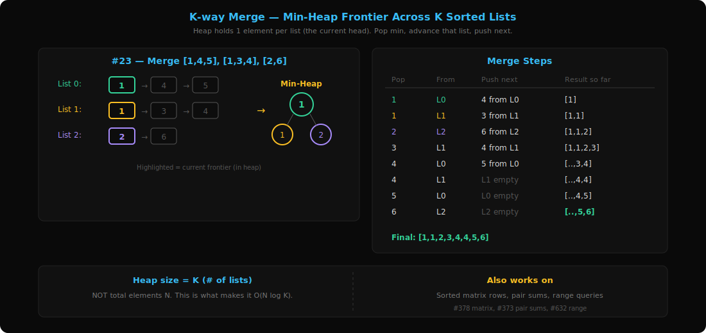
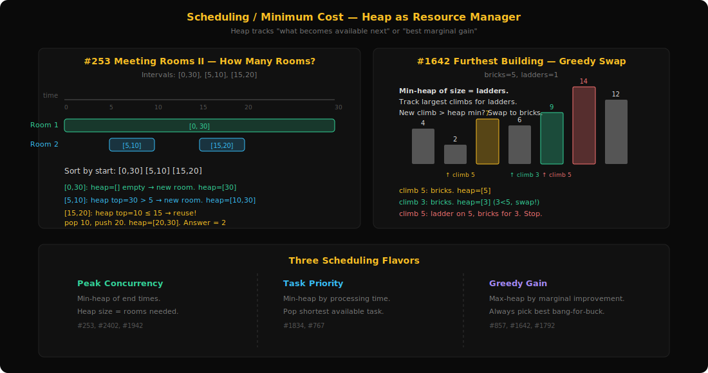

# Research: Heap (Priority Queue) Patterns Deep Dive

**Date**: 2026-03-09
**Researcher**: claude
**Git Commit**: 3fca422
**Branch**: main
**Repository**: idea1

## What is a Heap?

A heap is a complete binary tree stored in an array where every parent is smaller (min-heap) or larger (max-heap) than its children.

**Real-world analogy**: Imagine a hospital emergency room. Patients don't get treated in arrival order — the most critical patient is always seen first. A heap is exactly this: a data structure that instantly gives you the "most important" element without sorting everything.

**Array representation** (0-indexed):
```
Parent of i    → (i - 1) / 2
Left child of i  → 2*i + 1
Right child of i → 2*i + 2
```

**Key operations**:
| Operation | Time |
|-----------|------|
| Insert (push) | O(log n) |
| Extract min/max (pop) | O(log n) |
| Peek min/max | O(1) |
| Build heap from array | O(n) |

**When to use a heap**:
- You need the min or max element repeatedly
- You're processing elements in priority order
- You need the "top K" or "kth" of something
- You need to merge sorted streams efficiently

---

## 1. Top K Elements Pattern



**Problems**: 215 (Kth Largest Element), 347 (Top K Frequent), 703 (Kth Largest in Stream), 973 (K Closest Points), 1046 (Last Stone Weight), 451 (Sort Characters by Frequency), 506 (Relative Ranks), 2558 (Take Gifts)

### What is it?

You have a collection and need to find the "K best" elements — whether that's K largest, K most frequent, K closest, etc.

**Real-world analogy**: Imagine you're a talent scout at a marathon with 10,000 runners. You don't need to rank all 10,000 — you just need the top 3 finishers. You keep a mental "shortlist" of the 3 fastest so far. When a new runner finishes, you compare them to the slowest on your shortlist. If they're faster, swap them in.

**Example**: Find the 2nd largest element in [3, 2, 1, 5, 6, 4]

```
Approach: Keep a min-heap of size k=2

Process 3: heap = [3]            (size < k, just add)
Process 2: heap = [2, 3]         (size = k, 2 is the root/minimum)
Process 1: heap = [2, 3]         (1 < heap top 2, skip — can't be top-2)
Process 5: heap = [3, 5]         (5 > heap top 2, pop 2, push 5)
Process 6: heap = [5, 6]         (6 > heap top 3, pop 3, push 6)
Process 4: heap = [5, 6]         (4 < heap top 5, skip)

Answer: heap top = 5 ← the 2nd largest!
```

### The Key Insight

**Use a min-heap of size K to find the K largest elements.** This seems backwards, but think about it: the min-heap's root is the smallest of the K elements you're keeping — which is exactly the Kth largest element overall.

Why not a max-heap? A max-heap of size N would give you the max, but you'd need to pop K times. A min-heap of size K processes each element in O(log K) instead of O(log N).

### Core Template

```
function topK(items, k):
    minHeap = new MinHeap()

    for item in items:
        if heap.size < k:
            heap.push(item)
        elif item > heap.peek():    // better than worst in top-k
            heap.pop()
            heap.push(item)

    return heap   // contains the K largest elements
    // heap.peek() = the Kth largest element
```

**Time**: O(N log K) — each of N elements may trigger a push/pop on a size-K heap
**Space**: O(K) — only K elements stored

### How to Recognize This Pattern

- "Find the K largest / smallest / most frequent / closest"
- "Return the Kth ___" (largest, smallest, etc.)
- "Keep track of the top K" in a streaming context
- "Repeatedly extract the maximum/minimum"
- Look for: **K + superlative** in the problem statement

### Variations

**Min-heap vs Max-heap choice**:
- K largest → use min-heap of size K (gatekept by the smallest of the K)
- K smallest → use max-heap of size K (gatekept by the largest of the K)

**Frequency-based Top K** (#347, #451):
1. Count frequencies with a hashmap
2. Push (frequency, element) into the heap
3. This transforms "most frequent" into "largest frequency"

**Streaming Top K** (#703):
- Same min-heap approach, but elements arrive one at a time
- The heap persists between calls to `add()`
- Only insert if new element > heap top

**Repeated extraction** (#1046 Last Stone Weight, #2558 Take Gifts):
- Use a max-heap to repeatedly extract the largest
- Process (smash, reduce, etc.) and push result back
- Continue until 1 or 0 elements remain

### Questions Detail

| # | Title | Difficulty | Key Twist |
|---|-------|-----------|-----------|
| 215 | Kth Largest Element in an Array | Medium | Classic top-K. Can also solve with quickselect for O(N) average. Min-heap of size K gives O(N log K). |
| 347 | Top K Frequent Elements | Medium | Two-phase: first count frequencies with hashmap, then top-K on the (freq, element) pairs. Can also use bucket sort for O(N). |
| 703 | Kth Largest Element in a Stream | Easy | Streaming variant — maintain a min-heap of size K across multiple `add()` calls. If new val > heap top, replace. |
| 973 | K Closest Points to Origin | Medium | Top-K where "priority" is distance. Use max-heap of size K (evict the farthest). No need to compute sqrt — compare squared distances. |
| 1046 | Last Stone Weight | Easy | Repeated extraction: max-heap, pop two, push |y-x| back if y≠x. Pure heap simulation. |
| 451 | Sort Characters By Frequency | Medium | Count freq → push all (freq, char) → pop all in order. Or use bucket sort where index = frequency. |
| 506 | Relative Ranks | Easy | Max-heap of (score, index). Pop in order and assign "Gold Medal", "Silver Medal", etc. |
| 2558 | Take Gifts From Richest Pile | Easy | Max-heap. Extract max, push floor(sqrt(max)) back. Repeat K times. Sum remaining. |

---

## 2. Two Heaps Pattern



**Problems**: 295 (Find Median from Data Stream), 1825 (Finding MK Average)

### What is it?

You maintain two heaps that together partition the data into two halves — typically a "smaller half" and a "larger half". This gives you O(1) access to the boundary between the halves (like the median).

**Real-world analogy**: Imagine sorting playing cards into two piles: a "low pile" and a "high pile". The low pile is face-up with the highest card on top (max-heap). The high pile is also face-up with the lowest card on top (min-heap). If both piles are equal size, the median is the average of the two top cards. If the low pile has one extra, its top card IS the median.

**Example**: Find the running median of stream [5, 15, 1, 3]

```
Step 1: add(5)
  maxHeap (lower): [5]     ← top = 5
  minHeap (upper): []
  Median = 5.0

Step 2: add(15)
  maxHeap (lower): [5]     ← top = 5
  minHeap (upper): [15]    ← top = 15
  Median = (5 + 15) / 2 = 10.0

Step 3: add(1)
  maxHeap (lower): [5, 1]  ← top = 5  (size 2)
  minHeap (upper): [15]    ← top = 15 (size 1)
  Rebalance? No, diff = 1 is ok (lower can have 1 extra)
  Median = 5.0  (top of larger heap)

Step 4: add(3)
  First: push 3 to maxHeap → [5, 3, 1], top = 5
  maxHeap size (3) > minHeap size (1) + 1 → rebalance!
  Move 5 from maxHeap to minHeap
  maxHeap (lower): [3, 1]  ← top = 3
  minHeap (upper): [5, 15] ← top = 5
  Median = (3 + 5) / 2 = 4.0 ✓
```

### The Key Insight

**Two heaps let you maintain a sorted partition without actually sorting.** The max-heap holds the smaller half (gives you instant access to the largest of the small), and the min-heap holds the larger half (gives you instant access to the smallest of the large). Together, they give O(1) median access.

The crucial invariant: **every element in maxHeap ≤ every element in minHeap**. The add() operation enforces this by always pushing to maxHeap first, then rebalancing.

### Core Template

```
maxHeap = new MaxHeap()   // lower half — top is the biggest "small" number
minHeap = new MinHeap()   // upper half — top is the smallest "big" number

function addNum(num):
    maxHeap.push(num)

    // Ensure ordering: max of lower ≤ min of upper
    if maxHeap.peek() > minHeap.peek():
        minHeap.push(maxHeap.pop())

    // Ensure balance: sizes differ by at most 1
    if maxHeap.size > minHeap.size + 1:
        minHeap.push(maxHeap.pop())
    elif minHeap.size > maxHeap.size:
        maxHeap.push(minHeap.pop())

function findMedian():
    if maxHeap.size > minHeap.size:
        return maxHeap.peek()
    return (maxHeap.peek() + minHeap.peek()) / 2
```

**Time**: O(log N) per add, O(1) per median query
**Space**: O(N)

### How to Recognize This Pattern

- "Find the median of a data stream"
- "Maintain two halves of sorted data"
- "Need quick access to the boundary between lower and upper halves"
- "Sliding window with trimmed statistics" (MK Average)
- Look for: **median / middle / partition into halves**

### Variations

**MK Average** (#1825):
- Same two-heap concept but with a sliding window of last M elements
- Need three structures: lower k (max-heap), middle (sorted set), upper k (min-heap)
- When the window slides, remove the oldest and add the newest

### Questions Detail

| # | Title | Difficulty | Key Twist |
|---|-------|-----------|-----------|
| 295 | Find Median from Data Stream | Hard | Classic two-heap. MaxHeap for lower half, MinHeap for upper half. Maintain size balance (differ by ≤1). Median from tops. |
| 1825 | Finding MK Average | Hard | Sliding window of last M elements. Remove smallest K and largest K, average the rest. Needs three sorted structures (SortedList or 3 heaps) + careful window eviction. |

---

## 3. K-way Merge Pattern



**Problems**: 23 (Merge K Sorted Lists), 373 (Find K Pairs with Smallest Sums), 378 (Kth Smallest in Sorted Matrix), 632 (Smallest Range)

### What is it?

You have K sorted sequences (lists, arrays, matrix rows) and need to merge them or find elements across all of them. A min-heap of size K tracks the "frontier" — the current smallest element from each sequence.

**Real-world analogy**: Imagine K checkout lines at a grocery store, each sorted by arrival time. You're the manager deciding which customer to serve next across ALL lines. You look at the front person of each line (K people), pick the one who arrived earliest, serve them, and the next person in that line steps forward.

**Example**: Merge K sorted lists: [1,4,5], [1,3,4], [2,6]

```
Initial heap (front of each list + list index):
  heap = [(1, list0), (1, list1), (2, list2)]

Pop min = (1, list0) → result = [1]
  Push next from list0: (4, list0)
  heap = [(1, list1), (2, list2), (4, list0)]

Pop min = (1, list1) → result = [1, 1]
  Push next from list1: (3, list1)
  heap = [(2, list2), (3, list1), (4, list0)]

Pop min = (2, list2) → result = [1, 1, 2]
  Push next from list2: (6, list2)
  heap = [(3, list1), (4, list0), (6, list2)]

Pop min = (3, list1) → result = [1, 1, 2, 3]
  Push next from list1: (4, list1)
  heap = [(4, list0), (4, list1), (6, list2)]

... continue until heap is empty
Final result = [1, 1, 2, 3, 4, 4, 5, 6]
```

### The Key Insight

**The heap always contains exactly one element from each sorted source.** When you pop the minimum, you advance that source's pointer and push the next element. This ensures you always process elements in global sorted order while only keeping K elements in memory.

The heap size stays at K (number of sources), NOT N (total elements). This is what makes it efficient: O(N log K) instead of O(N log N).

### Core Template

```
function mergeKSorted(lists):
    minHeap = new MinHeap()

    // Seed: push the first element from each list
    for i in range(len(lists)):
        if lists[i] is not empty:
            heap.push((lists[i][0], i, 0))  // (value, list_index, element_index)

    result = []
    while heap is not empty:
        val, listIdx, elemIdx = heap.pop()
        result.append(val)

        // Advance pointer in that list
        if elemIdx + 1 < len(lists[listIdx]):
            nextVal = lists[listIdx][elemIdx + 1]
            heap.push((nextVal, listIdx, elemIdx + 1))

    return result
```

**Time**: O(N log K) where N = total elements, K = number of lists
**Space**: O(K) for the heap

### How to Recognize This Pattern

- "Merge K sorted ___" (lists, arrays, streams)
- "Kth smallest across multiple sorted sources"
- "Smallest range covering elements from K lists"
- Matrix where rows AND columns are sorted
- "Find K pairs with smallest sums" from two sorted arrays
- Look for: **multiple sorted inputs → single sorted output**

### Variations

**Sorted Matrix** (#378):
- An n×n matrix sorted by rows and columns is just N sorted lists!
- Seed heap with first column, advance along rows

**K Pairs with Smallest Sums** (#373):
- Two sorted arrays → conceptual matrix where cell(i,j) = nums1[i] + nums2[j]
- Each "row" (fixing i) is a sorted sequence
- Seed with (nums1[i]+nums2[0], i, 0) for each i, advance j

**Smallest Range** (#632):
- Track min AND max across the K current elements
- Use heap for min, track max separately
- When you pop and advance, update the range
- Stop when any list is exhausted

### Questions Detail

| # | Title | Difficulty | Key Twist |
|---|-------|-----------|-----------|
| 23 | Merge K Sorted Lists | Hard | Classic K-way merge. Push (node.val, list_index) to min-heap. Pop min, advance that list, push next. O(N log K). |
| 373 | Find K Pairs with Smallest Sums | Medium | Virtual matrix: cell(i,j) = nums1[i]+nums2[j]. Seed with column 0 of each row. Only need first K results, so stop early. |
| 378 | Kth Smallest in Sorted Matrix | Medium | Row-column sorted matrix. K-way merge across rows OR binary search on value range. Heap approach: O(K log N). |
| 632 | Smallest Range Covering K Lists | Hard | K-way merge but tracking range [heap_min, tracked_max]. Advance the list that contributed the min. Shrinks the range until optimal. |

---

## 4. Scheduling / Minimum Cost Pattern



**Problems**: 253 (Meeting Rooms II), 767 (Reorganize String), 857 (Min Cost to Hire K Workers), 1642 (Furthest Building), 1792 (Max Average Pass Ratio), 1834 (Single-Threaded CPU), 1942 (Smallest Unoccupied Chair), 2402 (Meeting Rooms III)

### What is it?

You simulate a system where resources are allocated based on priority — rooms freed up earliest, cheapest workers, tasks with shortest processing time, etc. The heap efficiently tracks "what becomes available next" or "what's the best choice right now."

**Real-world analogy**: Airport gate management. Planes arrive at scheduled times. Each needs a gate for a certain duration. When a plane arrives, you check if any gate is free (earliest departure from the min-heap). If a gate is free, reuse it. If not, open a new gate. The min-heap sorted by departure time tells you instantly which gate frees up first.

**Example**: Meeting Rooms II — intervals [[0,30],[5,10],[15,20]]

```
Sort by start time: [0,30], [5,10], [15,20]

Meeting [0,30]: No rooms free. Open room 1.
  heap (end times) = [30]         rooms needed = 1

Meeting [5,10]: heap top = 30 > 5, no room free. Open room 2.
  heap = [10, 30]                 rooms needed = 2

Meeting [15,20]: heap top = 10 ≤ 15, room freed! Reuse it.
  Pop 10, push 20.
  heap = [20, 30]                 rooms needed = 2

Answer: 2 rooms needed (peak concurrent)
```

### The Key Insight

**The heap represents "future availability."** In scheduling, what matters is not the current state but WHEN resources become free. A min-heap of end times gives O(1) access to "the earliest a resource becomes available."

For cost optimization problems (#857, #1792), the heap selects "which action gives the best marginal gain" — a greedy approach powered by a priority queue.

### Core Template

**Resource scheduling (Meeting Rooms style)**:
```
function minRooms(intervals):
    sort intervals by start time
    minHeap = new MinHeap()    // tracks end times of active rooms

    for [start, end] in intervals:
        if heap is not empty AND heap.peek() <= start:
            heap.pop()         // reuse the room that freed up
        heap.push(end)

    return heap.size           // peak concurrent rooms
```

**Greedy cost optimization (Max Gain per Step)**:
```
function optimize(items, budget):
    maxHeap = new MaxHeap()    // (marginal_gain, item_info)

    for item in items:
        heap.push((gain(item), item))

    while budget > 0 AND heap is not empty:
        gain, item = heap.pop()
        apply(item)            // use this resource
        heap.push((new_gain(item), item))  // recompute gain
        budget -= 1

    return result
```

### How to Recognize This Pattern

- "Minimum number of rooms/machines/intervals"
- "Schedule tasks with constraints on concurrency"
- "Allocate resources to maximize/minimize ___"
- "Greedy allocation" — always pick the best available option
- "Process events in time order with resource tracking"
- Look for: **scheduling + optimization + "at each step, pick the best"**

### Variations

**Peak concurrency** (#253, #2402):
- Sort by start time, heap tracks end times
- Heap size = concurrent resource count

**Task scheduling with priority** (#1834):
- Events arrive over time, pick shortest/smallest task first
- Sort tasks by arrival, use heap for available tasks

**Greedy resource swap** (#1642 Furthest Building):
- Use ladders for K largest climbs, bricks for the rest
- Min-heap of size K tracks the K largest climbs seen so far
- When a new climb > heap top, swap: use bricks for the old smaller climb

**Marginal gain greedy** (#1792):
- Each step: pick the action with best marginal improvement
- After applying, recompute the gain and push back

**Reorganize String** (#767):
- Max-heap of (frequency, char). Pop top two chars, place them alternately
- Push back with decremented frequency

### Questions Detail

| # | Title | Difficulty | Key Twist |
|---|-------|-----------|-----------|
| 253 | Meeting Rooms II | Medium | Classic scheduling. Min-heap of end times. For each meeting, reuse room if heap top ≤ start, else add new room. Answer = heap size. (Premium) |
| 767 | Reorganize String | Medium | Max-heap of (freq, char). Pop two most frequent, place both, push back. If any freq > (n+1)/2, impossible. |
| 857 | Min Cost to Hire K Workers | Hard | Sort by wage/quality ratio. For each ratio, total cost = ratio × sum of K smallest qualities. Max-heap of size K tracks quality sum. |
| 1642 | Furthest Building You Can Reach | Medium | Greedy swap: min-heap of size = ladders. Track largest climbs for ladders. When heap full and new climb > min, swap to bricks. Stop when bricks run out. |
| 1792 | Max Average Pass Ratio | Medium | Max-heap by marginal gain: gain = (p+1)/(t+1) - p/t. Greedily assign extra students to class with highest gain. |
| 1834 | Single-Threaded CPU | Medium | Sort by enqueue time. Simulate: advance time, push available tasks to min-heap (by processing time, then index). Pop to execute. |
| 1942 | Smallest Unoccupied Chair | Medium | Two min-heaps: one for available chairs (by chair number), one for busy chairs (by departure time). Process arrivals in order. |
| 2402 | Meeting Rooms III | Hard | Two heaps: available rooms (min by number) and busy rooms (min by end time). When no room free, pop earliest-ending room, delay meeting. Track count per room. |

---

## Pattern Comparison Table

| Aspect | Top K Elements | Two Heaps | K-way Merge | Scheduling/Min Cost |
|--------|---------------|-----------|-------------|-------------------|
| Heap type | Min-heap (size K) | MaxHeap + MinHeap | Min-heap (size K) | Min-heap (end times) or Max-heap (gain) |
| Heap size | K (fixed) | N/2 each (grows) | K (fixed, = # sources) | Varies (= active resources) |
| What's in heap | K best candidates | Lower half + Upper half | Current frontier from each source | Future availability / marginal gains |
| Key operation | Compare & replace | Rebalance halves | Pop min, advance source | Pop earliest/best, allocate |
| Time per element | O(log K) | O(log N) | O(log K) | O(log N) |
| Typical problem | "Find K largest" | "Find median" | "Merge K sorted" | "Min rooms needed" |

---

## Code References

- `server/patterns.py:61-66` — Heap (Priority Queue) category definition with 4 sub-patterns and 22 problem IDs
- `server/patterns.py:362-367` — Reverse lookup (slug → problem number)
- `server/main.py:307-369` — API endpoint serving pattern data
- `extension/patterns.js` — Client-side pattern labels
