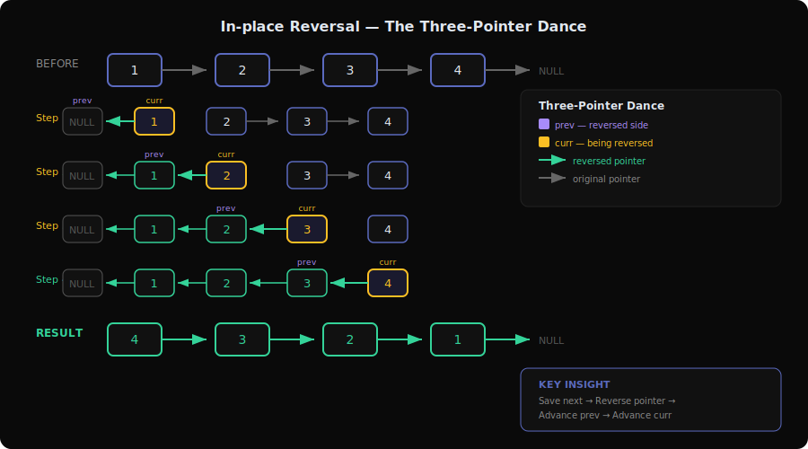
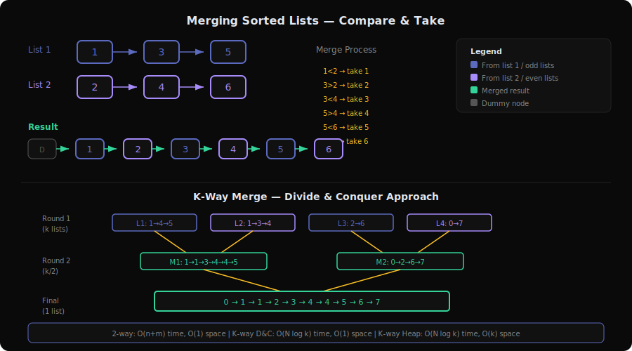
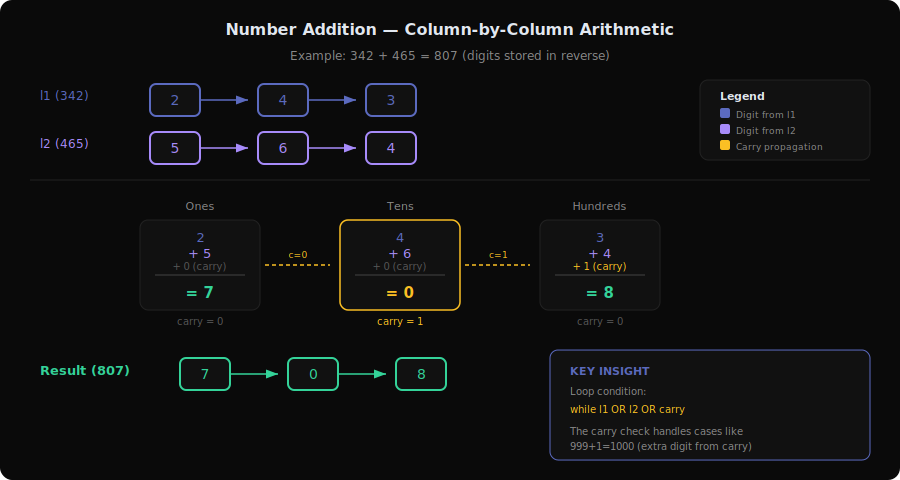
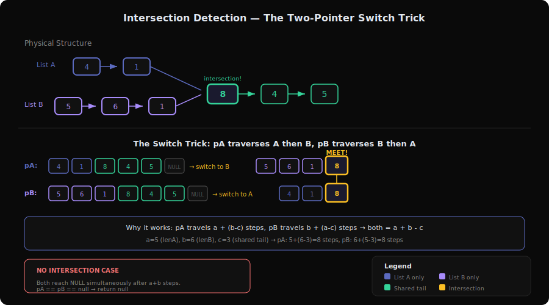
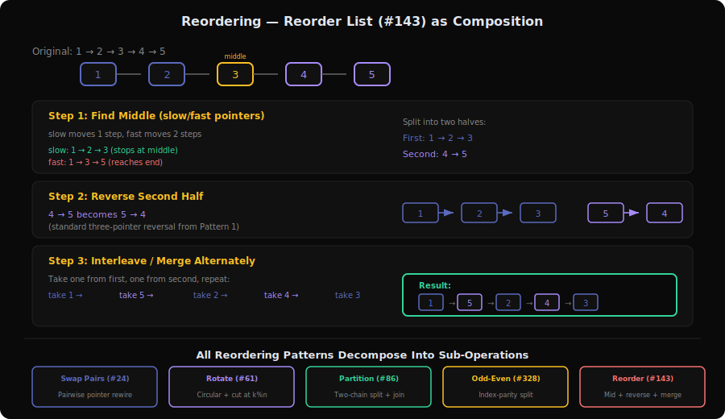

# Linked List Patterns Deep Dive

Linked lists are the data structure where **pointer manipulation is the algorithm**. Unlike arrays where you think about indices, here you think about rewiring `.next` pointers. Every linked list problem reduces to: who points to whom after the operation?

This document covers all 5 sub-patterns from `server/patterns.py` with 17 problems total.

---

## 1. In-place Reversal Pattern



**Problems**: 206 (Reverse Linked List), 92 (Reverse Linked List II), 25 (Reverse Nodes in k-Group), 82 (Remove Duplicates from Sorted List II), 83 (Remove Duplicates from Sorted List), 234 (Palindrome Linked List)

### What is it?

Think of a conga line where everyone suddenly turns around. Instead of person A holding person B's shoulders (A→B→C→D), you make each person grab the person *behind* them (D→C→B→A).

**Concrete example**: Reverse `1→2→3→NULL`

```
Step 0: prev=NULL, curr=1→2→3→NULL
Step 1: Save next=2. Point 1→NULL. Move: prev=1, curr=2→3→NULL
Step 2: Save next=3. Point 2→1→NULL. Move: prev=2→1, curr=3→NULL
Step 3: Save next=NULL. Point 3→2→1→NULL. Move: prev=3→2→1, curr=NULL
Done! Return prev = 3→2→1→NULL
```

### The Pointer Dance (Visualized)

```
Initial:  NULL   1 → 2 → 3 → NULL
          prev  curr

Step 1:   NULL ← 1   2 → 3 → NULL
          prev  curr next

          NULL ← 1   2 → 3 → NULL
                prev curr

Step 2:   NULL ← 1 ← 2   3 → NULL
                prev curr next

          NULL ← 1 ← 2   3 → NULL
                     prev curr

Step 3:   NULL ← 1 ← 2 ← 3   NULL
                     prev curr next

          NULL ← 1 ← 2 ← 3   NULL
                          prev curr=NULL → STOP
```

### Core Template (with walkthrough)

```
function reverse(head):
    prev = null           // The reversed portion starts empty
    curr = head           // Start at the beginning

    while curr != null:
        next_temp = curr.next   // 1. Save the next node (we're about to lose it)
        curr.next = prev        // 2. Reverse the pointer
        prev = curr             // 3. Advance prev
        curr = next_temp        // 4. Advance curr

    return prev               // prev is now the new head
```

**Why each line exists**:
- Line 1 (save next): Once we overwrite `curr.next`, we lose our path forward — must save it first
- Line 2 (reverse): The actual reversal — point backward instead of forward
- Lines 3-4 (advance): Slide the window forward by one node

### How to Recognize This Pattern

- "Reverse a linked list" or "reverse between positions"
- "Check if palindrome" (reverse second half, then compare)
- "Reverse in groups of k"
- Any problem where the output is the same nodes but in reversed order
- **Look for**: Problems asking you to change the direction of links without using extra space

### Key Insight / Trick

The **three-pointer dance**: `prev`, `curr`, `next_temp`. You always need all three because:
- `prev` is where you're pointing TO (the reversed side)
- `curr` is the node you're currently reversing
- `next_temp` saves your path forward before you break it

For **partial reversal** (like #92), you need two extra pointers: one to remember the node *before* the reversal starts (to reconnect the front), and one to remember the first node of the reversed portion (which becomes the *last* node after reversal, needing to connect to what comes after).

### Variations & Edge Cases

- **Full reversal** (#206): Straightforward three-pointer dance
- **Partial reversal** (#92): Find position `left`, reverse from `left` to `right`, reconnect the endpoints
- **k-Group reversal** (#25): Count k nodes, reverse the group, recursively handle the rest
- **Palindrome check** (#234): Find middle (slow/fast), reverse second half, compare
- **Duplicate removal** (#82, #83): Not strictly reversal but uses similar pointer surgery — skip nodes while `curr.val == curr.next.val`
- **Edge cases**: Single node, two nodes, empty list, all same values

### Questions Detail

| # | Title | Difficulty | Key Twist |
|---|-------|-----------|-----------|
| 206 | Reverse Linked List | Easy | The base case — pure three-pointer reversal. Can also be solved recursively: reverse the rest, then point `head.next.next = head` and `head.next = null`. |
| 92 | Reverse Linked List II | Medium | Partial reversal between positions `left` and `right`. The trick is saving the "connection points": the node before `left` and the node after `right`. Use a dummy head to handle the case where `left = 1`. |
| 25 | Reverse Nodes in k-Group | Hard | Combines counting + reversal + recursion. First check if k nodes exist, then reverse them, then recurse on the remainder. The tricky part is reconnecting each reversed group to the next group. |
| 82 | Remove Duplicates from Sorted List II | Medium | Delete ALL nodes that have duplicates (not just extra copies). Use a dummy head since the head itself might be a duplicate. Skip entire runs of same-value nodes. |
| 83 | Remove Duplicates from Sorted List | Easy | Keep one copy of each duplicate. Simpler than #82 — just skip `curr.next` when values match. No dummy head needed since the head is always kept. |
| 234 | Palindrome Linked List | Easy | Combines two patterns: find middle (slow/fast pointers), reverse second half, compare node by node. Optionally re-reverse to restore the list. |

---

## 2. Merging Sorted Lists Pattern



**Problems**: 21 (Merge Two Sorted Lists), 23 (Merge k Sorted Lists)

### What is it?

Imagine you're a card dealer with two sorted stacks of cards. You peek at the top card of each stack, take the smaller one, and place it in the output pile. Repeat until both stacks are empty.

**Concrete example**: Merge `1→3→5` and `2→4→6`

```
Compare 1 vs 2 → take 1.  Result: 1
Compare 3 vs 2 → take 2.  Result: 1→2
Compare 3 vs 4 → take 3.  Result: 1→2→3
Compare 5 vs 4 → take 4.  Result: 1→2→3→4
Compare 5 vs 6 → take 5.  Result: 1→2→3→4→5
Only 6 left    → take 6.  Result: 1→2→3→4→5→6
```

### The Merge Process (Visualized)

```
List1: 1 → 3 → 5 → NULL
       ↑
List2: 2 → 4 → 6 → NULL
       ↑
Dummy: D → ?

Step 1: 1 < 2, take 1.   D → 1
Step 2: 3 > 2, take 2.   D → 1 → 2
Step 3: 3 < 4, take 3.   D → 1 → 2 → 3
Step 4: 5 > 4, take 4.   D → 1 → 2 → 3 → 4
Step 5: 5 < 6, take 5.   D → 1 → 2 → 3 → 4 → 5
Step 6: append rest: 6.   D → 1 → 2 → 3 → 4 → 5 → 6

Return D.next = 1 → 2 → 3 → 4 → 5 → 6
```

### Core Template (with walkthrough)

```
function mergeTwoLists(l1, l2):
    dummy = new ListNode(0)    // Dummy head avoids edge cases
    tail = dummy               // Build from the tail

    while l1 != null AND l2 != null:
        if l1.val <= l2.val:
            tail.next = l1     // Take from list 1
            l1 = l1.next       // Advance list 1
        else:
            tail.next = l2     // Take from list 2
            l2 = l2.next       // Advance list 2
        tail = tail.next       // Advance tail

    tail.next = l1 OR l2       // Append whichever list remains
    return dummy.next          // Skip the dummy
```

**Why each line exists**:
- Dummy node: Without it, you'd need special logic for "which node becomes the new head?"
- `tail` pointer: We build the merged list by always appending to the end
- Final `tail.next = l1 OR l2`: One list will exhaust first; the other's remainder is already sorted

### How to Recognize This Pattern

- "Merge sorted lists" or "combine sorted sequences"
- Input is multiple sorted linked lists
- Output is a single sorted linked list
- **Look for**: The word "sorted" + "merge" in the problem statement

### Key Insight / Trick

The **dummy head node**. It eliminates all edge cases about which node becomes the head. You always return `dummy.next`.

For **k lists** (#23), don't merge them one-by-one (O(kN) time). Instead:
- **Min-heap approach**: Push the head of all k lists into a min-heap. Pop the smallest, add it to result, push its `.next` if it exists. O(N log k).
- **Divide and conquer**: Pair up lists and merge each pair, halving the count each round. O(N log k). This reuses the 2-list merge as a building block.

### Variations & Edge Cases

- **Two lists** (#21): Direct comparison merge, O(n+m)
- **k lists** (#23): Min-heap or divide-and-conquer, O(N log k)
- **Edge cases**: Empty lists, lists of different lengths, single-element lists
- Can also be solved recursively: `merge(l1, l2) = smaller node + merge(rest, other)`

### Questions Detail

| # | Title | Difficulty | Key Twist |
|---|-------|-----------|-----------|
| 21 | Merge Two Sorted Lists | Easy | The base merge operation. Use dummy head + tail pointer. Can be done iteratively or recursively. The iterative version is the building block for #23. |
| 23 | Merge k Sorted Lists | Hard | Scale from 2 to k lists. Naive pairwise merge is O(kN). Optimal: min-heap with (value, list_index) tuples gives O(N log k). Alternatively, divide-and-conquer merges pairs of lists in rounds, also O(N log k). The heap approach is more intuitive; D&C reuses the 2-list merge directly. |

---

## 3. Number Addition Pattern



**Problems**: 2 (Add Two Numbers), 369 (Plus One Linked List)

### What is it?

Remember adding numbers by hand in school? You line up the digits, add column by column from right to left, and carry the 1. Linked list addition is exactly that — except the digits are stored as nodes.

**Concrete example**: Add `342 + 465 = 807`
Lists store digits in reverse: `2→4→3` and `5→6→4`

```
Position 0: 2 + 5 = 7, carry 0  → Node(7)
Position 1: 4 + 6 = 10, carry 1 → Node(0)
Position 2: 3 + 4 + 1(carry) = 8, carry 0 → Node(8)
Result: 7→0→8 (which is 807)
```

### The Addition Process (Visualized)

```
  l1:  2 → 4 → 3 → NULL       (342)
  l2:  5 → 6 → 4 → NULL       (465)
carry: 0

Step 1: 2+5+0 = 7   carry=0   Result: 7
Step 2: 4+6+0 = 10  carry=1   Result: 7→0
Step 3: 3+4+1 = 8   carry=0   Result: 7→0→8
Both null, carry=0 → done!

Result: 7→0→8 = 807 ✓
```

### Core Template (with walkthrough)

```
function addTwoNumbers(l1, l2):
    dummy = new ListNode(0)
    curr = dummy
    carry = 0

    while l1 != null OR l2 != null OR carry != 0:
        sum = carry
        if l1 != null:
            sum += l1.val
            l1 = l1.next
        if l2 != null:
            sum += l2.val
            l2 = l2.next

        carry = sum / 10           // Integer division
        curr.next = new Node(sum % 10)  // Ones digit
        curr = curr.next

    return dummy.next
```

**Why each line exists**:
- `carry` in the loop condition: handles the case where `999 + 1 = 1000` — carry creates an extra digit
- Separate null checks: lists can be different lengths, so we add 0 when one runs out
- `sum % 10` and `sum / 10`: standard digit extraction from column addition

### How to Recognize This Pattern

- "Add two numbers represented as linked lists"
- "Plus one to a number represented as a linked list"
- Digits stored in nodes, need arithmetic result as a linked list
- **Look for**: Arithmetic operations on numbers stored node-by-node

### Key Insight / Trick

The **carry variable** and the loop condition `while l1 OR l2 OR carry`. The carry check handles the case where the sum creates a new most-significant digit (e.g., `99 + 1 = 100`).

For **reverse-order digits** (#2): Numbers are already aligned from least-significant digit, so you can process left to right naturally.

For **forward-order digits** (#369 Plus One): You either reverse the list first, add, then reverse back — OR use recursion (the call stack naturally reverses the traversal order, processing from the tail).

### Variations & Edge Cases

- **Reverse order** (#2): Most natural — process from head, carry forward
- **Forward order** (#369): Reverse first, or use recursion/stack
- **Different lengths**: The template handles this with separate null checks
- **Edge cases**: Both lists are `[0]`, carry at the end (`999 + 1`), one list much longer

### Questions Detail

| # | Title | Difficulty | Key Twist |
|---|-------|-----------|-----------|
| 2 | Add Two Numbers | Medium | Digits in reverse order (least significant first), which is actually easier — you process head-to-tail matching the natural addition order. The main pitfall is forgetting the final carry. |
| 369 | Plus One Linked List | Medium | (Premium) Digits in forward order (most significant first). You need to either reverse → add 1 → reverse, or find the rightmost non-9 digit (increment it and set all following 9s to 0). If all digits are 9, prepend a new node with value 1. |

---

## 4. Intersection Detection Pattern



**Problems**: 160 (Intersection of Two Linked Lists), 599 (Minimum Index Sum of Two Lists)

### What is it?

Imagine two roads that merge into one at some point. Cars on Road A and Road B eventually drive on the same road after the merge point. You need to find *where* the roads merge — not by GPS coordinates (values), but by the actual physical junction (node reference).

**Concrete example**:
```
List A: 4 → 1 ↘
                 8 → 4 → 5
List B: 5 → 6 → 1 ↗

Intersection at node 8 (same memory address, not just same value)
```

### The Two-Pointer Trick (Visualized)

```
lenA = 5, lenB = 6

Pointer pA starts at headA, pointer pB starts at headB.
When pA reaches null, redirect to headB.
When pB reaches null, redirect to headA.

pA: 4 → 1 → 8 → 4 → 5 → NULL → 5 → 6 → 1 → [8] ← MEET!
pB: 5 → 6 → 1 → 8 → 4 → 5 → NULL → 4 → 1 → [8] ← MEET!

Both travel lenA + lenB steps. They align at the intersection!
```

**Why does this work?** If list A has length `a` and list B has length `b`, and the shared tail has length `c`:
- pA travels: `a + (b - c)` steps to reach intersection
- pB travels: `b + (a - c)` steps to reach intersection
- Both equal `a + b - c` — they arrive at the same time!

### Core Template (with walkthrough)

```
function getIntersectionNode(headA, headB):
    if headA == null OR headB == null:
        return null

    pA = headA
    pB = headB

    while pA != pB:
        pA = headB if pA == null else pA.next   // Switch to other list at end
        pB = headA if pB == null else pB.next   // Switch to other list at end

    return pA   // Either the intersection node or null (both reach null together)
```

**Why each line exists**:
- Switch at null (not at last node): If we switched at the last node, we'd skip the null case
- Both pointers travel the same total distance: `lenA + lenB` steps
- If no intersection: both reach null simultaneously after `lenA + lenB` steps

### How to Recognize This Pattern

- "Find where two linked lists intersect/merge"
- "Common elements between two lists with minimum index"
- Two sequences that share a common suffix
- **Look for**: Two separate structures that converge at some point

### Key Insight / Trick

The **length-equalizing trick**. By having each pointer traverse both lists, you eliminate the length difference. After switching lists, both pointers are guaranteed to be the same distance from the intersection point (or from null if there's no intersection).

Alternative approaches (less elegant):
- **Hash set**: Store all nodes of list A in a set, walk list B checking membership. O(n+m) time, O(n) space.
- **Length difference**: Calculate both lengths, advance the longer list's pointer by the difference, then walk together. O(n+m) time, O(1) space.

### Variations & Edge Cases

- **Physical intersection** (#160): Two linked lists share the same tail nodes (by reference)
- **Value-based intersection** (#599): Find common elements with minimum index sum — use a hash map
- **Edge cases**: No intersection (disjoint lists), intersection at the head, one list is a subset of the other, lists of equal length

### Questions Detail

| # | Title | Difficulty | Key Twist |
|---|-------|-----------|-----------|
| 160 | Intersection of Two Linked Lists | Easy | Find the node where two lists physically converge (same reference, not just same value). The elegant solution uses the two-pointer switch trick. O(n+m) time, O(1) space. Must not modify the lists. |
| 599 | Minimum Index Sum of Two Lists | Easy | Not actually a linked list problem despite the category — it's about two string arrays. Find common strings with minimum `i + j`. Use a hash map: store list1's strings→indices, iterate list2 checking for matches and tracking minimum sum. O(n+m) time. |

---

## 5. Reordering Pattern



**Problems**: 24 (Swap Nodes in Pairs), 61 (Rotate List), 86 (Partition List), 143 (Reorder List), 328 (Odd Even Linked List)

### What is it?

Think of rearranging a line of people. Instead of just reversing the line, you're doing specific rearrangements: interleaving from both ends, swapping neighbors, grouping by a criteria, or rotating the line.

**Concrete example — Reorder List (#143)**: `1→2→3→4→5`

```
Step 1: Find middle → 1→2→3 | 4→5
Step 2: Reverse second half → 1→2→3 | 5→4
Step 3: Interleave → 1→5→2→4→3
```

### The Reorder Process (Visualized)

```
Original:  1 → 2 → 3 → 4 → 5

Find middle (slow/fast):
  slow: 1, 2, 3 (stops here)
  fast: 1, 3, 5

Split:  1 → 2 → 3    4 → 5
                ↑ cut here

Reverse 2nd:  1 → 2 → 3    5 → 4

Interleave:
  Take from first:  1 →
  Take from second: 1 → 5 →
  Take from first:  1 → 5 → 2 →
  Take from second: 1 → 5 → 2 → 4 →
  Take from first:  1 → 5 → 2 → 4 → 3

Result: 1 → 5 → 2 → 4 → 3  ✓
```

### Core Template: Swap Pairs (with walkthrough)

```
function swapPairs(head):
    dummy = new ListNode(0)
    dummy.next = head
    prev = dummy

    while prev.next != null AND prev.next.next != null:
        first = prev.next          // The first node to swap
        second = prev.next.next    // The second node to swap

        // Perform the swap
        first.next = second.next   // first points past second
        second.next = first        // second points to first
        prev.next = second         // prev points to second (now first in pair)

        prev = first               // Move past the swapped pair

    return dummy.next
```

### Core Template: Partition (with walkthrough)

```
function partition(head, x):
    before_dummy = new ListNode(0)   // List for nodes < x
    after_dummy = new ListNode(0)    // List for nodes >= x
    before = before_dummy
    after = after_dummy

    while head != null:
        if head.val < x:
            before.next = head
            before = before.next
        else:
            after.next = head
            after = after.next
        head = head.next

    after.next = null              // CRITICAL: terminate the after list
    before.next = after_dummy.next // Connect before list to after list
    return before_dummy.next
```

**Why `after.next = null`?** Without it, the last node in the `after` list might still point to a node in the `before` list, creating a cycle.

### How to Recognize This Pattern

- "Reorder", "rearrange", "rotate", or "partition" a linked list
- "Swap nodes in pairs" or "group by odd/even indices"
- The output has the same nodes but in a different structural arrangement
- **Look for**: Problems where the nodes don't change value — only their ordering/connections change

### Key Insight / Trick

Most reordering problems decompose into **2-3 sub-operations** you already know:

| Problem | Sub-operations |
|---------|---------------|
| Reorder List (#143) | Find middle + Reverse second half + Merge/interleave |
| Swap Pairs (#24) | Pointer rewiring in groups of 2 (mini-reversal) |
| Rotate (#61) | Find length + Make circular + Cut at new position |
| Partition (#86) | Two-list split + Concatenate |
| Odd-Even (#328) | Two-list split by index parity + Concatenate |

The **dummy node** appears again in almost every variation — it handles the "what if the head changes?" edge case.

### Variations & Edge Cases

- **Pairwise swap** (#24): Swap adjacent pairs — essentially k-group reversal with k=2
- **Rotation** (#61): `k % length` handles k > length. Make the list circular, then cut at the right position
- **Partition** (#86): Two separate chains (before/after x), then concatenate. Critical: null-terminate the second chain
- **Interleave** (#143): Find middle → reverse second half → merge alternately
- **Index-based split** (#328): Separate odd-indexed and even-indexed nodes, then concatenate
- **Edge cases**: Empty list, single node, two nodes, k=0 for rotation, all nodes same value for partition

### Questions Detail

| # | Title | Difficulty | Key Twist |
|---|-------|-----------|-----------|
| 24 | Swap Nodes in Pairs | Medium | Swap every two adjacent nodes. Use a dummy head and `prev` pointer. The swap involves three pointer reassignments per pair. This is #25 (k-group) with k=2. |
| 61 | Rotate List | Medium | Rotate right by k. The trick: `k = k % length` (handles k > length). Make the list circular by connecting tail to head, then walk `length - k` steps from head to find the new tail. Cut there. |
| 86 | Partition List | Medium | Split into two lists: nodes < x and nodes >= x, preserving relative order within each group. Use two dummy heads as anchors. The critical step everyone forgets: set `after.next = null` to prevent cycles. |
| 143 | Reorder List | Medium | Interleave from both ends: L0→Ln→L1→Ln-1→... Combines three patterns: (1) find middle with slow/fast, (2) reverse the second half, (3) merge the two halves alternately. A beautiful composition problem. |
| 328 | Odd Even Linked List | Medium | Group odd-indexed nodes before even-indexed nodes. Maintain two pointers (odd, even) and an `evenHead` reference. Wire odd nodes together, wire even nodes together, then connect `odd.next = evenHead`. O(1) space required. |

---

## Pattern Comparison Table

| Aspect | In-place Reversal | Merging Sorted | Number Addition | Intersection Detection | Reordering |
|--------|-------------------|---------------|-----------------|----------------------|------------|
| Core operation | Reverse `.next` pointers | Compare-and-take smallest | Column-by-column arithmetic | Length equalization | Split + reconnect |
| Key variables | `prev`, `curr`, `next` | `dummy`, `tail` | `carry`, `sum` | `pA`, `pB` (two pointers) | `dummy`, multiple chain heads |
| Dummy node? | Sometimes (#92) | Always | Always | No | Almost always |
| Time complexity | O(n) | O(n) or O(N log k) | O(max(m,n)) | O(m+n) | O(n) |
| Space complexity | O(1) | O(1) or O(k) for heap | O(max(m,n)) for result | O(1) | O(1) |
| Common mistake | Forgetting to save `next` | Not handling unequal lengths | Forgetting final carry | Switching at last node vs null | Not null-terminating split chains |
| Pattern trigger | "reverse", "palindrome" | "merge sorted" | "add numbers", "plus one" | "intersection", "common" | "reorder", "swap", "rotate", "partition" |

---

## The Linked List Toolkit — Universal Techniques

These techniques appear across multiple sub-patterns:

### 1. Dummy/Sentinel Node
Creates a fake head node so you never have to special-case "what if the head changes?"
```
dummy = new ListNode(0)
dummy.next = head
// ... do work ...
return dummy.next
```
Used in: Merging, Reversal (#92), Partition, Swap Pairs

### 2. Slow/Fast Pointers (Floyd's Tortoise & Hare)
Find the middle of a list in one pass:
```
slow = head, fast = head
while fast != null AND fast.next != null:
    slow = slow.next
    fast = fast.next.next
// slow is now at the middle
```
Used in: Palindrome check (#234), Reorder List (#143), Cycle detection

### 3. Two-List Split
Split one list into two based on a condition, then reconnect:
```
chain_a, chain_b = dummy_a, dummy_b
for each node:
    if condition: append to chain_a
    else: append to chain_b
chain_b.next = null  // ALWAYS null-terminate!
chain_a.next = chain_b_head
```
Used in: Partition (#86), Odd-Even (#328)

### 4. In-place Pointer Reversal
The three-pointer dance (`prev`, `curr`, `next`) for O(1) space reversal.
Used in: All reversal variants, palindrome check, reorder list

---

## Code References

- `server/patterns.py:105-111` — Linked List category definition with all 5 sub-patterns
- `server/patterns.py:362-367` — Reverse lookup (problem number → pattern)
- `server/main.py:307-369` — API endpoint for pattern data
- `extension/patterns.js` — Client-side pattern labels
