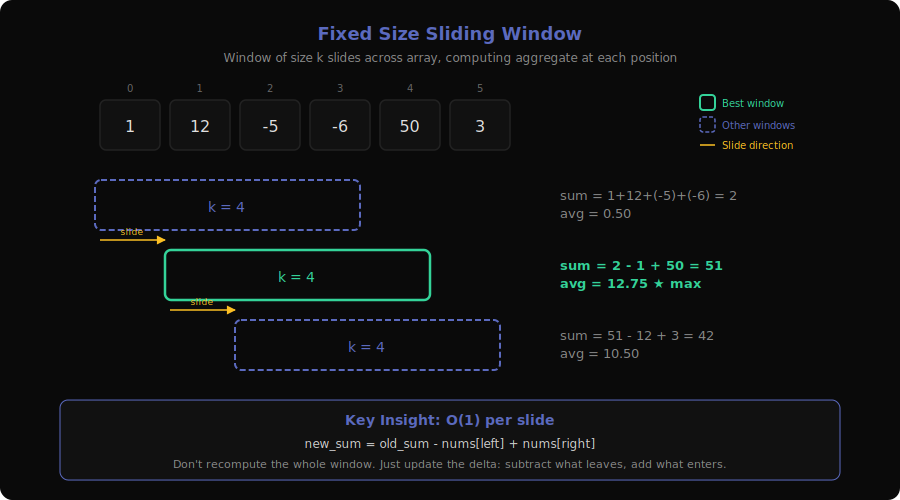
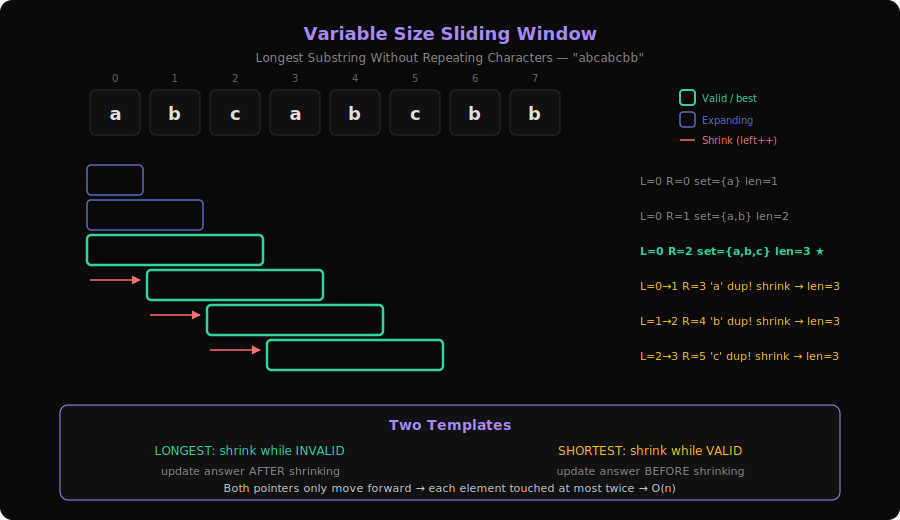
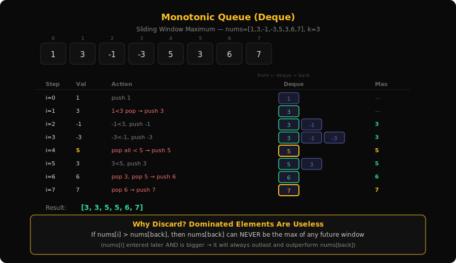
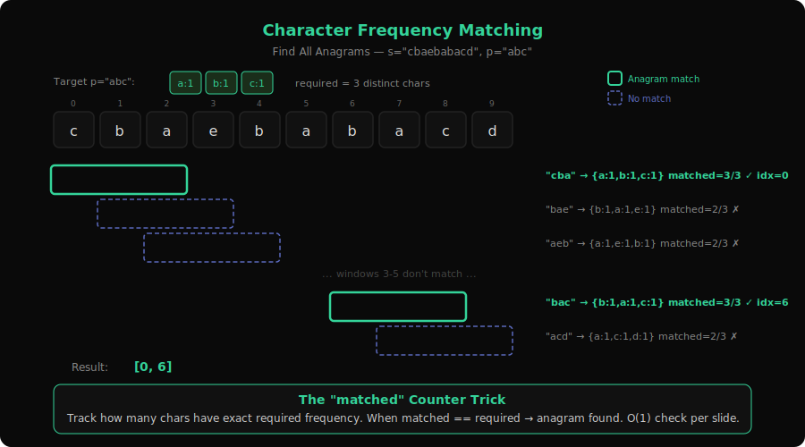

# Research: Sliding Window Patterns Deep Dive

**Date**: 2026-03-09
**Researcher**: claude
**Git Commit**: 3fca422
**Branch**: main
**Repository**: idea1

## What is a Sliding Window?

A sliding window is a technique where you maintain a **contiguous subarray/substring** over a sequence, adjusting its boundaries to satisfy some constraint or optimize some value.

**Real-world analogy**: Imagine looking through a train window. As the train moves, the scenery you see changes — but you're always looking at a **continuous segment** of the landscape. The window can be a fixed width (like a real train window), or you might stretch and shrink it (like pulling a curtain open or closed) to find the best view.

**Why it matters**: Brute force checks every subarray → O(n²) or O(n³). A sliding window visits each element at most twice (once when the right pointer expands, once when the left pointer contracts) → O(n).

**The Two Types**:
| Type | Window Size | Left Pointer | Example |
|------|------------|-------------|---------|
| Fixed Size | Always k | Moves in lockstep with right | Max average of k elements |
| Variable Size | Grows/shrinks | Moves when constraint violated | Longest substring without repeats |

**Core invariant**: At every step, the window `[left, right]` represents a valid state. When expanding breaks the invariant, contract from the left until it's valid again.

---

## 1. Fixed Size Window Pattern



**Problems**: 346 (Moving Average from Data Stream), 643 (Maximum Average Subarray I), 2985 (Calculate Delayed Arrival Time), 3254 (Find the Power of K-Size Subarrays I), 3318 (Find X-Sum of All K-Long Subarrays I)

### What is it?

You have an array and a window of exactly size `k`. Slide this window one element at a time from left to right, computing something (max, avg, sum) for each position.

**Real-world analogy**: A 7-day moving average of stock prices. Every day, you drop the oldest day and add the newest, keeping the window exactly 7 days wide.

**Example**: Find the maximum average subarray of length k=4 in `[1, 12, -5, -6, 50, 3]`

```
Window [0..3]: [1, 12, -5, -6]  → sum = 2    → avg = 0.50
Window [1..4]: [12, -5, -6, 50] → sum = 51   → avg = 12.75  ← maximum!
Window [2..5]: [-5, -6, 50, 3]  → sum = 42   → avg = 10.50
```

The trick: instead of recalculating the sum from scratch each time, you subtract the element leaving the window and add the element entering it:

```
sum = 2
sum = 2 - nums[0] + nums[4] = 2 - 1 + 50 = 51
sum = 51 - nums[1] + nums[5] = 51 - 12 + 3 = 42
```

### The Sliding Process (Visualized)

```
Array:   [1,  12,  -5,  -6,  50,  3]
          ↑               ↑
          L               R        sum=2, avg=0.5

Array:   [1,  12,  -5,  -6,  50,  3]
              ↑               ↑
              L               R    sum=51, avg=12.75 ✓ max

Array:   [1,  12,  -5,  -6,  50,  3]
                   ↑               ↑
                   L               R   sum=42, avg=10.5
```

### Core Template (with walkthrough)

```
function fixedWindow(nums, k):
    // 1. Build the first window
    windowSum = sum of nums[0..k-1]
    best = windowSum

    // 2. Slide: remove leftmost, add rightmost
    for right = k to n-1:
        windowSum += nums[right]          // add incoming element
        windowSum -= nums[right - k]      // remove outgoing element
        best = max(best, windowSum)        // update answer

    return best
```

**Line-by-line**:
- Lines 2-3: Initialize by computing the first window in O(k)
- Line 6: `right` starts at k because we already processed indices 0..k-1
- Line 7: The element entering the window is `nums[right]`
- Line 8: The element leaving is `nums[right - k]` (k positions behind the right end)
- Line 9: Update the answer after each slide

### How to Recognize This Pattern

- "**subarray of size k**" or "**window of size k**" is literally stated
- "Moving average", "rolling sum", "K consecutive elements"
- The window size **never changes** — it's always k
- You're asked for min/max/sum/count over **every** window position
- "Look for: fixed size k + slide + update answer each step"

### Key Insight / Trick

**The O(1) slide**: Instead of recomputing the window aggregate from scratch (O(k) per step → O(nk) total), you incrementally update by subtracting what leaves and adding what enters. This converts O(nk) → O(n).

For more complex aggregates (like count of distinct elements), maintain a hash map and update it ±1 on each slide.

### Variations & Edge Cases

- **Aggregate type**: Sum, count, distinct count, product — each needs different state tracking
- **Edge case**: k > n → only one or zero windows exist
- **Optimization**: For min/max over fixed windows, a simple variable isn't enough — use a **monotonic deque** (see Pattern 3)
- **2D windows**: Fixed-size submatrices — prefix sums often better than sliding window

### Questions Detail

| # | Title | Difficulty | Key Twist |
|---|-------|-----------|-----------|
| 346 | Moving Average from Data Stream | Easy | Stream-based: maintain a queue of size k, pop front and push back. Classic introduction to fixed-size windows as a data structure (premium). |
| 643 | Maximum Average Subarray I | Easy | The textbook fixed-size window problem. Slide a window of size k, track running sum, divide by k at the end. No tricks, pure pattern. |
| 2985 | Calculate Delayed Arrival Time | Easy | Arithmetic problem (modular clock math). Listed in fixed-size but is actually a math problem, not a sliding window. |
| 3254 | Find the Power of K-Size Subarrays I | Medium | Check if each k-size window contains consecutive elements and is sorted. Requires tracking whether the window is "consecutive" — an incremental check on each slide. |
| 3318 | Find X-Sum of All K-Long Subarrays I | Medium | Maintain the top-x most frequent elements in each k-size window. Combines fixed-size sliding with a frequency map and a secondary selection (top-x by frequency). More complex state management. |

---

## 2. Variable Size Window Pattern



**Problems**: 3 (Longest Substring Without Repeating Characters), 76 (Minimum Window Substring), 209 (Minimum Size Subarray Sum), 219 (Contains Duplicate II), 424 (Longest Repeating Character Replacement), 713 (Subarray Product Less Than K), 904 (Fruit Into Baskets), 1004 (Max Consecutive Ones III), 1438 (Longest Continuous Subarray With Absolute Diff ≤ Limit), 1493 (Count Number of Nice Subarrays), 1658 (Minimum Operations to Reduce X to Zero), 1838, 2461, 2516, 2762, 2779, 2981, 3026, 3346, 3347

### What is it?

You want to find the **longest** (or **shortest**) contiguous subarray/substring that satisfies some condition. The window expands when the condition holds, and contracts when it's violated.

**Real-world analogy**: Imagine stretching a rubber band between two fingers on a ruler. You keep stretching the right finger forward as long as the tension (constraint) holds. When the rubber band is about to snap (constraint violated), you pull the left finger forward to release tension.

**Example**: Find the longest substring without repeating characters in `"abcabcbb"`

```
Step 1: "a"        → {a}      → len=1
Step 2: "ab"       → {a,b}    → len=2
Step 3: "abc"      → {a,b,c}  → len=3  ← best so far
Step 4: "abca"     → 'a' repeats! → shrink from left
        → remove 'a', window becomes "bca" → {b,c,a} → len=3
Step 5: "bcab"     → 'b' repeats! → shrink
        → remove 'b', window becomes "cab" → {c,a,b} → len=3
Step 6: "cabc"     → 'c' repeats! → shrink
        → remove 'c', window becomes "abc" → {a,b,c} → len=3
Step 7: "abcb"     → 'b' repeats! → shrink
        → remove 'a', "bcb" still has repeat → remove 'b', → "cb" → len=2
Step 8: "cbb"      → 'b' repeats! → shrink → "b" → len=1

Answer: 3
```

### The Expand/Shrink Process (Visualized)

```
"a b c a b c b b"
 L R                 window="a"     set={a}           len=1
 L   R               window="ab"    set={a,b}         len=2
 L     R             window="abc"   set={a,b,c}       len=3 ✓
 L       R           'a' dup! →
   L     R           window="bca"   set={b,c,a}       len=3 ✓
   L       R         'b' dup! →
     L     R         window="cab"   set={c,a,b}       len=3 ✓
     L       R       'c' dup! →
       L     R       window="abc"   set={a,b,c}       len=3 ✓
       L       R     'b' dup! →
         L     R     "bcb" → still dup! →
           L   R     window="cb"    set={c,b}         len=2
           L     R   'b' dup! →
             L   R   window="b"     set={b}           len=1
```

### Core Template (with walkthrough)

**Template 1: Longest window satisfying condition**
```
function longestWindow(s):
    left = 0
    best = 0
    state = {}  // track window state (freq map, set, etc.)

    for right = 0 to n-1:
        // 1. Expand: add s[right] to state
        state.add(s[right])

        // 2. Shrink: while window is INVALID, contract from left
        while not isValid(state):
            state.remove(s[left])
            left++

        // 3. Update: window [left..right] is valid
        best = max(best, right - left + 1)

    return best
```

**Template 2: Shortest window satisfying condition**
```
function shortestWindow(nums, target):
    left = 0
    best = infinity
    windowSum = 0

    for right = 0 to n-1:
        // 1. Expand
        windowSum += nums[right]

        // 2. Shrink: while window is VALID, try to minimize
        while windowSum >= target:
            best = min(best, right - left + 1)
            windowSum -= nums[left]
            left++

    return best == infinity ? 0 : best
```

**The critical difference**: For **longest**, you shrink when invalid (and update after shrinking). For **shortest**, you shrink while valid (and update before shrinking).

### How to Recognize This Pattern

- "Longest/shortest **subarray** or **substring**" satisfying a condition
- "At most K distinct", "at most K flips/replacements"
- "Minimum length subarray with sum ≥ target"
- The constraint involves a **contiguous** sequence
- Two pointers both moving left-to-right (never backwards)
- "Look for: contiguous + optimize length + constraint on window content"

### Key Insight / Trick

**Both pointers only move forward**. This is what makes it O(n). Each element is added once (when right reaches it) and removed at most once (when left passes it). Total work = at most 2n operations.

The state tracking structure depends on the constraint:
- **No duplicates** → HashSet or frequency map (count > 1 means invalid)
- **Sum ≥ target** → running sum variable
- **At most K distinct** → frequency map + distinct counter
- **At most K replacements** → freq map + `(windowLen - maxFreq) ≤ k`

### Variations & Edge Cases

- **"At most K" → "Exactly K"**: Use the trick `exactly(K) = atMost(K) - atMost(K-1)`
- **"Minimum ops from both ends"** (LC 1658): Invert the problem — find the longest **middle** subarray with sum = totalSum - x
- **Products**: Multiply on expand, divide on shrink (only works with positive numbers)
- **Edge**: Empty array, k=0, all elements same, entire array is valid

### Questions Detail

| # | Title | Difficulty | Key Twist |
|---|-------|-----------|-----------|
| 3 | Longest Substring Without Repeating Characters | Medium | The classic variable window problem. Use a hash set/map. When a duplicate enters, shrink until it's removed. Optimization: jump `left` directly to `lastSeen[char] + 1` instead of shrinking one-by-one. |
| 76 | Minimum Window Substring | Hard | **Shortest** window containing all characters of t. Need a frequency map matching requirement + a `formed` counter tracking how many characters are fully matched. Shrink while valid to minimize. |
| 209 | Minimum Size Subarray Sum | Medium | Shortest subarray with sum ≥ target. All positive numbers so the sum is monotonic — shrink while valid. Clean template-2 application. Follow-up asks for O(n log n) with binary search on prefix sums. |
| 219 | Contains Duplicate II | Easy | Fixed-size window disguised as variable. Maintain a hash set of elements in the window of size k. Slide and check if the incoming element is already in the set. |
| 424 | Longest Repeating Character Replacement | Medium | Track frequency of each char in window. Window is valid when `windowLen - maxFreq ≤ k` (the non-max chars can be "replaced"). Key subtlety: maxFreq doesn't need to decrease on shrink — it only grows, which is safe for finding the maximum window. |
| 713 | Subarray Product Less Than K | Medium | Count subarrays (not just find one). Expand right, shrink left until product < k. Each valid position of right contributes `right - left + 1` new subarrays. Uses multiplication/division instead of addition/subtraction. |
| 904 | Fruit Into Baskets | Medium | Longest subarray with at most 2 distinct values. Fancy wording ("fruit trees", "baskets") but it's just a "at most K distinct" window with K=2. Use a frequency map. |
| 1004 | Max Consecutive Ones III | Medium | Longest subarray of 1s if you can flip at most k zeros. Track zero count in window. Shrink when zeroCount > k. Equivalent to "longest subarray with at most k zeros". |
| 1438 | Longest Continuous Subarray With Absolute Diff ≤ Limit | Medium | Need max AND min of window simultaneously. A simple variable won't track these under shrinks. Use **two monotonic deques** (one for max, one for min) or a sorted structure. Shrink when `max - min > limit`. |
| 1493 | Count Number of Nice Subarrays | Medium | Count subarrays with exactly k odd numbers. Use the "exactly K = atMost(K) - atMost(K-1)" trick, or use a prefix-count approach. |
| 1658 | Minimum Operations to Reduce X to Zero | Medium | Inversion trick! Removing from both ends to get sum x ↔ finding the **longest middle subarray** with sum = totalSum - x. Classic variable window once you reframe it. |

---

## 3. Monotonic Queue Pattern



**Problems**: 239 (Sliding Window Maximum), 862 (Shortest Subarray with Sum at Least K), 1696 (Jump Game VI)

### What is it?

A monotonic queue (deque) maintains elements in sorted order within a sliding window, enabling O(1) access to the min or max at any point. Elements that can never be useful are eagerly discarded.

**Real-world analogy**: Imagine a basketball team picking a starting lineup from a roster that changes as players join and leave. When LeBron James joins, you can immediately cut everyone shorter and slower — they'll never be picked while LeBron is on the roster. The remaining players are kept in height order. The tallest (front of deque) is always your pick.

**Example**: Find the max in every window of size k=3 in `[1, 3, -1, -3, 5, 3, 6, 7]`

```
Deque stores INDICES, but we think in values.
Invariant: deque is monotonically DECREASING (front = max).

i=0, val=1:  deque=[1]          (add 1)
i=1, val=3:  deque=[3]          (3 > 1, pop 1, add 3)
i=2, val=-1: deque=[3, -1]      (−1 < 3, add to back)
             Window [0..2] → max = front = 3 ✓

i=3, val=-3: deque=[3, -1, -3]  (−3 < −1, add)
             Index 0 is out of window? Yes → pop front
             deque=[-1, -3]     Wait — 3 is index 1, still in window [1..3]
             deque=[3, -1, -3]  → max = 3 ✓

i=4, val=5:  Pop -3, pop -1, pop 3 (all < 5)
             deque=[5]          → max = 5 ✓

i=5, val=3:  deque=[5, 3]       → max = 5 ✓
i=6, val=6:  Pop 3, pop 5. deque=[6] → max = 6 ✓
i=7, val=7:  Pop 6. deque=[7]   → max = 7 ✓

Result: [3, 3, 5, 5, 6, 7]
```

### The Monotonic Deque (Visualized)

```
Processing [1, 3, -1, -3, 5, 3, 6, 7] with k=3

Step    Element   Deque (front→back)    Action              Window Max
─────   ───────   ──────────────────    ──────              ──────────
i=0     1         [1]                   push 1              —
i=1     3         [3]                   1<3, pop; push 3    —
i=2     -1        [3, -1]              push -1              3
i=3     -3        [3, -1, -3]          push -3              3
i=4     5         [5]                   pop all < 5          5
i=5     3         [5, 3]               push 3               5
i=6     6         [6]                   pop all < 6          6
i=7     7         [7]                   pop all < 7; 6 OOW  7
```

### Core Template (with walkthrough)

```
function slidingWindowMax(nums, k):
    deque = []        // stores indices, not values
    result = []

    for i = 0 to n-1:
        // 1. Remove elements outside the window
        while deque not empty AND deque.front() <= i - k:
            deque.popFront()

        // 2. Remove elements smaller than current (they'll never be max)
        while deque not empty AND nums[deque.back()] <= nums[i]:
            deque.popBack()

        // 3. Add current index
        deque.pushBack(i)

        // 4. Record result once we have a full window
        if i >= k - 1:
            result.append(nums[deque.front()])

    return result
```

**Why it works**:
- Step 2 is the key: if `nums[i]` is bigger than elements at the back of the deque, those back elements will **never** be the maximum of any future window (because `nums[i]` entered later and is bigger). So discard them.
- The deque always contains indices in increasing order, with values in **decreasing** order. The front is always the maximum.
- Step 1 ensures we don't include elements that have slid out of the window.

### How to Recognize This Pattern

- "**Maximum/minimum** in every window of size k" → monotonic deque
- Sliding window + need O(1) access to min or max within the window
- A problem that combines DP + sliding window (like Jump Game VI)
- "Shortest subarray with sum ≥ K" with **negative numbers** (can't use simple two-pointer)
- "Look for: sliding window + need running max/min efficiently"

### Key Insight / Trick

**The deque is a "lazy sorted structure"**. Unlike a heap (which maintains ALL elements in order), the deque eagerly throws away elements that are dominated — an element at the back that's smaller than a newer element will never be the answer, so why keep it? This makes every operation amortized O(1).

**For min-queue**: Flip the comparison — keep the deque **monotonically increasing** (front = min).

**Amortized O(1)**: Each element enters the deque once and leaves once. Over n elements, total operations = O(n). Per element = O(1) amortized.

### Variations & Edge Cases

- **Min-deque**: Same structure but keep increasing order (pop back if `nums[back] >= nums[i]`)
- **Both min AND max**: Use two deques simultaneously (see LC 1438 — Variable Size pattern)
- **DP optimization**: If `dp[i] = max(dp[j] for j in [i-k, i-1]) + cost[i]`, use a monotonic deque over dp values to make it O(n)
- **Prefix sums + monotonic deque** (LC 862): For subarrays with sum ≥ K with negatives, use prefix sums then find shortest `j - i` where `prefix[j] - prefix[i] ≥ K`

### Questions Detail

| # | Title | Difficulty | Key Twist |
|---|-------|-----------|-----------|
| 239 | Sliding Window Maximum | Hard | The textbook monotonic deque problem. Maintain a decreasing deque of indices. Pop front if out of window, pop back if smaller than current. Front is always the window max. O(n) time. |
| 862 | Shortest Subarray with Sum at Least K | Hard | Can't use simple two-pointer because of **negative numbers** (sum isn't monotonic). Instead: compute prefix sums, then use a monotonic deque to find the shortest `j - i` where `prefix[j] - prefix[i] ≥ k`. The deque keeps prefix sums in increasing order — we can pop front when the condition is met (any future j would give a longer subarray), and pop back when current prefix is smaller (a smaller prefix at a later index is always better as a start point). |
| 1696 | Jump Game VI | Medium | DP + monotonic deque. `dp[i] = nums[i] + max(dp[i-k..i-1])`. Without optimization, checking the max over k elements is O(k) per step → O(nk). A max-deque over dp values makes the max lookup O(1) amortized, giving O(n) total (premium). |

---

## 4. Character Frequency Matching Pattern



**Problems**: 1 (Two Sum), 438 (Find All Anagrams in a String), 567 (Permutation in String)

### What is it?

You slide a fixed-size window over a string and check if the character frequencies in the window **match** the frequencies of a target pattern. It's a specialized combination of fixed-size window + frequency counting.

**Real-world analogy**: Imagine you have a combination lock with letters instead of numbers. You know the lock uses the letters A, B, C (in any order). You slide a 3-letter magnifying glass across a long string, checking if the three visible letters are exactly {A, B, C} — an anagram of your key.

**Example**: Find all anagram positions of `p = "abc"` in `s = "cbaebabacd"`

```
Target freq: {a:1, b:1, c:1}

Window "cba" [0..2]: {c:1, b:1, a:1} → match! ✓ → index 0
Window "bae" [1..3]: {b:1, a:1, e:1} → no match
Window "aeb" [2..4]: {a:1, e:1, b:1} → no match
Window "eba" [3..5]: {e:1, b:1, a:1} → no match
Window "bab" [4..6]: {b:2, a:1}      → no match
Window "aba" [5..7]: {a:2, b:1}      → no match
Window "bac" [6..8]: {b:1, a:1, c:1} → match! ✓ → index 6
Window "acd" [7..9]: {a:1, c:1, d:1} → no match

Result: [0, 6]
```

### The Matching Process (Visualized)

```
s: "c b a e b a b a c d"
    0 1 2 3 4 5 6 7 8 9

p: "abc" → need = {a:1, b:1, c:1}

Window [0..2] "cba":  have={c:1,b:1,a:1}  matched=3/3 ✓ → output 0
       Slide: remove s[0]='c', add s[3]='e'
Window [1..3] "bae":  have={b:1,a:1,e:1}  matched=2/3 ✗
       Slide: remove s[1]='b', add s[4]='b'
Window [2..4] "aeb":  have={a:1,e:1,b:1}  matched=2/3 ✗
       ...
Window [6..8] "bac":  have={b:1,a:1,c:1}  matched=3/3 ✓ → output 6
```

### Core Template (with walkthrough)

```
function findAnagrams(s, p):
    if len(p) > len(s): return []

    need = frequency map of p       // target frequencies
    have = {}                        // window frequencies
    matched = 0                      // count of chars with matching frequency
    required = count of distinct chars in need
    result = []

    for right = 0 to len(s)-1:
        // 1. Add character entering window
        char = s[right]
        have[char]++
        if have[char] == need[char]:
            matched++                // this char is now fully matched

        // 2. Remove character leaving window (once window exceeds size p)
        if right >= len(p):
            leftChar = s[right - len(p)]
            if have[leftChar] == need[leftChar]:
                matched--            // about to break this char's match
            have[leftChar]--

        // 3. Check if all characters match
        if matched == required:
            result.append(right - len(p) + 1)

    return result
```

**Why the `matched` counter**: Comparing two frequency maps each step is O(26) or O(alphabet). The `matched` counter gives O(1) checks — only update it when a character's count crosses the "exactly right" threshold.

### How to Recognize This Pattern

- "**Anagram**" or "**permutation**" of a string as a substring
- "Check if any rearrangement of pattern exists in text"
- Fixed-size window (size = len(pattern)) + character counting
- The order of characters doesn't matter, only their frequencies
- "Look for: substring/permutation match + frequency comparison"

### Key Insight / Trick

**The `matched` counter avoids O(26) comparisons per step**. Instead of comparing two entire frequency maps, you track how many characters have reached their required frequency. When `matched == required` (number of distinct chars in pattern), the window is an anagram.

Two key transitions:
- `have[c]` goes from `need[c]-1` to `need[c]` → increment `matched`
- `have[c]` goes from `need[c]` to `need[c]-1` → decrement `matched`

### Variations & Edge Cases

- **Boolean vs list**: LC 567 asks "does a permutation exist?" (return at first match). LC 438 asks "find all positions" (continue sliding)
- **Case sensitivity**: Some problems mix uppercase/lowercase
- **Large alphabet**: If characters aren't just lowercase a-z, use a hash map instead of a size-26 array
- **Optimization**: Use a size-26 array instead of a hash map for lowercase-only strings — it's faster and avoids hash overhead

### Questions Detail

| # | Title | Difficulty | Key Twist |
|---|-------|-----------|-----------|
| 438 | Find All Anagrams in a String | Medium | The defining problem for this pattern. Slide a window of size `len(p)` over `s`, comparing character frequencies. Use the `matched` counter for O(1) per-step checks. Return all starting indices where frequencies match. |
| 567 | Permutation in String | Medium | Identical to 438 but return `true/false` instead of a list of indices. Can short-circuit on first match. Same frequency-matching technique. |
| 1 | Two Sum | Easy | This is listed in the pattern but is actually a **hash map lookup** problem, not a sliding window. Find two numbers summing to target using `complement = target - num`. Not related to character frequency matching. |

---

## Comparison Table: All Sliding Window Sub-Patterns

| Aspect | Fixed Size | Variable Size | Monotonic Queue | Char Freq Matching |
|--------|-----------|--------------|----------------|-------------------|
| **Window size** | Always k | Grows/shrinks | Always k (or variable) | Always len(pattern) |
| **Left pointer** | Moves in lockstep (right - k) | Moves when constraint violated | Auto-managed by deque | Moves in lockstep |
| **State tracking** | Sum/count variable | Hash map, set, counters | Deque of indices | Two frequency maps + matched counter |
| **Time complexity** | O(n) | O(n) amortized | O(n) amortized | O(n) |
| **When to use** | "Every k-size window" | "Longest/shortest satisfying X" | "Max/min in window" or DP opt | "Anagram/permutation in string" |
| **Shrink trigger** | Automatic (fixed stride) | Constraint violation | Element out of window range | Automatic (fixed stride) |
| **Key data structure** | Variable (sum, count) | HashMap/Set | Deque (double-ended queue) | Frequency array/map |
| **Typical difficulty** | Easy-Medium | Medium-Hard | Hard | Medium |

### When Fixed Size Isn't Enough

Fixed-size windows break when you need min/max (not sum) → upgrade to monotonic queue.

### When Variable Size Needs Monotonic Queue

If your variable-size window constraint involves "max - min ≤ limit" (LC 1438), a simple variable can't track max and min under shrinks. Use two monotonic deques.

### Relationship Between Patterns

```
Fixed Size Window
    │
    ├── Need min/max in each window? ──→ Monotonic Queue
    │
    └── Need frequency match? ──→ Character Frequency Matching

Variable Size Window
    │
    ├── Need max/min tracking? ──→ Add Monotonic Queue(s)
    │
    └── DP + window optimization? ──→ Monotonic Queue over DP table
```

---

## Code References

- `server/patterns.py:19-24` — Sliding Window category definition (4 sub-patterns, 31 problems)
- `server/patterns.py:362-367` — Reverse lookup (problem → pattern)
- `server/main.py:307-369` — API endpoint for pattern data
- `extension/patterns.js` — Client-side pattern labels
