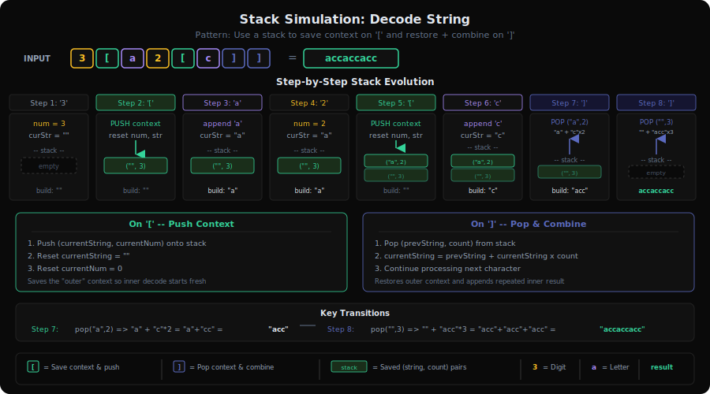
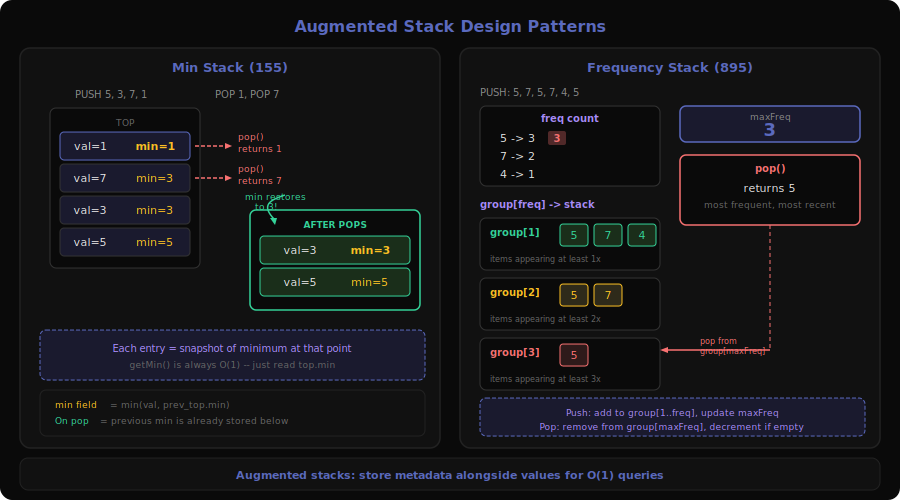
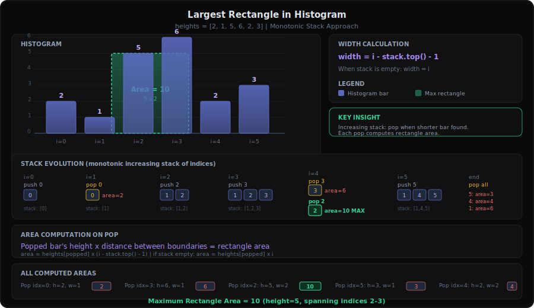

# Stack Patterns Deep Dive

Stack-based problems exploit the **Last-In-First-Out (LIFO)** property to maintain context, track dependencies, or enforce ordering constraints. The stack acts as a "memory of things we haven't resolved yet" — every push says "I'll deal with you later" and every pop says "now it's your turn."

This document covers all 6 sub-patterns with 26 problems from `server/patterns.py`.

---

## 1. Valid Parentheses Pattern


**Problems**: 20 (Valid Parentheses), 32 (Longest Valid Parentheses), 921 (Min Add to Make Valid), 1249 (Min Remove to Make Valid), 1963 (Min Swaps to Make Balanced)

### What is it?

Think of **nesting dolls** (matryoshka). Each opening bracket is like opening a doll — you expect to close it before you close any doll that was opened before it. If you try to close a doll that doesn't match, or you run out of dolls to close, something's wrong.

**Concrete example**: `s = "({[]})"` — is this valid?

```
Read '(' → push '(' → stack: ['(']
Read '{' → push '{' → stack: ['(', '{']
Read '[' → push '[' → stack: ['(', '{', '[']
Read ']' → pop '[' ✓ match → stack: ['(', '{']
Read '}' → pop '{' ✓ match → stack: ['(']
Read ')' → pop '(' ✓ match → stack: []
Stack empty → VALID ✓
```

Invalid example: `s = "([)]"`
```
Read '(' → push → stack: ['(']
Read '[' → push → stack: ['(', '[']
Read ')' → pop '[' ✗ mismatch! → INVALID
```

### The Decision Tree (Visualized)

```
Input: "({[]})"

Step 1: '(' → PUSH
  Stack: (
         ↑

Step 2: '{' → PUSH
  Stack: ( {
           ↑

Step 3: '[' → PUSH
  Stack: ( { [
             ↑

Step 4: ']' → POP & CHECK
  Stack: ( { [  ← top is '[', matches ']' ✓
  Stack: ( {

Step 5: '}' → POP & CHECK
  Stack: ( {  ← top is '{', matches '}' ✓
  Stack: (

Step 6: ')' → POP & CHECK
  Stack: (  ← top is '(', matches ')' ✓
  Stack: (empty)

Result: Stack empty + all matched → VALID
```

### Core Template (with walkthrough)

```
function isValid(s):
    stack = []                          // tracks unmatched opening brackets
    match = {')':'(', '}':'{', ']':'['} // closing → expected opening

    for char in s:
        if char is opening bracket:
            stack.push(char)            // remember this needs closing
        else:
            if stack is empty:
                return false            // nothing to match against
            if stack.pop() != match[char]:
                return false            // wrong type of bracket

    return stack is empty               // all brackets matched?
```

**Trace through** `s = "(])"`:
1. `(` → push → stack: `['(']`
2. `]` → pop `(`, check `( != [` → **return false**

### How to Recognize This Pattern

- Problem mentions **parentheses**, **brackets**, or **balanced** strings
- You need to check if **nesting is correct** (every opener has a matching closer in the right order)
- Counting open/close is necessary but NOT sufficient (order matters: `)(` has equal counts but is invalid)
- "Minimum additions/removals to make valid" — variant of the core validation
- Look for: **matching pairs with nesting constraints**

### Key Insight / Trick

The stack stores **unresolved opening brackets**. Each closing bracket resolves the most recent unresolved opener. This is why a simple counter fails for problems with multiple bracket types — you need to remember WHICH type was opened, not just HOW MANY.

For the "minimum operations" variants (921, 1249, 1963), the key insight shifts: instead of just validating, you **count unresolved brackets** — each unresolved one represents a required operation.

### Variations & Edge Cases

- **Single type** (`()` only): Can simplify to a counter instead of a stack
- **Mixed types** (`()[]{}`) : Must use stack to track type
- **Minimum additions** (921): Count unmatched opens + unmatched closes separately
- **Minimum removals** (1249): Two-pass — first pass marks invalid `)`, second pass marks invalid `(`
- **Minimum swaps** (1963): After canceling valid pairs, remaining pattern is `]]]...[[[...` — answer is `ceil(unmatched / 2)`
- **Longest valid substring** (32): Use stack to store indices, not characters — enables length calculation

### Questions Detail

| # | Title | Difficulty | Key Twist |
|---|-------|-----------|-----------|
| 20 | Valid Parentheses | Easy | Pure validation with 3 bracket types. Direct stack matching — the "hello world" of stack problems. Push openers, pop and verify on closers. |
| 32 | Longest Valid Parentheses | Hard | Not just "is it valid?" but "what's the longest valid substring?" Stack stores **indices** instead of characters. Push -1 as base, push index of `(`, on `)` pop and calculate `i - stack.top()`. Also solvable with DP. |
| 921 | Min Add to Make Parentheses Valid | Medium | Count minimum insertions. Track `open` (unmatched `(`) and `close` (unmatched `)`) counters. Answer is `open + close`. Can use stack but counter suffices since single bracket type. |
| 1249 | Min Remove to Make Valid Parentheses | Medium | Remove minimum characters to make valid, with **non-bracket characters mixed in**. Two-pass approach: left-to-right removes excess `)`, right-to-left removes excess `(`. Or single-pass with stack storing indices of unmatched brackets, then rebuild string skipping those indices. |
| 1963 | Min Swaps to Make Balanced | Medium | Uses `[` and `]` instead of `()`. Key insight: after canceling all valid pairs by scanning left-to-right, you're left with `]]]...[[[...` pattern. Each swap fixes TWO unmatched brackets, so answer is `ceil(unmatched_close / 2)`. |

---

## 2. Monotonic Stack Pattern


**Problems**: 739 (Daily Temperatures), 496 (Next Greater Element I), 503 (Next Greater Element II), 402 (Remove K Digits), 901 (Online Stock Span), 907 (Sum of Subarray Minimums), 962 (Maximum Width Ramp), 1475 (Final Prices), 1673 (Most Competitive Subsequence)

### What is it?

Imagine you're standing in a line of people of different heights, looking to the right. You want to know: **"Who is the first person taller than me?"** You could check everyone one by one (O(n²)), or you could be clever.

A **monotonic stack** maintains elements in sorted order (either increasing or decreasing). When a new element arrives that breaks the monotonicity, we pop elements — and each pop resolves a pending question like "what's my next greater/smaller element?"

**Concrete example**: Daily Temperatures — `[73, 74, 75, 71, 69, 72, 76, 73]`

"How many days until a warmer day?"

```
Day 0 (73): push 0    stack: [0]
Day 1 (74): 74 > 73   → pop 0, ans[0]=1-0=1. push 1    stack: [1]
Day 2 (75): 75 > 74   → pop 1, ans[1]=2-1=1. push 2    stack: [2]
Day 3 (71): 71 < 75   → push 3   stack: [2,3]
Day 4 (69): 69 < 71   → push 4   stack: [2,3,4]
Day 5 (72): 72 > 69   → pop 4, ans[4]=5-4=1
            72 > 71   → pop 3, ans[3]=5-3=2
            72 < 75   → push 5   stack: [2,5]
Day 6 (76): 76 > 72   → pop 5, ans[5]=6-5=1
            76 > 75   → pop 2, ans[2]=6-2=4. push 6   stack: [6]
Day 7 (73): 73 < 76   → push 7   stack: [6,7]

Remaining: ans[6]=0, ans[7]=0
Answer: [1, 1, 4, 2, 1, 1, 0, 0] ✓
```

### The Decision Tree (Visualized)

```
temps = [73, 74, 75, 71, 69, 72, 76, 73]

Stack evolution (storing indices, showing temps):

  Step   | Action           | Stack (bottom→top)  | Resolved
  -------|------------------|---------------------|----------
  i=0    | push 0           | [73]                |
  i=1    | pop 0, push 1    | [74]                | 73→1 day
  i=2    | pop 1, push 2    | [75]                | 74→1 day
  i=3    | push 3           | [75, 71]            |
  i=4    | push 4           | [75, 71, 69]        |
  i=5    | pop 4,3, push 5  | [75, 72]            | 69→1, 71→2
  i=6    | pop 5,2, push 6  | [76]                | 72→1, 75→4
  i=7    | push 7           | [76, 73]            |
  end    | clear stack       |                     | 76→0, 73→0

Key: Stack is always DECREASING (monotonic decreasing stack)
     We pop when current temp > stack top
```

### Core Template (with walkthrough)

```
function nextGreaterElement(nums):
    n = len(nums)
    answer = array of n zeros
    stack = []                          // stores indices

    for i = 0 to n-1:
        while stack not empty AND nums[i] > nums[stack.top()]:
            idx = stack.pop()           // this element found its answer
            answer[idx] = i - idx       // or nums[i], depending on problem
        stack.push(i)                   // this element still waiting

    return answer
```

**Monotonic Decreasing** stack (for "next greater"): pop when current > top
**Monotonic Increasing** stack (for "next smaller"): pop when current < top

### How to Recognize This Pattern

- "Next greater element" or "next smaller element" — classic monotonic stack
- "How many days/steps until X exceeds Y" — temporal next greater
- "Previous greater/smaller element" — iterate right to left
- Finding spans, ranges, or windows bounded by a condition
- Any O(n²) solution where you compare each element with all subsequent elements and need O(n)
- Look for: **pairwise comparisons that can be resolved by maintaining sorted order**

### Key Insight / Trick

Each element is pushed and popped **at most once**, giving O(n) total time despite the nested while loop. The stack acts as a "waiting room" — elements sit there until something resolves their question. The monotonic property ensures we never waste time on elements that can't be the answer.

**Two flavors**:
- **Decreasing stack** → finds "next greater" (pop when bigger comes)
- **Increasing stack** → finds "next smaller" (pop when smaller comes)

### Variations & Edge Cases

- **Circular array** (503): Iterate `2n` times using `i % n` for index
- **Building a result** (402, 1673): Stack builds the optimal number/subsequence by popping suboptimal elements
- **Online/streaming** (901): Maintain stack across calls, each `next()` pops and accumulates spans
- **Sum contribution** (907): Use monotonic stack to find left/right boundaries for each element as minimum, then calculate its contribution to all subarrays containing it
- **Width ramp** (962): Build decreasing stack of candidates for left endpoint, then scan right-to-left for best match

### Questions Detail

| # | Title | Difficulty | Key Twist |
|---|-------|-----------|-----------|
| 739 | Daily Temperatures | Medium | The "hello world" of monotonic stack. Decreasing stack of indices; when a warmer day pops an index, the difference is the answer. Clean, direct application. |
| 496 | Next Greater Element I | Easy | Two arrays — nums1 is subset of nums2. Build next-greater map for nums2 using monotonic stack, then look up each nums1 element. Introduces the "precompute with stack, query with map" pattern. |
| 503 | Next Greater Element II | Medium | Circular array twist. Iterate `2*n` elements using `i % n`. Only push during first pass, but pop during both passes. Same decreasing stack core. |
| 402 | Remove K Digits | Medium | Stack builds smallest number. While new digit < stack top and k > 0, pop (remove a digit). Greedy monotonic increasing stack. Handle leading zeros and edge case where k digits remain to remove from end. |
| 901 | Online Stock Span | Medium | Streaming/online version — maintain stack across `next()` calls. Stack stores `(price, span)` pairs. When new price >= top, pop and accumulate spans. Demonstrates monotonic stack as a persistent data structure. |
| 907 | Sum of Subarray Minimums | Medium | For each element, find how many subarrays it's the minimum of. Use two monotonic stacks: one for "previous less element" (left boundary), one for "next less element" (right boundary). Contribution = `arr[i] * left * right`. Handle duplicates with strict vs non-strict inequality. |
| 962 | Maximum Width Ramp | Medium | Find max `j - i` where `nums[i] <= nums[j]`. Build decreasing stack of candidates for `i` (left-to-right), then scan right-to-left trying to extend the ramp. Non-obvious stack application — the key is that left endpoints must be in decreasing order. |
| 1475 | Final Prices (Discount) | Easy | Next smaller or equal element. For each price, find first later price ≤ it (that's your discount). Monotonic increasing stack; when new price ≤ top, pop and apply discount. Straightforward application. |
| 1673 | Most Competitive Subsequence | Medium | Like Remove K Digits but for arrays. Maintain increasing stack of size k. Pop when current < top and enough elements remain to fill k slots. Greedy monotonic stack building the lexicographically smallest subsequence. |

---

## 3. Expression Evaluation Pattern


**Problems**: 224 (Basic Calculator), 227 (Basic Calculator II), 150 (Evaluate Reverse Polish Notation), 772 (Basic Calculator III)

### What is it?

Think of how a **calculator app** works. When you type `3 + 5 * 2`, the calculator can't just go left-to-right (that would give 16 instead of 13). It needs to handle **operator precedence** — multiplication before addition.

A stack helps by deferring lower-precedence operations. When we see `*`, we know it binds tighter than the pending `+`, so we evaluate `*` first.

**Concrete example**: Evaluate `3 + 5 * 2 - 4`

```
Using a number stack and tracking last operator:

Read '3'  → num = 3
Read '+'  → lastOp was start, push 3. lastOp = '+'
Read '5'  → num = 5
Read '*'  → lastOp was '+', push 5. lastOp = '*'
Read '2'  → num = 2
Read '-'  → lastOp was '*', push 5*2=10. lastOp = '-'
Read '4'  → num = 4
End       → lastOp was '-', push -(4) = -4

Stack: [3, 10, -4]
Sum all: 3 + 10 + (-4) = 9 ✓  (= 3 + 10 - 4)
```

### The Decision Tree (Visualized)

```
Expression: "3 + 5 * 2 - 4"

Processing timeline:
─────────────────────────────────────────────
Token   | Action              | Stack      | Op
─────────────────────────────────────────────
  3     | num = 3             | []         | +
  +     | push +3             | [3]        | +
  5     | num = 5             | [3]        | +
  *     | push +5             | [3, 5]    | *
  2     | num = 2             | [3, 5]    | *
  -     | push 5*2=10         | [3, 10]   | -
  4     | num = 4             | [3, 10]   | -
 END    | push -(4)           | [3,10,-4] |
─────────────────────────────────────────────
Result: sum(stack) = 3 + 10 + (-4) = 9

Key insight: * and / are evaluated IMMEDIATELY,
             + and - are DEFERRED (stored as signed numbers)
```

### Core Template (with walkthrough)

**For +, -, *, / without parentheses (LC 227):**
```
function calculate(s):
    stack = []
    num = 0
    op = '+'                            // operator BEFORE current number

    for i, char in enumerate(s + '+'):   // sentinel '+' forces final eval
        if char is digit:
            num = num * 10 + int(char)  // build multi-digit number
        else if char is operator or i == len(s):
            if op == '+': stack.push(num)
            if op == '-': stack.push(-num)
            if op == '*': stack.push(stack.pop() * num)
            if op == '/': stack.push(trunc(stack.pop() / num))
            op = char                   // remember this op for next number
            num = 0

    return sum(stack)
```

**For +, - with parentheses (LC 224):**
```
function calculate(s):
    stack = []
    num = 0
    sign = 1
    result = 0

    for char in s:
        if char is digit:
            num = num * 10 + int(char)
        else if char == '+':
            result += sign * num
            num = 0; sign = 1
        else if char == '-':
            result += sign * num
            num = 0; sign = -1
        else if char == '(':
            stack.push(result)          // save outer result
            stack.push(sign)            // save outer sign
            result = 0; sign = 1        // reset for inner expression
        else if char == ')':
            result += sign * num
            num = 0
            result *= stack.pop()       // apply saved sign
            result += stack.pop()       // add saved result

    return result + sign * num
```

**For RPN (LC 150):**
```
function evalRPN(tokens):
    stack = []
    for token in tokens:
        if token is operator:
            b = stack.pop()             // second operand (popped first!)
            a = stack.pop()             // first operand
            stack.push(apply(a, token, b))
        else:
            stack.push(int(token))
    return stack[0]
```

### How to Recognize This Pattern

- "Evaluate expression" or "calculate result" with operators
- Operator precedence must be respected (`*` before `+`)
- Parentheses create nested sub-expressions
- Reverse Polish Notation (postfix) — already precedence-free, just needs operand stack
- Look for: **deferred computation with precedence rules**

### Key Insight / Trick

The fundamental trick is **deferring lower-precedence operations**. For `+` and `-`, we store signed numbers on the stack and sum at the end. For `*` and `/`, we evaluate immediately by popping the previous number.

For parentheses, we save the "outer world" (accumulated result + sign) on the stack, evaluate the inner expression fresh, then restore the outer context on `)`. This is essentially manual recursion using an explicit stack.

### Variations & Edge Cases

- **RPN (postfix)**: No precedence issues — just push numbers, pop two operands per operator
- **Unary minus**: `-3 + 5` — handle `-` at start or after `(` as unary
- **Spaces**: Skip whitespace during parsing
- **Integer overflow**: Intermediate results can be large
- **Truncation toward zero**: `-7 / 2 = -3` not `-4` (different from floor division in Python)
- **Nested parentheses** (772): Combine both templates — recursion or stack-within-stack

### Questions Detail

| # | Title | Difficulty | Key Twist |
|---|-------|-----------|-----------|
| 150 | Evaluate Reverse Polish Notation | Medium | Postfix notation — no precedence worries. Pure operand stack: push numbers, pop two on operator. Watch for operand order (`a op b` where `a` is popped second). Good warm-up for the pattern. |
| 224 | Basic Calculator | Hard | Only `+`, `-`, and `()`. No `*`/`/` means no precedence between operators, but parentheses add nesting. Stack saves `(result, sign)` pairs on `(`. Unary minus handling is the tricky edge case. |
| 227 | Basic Calculator II | Medium | Has `+`, `-`, `*`, `/` but NO parentheses. Track previous operator; evaluate `*`/`/` immediately, defer `+`/`-`. Cleaner than 224 despite seeming harder — no nesting logic needed. |
| 772 | Basic Calculator III | Hard | The "final boss" — combines ALL operators `+`, `-`, `*`, `/` WITH parentheses. Requires handling both precedence and nesting. Best solved with recursion: when hitting `(`, recurse; when hitting `)`, return. Each recursive call handles one parenthesized sub-expression using the BC II template. (Premium problem) |

---

## 4. Simulation Pattern



**Problems**: 394 (Decode String), 71 (Simplify Path), 735 (Asteroid Collision)

### What is it?

These problems use the stack to **simulate a real-world process** where the current action depends on what came before. Think of it like an **undo stack** in a text editor — you build up state, and certain triggers cause you to go back and modify what you've built.

**Concrete example**: Decode String — `s = "3[a2[c]]"`

```
Read '3' → num = 3
Read '[' → push ("", 3) → save context. Reset: str="", num=0
Read 'a' → str = "a"
Read '2' → num = 2
Read '[' → push ("a", 2) → save context. Reset: str="", num=0
Read 'c' → str = "c"
Read ']' → pop ("a", 2) → str = "a" + "c"*2 = "acc"
Read ']' → pop ("", 3) → str = "" + "acc"*3 = "accaccacc"

Result: "accaccacc" ✓
```

### The Decision Tree (Visualized)

```
Decode String: "3[a2[c]]"

Step  | Char | Action           | Stack              | Current
------|------|------------------|--------------------|--------
  1   |  3   | num = 3          | []                 | ""
  2   |  [   | push("",3)       | [("",3)]           | ""
  3   |  a   | str += 'a'       | [("",3)]           | "a"
  4   |  2   | num = 2          | [("",3)]           | "a"
  5   |  [   | push("a",2)      | [("",3),("a",2)]   | ""
  6   |  c   | str += 'c'       | [("",3),("a",2)]   | "c"
  7   |  ]   | pop("a",2)       | [("",3)]           | "a"+"cc"="acc"
  8   |  ]   | pop("",3)        | []                 | ""+"accaccacc"

Nesting is handled naturally — each '[' pushes context,
each ']' pops and combines.
```

### Core Template (with walkthrough)

**Decode String (394):**
```
function decodeString(s):
    stack = []                          // stores (prevString, repeatCount) pairs
    currentStr = ""
    num = 0

    for char in s:
        if char is digit:
            num = num * 10 + int(char)  // handle multi-digit numbers
        else if char == '[':
            stack.push((currentStr, num))  // save what we've built + how many times
            currentStr = ""             // reset for inner content
            num = 0
        else if char == ']':
            (prevStr, count) = stack.pop()
            currentStr = prevStr + currentStr * count  // combine
        else:
            currentStr += char          // accumulate letters

    return currentStr
```

**Simplify Path (71):**
```
function simplifyPath(path):
    stack = []
    parts = path.split('/')

    for part in parts:
        if part == '..' and stack not empty:
            stack.pop()                 // go up one directory
        else if part != '' and part != '.' and part != '..':
            stack.push(part)            // valid directory name

    return '/' + '/'.join(stack)
```

**Asteroid Collision (735):**
```
function asteroidCollision(asteroids):
    stack = []

    for ast in asteroids:
        alive = true
        while alive AND stack not empty AND ast < 0 AND stack.top() > 0:
            if stack.top() < abs(ast):
                stack.pop()             // top asteroid destroyed
            else if stack.top() == abs(ast):
                stack.pop()             // both destroyed
                alive = false
            else:
                alive = false           // incoming asteroid destroyed
        if alive:
            stack.push(ast)

    return stack
```

### How to Recognize This Pattern

- **Nested structures** that need to be built/unbuilt (like `k[string]`)
- **State that depends on history** — what happened before affects current action
- **Collision/cancellation** — two elements meeting and one (or both) being removed
- **Path processing** — `..` undoes previous directory, `.` is no-op
- Look for: **build up, then selectively undo/combine based on triggers**

### Key Insight / Trick

The stack acts as a **context saver**. Before diving into a nested structure, save the current state. When exiting the nested structure, restore the previous state and combine with what you computed inside.

For collision problems (735), the stack represents "settled state" — everything in the stack has already survived. New elements either join peacefully or fight the top until one side loses.

### Variations & Edge Cases

- **Multi-digit numbers** (394): Build number digit by digit before `[`
- **Empty path components** (71): `///` splits into `["", "", "", ""]` — skip empties
- **`..` beyond root** (71): Can't go above `/`, so skip `..` when stack is empty
- **Chain collisions** (735): One large negative asteroid can destroy multiple positive ones — the while loop handles this
- **Same-direction asteroids** (735): Never collide — `[5, 10]` stays as-is, `[-5, -10]` stays as-is

### Questions Detail

| # | Title | Difficulty | Key Twist |
|---|-------|-----------|-----------|
| 394 | Decode String | Medium | Nested brackets with repeat counts. Stack saves `(previousString, count)` on each `[`. The nesting can be arbitrary depth. Think of it as manual recursion — each `[` is a function call, each `]` is a return. |
| 71 | Simplify Path | Medium | Unix path simplification. Split by `/`, use stack as directory list. `..` pops, `.` is no-op, empty strings (from `//`) are skipped. Rejoin with `/` separator. Edge case: `/../` should return `/` (can't go above root). |
| 735 | Asteroid Collision | Medium | Physics simulation. Only collisions happen when positive (right-moving) is on stack and negative (left-moving) comes in. The while loop handles chain reactions. Key edge case: equal-size collision destroys both. Result is whatever remains in the stack. |

---

## 5. Min Stack Design Pattern



**Problems**: 155 (Min Stack), 895 (Maximum Frequency Stack), 901 (Online Stock Span)

### What is it?

Think of a **stack with superpowers**. A normal stack only lets you see the top. But what if you also need to know the minimum element at any time? Or the most frequent element? You augment the basic stack with extra tracking.

It's like having a **scoreboard** next to a stack of papers — as you add/remove papers, the scoreboard instantly updates without you having to look through the whole pile.

**Concrete example**: Min Stack operations

```
push(5)  → stack: [(5, min=5)]
push(3)  → stack: [(5,5), (3, min=3)]
push(7)  → stack: [(5,5), (3,3), (7, min=3)]
getMin() → 3  (current min without scanning!)
pop()    → remove (7,3) → stack: [(5,5), (3,3)]
getMin() → 3  (still correct!)
pop()    → remove (3,3) → stack: [(5,5)]
getMin() → 5  (automatically updated!)
```

### The Decision Tree (Visualized)

```
Min Stack — each entry stores (value, currentMin):

Operation    | Stack State                | getMin
-------------|----------------------------|-------
push(5)      | [(5, 5)]                  | 5
push(3)      | [(5,5), (3,3)]            | 3
push(7)      | [(5,5), (3,3), (7,3)]     | 3
push(1)      | [(5,5), (3,3), (7,3), (1,1)] | 1
pop()        | [(5,5), (3,3), (7,3)]     | 3  ← auto-restored!
pop()        | [(5,5), (3,3)]            | 3
pop()        | [(5,5)]                   | 5  ← auto-restored!

Key: min at each level = min(current_value, previous_min)
     Popping automatically "restores" the previous min
```

### Core Template (with walkthrough)

**Min Stack (155):**
```
class MinStack:
    stack = []                          // stores (value, currentMin) pairs

    push(val):
        if stack is empty:
            stack.push((val, val))
        else:
            currentMin = min(val, stack.top().min)
            stack.push((val, currentMin))

    pop():
        stack.pop()

    top():
        return stack.top().value

    getMin():
        return stack.top().min          // O(1)!
```

**Frequency Stack (895):**
```
class FreqStack:
    freq = {}                           // val → count
    group = {}                          // frequency → stack of values at that freq
    maxFreq = 0

    push(val):
        freq[val] = freq.get(val, 0) + 1
        f = freq[val]
        maxFreq = max(maxFreq, f)
        group[f].push(val)              // add to frequency group

    pop():
        val = group[maxFreq].pop()      // most frequent, most recent
        freq[val] -= 1
        if group[maxFreq] is empty:
            maxFreq -= 1                // drop down to next frequency
        return val
```

### How to Recognize This Pattern

- "Design a data structure" that combines stack behavior with an **aggregate query**
- Need O(1) access to min/max/most-frequent while maintaining push/pop semantics
- The "design" keyword in the problem title
- Stack operations + an extra operation that normally requires scanning
- Look for: **stack + O(1) metadata tracking**

### Key Insight / Trick

**Min Stack**: Store the running minimum WITH each stack entry. When you pop, the previous minimum is automatically exposed — no recalculation needed. Each entry is a snapshot of "what was the min when I was pushed?"

**Frequency Stack**: Group elements by their frequency using a **map of stacks**. `group[f]` is a stack of all elements that have been pushed exactly `f` times. Popping from `group[maxFreq]` automatically gives the most frequent + most recent element (LIFO within the frequency group).

### Variations & Edge Cases

- **Alternative Min Stack**: Use a separate min-stack that only pushes when a new minimum is found (saves space but trickier to implement correctly with duplicates)
- **Max Stack**: Same concept but track maximum instead of minimum; harder if you need to pop the max from arbitrary position (LC 716)
- **Frequency ties**: FreqStack handles ties by using LIFO order within each frequency group — the most recently pushed element at `maxFreq` gets popped first
- **Online Stock Span (901)**: Classified here because it's a stack-based design problem, but mechanically it's a monotonic stack that accumulates spans

### Questions Detail

| # | Title | Difficulty | Key Twist |
|---|-------|-----------|-----------|
| 155 | Min Stack | Medium | Store `(value, currentMin)` pairs. Each push computes `min(newVal, prevMin)`. Popping automatically restores previous min. The key realization is that the min is a function of stack state, so it changes in sync with push/pop. |
| 895 | Maximum Frequency Stack | Hard | Map-of-stacks design. Track frequency of each value + a stack per frequency level. `maxFreq` pointer jumps to the right group. Elegant O(1) push/pop. The trick is that an element at frequency 3 also exists in the frequency-2 stack (it was pushed there when its count was 2). |
| 901 | Online Stock Span | Medium | Monotonic decreasing stack that persists across calls. Each `next(price)` pops smaller prices, accumulating their spans. Stack stores `(price, span)` pairs. Cross-listed with Monotonic Stack — it's both a design problem and a monotonic stack application. |

---

## 6. Largest Rectangle Pattern



**Problems**: 84 (Largest Rectangle in Histogram), 85 (Maximal Rectangle)

### What is it?

Imagine you have a **bar chart** (histogram) and you want to find the largest rectangle you can draw that fits entirely under the bars. Each bar has width 1 and various heights.

For each bar, the rectangle it can be part of extends left and right as far as there are bars **at least as tall** as it. The challenge is efficiently finding these boundaries.

**Concrete example**: `heights = [2, 1, 5, 6, 2, 3]`

```
For height 5 at index 2:
  - Can extend left to index 2 (bar at index 1 is height 1 < 5, stops)
  - Can extend right to index 3 (bar at index 4 is height 2 < 5, stops)
  - Width = 3 - 2 + 1 = 2 (indices 2 and 3)
  Wait, that's wrong. Let's be precise:
  - Left boundary: first bar shorter than 5 going left = index 1
  - Right boundary: first bar shorter than 5 going right = index 4
  - Width = 4 - 1 - 1 = 2
  - Area = 5 * 2 = 10 ← This is the answer!
```

### The Decision Tree (Visualized)

```
heights = [2, 1, 5, 6, 2, 3]
           0  1  2  3  4  5

Stack-based approach (monotonic increasing stack):

Step | height | Action              | Stack (idx:h)    | Areas computed
-----|--------|---------------------|------------------|---------------
i=0  |   2    | push 0              | [0:2]            |
i=1  |   1    | 1<2 → pop 0        | []               | h=2, w=1, A=2
     |        | push 1              | [1:1]            |
i=2  |   5    | push 2              | [1:1, 2:5]       |
i=3  |   6    | push 3              | [1:1, 2:5, 3:6]  |
i=4  |   2    | 2<6 → pop 3        | [1:1, 2:5]       | h=6, w=1, A=6
     |        | 2<5 → pop 2        | [1:1]            | h=5, w=2, A=10 ★
     |        | push 4              | [1:1, 4:2]       |
i=5  |   3    | push 5              | [1:1, 4:2, 5:3]  |
END  |        | pop 5               | [1:1, 4:2]       | h=3, w=1, A=3
     |        | pop 4               | [1:1]            | h=2, w=4, A=8
     |        | pop 1               | []               | h=1, w=6, A=6

Maximum area = 10 ★ (height 5, width 2)
```

### Core Template (with walkthrough)

```
function largestRectangleInHistogram(heights):
    stack = []                          // monotonic increasing stack of indices
    maxArea = 0

    for i = 0 to len(heights):         // note: go ONE past the end
        h = heights[i] if i < len(heights) else 0  // sentinel height 0

        while stack not empty AND h < heights[stack.top()]:
            height = heights[stack.pop()]
            width = i if stack is empty else (i - stack.top() - 1)
            maxArea = max(maxArea, height * width)

        stack.push(i)

    return maxArea
```

**Key formula**: When we pop index `idx` with height `h`:
- **Right boundary**: current index `i` (first shorter bar to the right)
- **Left boundary**: `stack.top()` after popping (first shorter bar to the left), or `-1` if stack empty
- **Width** = `i - leftBoundary - 1` = `i - stack.top() - 1` (or `i` if stack empty)

**Trace through** `[2, 1, 5, 6, 2, 3]`:
- Pop index 0 (h=2) at i=1: width = 1 (stack empty → width=i=1). Area = 2×1 = 2
- Pop index 3 (h=6) at i=4: width = 4-2-1 = 1. Area = 6×1 = 6
- Pop index 2 (h=5) at i=4: width = 4-1-1 = 2. Area = 5×2 = **10** ★
- Pop index 5 (h=3) at end: width = 6-4-1 = 1. Area = 3×1 = 3
- Pop index 4 (h=2) at end: width = 6-1-1 = 4. Area = 2×4 = 8
- Pop index 1 (h=1) at end: width = 6 (stack empty). Area = 1×6 = 6

### How to Recognize This Pattern

- "Largest rectangle" in any context — histogram bars, binary matrix
- Finding the maximum area bounded by height constraints
- Problems that reduce to "for each element, find nearest smaller on both sides"
- Look for: **area maximization with height as the bottleneck**

### Key Insight / Trick

A bar of height `h` contributes to the largest rectangle where it is the **shortest bar**. The rectangle extends left and right until hitting a shorter bar. The monotonic increasing stack naturally finds these boundaries — when a bar is popped, the current index is its right boundary and the new stack top is its left boundary.

The sentinel value `0` at the end forces all remaining bars to be popped, ensuring no bar is missed.

### Variations & Edge Cases

- **2D matrix** (85): Convert each row to a histogram by accumulating heights column-by-column (reset to 0 on '0'). Apply 1D histogram algorithm per row.
- **All same height**: Still works — each bar popped at the sentinel
- **Strictly decreasing**: Each bar popped immediately by the next bar
- **Strictly increasing**: All bars popped at the sentinel at the end
- **Single bar**: Width = 1, area = heights[0]

### Questions Detail

| # | Title | Difficulty | Key Twist |
|---|-------|-----------|-----------|
| 84 | Largest Rectangle in Histogram | Hard | The classic. Monotonic increasing stack finds left/right boundaries for each bar. Sentinel value at end forces final cleanup. The width calculation formula `i - stack.top() - 1` is the tricky part — practice deriving it from the boundary definition. |
| 85 | Maximal Rectangle | Hard | 2D version — binary matrix. For each row, build a histogram of column heights (count consecutive 1s going up). Then apply LC 84 on each row's histogram. Reduces a 2D problem to n applications of the 1D algorithm. Elegant but hard to see the reduction. |

---

## Comparison Table: All 6 Stack Sub-Patterns

| Aspect | Valid Parentheses | Monotonic Stack | Expression Eval | Simulation | Min Stack Design | Largest Rectangle |
|--------|------------------|-----------------|-----------------|------------|-----------------|-------------------|
| Stack stores | Characters/indices | Indices (sorted order) | Numbers/state | Context pairs | (val, metadata) | Indices (increasing) |
| Push trigger | Opening bracket | Every element | Number parsed | `[` or start | push() call | Every bar |
| Pop trigger | Closing bracket | Monotonicity broken | `)` or operator | `]` or trigger | pop() call | Shorter bar found |
| Key operation | Match top | Resolve pending query | Evaluate sub-expr | Restore context | Update aggregate | Calculate area |
| Result from | Stack empty check | Values at pop time | Final stack sum | Built-up string | Top of stack | Max area across pops |
| Typical complexity | O(n) | O(n) | O(n) | O(n × output) | O(1) per op | O(n) |
| Difficulty range | Easy–Hard | Easy–Medium | Medium–Hard | Medium | Medium–Hard | Hard |
| Problem count | 5 | 9 | 4 | 3 | 3 | 2 |

---

## Code References

- `server/patterns.py:91-98` — Stack category definition with 6 sub-patterns
- `server/patterns.py:362-367` — Reverse lookup (problem → pattern)
- `server/main.py:307-369` — API endpoint for pattern data
- `extension/patterns.js` — Client-side pattern labels
