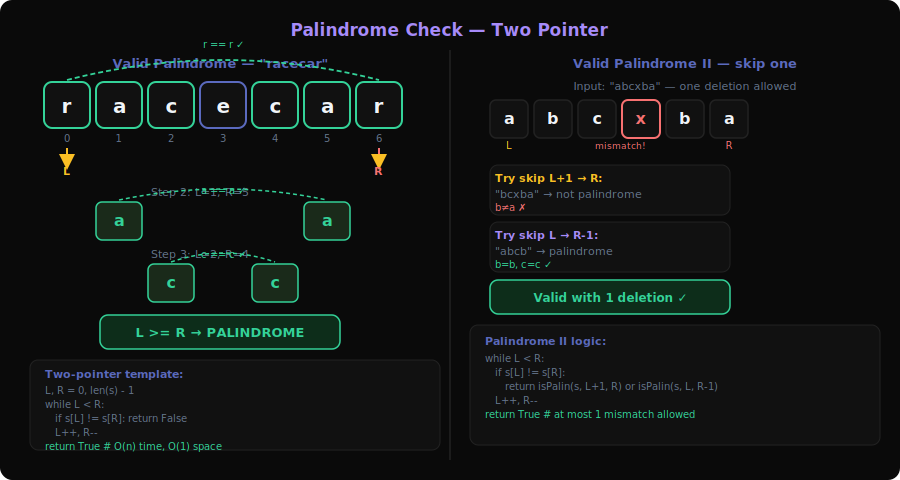
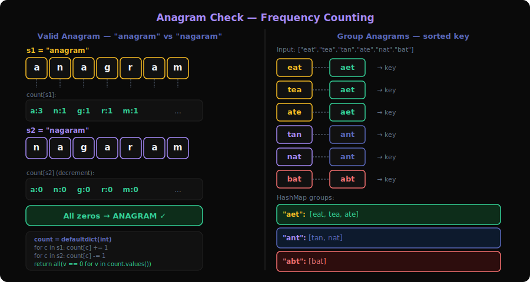
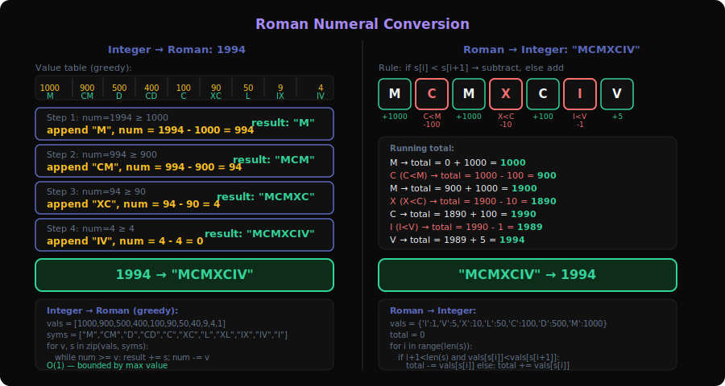
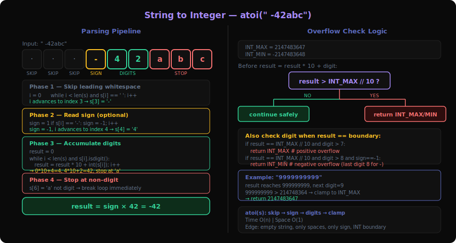
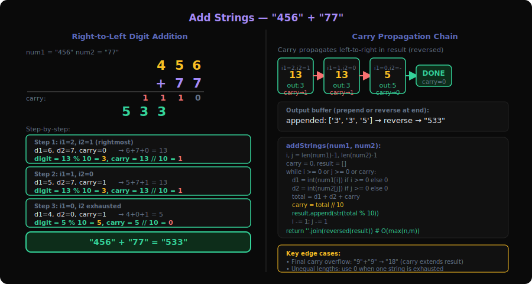
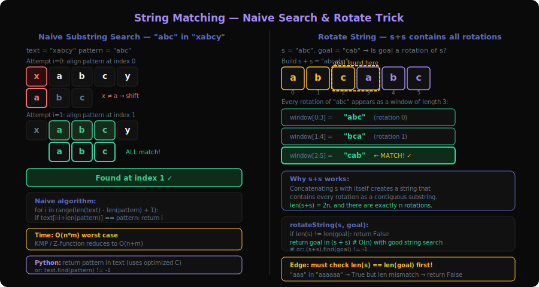
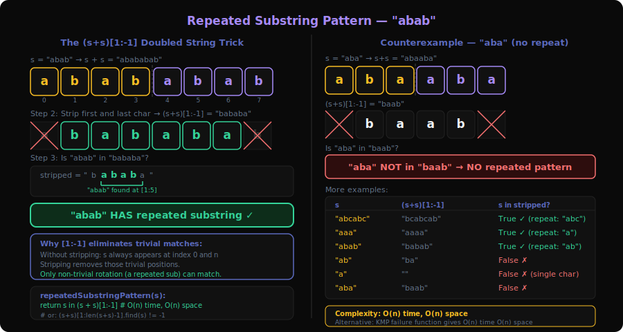

# String Manipulation Patterns Deep Dive

String problems test your ability to work with character sequences — parsing, matching, transforming, and validating. Unlike array problems that manipulate numbers, string problems often involve **character frequency counting**, **two-pointer scanning**, and **pattern recognition**.

This document covers all 7 sub-patterns with 20 problems from `server/patterns.py`.

---

## 1. Palindrome Check Pattern



**Problems**: 9 (Palindrome Number), 125 (Valid Palindrome), 680 (Valid Palindrome II)

### What is it?

A palindrome reads the same forward and backward. The check is simple: two pointers from both ends, comparing characters as they converge. Think of **folding a word in half** — if both halves match, it's a palindrome.

**Concrete example**: Is `"racecar"` a palindrome?

```
L=0('r'), R=6('r') → match ✓
L=1('a'), R=5('a') → match ✓
L=2('c'), R=4('c') → match ✓
L=3('e'), R=3('e') → L >= R → DONE. Palindrome ✓
```

Is `"A man, a plan, a canal: Panama"` valid? (125)
```
Lowercase + strip non-alphanumeric: "amanaplanacanalpanama"
Two-pointer check → Palindrome ✓
```

### Core Template (with walkthrough)

```
function isPalindrome(s):
    left = 0, right = len(s) - 1

    while left < right:
        // Skip non-alphanumeric (for LC 125)
        while left < right AND !isAlphanumeric(s[left]): left++
        while left < right AND !isAlphanumeric(s[right]): right--

        if toLower(s[left]) != toLower(s[right]):
            return false
        left++; right--

    return true
```

**Valid Palindrome II (one deletion allowed):**
```
function validPalindrome(s):
    left = 0, right = len(s) - 1

    while left < right:
        if s[left] != s[right]:
            // Try skipping left OR skipping right
            return isPalin(s, left+1, right) OR isPalin(s, left, right-1)
        left++; right--

    return true
```

### How to Recognize This Pattern

- "Is this a palindrome?" with various input cleaning rules
- "Can it become a palindrome with at most k deletions?"
- Numeric palindrome (reverse the number)
- Look for: **symmetric comparison from both ends**

### Key Insight / Trick

For **Palindrome Number** (9), avoid string conversion — reverse the second half of the number and compare. For **Valid Palindrome II** (680), the key insight is that when a mismatch occurs, you only have TWO choices (skip left or skip right), and you can check both in O(n).

### Questions Detail

| # | Title | Difficulty | Key Twist |
|---|-------|-----------|-----------|
| 9 | Palindrome Number | Easy | Don't convert to string — reverse half the number. Compare first half with reversed second half. Negatives are never palindromes. Numbers ending in 0 (except 0 itself) aren't palindromes. |
| 125 | Valid Palindrome | Easy | Skip non-alphanumeric characters, case-insensitive comparison. Two pointers with skip logic. The "cleaning" step is the only twist over basic palindrome. |
| 680 | Valid Palindrome II | Easy | When mismatch found at `(L, R)`, check both `isPalin(L+1, R)` and `isPalin(L, R-1)`. If either is palindrome, answer is true. Greedy choice at the mismatch point. |

---

## 2. Anagram Check Pattern



**Problems**: 49 (Group Anagrams), 242 (Valid Anagram)

### What is it?

An anagram uses exactly the same letters in different order. "listen" → "silent". The key tool is **character frequency counting** — two strings are anagrams if and only if they have identical character counts.

**Concrete example**: Are "anagram" and "nagaram" anagrams?

```
Count "anagram": {a:3, n:1, g:1, r:1, m:1}
Count "nagaram": {n:1, a:3, g:1, r:1, m:1}
Same counts → YES ✓
```

### Core Template (with walkthrough)

```
function isAnagram(s, t):
    if len(s) != len(t): return false

    count = array of 26 zeros           // for lowercase English letters

    for i = 0 to len(s)-1:
        count[s[i] - 'a'] += 1
        count[t[i] - 'a'] -= 1

    return all values in count are 0
```

**Group Anagrams:**
```
function groupAnagrams(strs):
    groups = hashmap<string, list>

    for word in strs:
        key = sort(word)                // sorted word is the anagram signature
        groups[key].add(word)

    return groups.values()
```

### How to Recognize This Pattern

- "Anagram" mentioned explicitly
- "Same characters, different order"
- Grouping strings by character composition
- Look for: **character frequency comparison**

### Key Insight / Trick

**Sorting** each word creates a canonical form — all anagrams sort to the same string. Alternatively, use a character count array as the key (faster than sorting for long strings). For grouping, the sorted string or count tuple becomes the hash map key.

### Questions Detail

| # | Title | Difficulty | Key Twist |
|---|-------|-----------|-----------|
| 242 | Valid Anagram | Easy | Compare character frequencies. Either sort both strings and compare, or use a 26-element count array (increment for s, decrement for t, check all zeros). O(n) with counting. |
| 49 | Group Anagrams | Medium | Hash map where key = sorted word (or character count tuple). All anagrams share the same key. Sorting each word is O(k log k) where k is word length. Count-based key is O(k). |

---

## 3. Roman Conversion Pattern



**Problems**: 12 (Integer to Roman), 13 (Roman to Integer)

### What is it?

Roman numerals use symbols (I=1, V=5, X=10, L=50, C=100, D=500, M=1000) with a **subtraction rule**: when a smaller value precedes a larger one, subtract it (IV=4, IX=9, XL=40, XC=90, CD=400, CM=900).

**Concrete example**: Convert 1994 to Roman

```
1994 ≥ 1000 → M,    remainder = 994
994  ≥ 900  → CM,   remainder = 94
94   ≥ 90   → XC,   remainder = 4
4    ≥ 4    → IV,   remainder = 0

Result: "MCMXCIV" ✓
```

### Core Template (with walkthrough)

**Integer to Roman:**
```
function intToRoman(num):
    values  = [1000, 900, 500, 400, 100, 90, 50, 40, 10, 9, 5, 4, 1]
    symbols = ["M","CM","D","CD","C","XC","L","XL","X","IX","V","IV","I"]
    result = ""

    for i = 0 to len(values)-1:
        while num >= values[i]:
            result += symbols[i]
            num -= values[i]

    return result
```

**Roman to Integer:**
```
function romanToInt(s):
    map = {'I':1, 'V':5, 'X':10, 'L':50, 'C':100, 'D':500, 'M':1000}
    result = 0

    for i = 0 to len(s)-1:
        if i+1 < len(s) AND map[s[i]] < map[s[i+1]]:
            result -= map[s[i]]         // subtraction case (e.g., I before V)
        else:
            result += map[s[i]]

    return result
```

### How to Recognize This Pattern

- "Roman numeral" conversion in either direction
- Look for: **ordered value table with subtraction rule**

### Key Insight / Trick

For **int→roman**: use a greedy approach with a value table that includes the subtraction pairs (900, 400, 90, 40, 9, 4). For **roman→int**: scan left-to-right; if current value < next value, subtract instead of add.

### Questions Detail

| # | Title | Difficulty | Key Twist |
|---|-------|-----------|-----------|
| 12 | Integer to Roman | Medium | Greedy with 13-entry value table (including CM, CD, XC, XL, IX, IV). Repeatedly subtract the largest fitting value. No complex logic needed — the table encodes all rules. |
| 13 | Roman to Integer | Easy | Left-to-right scan. If `val[s[i]] < val[s[i+1]]`, subtract current value; otherwise add it. Single pass O(n). The subtraction rule is the only tricky part. |

---

## 4. String to Integer Pattern



**Problems**: 8 (String to Integer / atoi), 65 (Valid Number)

### What is it?

Parse a string into a number following strict rules: handle whitespace, sign, digits, overflow, and invalid characters. Essentially implementing `parseInt`/`atoi` from scratch.

**Concrete example**: atoi(`"   -42abc"`)

```
Step 1: Skip whitespace → "   " skipped, at '-'
Step 2: Read sign → '-', negative = true
Step 3: Read digits → '4', '2' → num = 42
Step 4: Stop at 'a' (non-digit)
Step 5: Apply sign → -42
Step 6: Clamp to [-2³¹, 2³¹-1] → -42 (in range)

Result: -42
```

### Core Template (with walkthrough)

```
function myAtoi(s):
    i = 0
    n = len(s)

    // Step 1: Skip whitespace
    while i < n AND s[i] == ' ': i++

    // Step 2: Read sign
    sign = 1
    if i < n AND (s[i] == '+' OR s[i] == '-'):
        sign = -1 if s[i] == '-' else 1
        i++

    // Step 3: Read digits
    result = 0
    while i < n AND s[i] is digit:
        digit = s[i] - '0'

        // Step 4: Overflow check BEFORE adding digit
        if result > INT_MAX / 10 OR
           (result == INT_MAX / 10 AND digit > INT_MAX % 10):
            return INT_MAX if sign == 1 else INT_MIN

        result = result * 10 + digit
        i++

    return sign * result
```

### How to Recognize This Pattern

- "Convert string to integer" with edge cases
- "Validate number format" (integers, decimals, scientific notation)
- Parsing with state machine logic
- Look for: **sequential parsing with strict format rules**

### Key Insight / Trick

The overflow check must happen **before** multiplying by 10 and adding the digit. If `result > INT_MAX/10`, it will overflow. If `result == INT_MAX/10` and `digit > 7` (for 32-bit), it will overflow. This prevents undefined behavior.

For **Valid Number** (65), a state machine or careful regex-like logic handles the many format rules (optional sign, digits, optional dot, optional exponent).

### Questions Detail

| # | Title | Difficulty | Key Twist |
|---|-------|-----------|-----------|
| 8 | String to Integer (atoi) | Medium | Sequential parsing: whitespace → sign → digits → stop. The hard part is **overflow detection** before it happens. Clamp to `[-2³¹, 2³¹-1]`. Many edge cases: empty string, only whitespace, sign without digits. |
| 65 | Valid Number | Hard | State machine with many valid formats: integers, decimals, scientific notation (e/E). Must handle: optional sign, at least one digit, optional decimal point, optional exponent with optional sign. Best solved with explicit state transitions or careful flag tracking. |

---

## 5. Manual Simulation Pattern



**Problems**: 43 (Multiply Strings), 67 (Add Binary), 415 (Add Strings)

### What is it?

Implement arithmetic operations on numbers represented as strings, digit by digit. This is the string-focused view of the same "manual arithmetic" concept from Array/Matrix (43, 67 appear in both categories).

**Concrete example**: Add Strings — `"456" + "77"`

```
i=2, j=1: 6 + 7 = 13 → digit='3', carry=1
i=1, j=0: 5 + 7 + 1 = 13 → digit='3', carry=1
i=0, j=-1: 4 + 0 + 1 = 5 → digit='5', carry=0

Reverse result: "533" ✓
```

### Core Template (with walkthrough)

```
function addStrings(num1, num2):
    i = len(num1) - 1
    j = len(num2) - 1
    carry = 0
    result = []

    while i >= 0 OR j >= 0 OR carry > 0:
        d1 = int(num1[i]) if i >= 0 else 0
        d2 = int(num2[j]) if j >= 0 else 0
        total = d1 + d2 + carry
        result.append(str(total % 10))
        carry = total / 10
        i--; j--

    return reverse(result).join('')
```

### How to Recognize This Pattern

- Numbers as strings with arithmetic operations
- "Without using built-in big integer libraries"
- Adding, multiplying numbers that exceed integer limits
- Look for: **grade-school arithmetic simulated in code**

### Key Insight / Trick

Process right-to-left, handle different-length inputs by treating missing digits as 0. The carry loop continues even after both strings are exhausted (handles cases like `"1" + "9" = "10"`).

### Questions Detail

| # | Title | Difficulty | Key Twist |
|---|-------|-----------|-----------|
| 415 | Add Strings | Easy | Two-pointer from end with carry. Handle unequal lengths by treating exhausted string as contributing 0. Continue while carry > 0 after both strings done. |
| 67 | Add Binary | Easy | Same as Add Strings but base 2. `digit = (a + b + carry) % 2`, `carry = (a + b + carry) / 2`. Build result in reverse. |
| 43 | Multiply Strings | Medium | O(m×n) digit-by-digit multiplication. `result[i+j+1] += d1[i] * d2[j]`, then propagate carries. Strip leading zeros. The position formula `i+j+1` is the key insight. |

---

## 6. String Matching Pattern



**Problems**: 28 (Find First Occurrence), 214 (Shortest Palindrome), 686 (Repeated String Match), 796 (Rotate String), 3008 (Beautiful Indices II)

### What is it?

Finding one string within another — the classic **substring search** problem. Naive approach is O(n×m), but algorithms like KMP (Knuth-Morris-Pratt) achieve O(n+m) by precomputing a failure/prefix function.

**Concrete example**: Find `"sad"` in `"sadbutsad"`

```
Naive: Compare "sad" at each position
  i=0: "sad" == "sad" → FOUND at index 0 ✓
```

For KMP on harder cases, the prefix function avoids re-comparing characters after a partial match fails.

### Core Template (with walkthrough)

**Naive matching:**
```
function strStr(haystack, needle):
    for i = 0 to len(haystack) - len(needle):
        if haystack[i : i+len(needle)] == needle:
            return i
    return -1
```

**KMP prefix function:**
```
function computePrefix(pattern):
    prefix = array of len(pattern) zeros
    j = 0

    for i = 1 to len(pattern)-1:
        while j > 0 AND pattern[i] != pattern[j]:
            j = prefix[j-1]            // fall back
        if pattern[i] == pattern[j]:
            j++
        prefix[i] = j

    return prefix
```

### How to Recognize This Pattern

- "Find substring" or "check if string contains pattern"
- "Shortest palindrome by prepending" — uses reverse + KMP
- "Is A a rotation of B?" — check if B exists in A+A
- Look for: **substring search, potentially needing KMP/Z-function**

### Key Insight / Trick

**Rotate String** (796): `s` is a rotation of `goal` iff `goal` is a substring of `s + s`. This elegant reduction avoids checking all rotation positions.

**Shortest Palindrome** (214): Find the longest palindromic prefix using KMP on `s + "#" + reverse(s)`. The prefix function of this combined string reveals where the palindrome ends. Prepend the reverse of the non-palindromic suffix.

### Questions Detail

| # | Title | Difficulty | Key Twist |
|---|-------|-----------|-----------|
| 28 | Find First Occurrence in String | Easy | Basic substring search. Naive O(n×m) is fine for easy constraints. KMP or built-in `indexOf` for optimal. The "hello world" of string matching. |
| 214 | Shortest Palindrome | Hard | Find longest palindromic prefix, then prepend reverse of the remaining suffix. KMP trick: build `s + "#" + rev(s)`, compute prefix function, last value = longest palindromic prefix length. |
| 686 | Repeated String Match | Medium | Repeat `a` until its length ≥ `len(b)`, then check if `b` is substring. May need one extra repetition. Answer is `ceil(len(b)/len(a))` or `ceil(len(b)/len(a)) + 1`, or -1. |
| 796 | Rotate String | Easy | Check if `goal` is substring of `s + s` (and lengths match). Rotation = split at some point and swap halves. All rotations appear as substrings of the doubled string. Elegant one-liner. |
| 3008 | Beautiful Indices II | Hard | Find indices where both pattern `a` and pattern `b` match within distance `k`. Use KMP/Z-function to find all occurrences of both patterns, then two-pointer to find close pairs. |

---

## 7. Repeated Substring Pattern



**Problems**: 28 (Find First Occurrence), 459 (Repeated Substring Pattern), 686 (Repeated String Match)

### What is it?

Determine if a string is made by repeating a smaller substring. `"abcabc"` = `"abc"` × 2. The substring length must divide the string length, and the string must equal the substring concatenated `n/len(sub)` times.

**Concrete example**: Is `"abab"` a repeated substring pattern?

```
Length = 4. Try divisors: 1, 2
  len=1: "a" × 4 = "aaaa" ≠ "abab" ✗
  len=2: "ab" × 2 = "abab" = "abab" ✓ → YES
```

### Core Template (with walkthrough)

```
function repeatedSubstring(s):
    n = len(s)
    for len = 1 to n/2:
        if n % len == 0:                // must divide evenly
            pattern = s[0:len]
            if pattern * (n / len) == s:
                return true
    return false
```

**Elegant trick**: If `s` has a repeated pattern, then `(s + s)[1:-1]` contains `s` as a substring (removing first and last char prevents trivial match).

```
function repeatedSubstring(s):
    doubled = (s + s)[1:-1]             // remove first and last char
    return s in doubled
```

### How to Recognize This Pattern

- "Can string be constructed by repeating a substring?"
- "Minimum number of repetitions" to contain another string
- Periodicity in strings
- Look for: **string repetition/periodicity detection**

### Key Insight / Trick

The **doubled-string trick**: if `s` has period `p`, then `s` appears in `s+s` at positions other than 0 and `n`. Removing the first and last character of `s+s` eliminates the trivial occurrences. If `s` still appears, it has a repeated pattern.

Alternatively, KMP prefix function: the string has a repeated pattern iff `n % (n - prefix[n-1]) == 0` and `prefix[n-1] > 0`.

### Questions Detail

| # | Title | Difficulty | Key Twist |
|---|-------|-----------|-----------|
| 459 | Repeated Substring Pattern | Easy | Check if `s` is in `(s+s)[1:-1]`. Or brute force: try all substring lengths that divide `n`. KMP approach: check if `n % (n - prefix[n-1]) == 0`. Multiple elegant solutions. |
| 28 | Find First Occurrence | Easy | Cross-listed — used as a building block for substring checks in this category. |
| 686 | Repeated String Match | Medium | Cross-listed — how many repetitions of `a` needed to contain `b`. Minimum is `ceil(len(b)/len(a))`, check that and +1. |

---

## Comparison Table: All 7 String Manipulation Sub-Patterns

| Aspect | Palindrome Check | Anagram Check | Roman Conversion | String to Int | Manual Simulation | String Matching | Repeated Substring |
|--------|-----------------|---------------|-----------------|--------------|-------------------|----------------|-------------------|
| Key technique | Two-pointer converge | Frequency count | Value table | Sequential parse | Digit-by-digit | KMP/naive search | Doubled string trick |
| Data structure | None (pointers) | Array[26] or HashMap | Array of pairs | None (state) | Array (digits) | Prefix array (KMP) | None |
| Time complexity | O(n) | O(n) or O(n·k log k) | O(1) fixed | O(n) | O(n) or O(n×m) | O(n+m) KMP | O(n) |
| Common trigger | "palindrome" | "anagram" | "roman numeral" | "convert string" | "add/multiply strings" | "find substring" | "repeated pattern" |
| Problem count | 3 | 2 | 2 | 2 | 3 | 5 | 3 |

---

## Code References

- `server/patterns.py:121-129` — String Manipulation category definition with 7 sub-patterns
- `server/patterns.py:362-367` — Reverse lookup (problem → pattern)
- `server/main.py:307-369` — API endpoint for pattern data
- `extension/patterns.js` — Client-side pattern labels
