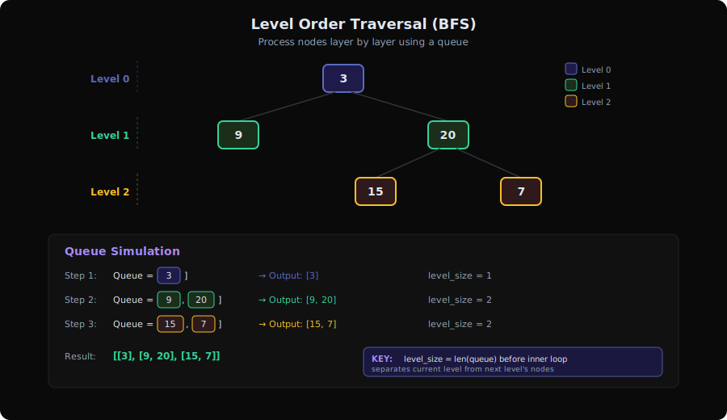
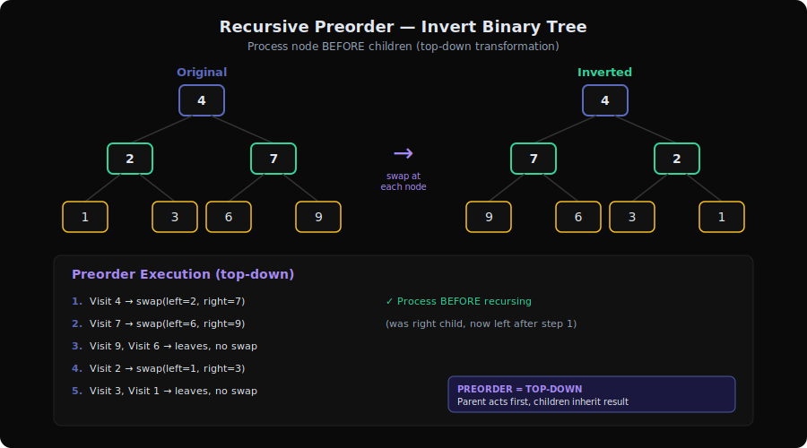
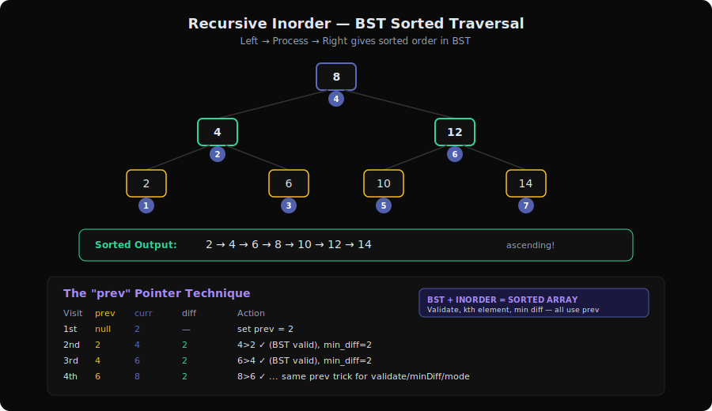
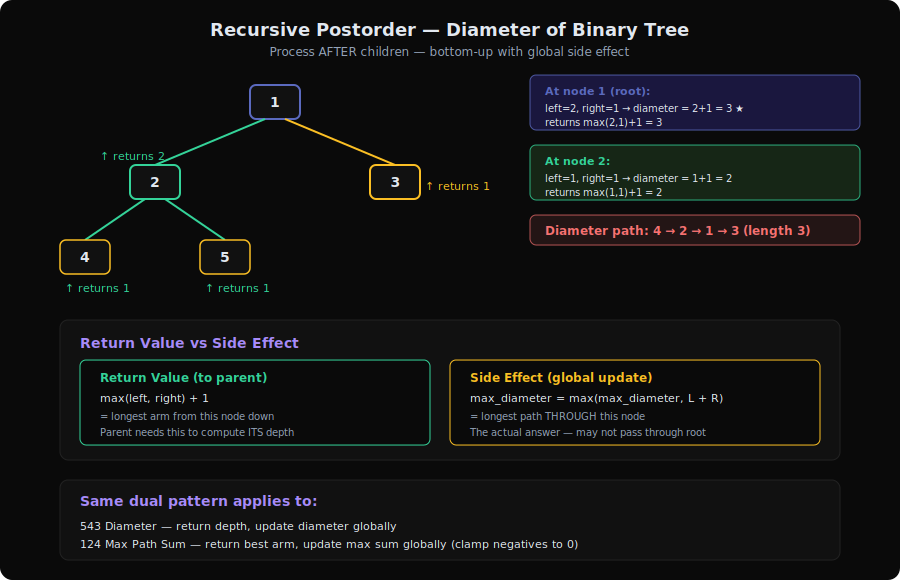
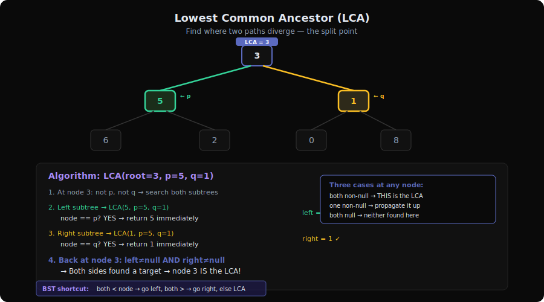
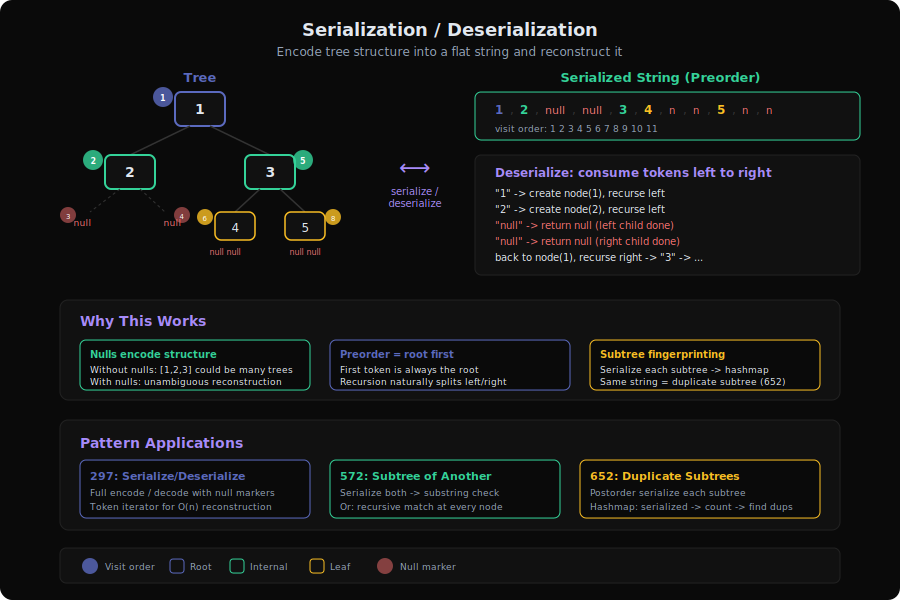

# Tree Traversal Patterns Deep Dive

Tree traversal is the backbone of almost every tree problem. The key insight: **every tree problem reduces to choosing the right traversal order** and deciding what to compute at each node. The traversal order determines when you process a node relative to its children — and that single choice dictates which problems each traversal can solve elegantly.

**6 Sub-Patterns, 33 Problems**

| # | Sub-Pattern | Problems | Core Idea |
|---|------------|----------|-----------|
| 1 | Level Order Traversal | 5 | BFS layer by layer — use a queue |
| 2 | Recursive Preorder | 7 | Process node BEFORE children — top-down |
| 3 | Recursive Inorder | 6 | Process node BETWEEN children — sorted order in BST |
| 4 | Recursive Postorder | 10 | Process node AFTER children — bottom-up aggregation |
| 5 | Lowest Common Ancestor | 2 | Find where two paths diverge |
| 6 | Serialization/Deserialization | 3 | Encode tree structure into flat format and back |

---

## 1. Level Order Traversal Pattern



**Problems**: 102 (Binary Tree Level Order Traversal), 103 (Zigzag Level Order Traversal), 199 (Binary Tree Right Side View), 515 (Find Largest Value in Each Tree Row), 1161 (Maximum Level Sum of a Binary Tree)

### What is it?
Imagine reading a family tree chart from top to bottom, left to right — that's level order traversal. You visit every person on the same floor before going down to the next floor.

Given this tree:
```
        3
       / \
      9   20
         / \
        15   7
```
Level order visits: `[[3], [9, 20], [15, 7]]` — one list per floor.

### The Queue-Based Process (Visualized)
```
Queue: [3]          → Process level 0: [3]
Queue: [9, 20]      → Process level 1: [9, 20]
Queue: [15, 7]      → Process level 2: [15, 7]
Queue: []           → Done!

Step by step:
  Dequeue 3  → enqueue children 9, 20     → level 0 result: [3]
  Dequeue 9  → no children                |
  Dequeue 20 → enqueue children 15, 7     → level 1 result: [9, 20]
  Dequeue 15 → no children                |
  Dequeue 7  → no children                → level 2 result: [15, 7]
```

### Core Template (with walkthrough)
```
function levelOrder(root):
    if root is null: return []

    result = []
    queue = [root]                    // Start with root

    while queue is not empty:
        level_size = len(queue)       // KEY: snapshot current level size
        level_values = []

        for i in 0..level_size:       // Process exactly this many nodes
            node = queue.dequeue()
            level_values.append(node.val)

            if node.left:  queue.enqueue(node.left)   // Next level
            if node.right: queue.enqueue(node.right)   // Next level

        result.append(level_values)

    return result
```
**The key line is `level_size = len(queue)`** — by capturing the queue size before processing, you know exactly how many nodes belong to the current level. Everything enqueued during processing belongs to the next level.

### How to Recognize This Pattern
- "Level by level" or "layer by layer" in the problem statement
- "Right side view" → last node of each level
- "Largest/smallest value per level" → aggregate per level
- "Zigzag" → alternate direction per level
- Any problem requiring you to group nodes by their depth

### Key Insight / Trick
**The level boundary trick**: `level_size = len(queue)` before the inner loop. This separates BFS into discrete levels. Without it, BFS is just "visit all nodes" — with it, you get structured level-by-level access.

For **zigzag**: just reverse every other level's list (or use a deque and alternate append direction).
For **right side view**: only keep the last element of each level.
For **max per level**: track max during the inner loop.

### Variations & Edge Cases
- **Zigzag (103)**: Reverse every odd-indexed level, or use a deque
- **Right side view (199)**: Only add `level_values[-1]` to result
- **Max per row (515)**: Track `max_val` in inner loop
- **Max level sum (1161)**: Sum each level, track which level has max
- **Empty tree**: Always handle `root is null` upfront
- **Single node**: Returns `[[root.val]]`

### Questions Detail
| # | Title | Difficulty | Key Twist |
|---|-------|-----------|-----------|
| 102 | Binary Tree Level Order Traversal | Medium | The base pattern — straightforward BFS with level grouping. Master this and every variation becomes a one-line modification. |
| 103 | Binary Tree Zigzag Level Order Traversal | Medium | Same BFS but reverse every other level. The trick is tracking level index parity — odd levels get reversed. Can also use a deque with alternating append sides. |
| 199 | Binary Tree Right Side View | Medium | Only the last node of each BFS level is visible. Instead of collecting all values, just keep overwriting until the level ends — the last value wins. |
| 515 | Find Largest Value in Each Tree Row | Medium | Replace the level collection with a running max. Initialize to negative infinity at each level start, update as you process nodes. |
| 1161 | Maximum Level Sum of a Binary Tree | Medium | Sum each level (not just max element), then find which level has the maximum sum. Track both the sum and the level index. 1-indexed levels. |

---

## 2. Recursive Preorder Pattern



**Problems**: 226 (Invert Binary Tree), 100 (Same Tree), 101 (Symmetric Tree), 105 (Construct Binary Tree from Preorder and Inorder), 114 (Flatten Binary Tree to Linked List), 257 (Binary Tree Paths), 988 (Smallest String Starting From Leaf)

### What is it?
Preorder means **"me first, then my children"**. Like a manager who makes a decision before delegating to their team.

Think of painting a house from the roof down: you paint each section before moving to the sections below it. By the time you reach the leaves, every ancestor has already been processed.

```
        1
       / \
      2   3
     / \
    4   5

Preorder visit: 1 → 2 → 4 → 5 → 3
(Process root, then left subtree, then right subtree)
```

### The Decision Tree (Visualized)
```
preorder(1)
├── PROCESS 1               ← do work HERE (before children)
├── preorder(2)
│   ├── PROCESS 2
│   ├── preorder(4)
│   │   ├── PROCESS 4
│   │   ├── preorder(null) → return
│   │   └── preorder(null) → return
│   └── preorder(5)
│       ├── PROCESS 5
│       ├── preorder(null) → return
│       └── preorder(null) → return
└── preorder(3)
    ├── PROCESS 3
    ├── preorder(null) → return
    └── preorder(null) → return
```

### Core Template (with walkthrough)
```
function preorder(node, state):
    if node is null: return

    // ★ PROCESS NODE HERE (before children) ★
    // This is where you do work: modify, compare, accumulate
    do_something(node, state)

    preorder(node.left, state)     // Recurse left
    preorder(node.right, state)    // Recurse right
```

**For Invert Binary Tree (226)**: the "do_something" is `swap(node.left, node.right)`.
**For Same Tree (100)**: the "do_something" is `check if p.val == q.val`, and recurse on both trees simultaneously.
**For Binary Tree Paths (257)**: the state is the current path string, and at leaves you add it to results.

### How to Recognize This Pattern
- You need to **pass information down** from parent to children
- The problem says "from root to leaf" or "top-down"
- You need to **modify the tree structure** (like inverting or flattening)
- You're **constructing a tree** from traversal orders
- The parent's value/state affects how children are processed

### Key Insight / Trick
**Top-down information flow**: Preorder is the natural choice when parents dictate children's behavior. The parent is processed first, so it can set up state (path so far, target value, transformations) that children inherit.

For **Invert Binary Tree**: swap children at each node before recursing — by the time recursion finishes, the entire tree is mirrored.
For **Construct from Preorder+Inorder**: the first element of preorder is always the root. Use inorder to determine which elements go left vs right. This is why preorder + inorder uniquely defines a tree.

### Variations & Edge Cases
- **Two-tree traversal (100, 101)**: Recurse on two nodes simultaneously — compare them at each step
- **Path accumulation (257, 988)**: Pass current path as parameter, collect at leaves
- **Tree construction (105)**: Use hashmap for O(1) inorder index lookup
- **Flatten to linked list (114)**: Save right child before overwriting, use Morris-like rewiring
- **Symmetric check (101)**: Compare left.left with right.right AND left.right with right.left

### Questions Detail
| # | Title | Difficulty | Key Twist |
|---|-------|-----------|-----------|
| 226 | Invert Binary Tree | Easy | The canonical preorder modification: swap left and right children before recursing. Works because each subtree is independently invertible. Three lines of code. |
| 100 | Same Tree | Easy | Two-tree simultaneous traversal. Compare values at each position, recurse in lockstep. Both null = true, one null = false, different values = false. |
| 101 | Symmetric Tree | Easy | Like Same Tree but mirrored: compare left.left↔right.right and left.right↔right.left. Can also solve with BFS checking level palindromes. |
| 105 | Construct Binary Tree from Preorder and Inorder Traversal | Medium | First preorder element = root. Find it in inorder to split left/right subtrees. Use a hashmap for O(1) inorder lookups. Maintain index boundaries instead of slicing arrays. |
| 114 | Flatten Binary Tree to Linked List | Medium | Rewire tree in-place to a right-skewed linked list in preorder. The trick: process right subtree first (reverse preorder), maintain a `prev` pointer. Or: for each node, find left subtree's rightmost node, link it to right child, move left to right. |
| 257 | Binary Tree Paths | Easy | Classic path accumulation. Pass current path string down, at leaf nodes add to result. Use "→" separator. String building vs backtracking tradeoff. |
| 988 | Smallest String Starting From Leaf | Medium | Like Binary Tree Paths but bottom-up: build string from leaf to root (reverse). Compare lexicographically at each leaf. Tricky because you can't just prepend — you need to compare full paths. |

---

## 3. Recursive Inorder Pattern



**Problems**: 94 (Binary Tree Inorder Traversal), 98 (Validate Binary Search Tree), 173 (BST Iterator), 230 (Kth Smallest Element in a BST), 501 (Find Mode in BST), 530 (Minimum Absolute Difference in BST)

### What is it?
Inorder means **"left first, then me, then right"**. In a Binary Search Tree, this visits nodes in **sorted ascending order** — that's the killer feature.

Imagine reading a bookshelf where books are organized: you read everything on the left shelf, then the current book, then everything on the right shelf.

```
        4
       / \
      2   6
     / \ / \
    1  3 5  7

Inorder: 1 → 2 → 3 → 4 → 5 → 6 → 7  (sorted!)
```

### The Decision Tree (Visualized)
```
inorder(4)
├── inorder(2)
│   ├── inorder(1)
│   │   ├── inorder(null) → return
│   │   ├── PROCESS 1            ← first!
│   │   └── inorder(null) → return
│   ├── PROCESS 2                ← second
│   └── inorder(3)
│       ├── inorder(null) → return
│       ├── PROCESS 3            ← third
│       └── inorder(null) → return
├── PROCESS 4                    ← fourth (middle!)
└── inorder(6)
    ├── inorder(5)
    │   ├── ...
    │   ├── PROCESS 5            ← fifth
    │   └── ...
    ├── PROCESS 6                ← sixth
    └── inorder(7)
        ├── ...
        ├── PROCESS 7            ← seventh (last)
        └── ...
```

### Core Template (with walkthrough)
```
function inorder(node):
    if node is null: return

    inorder(node.left)            // Go left first

    // ★ PROCESS NODE HERE (between children) ★
    // In BST: nodes arrive in sorted order
    // Use prev_node to compare consecutive values
    do_something(node)

    inorder(node.right)           // Then go right

// Common variant: tracking previous value
prev = null
function inorder_with_prev(node):
    if node is null: return
    inorder_with_prev(node.left)

    if prev is not null:
        // Compare node.val with prev.val
        // (for BST validation, min diff, mode finding)
    prev = node

    inorder_with_prev(node.right)
```

**The `prev` variable pattern** is central to BST inorder problems. Since nodes arrive sorted, consecutive comparisons let you validate BST property, find minimum differences, and detect modes.

### How to Recognize This Pattern
- The tree is a **BST** (Binary Search Tree)
- Problem asks for sorted order, kth smallest/largest, or predecessor/successor
- You need to compare **consecutive elements** in sorted order
- "Validate BST" — inorder must be strictly increasing
- Finding minimum difference, mode, or median in a BST

### Key Insight / Trick
**BST + Inorder = sorted array**. Any problem you can solve on a sorted array, you can solve on a BST with inorder traversal — without actually creating the array. The `prev` pointer simulates the "previous element in sorted order."

For **BST Validation (98)**: each node must be greater than `prev`. If you ever see `node.val <= prev.val`, it's invalid.
For **Kth Smallest (230)**: count nodes during inorder, stop at k.
For **Min Diff (530)**: track `min(node.val - prev.val)` across all consecutive pairs.

### Variations & Edge Cases
- **Iterative with stack (94, 173)**: Push all left children, pop and process, go right. Essential for the iterator pattern.
- **Early termination (230)**: Don't traverse the whole tree — stop when you've found the kth element
- **Mode finding (501)**: Track current streak count and max streak count during inorder
- **Negative values**: Min diff is always non-negative in BST (since sorted ascending)
- **Duplicate values**: BST definition varies — some allow `<=` in left subtree

### Questions Detail
| # | Title | Difficulty | Key Twist |
|---|-------|-----------|-----------|
| 94 | Binary Tree Inorder Traversal | Easy | The foundation: implement inorder iteratively using an explicit stack. Push left children until null, pop and process, go right. Understanding this stack simulation unlocks BST Iterator (173). |
| 98 | Validate Binary Search Tree | Medium | Inorder must be strictly increasing. Track `prev` value — if any `node.val <= prev`, return false. Common pitfall: checking only parent-child, not entire subtree bounds. Also solvable with min/max range passed down (preorder approach). |
| 173 | Binary Search Tree Iterator | Medium | Amortized O(1) next() using controlled inorder with a stack. Push all left children in constructor. next(): pop, push right child's left chain. The stack never holds more than O(h) nodes. |
| 230 | Kth Smallest Element in a BST | Medium | Inorder traversal with a counter. Decrement k at each visit, return when k hits 0. Can optimize with augmented tree (store subtree sizes) for repeated queries. |
| 501 | Find Mode in Binary Search Tree | Easy | Inorder gives sorted values. Track current value streak length vs max streak. If current streak equals max, add to result. If exceeds max, reset result. Two-pass (find max freq, then collect) or single-pass with list reset. |
| 530 | Minimum Absolute Difference in BST | Easy | Inorder traversal tracking `prev`. At each node, compute `node.val - prev.val` (always positive since sorted). Track global minimum. The answer is always between consecutive inorder values. |

---

## 4. Recursive Postorder Pattern



**Problems**: 104 (Maximum Depth), 110 (Balanced Binary Tree), 124 (Binary Tree Maximum Path Sum), 145 (Binary Tree Postorder Traversal), 337 (House Robber III), 366 (Find Leaves of Binary Tree), 543 (Diameter of Binary Tree), 863 (All Nodes Distance K), 1110 (Delete Nodes and Return Forest), 2458 (Height After Subtree Removal Queries)

### What is it?
Postorder means **"children first, then me"**. Like a company where every employee reports their results upward — you can't make your decision until you've heard from your entire team.

This is the **bottom-up aggregation** pattern: compute something about each subtree and bubble the result up to the parent.

```
        1
       / \
      2   3
     / \
    4   5

Postorder: 4 → 5 → 2 → 3 → 1
(Children fully processed before parent)
```

### The Decision Tree (Visualized)
```
postorder(1)
├── postorder(2)
│   ├── postorder(4)
│   │   ├── postorder(null) → return 0
│   │   ├── postorder(null) → return 0
│   │   └── PROCESS 4: depth = max(0,0)+1 = 1    ← leaf
│   ├── postorder(5)
│   │   ├── postorder(null) → return 0
│   │   ├── postorder(null) → return 0
│   │   └── PROCESS 5: depth = max(0,0)+1 = 1    ← leaf
│   └── PROCESS 2: depth = max(1,1)+1 = 2        ← uses children's results
├── postorder(3)
│   ├── postorder(null) → return 0
│   ├── postorder(null) → return 0
│   └── PROCESS 3: depth = max(0,0)+1 = 1
└── PROCESS 1: depth = max(2,1)+1 = 3            ← final answer
```

### Core Template (with walkthrough)
```
function postorder(node):
    if node is null: return BASE_VALUE   // e.g., 0 for depth, true for balanced

    left_result = postorder(node.left)    // Get left subtree's answer
    right_result = postorder(node.right)  // Get right subtree's answer

    // ★ PROCESS NODE HERE (after children) ★
    // Combine left_result and right_result
    // Optionally update a global variable (diameter, max path sum)
    return combine(left_result, right_result, node.val)

// Example: Maximum Depth (104)
function maxDepth(node):
    if node is null: return 0
    left = maxDepth(node.left)
    right = maxDepth(node.right)
    return max(left, right) + 1

// Example: Diameter (543) — postorder with global update
global max_diameter = 0
function depth(node):
    if node is null: return 0
    left = depth(node.left)
    right = depth(node.right)
    max_diameter = max(max_diameter, left + right)  // Update global
    return max(left, right) + 1                      // Return to parent
```

### How to Recognize This Pattern
- You need information from **both subtrees** to answer the question at a node
- "Height", "depth", "diameter", "balanced" — all bottom-up computations
- "Maximum path sum" — combine left and right path values
- The answer for a subtree depends on answers from its sub-subtrees
- "Delete nodes and return remaining trees" — restructure bottom-up

### Key Insight / Trick
**Return value vs side effect**: Many postorder problems need BOTH:
1. A **return value** bubbled up to the parent (e.g., depth of subtree)
2. A **global/side-effect update** using both children's values (e.g., diameter = left + right)

This dual purpose is what makes problems like Diameter (543) and Maximum Path Sum (124) tricky. The return value and the answer are different things.

For **Diameter**: return `max(left, right) + 1` (longest arm) but update global with `left + right` (full path through node).
For **Max Path Sum**: return `max(left, right) + node.val` (best single-arm path) but update global with `left + right + node.val` (full path through node). Clamp negative arms to 0.

### Variations & Edge Cases
- **Balanced check (110)**: Return -1 to signal "unbalanced" — short-circuit propagation
- **House Robber III (337)**: Return a pair (rob_this, skip_this) — DP on tree
- **Find Leaves (366)**: Group nodes by height (leaves = 0, their parents = 1, etc.)
- **Negative values (124)**: Clamp subtree contributions to 0 — don't extend negative paths
- **Distance K (863)**: Convert tree to graph first, then BFS from target

### Questions Detail
| # | Title | Difficulty | Key Twist |
|---|-------|-----------|-----------|
| 104 | Maximum Depth of Binary Tree | Easy | The purest postorder: `max(left_depth, right_depth) + 1`. Base case: null returns 0. Three lines of code, foundational for everything else in this section. |
| 110 | Balanced Binary Tree | Easy | Postorder depth computation with early termination. If any subtree is unbalanced (height diff > 1), return -1 as sentinel. Propagate -1 upward to avoid unnecessary computation. |
| 124 | Binary Tree Maximum Path Sum | Hard | The hardest tree problem. At each node, compute best path through it (left + node + right) and update global max. But return only the best single-arm extension (max(left, right) + node). Negative arms clamped to 0. |
| 145 | Binary Tree Postorder Traversal | Easy | Implement postorder iteratively. Trick: do modified preorder (root → right → left) and reverse the result, or use two stacks. More complex than iterative preorder/inorder. |
| 337 | House Robber III | Medium | Tree DP: each node returns a pair (rob_this_node, skip_this_node). If robbing: add node.val + skip_left + skip_right. If skipping: add max(rob_left, skip_left) + max(rob_right, skip_right). |
| 366 | Find Leaves of Binary Tree | Medium | Assign each node its "height from bottom" (leaves = 0). Group nodes by this height. Equivalent to postorder where return value is `max(left_height, right_height) + 1`, but collect nodes at each height level. |
| 543 | Diameter of Binary Tree | Easy | Classic "return vs side effect" problem. Return depth to parent, but update global diameter with `left_depth + right_depth` at each node. Diameter may not pass through root. |
| 863 | All Nodes Distance K in Binary Tree | Medium | Not pure postorder — convert tree to undirected graph (add parent pointers or adjacency list), then BFS from target node for K steps. The tree structure becomes a graph problem. |
| 1110 | Delete Nodes and Return Forest | Medium | Postorder deletion: process children first, then decide if current node should be deleted. If deleted, its non-null children become new roots. Return null to parent to sever the link. Collect roots in a result set. |
| 2458 | Height of Binary Tree After Subtree Removal Queries | Hard | Precompute heights, then for each query, answer in O(1). Need to know: for each node, what's the tree height if this subtree is removed? Precompute max height from nodes NOT in this subtree using level-order with first and second maximums per level. |

---

## 5. Lowest Common Ancestor Pattern



**Problems**: 236 (Lowest Common Ancestor of a Binary Tree), 235 (Lowest Common Ancestor of a BST)

### What is it?
The LCA of two nodes is the **deepest node that is an ancestor of both**. Think of it as finding where two family members' lineages first converge going back in time.

```
        3
       / \
      5   1
     / \ / \
    6  2 0  8
      / \
     7   4

LCA(5, 1) = 3    (3 is the first shared ancestor)
LCA(5, 4) = 5    (5 is ancestor of both 5 and 4)
LCA(6, 4) = 5    (5 is where paths to 6 and 4 diverge)
```

### The Decision Tree (Visualized)
```
LCA(root=3, p=5, q=1):
├── LCA(5, p=5, q=1)
│   ├── LCA(6, p=5, q=1) → null (neither found)
│   ├── LCA(2, p=5, q=1) → null (neither found)
│   └── node==p? YES → return 5        ← found p!
├── LCA(1, p=5, q=1)
│   ├── LCA(0, ...) → null
│   ├── LCA(8, ...) → null
│   └── node==q? YES → return 1        ← found q!
└── left=5, right=1, BOTH non-null
    → return 3                          ← THIS is the LCA!
```

### Core Template (with walkthrough)
```
// General Binary Tree LCA (236)
function lowestCommonAncestor(node, p, q):
    if node is null: return null      // Base: reached beyond leaf
    if node == p or node == q:        // Found one of the targets
        return node

    left = lowestCommonAncestor(node.left, p, q)    // Search left
    right = lowestCommonAncestor(node.right, p, q)  // Search right

    if left != null AND right != null:  // Both sides found something
        return node                      // Current node IS the LCA

    return left != null ? left : right  // Propagate whichever side found something

// BST-optimized LCA (235)
function lcaBST(node, p, q):
    if p.val < node.val AND q.val < node.val:
        return lcaBST(node.left, p, q)     // Both in left subtree
    if p.val > node.val AND q.val > node.val:
        return lcaBST(node.right, p, q)    // Both in right subtree
    return node                             // Split point = LCA
```

### How to Recognize This Pattern
- "Lowest/nearest common ancestor" directly in the problem
- Finding where two paths diverge or converge in a tree
- Distance between two nodes (often = depth(p) + depth(q) - 2*depth(LCA))
- Any problem needing the "meeting point" of two nodes

### Key Insight / Trick
**The split point**: In the general tree, the LCA is the first node where p and q end up on different sides (left and right subtrees). In a BST, the split point is where one value is ≤ node and the other is ≥ node — you can navigate there in O(h) without searching the whole tree.

The recursive solution is elegant because it handles ALL edge cases:
- If p is ancestor of q: we hit `node == p` before finding q in p's subtree
- If they're on different sides: both left and right return non-null
- If they're in the same subtree: only one side returns non-null, propagated up

### Variations & Edge Cases
- **BST optimization (235)**: O(h) instead of O(n) — use BST property to navigate directly
- **p is ancestor of q**: The algorithm naturally handles this — `node == p` returns immediately
- **p == q**: Returns p (or q) — trivially correct
- **Node guaranteed to exist**: Both problems assume p and q exist in the tree

### Questions Detail
| # | Title | Difficulty | Key Twist |
|---|-------|-----------|-----------|
| 236 | Lowest Common Ancestor of a Binary Tree | Medium | The general case: postorder search both subtrees. If both return non-null, current node is LCA. If only one returns non-null, propagate it up. Handles all cases including p being ancestor of q. O(n) time. |
| 235 | Lowest Common Ancestor of a BST | Medium | BST property makes this O(h): if both values are smaller, go left; if both larger, go right; otherwise current node is the split point (LCA). Can be done iteratively — no recursion needed. |

---

## 6. Serialization/Deserialization Pattern



**Problems**: 297 (Serialize and Deserialize Binary Tree), 572 (Subtree of Another Tree), 652 (Find Duplicate Subtrees)

### What is it?
Serialization is converting a tree into a flat string (or array) that **uniquely represents its structure**, and deserialization is reconstructing the tree from that string.

Think of it as saving a 3D sculpture as a blueprint — you need to capture enough information to rebuild it exactly, including where the "empty spaces" (null nodes) are.

```
Tree:          Serialized:
    1          "1,2,null,null,3,4,null,null,5,null,null"
   / \         (preorder with null markers)
  2   3
     / \
    4   5
```

### The Process (Visualized)
```
Serialize (preorder with nulls):
    visit(1) → "1,"
    visit(2) → "2,"
    visit(null) → "null,"
    visit(null) → "null,"
    visit(3) → "3,"
    visit(4) → "4,"
    visit(null) → "null,"
    visit(null) → "null,"
    visit(5) → "5,"
    visit(null) → "null,"
    visit(null) → "null,"

Result: "1,2,null,null,3,4,null,null,5,null,null"

Deserialize (consume tokens left to right):
    token "1" → create node(1)
        token "2" → create node(2), set as left child
            token "null" → left child = null
            token "null" → right child = null
        token "3" → create node(3), set as right child
            token "4" → create node(4), set as left child
                ...
```

### Core Template (with walkthrough)
```
// Serialize: preorder traversal, record nulls
function serialize(node):
    if node is null: return "null"
    return str(node.val) + "," + serialize(node.left) + "," + serialize(node.right)

// Deserialize: consume tokens from iterator
function deserialize(data):
    tokens = data.split(",")
    index = 0                          // Use shared index or iterator

    function build():
        if tokens[index] == "null":
            index++
            return null

        node = new TreeNode(int(tokens[index]))
        index++
        node.left = build()            // Next tokens are left subtree
        node.right = build()           // Remaining tokens are right subtree
        return node

    return build()
```

**Why preorder?** The root is first, which makes reconstruction straightforward — you immediately know the root, then recursively build left and right subtrees from the remaining tokens.

**Why include nulls?** Without null markers, you can't distinguish between different tree shapes that have the same values. The nulls encode the structure.

### How to Recognize This Pattern
- "Serialize" or "deserialize" in the problem title
- Need to convert tree to string/array and back
- Comparing tree structures for equality (subtree matching, duplicate detection)
- Any problem where you need a **canonical string representation** of a subtree

### Key Insight / Trick
**Subtree hashing**: For problems like Find Duplicate Subtrees (652), serialize each subtree as a string during postorder traversal. Use a hashmap to detect duplicates. The serialized string is a unique fingerprint of the subtree's structure and values.

For **Subtree of Another Tree (572)**: serialize both trees and check if tree s's serialization is a substring of tree t's serialization. Or recursively check at each node if the subtrees match.

### Variations & Edge Cases
- **Level-order serialization**: Use BFS — simpler for some implementations but trickier for reconstruction
- **Subtree matching (572)**: Can use serialization + string matching, or recursive comparison at every node
- **Duplicate subtrees (652)**: Postorder serialization of each subtree → hashmap to find duplicates
- **Empty tree**: Serialize as "null", deserialize "null" returns null
- **Negative values & multi-digit numbers**: Use a delimiter (comma) — don't assume single chars

### Questions Detail
| # | Title | Difficulty | Key Twist |
|---|-------|-----------|-----------|
| 297 | Serialize and Deserialize Binary Tree | Hard | The full pattern: preorder traversal with null markers for serialize, token iterator for deserialize. The key is that null markers make the serialization unambiguous — no second traversal needed. Level-order also works with queue-based approach. |
| 572 | Subtree of Another Tree | Easy | Check if tree s appears as a subtree of tree t. Approach 1: at each node in t, check if subtree matches s (O(m*n)). Approach 2: serialize both trees, check substring containment (be careful with delimiter to avoid false matches like "12" matching "2"). |
| 652 | Find Duplicate Subtrees | Medium | Postorder traversal: serialize each subtree as a string, store in hashmap (serialization → count). When count hits 2, add root to result. The serialization acts as a structural fingerprint. Optimization: use integer IDs instead of full strings to avoid string comparison overhead. |

---

## Pattern Comparison Table

| Aspect | Level Order | Preorder | Inorder | Postorder | LCA | Serialization |
|--------|------------|----------|---------|-----------|-----|---------------|
| Process order | Layer by layer | Root → Left → Right | Left → Root → Right | Left → Right → Root | Postorder search | Preorder (encode) / Token stream (decode) |
| Data structure | Queue | Call stack | Call stack | Call stack | Call stack | String + Iterator |
| Direction | Top-down, breadth | Top-down, depth | In-between | Bottom-up | Bottom-up search | Both |
| Information flow | Level grouping | Parent → child | Sorted sequence (BST) | Children → parent | Both subtrees → parent | Structure ↔ flat |
| When to use | Level-wise ops | Modify/construct | BST operations | Aggregate subtrees | Find meeting point | Encode/compare structure |
| Time complexity | O(n) | O(n) | O(n) | O(n) | O(n) or O(h) for BST | O(n) |
| Space complexity | O(w) width | O(h) height | O(h) height | O(h) height | O(h) height | O(n) |
| Key variable | `level_size` | State parameter | `prev` pointer | Return value | Left/right results | Token index |

### When to Use Which Traversal — Decision Guide

```
Is it a BST problem (sorted order, kth element, validation)?
  → YES: Inorder (Pattern 3)

Do you need level-by-level information?
  → YES: Level Order / BFS (Pattern 1)

Do you need to pass info DOWN from parent to children?
  → YES: Preorder (Pattern 2)

Do you need to compute a result FROM children and bubble it UP?
  → YES: Postorder (Pattern 4)

Need to find where two nodes' paths diverge?
  → YES: LCA (Pattern 5)

Need to encode tree structure as a string/compare structures?
  → YES: Serialization (Pattern 6)
```

---

## Code References
- `server/patterns.py:25-32` — Tree Traversal category definition
- `server/patterns.py:362-367` — Reverse lookup (problem → pattern)
- `server/main.py:307-369` — API endpoint
- `extension/patterns.js` — Client-side pattern labels
