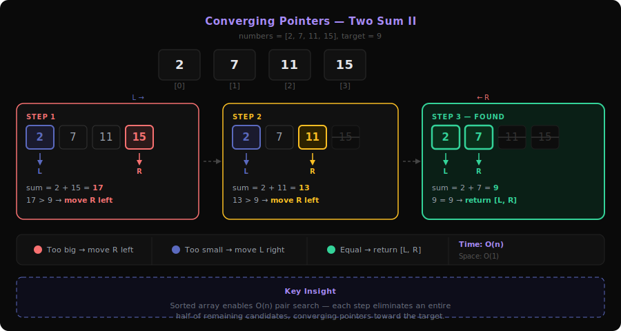
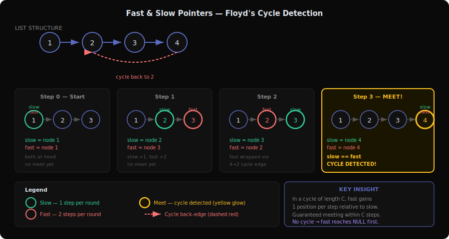
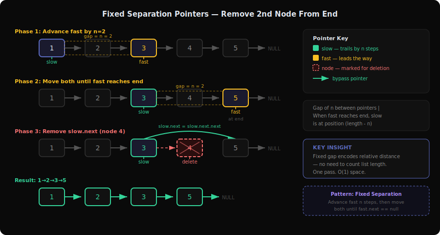
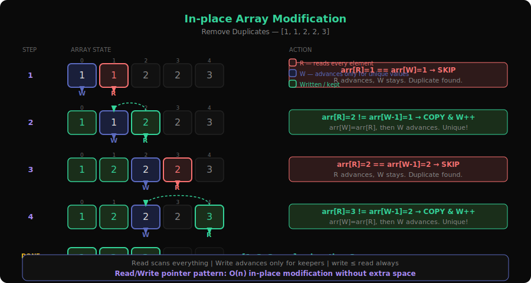
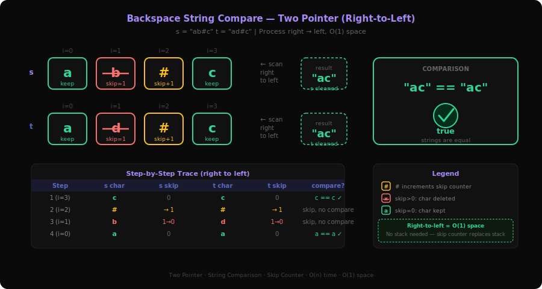
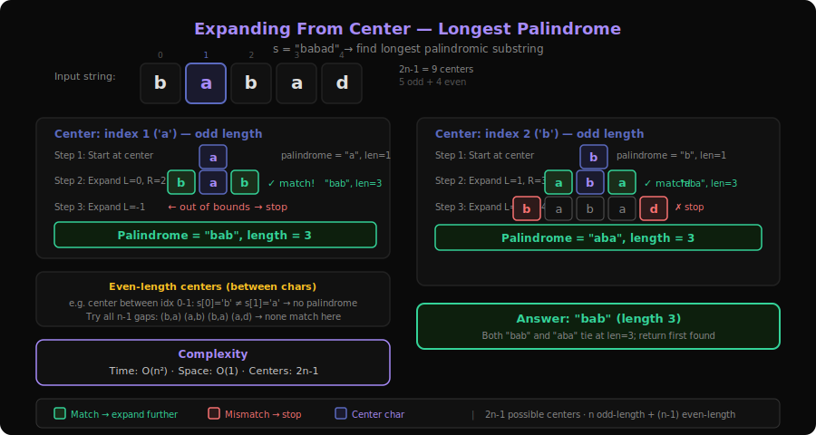
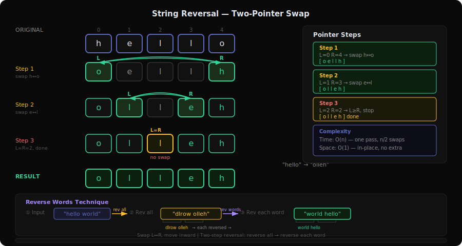

# Two Pointers Patterns Deep Dive

Two pointers is one of the most versatile array/string techniques. The core idea: instead of a single index scanning linearly, use **two indices** that move strategically to exploit some ordering or structural property, turning O(n²) brute force into O(n) or O(n log n).

This document covers all 7 sub-patterns with 34 problems from `server/patterns.py`.

---

## 1. Converging Pointers Pattern



**Problems**: 11 (Container With Most Water), 15 (3Sum), 16 (3Sum Closest), 18 (4Sum), 167 (Two Sum II), 349 (Intersection of Two Arrays), 881 (Boats to Save People), 977 (Squares of Sorted Array), 259 (3Sum Smaller)

### What is it?

Imagine two people standing at opposite ends of a hallway, walking toward each other. At each step, they decide who should move based on what they see. This is the **converging (shrinking window)** pattern — left pointer starts at the beginning, right pointer at the end, and they move inward until they meet.

**Concrete example**: Two Sum II — `numbers = [2, 7, 11, 15]`, target = 9

```
left=0, right=3: 2 + 15 = 17 > 9 → move right ←
left=0, right=2: 2 + 11 = 13 > 9 → move right ←
left=0, right=1: 2 + 7  = 9  = target → FOUND ✓
Answer: [1, 2] (1-indexed)
```

**Why it works**: Array is sorted. If sum is too big, moving right pointer left decreases it. If sum is too small, moving left pointer right increases it. We never miss the answer because we only eliminate pairs that provably can't work.

### The Decision Tree (Visualized)

```
numbers = [2, 7, 11, 15], target = 9

  L                   R
  ↓                   ↓
 [2,   7,   11,  15]     sum=17 > 9 → R moves left

  L              R
  ↓              ↓
 [2,   7,   11,  15]     sum=13 > 9 → R moves left

  L         R
  ↓         ↓
 [2,   7,   11,  15]     sum=9 = target → FOUND ✓

Key: Too big → shrink from right
     Too small → shrink from left
     Equal → found answer
```

### Core Template (with walkthrough)

```
function twoSumSorted(nums, target):
    left = 0
    right = len(nums) - 1

    while left < right:
        sum = nums[left] + nums[right]
        if sum == target:
            return [left, right]        // found the pair
        else if sum < target:
            left += 1                   // need bigger sum
        else:
            right -= 1                  // need smaller sum

    return []                           // no pair found
```

**For 3Sum/4Sum**: Fix one (or two) elements with an outer loop, then run two-pointer on the remaining subarray. Sort first to enable the technique.

```
function threeSum(nums, target=0):
    sort(nums)
    results = []

    for i = 0 to n-3:
        if i > 0 and nums[i] == nums[i-1]: continue  // skip duplicates
        left = i + 1
        right = n - 1
        while left < right:
            sum = nums[i] + nums[left] + nums[right]
            if sum == target:
                results.add([nums[i], nums[left], nums[right]])
                while left < right and nums[left] == nums[left+1]: left++  // skip dupes
                while left < right and nums[right] == nums[right-1]: right-- // skip dupes
                left++; right--
            else if sum < target: left++
            else: right--

    return results
```

### How to Recognize This Pattern

- Array is **sorted** (or can be sorted without losing information)
- Looking for **pairs/triplets/quadruplets** that satisfy a sum condition
- "Find two numbers that..." with a sorted array
- Container/area problems where you want to maximize something bounded by two endpoints
- Look for: **sorted + pair search + sum/product constraint**

### Key Insight / Trick

Sorting is the enabler. Once sorted, the two-pointer approach works because each pointer movement **monotonically changes the sum** in one direction. Moving left pointer right can only increase the sum; moving right pointer left can only decrease it. This means we can eliminate large portions of the search space with each decision.

For **Container With Most Water** (11), the insight is different: you always move the pointer pointing to the shorter line, because moving the taller one can only decrease the area (width shrinks, height can't increase past the shorter side).

### Variations & Edge Cases

- **Duplicate handling** (15, 18): Skip consecutive equal elements after finding a result
- **Closest sum** (16): Track minimum difference instead of exact match
- **k-Sum generalization** (18): Nest k-2 loops + two-pointer for the innermost pair
- **Unsorted input** (349): Sort first, or use hash set — two-pointer is optional
- **Squares of sorted array** (977): Two pointers from both ends, place largest square at the end of result

### Questions Detail

| # | Title | Difficulty | Key Twist |
|---|-------|-----------|-----------|
| 11 | Container With Most Water | Medium | Not a sum problem — maximize area between two lines. Always move the shorter line's pointer because moving the taller one cannot improve area. Width decreases by 1 each step, so we need height gains to compensate. |
| 15 | 3Sum | Medium | Sort + fix one element + two-pointer for remaining pair. The main challenge is **duplicate avoidance** — skip equal elements at all three levels. O(n²) overall. The canonical multi-pointer problem. |
| 16 | 3Sum Closest | Medium | Like 3Sum but find closest sum to target instead of exact. Track `minDiff = abs(sum - target)` and update answer when smaller diff found. No duplicate result concern since we want just one answer. |
| 18 | 4Sum | Medium | Extension of 3Sum — two nested loops + two-pointer. O(n³). Same dedup logic at four levels. Beware integer overflow when summing four numbers — use long/bigint. |
| 167 | Two Sum II | Medium | Pure sorted two-pointer. The "hello world" of converging pointers. Exactly one solution guaranteed. 1-indexed output. |
| 349 | Intersection of Two Arrays | Easy | Sort both arrays, use two pointers to find common elements. Skip duplicates. Alternatively solvable with hash sets, but two-pointer approach is O(n log n) with O(1) extra space. |
| 881 | Boats to Save People | Medium | Sort people by weight. Pair lightest with heaviest if they fit in one boat (`people[L] + people[R] <= limit`). Greedy + converging pointers. Each iteration uses one boat. |
| 977 | Squares of Sorted Array | Easy | Input has negatives, so squares aren't sorted. Two pointers from ends — compare `abs(nums[L])` vs `abs(nums[R])`, place larger square at end of result. Fill result array right-to-left. |
| 259 | 3Sum Smaller | Medium | Count triplets with sum < target. Sort + fix one element + two-pointer. When `sum < target`, ALL pairs between left and right work → add `right - left` to count. Premium problem. |

---

## 2. Fast & Slow Pointers Pattern



**Problems**: 141 (Linked List Cycle), 202 (Happy Number), 287 (Find the Duplicate Number), 392 (Is Subsequence)

### What is it?

Think of two runners on a circular track — one runs twice as fast as the other. If the track is circular (has a cycle), the fast runner will eventually **lap** the slow runner and they'll meet. If the track is straight (no cycle), the fast runner reaches the end first.

This is **Floyd's Tortoise and Hare algorithm**. The slow pointer moves 1 step, the fast pointer moves 2 steps.

**Concrete example**: Linked List Cycle — `1 → 2 → 3 → 4 → 2` (cycle at node 2)

```
Step 0: slow=1, fast=1
Step 1: slow=2, fast=3
Step 2: slow=3, fast=2 (wrapped around)
Step 3: slow=4, fast=4 → MEET! Cycle detected ✓
```

### The Decision Tree (Visualized)

```
Linked List: 1 → 2 → 3 → 4 → 2 (cycle)

Step 0:  1 → 2 → 3 → 4
         S
         F

Step 1:  1 → 2 → 3 → 4
              S
                   F

Step 2:  1 → 2 → 3 → 4
                   S
              F         (fast wrapped: 4→2)

Step 3:  1 → 2 → 3 → 4
                        S (slow: 3→4)
                        F (fast: 2→3→4)
         MEET at 4! → Cycle exists ✓
```

### Core Template (with walkthrough)

```
function hasCycle(head):
    slow = head
    fast = head

    while fast != null AND fast.next != null:
        slow = slow.next            // 1 step
        fast = fast.next.next       // 2 steps
        if slow == fast:
            return true             // cycle detected

    return false                    // fast reached end → no cycle
```

**Finding cycle start** (follow-up):
```
    // After slow == fast:
    slow = head                     // reset slow to head
    while slow != fast:
        slow = slow.next            // both move 1 step
        fast = fast.next
    return slow                     // meeting point = cycle start
```

### How to Recognize This Pattern

- **Cycle detection** in linked list or sequence
- "Does this process terminate or loop forever?" (Happy Number)
- Finding a **duplicate** in a constrained array (pigeonhole + cycle)
- Subsequence checking with two independent iterators
- Look for: **linked structure or implicit graph with potential cycles**

### Key Insight / Trick

In a cycle of length C, the fast pointer gains 1 position per step on the slow pointer. After C steps, they'll be at the same position. This guarantees meeting within O(n) steps.

For **Find the Duplicate** (287), the array `nums` where each value is in `[1, n]` defines an implicit linked list: `index → nums[index]`. A duplicate value means two indices point to the same "node," creating a cycle. Floyd's algorithm finds the duplicate without modifying the array.

### Variations & Edge Cases

- **Happy Number** (202): The "linked list" is implicit — next node is `sum of digit squares`. Either reaches 1 (happy) or cycles (not happy)
- **Is Subsequence** (392): Not cycle detection — two pointers move through different strings at different speeds. Slow pointer on `s`, fast on `t`
- **Single node**: `fast.next` check prevents null pointer on single-node lists
- **Cycle start**: Mathematical proof — distance from head to cycle start equals distance from meeting point to cycle start (going forward)

### Questions Detail

| # | Title | Difficulty | Key Twist |
|---|-------|-----------|-----------|
| 141 | Linked List Cycle | Easy | Pure Floyd's algorithm. Slow moves 1 step, fast moves 2. If they meet → cycle. If fast hits null → no cycle. The foundational problem for this pattern. |
| 202 | Happy Number | Easy | Implicit linked list — `n → sum_of_squares(digits(n))`. Apply Floyd's to this sequence. If slow meets fast at 1 → happy. If they meet elsewhere → cycle (not happy). Can also use hash set but fast/slow is O(1) space. |
| 287 | Find the Duplicate Number | Medium | Array as implicit linked list: `f(x) = nums[x]`. Duplicate creates a cycle. Phase 1: find meeting point with fast/slow. Phase 2: find cycle entrance (= duplicate value). Brilliant reduction — no array modification, O(1) space. |
| 392 | Is Subsequence | Easy | Not classic fast/slow — two pointers on different strings. Pointer `i` on `s` (subsequence), `j` on `t` (source). Advance `j` always; advance `i` only when `s[i] == t[j]`. If `i` reaches end of `s` → true. |

---

## 3. Fixed Separation Pointers Pattern



**Problems**: 19 (Remove Nth Node From End), 876 (Middle of Linked List), 2095 (Delete Middle Node)

### What is it?

Think of measuring a specific distance in a linked list without knowing its length. You use two pointers with a **fixed gap** between them. When the front pointer reaches the end, the back pointer is at exactly the right position.

**Concrete example**: Remove 2nd node from end of `1 → 2 → 3 → 4 → 5`

```
Step 1: Advance fast by n=2 steps
  slow=1, fast=3  (gap of 2)

Step 2: Move both until fast reaches end
  slow=1, fast=3
  slow=2, fast=4
  slow=3, fast=5 (fast.next = null → stop)

Step 3: slow is at node BEFORE the target
  Remove slow.next (node 4)
  Result: 1 → 2 → 3 → 5 ✓
```

### The Decision Tree (Visualized)

```
List: 1 → 2 → 3 → 4 → 5     Remove 2nd from end

Phase 1: Create gap of n=2
  1 → 2 → 3 → 4 → 5
  S         F                  (fast is 2 ahead)

Phase 2: Advance together
  1 → 2 → 3 → 4 → 5
       S         F
  1 → 2 → 3 → 4 → 5
            S         F       (fast at end)

Result: slow.next = slow.next.next
  1 → 2 → 3 ──→ 5             (removed 4) ✓
```

### Core Template (with walkthrough)

```
function removeNthFromEnd(head, n):
    dummy = new Node(0, head)           // dummy handles edge case of removing head
    slow = dummy
    fast = dummy

    // Phase 1: advance fast by n+1 steps (so slow lands BEFORE target)
    for i = 0 to n:
        fast = fast.next

    // Phase 2: advance both until fast reaches end
    while fast != null:
        slow = slow.next
        fast = fast.next

    // Phase 3: remove the target node
    slow.next = slow.next.next

    return dummy.next
```

**For finding middle:**
```
function middleOfList(head):
    slow = head
    fast = head
    while fast != null AND fast.next != null:
        slow = slow.next                // 1 step
        fast = fast.next.next           // 2 steps
    return slow                         // slow is at middle
```

### How to Recognize This Pattern

- "Nth from the end" of a linked list — without knowing length
- "Find the middle" — fast moves 2x, slow moves 1x
- Any problem where you need a position relative to the end
- **Single pass** requirement on a linked list
- Look for: **relative positioning in a linked list**

### Key Insight / Trick

The gap between pointers encodes the relative distance. By fixing the gap at `n`, when the front pointer reaches position `length`, the back pointer is at position `length - n`. This avoids the need for a separate pass to count the list length.

For **middle finding**, the "gap" is implicit — fast moves 2x speed, so when fast has traveled the full length, slow has traveled half.

### Variations & Edge Cases

- **Dummy node**: Essential when the head itself might be removed (n = list length)
- **Even-length middle**: `1→2→3→4` — with standard fast/slow, slow lands on node 3 (second middle). Adjust if you need the first middle
- **Delete middle** (2095): Combine middle-finding with deletion in a single pass

### Questions Detail

| # | Title | Difficulty | Key Twist |
|---|-------|-----------|-----------|
| 19 | Remove Nth Node From End | Medium | Create gap of n, then advance together. Dummy node is crucial for the edge case where head is removed. The `n+1` gap (using dummy) ensures slow stops BEFORE the target node. |
| 876 | Middle of Linked List | Easy | Fast pointer at 2x speed. When fast reaches end, slow is at middle. For even-length lists, returns the second middle node. Foundation for merge sort on linked lists. |
| 2095 | Delete the Middle Node | Medium | Same middle-finding technique but need to stop one node BEFORE the middle to delete it. Use `fast = head.next.next` initialization or track `prev` pointer. |

---

## 4. In-place Array Modification Pattern



**Problems**: 26 (Remove Duplicates), 27 (Remove Element), 75 (Sort Colors), 80 (Remove Duplicates II), 283 (Move Zeroes), 443 (String Compression), 905 (Sort Array By Parity), 2337 (Move Pieces), 2938 (Separate Black and White Balls)

### What is it?

Think of **packing a suitcase** — you have items spread across a table (the array) and you want to rearrange them in place. One pointer (`write`) marks where the next "good" item should go. Another pointer (`read`) scans through all items. When `read` finds a good item, it copies it to the `write` position.

**Concrete example**: Remove Duplicates from `[1, 1, 2, 2, 3]`

```
write=1, read=1: nums[1]=1 == nums[0]=1 → skip
write=1, read=2: nums[2]=2 != nums[0]=1 → copy, nums[1]=2, write=2
write=2, read=3: nums[3]=2 == nums[1]=2 → skip
write=2, read=4: nums[4]=3 != nums[1]=2 → copy, nums[2]=3, write=3

Result: [1, 2, 3, _, _], return 3
```

### The Decision Tree (Visualized)

```
Remove Duplicates: [1, 1, 2, 2, 3]

  W  R
  ↓  ↓
 [1, 1, 2, 2, 3]    1==1 → skip, R++

  W     R
  ↓     ↓
 [1, 1, 2, 2, 3]    2!=1 → copy to W, W++

     W     R
     ↓     ↓
 [1, 2, 2, 2, 3]    2==2 → skip, R++

     W        R
     ↓        ↓
 [1, 2, 2, 2, 3]    3!=2 → copy to W, W++

        W
        ↓
 [1, 2, 3, _, _]    return W=3

Key: READ scans everything, WRITE only advances for keepers
```

### Core Template (with walkthrough)

**Remove duplicates (keep 1 each):**
```
function removeDuplicates(nums):
    if len(nums) == 0: return 0
    write = 1                           // first element always kept

    for read = 1 to n-1:
        if nums[read] != nums[write-1]: // different from last written
            nums[write] = nums[read]
            write += 1

    return write                        // new length
```

**Dutch National Flag / Sort Colors (75):**
```
function sortColors(nums):
    low = 0                             // boundary for 0s
    mid = 0                             // current element
    high = n - 1                        // boundary for 2s

    while mid <= high:
        if nums[mid] == 0:
            swap(nums[low], nums[mid])
            low++; mid++
        else if nums[mid] == 1:
            mid++                       // 1s stay in middle
        else:  // nums[mid] == 2
            swap(nums[mid], nums[high])
            high--                      // don't advance mid — swapped element unchecked
```

### How to Recognize This Pattern

- "Remove/modify **in-place**" with O(1) extra space
- "Return the new length" after removing elements
- Partition array into groups (even/odd, 0s/1s/2s, etc.)
- "Move all X to the end/beginning"
- Look for: **in-place rearrangement with a read/write pointer pair**

### Key Insight / Trick

The `write` pointer only advances when we keep an element, while `read` always advances. This guarantees `write <= read`, so we never overwrite unprocessed data. The section `[0, write)` contains the result, `[write, read)` is "garbage" that we've already processed.

For **Sort Colors** (3-way partition), we need THREE pointers because there are three categories. The `mid` pointer doesn't advance when swapping with `high` because the swapped-in element hasn't been examined yet.

### Variations & Edge Cases

- **Keep at most k duplicates** (80): Compare with `nums[write - k]` instead of `nums[write - 1]`
- **String compression** (443): Write pointer writes characters AND counts. Read pointer groups consecutive chars
- **Three-way partition** (75): Dutch National Flag — three pointers for three categories
- **Move pieces** (2337): Two-pointer comparison between source and target strings, checking movement constraints
- **Count minimum swaps** (2938): Count inversions where a 0 appears after a 1

### Questions Detail

| # | Title | Difficulty | Key Twist |
|---|-------|-----------|-----------|
| 26 | Remove Duplicates from Sorted Array | Easy | Classic read/write pattern. Keep one of each value. Compare `nums[read]` with `nums[write-1]`. Sorted input means duplicates are adjacent. |
| 27 | Remove Element | Easy | Even simpler — remove all instances of `val`. Write pointer skips elements equal to `val`. Order doesn't matter, so you can also swap with the end. |
| 75 | Sort Colors | Medium | Dutch National Flag algorithm. Three pointers: `low`, `mid`, `high`. Partition into 0s, 1s, 2s in one pass. The subtle part: don't advance `mid` after swapping with `high` (the swapped element needs checking). |
| 80 | Remove Duplicates from Sorted Array II | Medium | Generalization of 26 — allow at most 2 of each. Compare with `nums[write-2]`. Elegant: `if nums[read] != nums[write-2]` then write. Works because array is sorted. |
| 283 | Move Zeroes | Easy | Move non-zeros to front, maintaining order. Write pointer tracks next non-zero position. After the scan, fill remaining positions with zeros. Or swap to avoid the fill pass. |
| 443 | String Compression | Medium | Read groups consecutive identical chars, write compressed form (char + count if > 1). Tricky: writing multi-digit counts character by character while not overwriting unread data. |
| 905 | Sort Array By Parity | Easy | Two-pointer partition: evens to front, odds to back. Converging pointers, swap when left is odd and right is even. Order within groups doesn't matter. |
| 2337 | Move Pieces to Obtain a String | Medium | Two pointers on `start` and `target`, skipping `_`. When both point to same letter, check movement validity: `L` can only move left (index must decrease), `R` can only move right (index must increase). |
| 2938 | Separate Black and White Balls | Medium | Count minimum adjacent swaps to move all 0s left and 1s right. For each 0 encountered, count how many 1s are to its left — that's how many swaps it needs. Two-pointer or simple counting approach. |

---

## 5. String Comparison Pattern



**Problems**: 844 (Backspace String Compare), 1598 (Crawler Log Folder), 2390 (Removing Stars From a String)

### What is it?

These problems simulate **editing operations** on strings using two pointers. Characters can be deleted (backspace, stars) or paths can be simplified. You process from right-to-left or use a stack-like approach with pointers.

**Concrete example**: Backspace String Compare — `s = "ab#c"`, `t = "ad#c"`

```
Process s from right:
  'c' → keep → result: "c"
  '#' → skip next
  'b' → skipped (backspaced)
  'a' → keep → result: "ac"

Process t from right:
  'c' → keep → result: "c"
  '#' → skip next
  'd' → skipped (backspaced)
  'a' → keep → result: "ac"

"ac" == "ac" → true ✓
```

### Core Template (with walkthrough)

```
function backspaceCompare(s, t):
    i = len(s) - 1
    j = len(t) - 1

    while i >= 0 OR j >= 0:
        i = getNextValid(s, i)          // skip backspaced chars
        j = getNextValid(t, j)

        if i >= 0 AND j >= 0:
            if s[i] != t[j]: return false
        else if i >= 0 OR j >= 0:       // one ran out but not the other
            return false

        i--; j--

    return true

function getNextValid(str, index):
    skip = 0
    while index >= 0:
        if str[index] == '#':
            skip++; index--
        else if skip > 0:
            skip--; index--             // this char is backspaced
        else:
            break                       // this char is valid
    return index
```

### How to Recognize This Pattern

- Strings with **deletion/backspace** operations that need comparison
- Processing strings with special characters that affect previous characters
- "After applying all operations, are these strings equal?"
- Look for: **string processing with retroactive deletions**

### Key Insight / Trick

Process **right-to-left** to handle backspaces without extra space. When you encounter a `#`, increment a skip counter. When you encounter a regular character with skip > 0, skip it. This avoids building the actual result string.

### Questions Detail

| # | Title | Difficulty | Key Twist |
|---|-------|-----------|-----------|
| 844 | Backspace String Compare | Easy | Two pointers from the end of both strings, each using a skip counter for `#`. Compare characters after resolving all backspaces. O(1) space with right-to-left traversal. Can also use stack but that's O(n) space. |
| 1598 | Crawler Log Folder | Easy | Track folder depth with a counter. `../` decrements (min 0), `./` is no-op, anything else increments. Answer is the final depth. Simpler variant — no real two-pointer needed, just counting. |
| 2390 | Removing Stars From a String | Medium | Each `*` removes the closest non-star to its left. Stack-based (push chars, pop on `*`), or use a write pointer that retreats on `*`. Result is the remaining stack/written portion. |

---

## 6. Expanding From Center Pattern



**Problems**: 5 (Longest Palindromic Substring), 647 (Palindromic Substrings)

### What is it?

Instead of checking all possible substrings (O(n³)), start from **every possible center** and expand outward as long as the palindrome condition holds. Two pointers move in **opposite directions** from a center point.

**Concrete example**: Find longest palindrome in `"babad"`

```
Center at index 0 ('b'): expand → "b" (len 1)
Center at index 1 ('a'): expand → "bab" (len 3) ← "aba" also works
Center at index 2 ('b'): expand → "aba"? no. "b" → expand "aba" → expand "babad"? no. (len 3)
Center at index 3 ('a'): expand → "a" (len 1)
Center at index 4 ('d'): expand → "d" (len 1)
Between 0-1: "ba" ≠ palindrome
Between 1-2: "ab" ≠ palindrome
Between 2-3: "ba" ≠ palindrome
Between 3-4: "ad" ≠ palindrome

Longest: "bab" (or "aba"), length 3
```

### Core Template (with walkthrough)

```
function longestPalindrome(s):
    start = 0
    maxLen = 1

    for i = 0 to n-1:
        // Odd-length palindromes (single center)
        len1 = expandFromCenter(s, i, i)
        // Even-length palindromes (between two chars)
        len2 = expandFromCenter(s, i, i+1)

        len = max(len1, len2)
        if len > maxLen:
            maxLen = len
            start = i - (len - 1) / 2

    return s[start : start + maxLen]

function expandFromCenter(s, left, right):
    while left >= 0 AND right < len(s) AND s[left] == s[right]:
        left--                          // expand left
        right++                         // expand right
    return right - left - 1             // length of palindrome
```

### How to Recognize This Pattern

- **Palindrome** problems on strings
- "Find all palindromic substrings" or "longest palindromic substring"
- Any symmetric expansion from a center point
- Look for: **palindrome + substring (not subsequence)**

### Key Insight / Trick

There are **2n - 1** possible centers (n single-character centers + n-1 between-character centers for even-length palindromes). Each expansion takes O(n) worst case, giving O(n²) total — much better than O(n³) brute force.

For **counting** palindromes (647), each successful expansion step adds one palindrome to the count.

### Questions Detail

| # | Title | Difficulty | Key Twist |
|---|-------|-----------|-----------|
| 5 | Longest Palindromic Substring | Medium | Expand from each center (2n-1 centers), track the longest found. Return the actual substring. Also solvable with DP or Manacher's algorithm (O(n)), but expand-from-center is the most intuitive O(n²) approach. |
| 647 | Palindromic Substrings | Medium | Same expansion technique but **count** instead of track longest. Each expansion step that succeeds (chars match) represents one more palindromic substring. Sum across all centers. |

---

## 7. String Reversal Pattern



**Problems**: 151 (Reverse Words in a String), 344 (Reverse String), 345 (Reverse Vowels), 541 (Reverse String II)

### What is it?

The classic two-pointer swap: left pointer at the start, right pointer at the end, swap elements and move inward. This is the fundamental building block for all reversal operations.

**Concrete example**: Reverse `['h', 'e', 'l', 'l', 'o']`

```
left=0, right=4: swap h↔o → ['o', 'e', 'l', 'l', 'h']
left=1, right=3: swap e↔l → ['o', 'l', 'l', 'e', 'h']
left=2, right=2: left >= right → DONE

Result: ['o', 'l', 'l', 'e', 'h'] ✓
```

### Core Template (with walkthrough)

```
function reverseString(s):
    left = 0
    right = len(s) - 1

    while left < right:
        swap(s[left], s[right])
        left++
        right--
```

**Reverse words** (two-step reversal):
```
function reverseWords(s):
    // Step 1: Reverse entire string
    reverse(s, 0, len(s) - 1)
    // Step 2: Reverse each word individually
    for each word boundary:
        reverse(s, wordStart, wordEnd)
    // Step 3: Clean up extra spaces
```

**Reverse vowels only:**
```
function reverseVowels(s):
    left = 0, right = len(s) - 1
    while left < right:
        while left < right AND s[left] not vowel: left++
        while left < right AND s[right] not vowel: right--
        swap(s[left], s[right])
        left++; right--
```

### How to Recognize This Pattern

- "Reverse" a string/array **in-place**
- "Reverse only certain elements" (vowels, every k-th group)
- "Reverse words" — composed of multiple reversals
- Look for: **in-place reversal with O(1) space**

### Key Insight / Trick

The **two-step reversal trick** for reversing words: reverse the whole string, then reverse each word. This works because reversing twice restores original order within each word, while the word order gets flipped.

For selective reversal (vowels only), the pointers skip non-target characters, effectively operating on a "virtual array" of just the vowels.

### Questions Detail

| # | Title | Difficulty | Key Twist |
|---|-------|-----------|-----------|
| 344 | Reverse String | Easy | Pure in-place swap with two pointers. The "hello world" of this pattern. O(n) time, O(1) space. Must modify array in-place. |
| 345 | Reverse Vowels of a String | Easy | Same converging swap but skip consonants. Both pointers advance past non-vowels before swapping. Watch for both uppercase and lowercase vowels. |
| 151 | Reverse Words in a String | Medium | Split by spaces, reverse the word list, rejoin. Or: reverse entire string → reverse each word. Handle multiple spaces, leading/trailing spaces. In-place variant is trickier. |
| 541 | Reverse String II | Easy | Reverse first k characters in every 2k chunk. Iterate with step 2k, reverse `[i, min(i+k, n))`. Simple application of the reversal primitive with a stride. |

---

## Comparison Table: All 7 Two Pointers Sub-Patterns

| Aspect | Converging | Fast & Slow | Fixed Separation | In-place Modify | String Compare | Expand Center | String Reversal |
|--------|-----------|-------------|------------------|----------------|---------------|---------------|----------------|
| Pointer init | Both ends | Same start | Same start | read=0, write=0 | End of both strings | Center point | Both ends |
| Movement | Inward | Different speeds | Together after gap | read always, write conditionally | Right-to-left | Outward | Inward + swap |
| Prerequisite | Sorted array | Linked list/sequence | Linked list | None | None | None | None |
| Key operation | Compare sum | Detect meeting | Gap maintenance | Copy/swap | Skip deleted chars | Compare chars | Swap chars |
| Typical use | Pair/triplet sum | Cycle detection | Nth from end | Remove/partition | Backspace strings | Palindromes | Reverse in-place |
| Time complexity | O(n) or O(n²) | O(n) | O(n) | O(n) | O(n) | O(n²) | O(n) |
| Problem count | 9 | 4 | 3 | 9 | 3 | 2 | 4 |

---

## Code References

- `server/patterns.py:10-18` — Two Pointers category definition with 7 sub-patterns
- `server/patterns.py:362-367` — Reverse lookup (problem → pattern)
- `server/main.py:307-369` — API endpoint for pattern data
- `extension/patterns.js` — Client-side pattern labels
